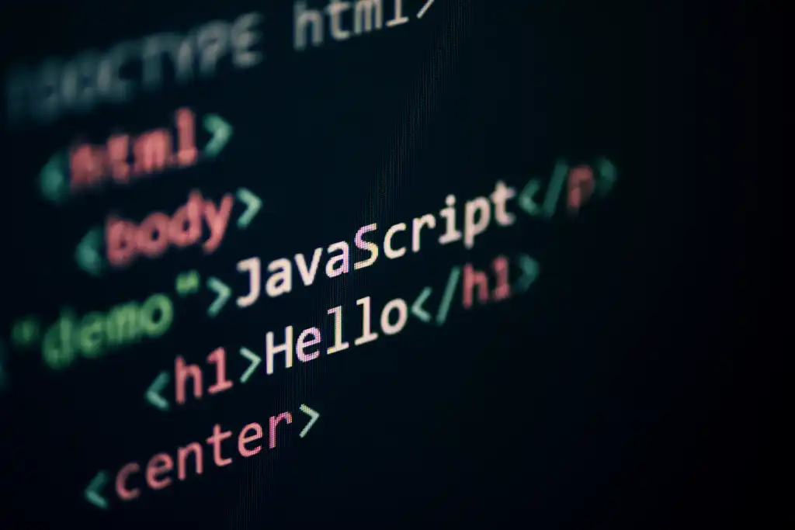

# Лекции по JavaScript



Перед тем как переходить к `React`, `Vue` или любым другим библиотекам, важно уверенно понимать сам `JavaScript`. Именно он отвечает за логику интерфейса, работу с данными, взаимодействие со страницей, события, запросы к серверу и структуру приложения.

В этом репозитории собраны мои лекции по `JavaScript` и смежным темам, которые нужны начинающему фронтенд-разработчику для уверенного перехода от вёрстки к полноценной интерактивной разработке. Материал выстроен последовательно: от переменных, условий и циклов до `DOM`, `API`, модулей, `Vite` и сборки небольшого `SPA-приложения`.

## О чём этот репозиторий?

Этот репозиторий - не просто набор отдельных конспектов. Это цельная программа, которая помогает пройти путь от самых первых конструкций `JavaScript` до более практической работы с браузером, интерфейсом и структурой современного фронтенд-проекта.

Здесь мы постепенно разбираем:

- как устроен базовый синтаксис `JavaScript`;
- как работать с условиями, циклами, функциями, массивами и объектами;
- как организовывать код через `ООП`;
- как управлять страницей через `DOM`;
- как обрабатывать события и формы;
- как работать с `BOM`, таймерами и `localStorage`;
- как отправлять запросы через `fetch` и взаимодействовать с `API`;
- как разделять код на модули;
- как запускать и собирать проект через `npm` и `Vite`;
- как собрать небольшой `SPA` с роутингом, переводами и темой оформления.

> Важно понимать, что хороший фронтенд начинается не с фреймворка, а с уверенной базы в самом языке, браузерной среде и структуре приложения. Именно поэтому курс начинается с основ и только потом переходит к более прикладным темам.

## Что находится внутри?

В репозитории находятся:

- `14` лекций в формате `Markdown`;
- отдельный файл с требованиями к итоговому проекту: [project-requirements.md](project-requirements.md);
- папка `images/` с иллюстрациями, схемами и примерами;
- практические задания в конце многих лекций;
- домашняя работа после ключевых тем;
- темы, которые выстроены в логичном порядке: от простого к сложному.

Каждая лекция посвящена отдельной теме и объясняет не только *что писать в коде*, но и *зачем это нужно на практике*.

## Программа курса

### Лекция 1. Введение в JavaScript

Файл: [lesson01.md](lesson01.md)

В этой лекции разбираются самые первые и важные понятия: что такое `JavaScript`, где он используется, как подключается к `HTML`, как работает в браузере, чем отличается от `Java`, что такое `ECMAScript`, а так же базовый синтаксис, переменные, типы данных, `prompt`, `alert`, арифметика и сравнения.

### Лекция 2. Условия, логика и методы строк

Файл: [lesson02.md](lesson02.md)

Здесь рассматриваются `boolean`, сравнения, `truthy` и `falsy`, логические операторы, конструкции `if / else`, `else if`, тернарный оператор, `switch`, проверки пользовательского ввода и основные методы строк, которые часто используются при валидации и обработке данных.

### Лекция 3. Циклы в JavaScript

Файл: [lesson03.md](lesson03.md)

Эта лекция посвящена циклам: `while`, `do...while`, `for`, а так же `break` и `continue`. Отдельное внимание уделяется типовым паттернам: сумме, поиску значения, повторному вводу данных и другим задачам, которые постоянно встречаются на практике.

### Лекция 4. Функции в JavaScript

Файл: [lesson04.md](lesson04.md)

Одна из базовых лекций по языку. В ней разбираются `Function Declaration`, `Function Expression`, `Arrow Function`, параметры и аргументы, `return`, ранний возврат, область видимости, параметры по умолчанию, `...args`, колбэки и базовое понимание замыканий.

### Лекция 5. Массивы и методы обработки данных

Файл: [lesson05.md](lesson05.md)

Здесь мы переходим к работе с наборами данных. Разбираются массивы, индексы, `length`, перебор через `for` и `for...of`, методы `push`, `pop`, `shift`, `unshift`, `slice`, `splice`, а так же `map`, `filter`, `find`, `reduce` и типовые задачи на обработку массивов.

### Лекция 6. Объекты в JavaScript

Файл: [lesson06.md](lesson06.md)

В этой теме разбираются объекты, свойства и методы, `this`, перебор через `for...in`, `Object.keys`, `Object.values`, `Object.entries`, ссылки и копирование объектов, массивы объектов, деструктуризация, `spread/rest`, проверка свойств и безопасный доступ через `optional chaining`.

### Лекция 7. Основы ООП в JavaScript

Файл: [lesson07.md](lesson07.md)

Эта лекция посвящена объектно-ориентированному подходу. Здесь рассматриваются прототипы, цепочка прототипов, функции-конструкторы, `class`, `constructor`, инкапсуляция, приватные поля, геттеры и сеттеры, наследование, `super`, переопределение методов, полиморфизм, абстракция и `static` методы.

### Лекция 8. DOM: управление страницей через JavaScript

Файл: [lesson08.md](lesson08.md)

Одна из ключевых практических тем курса. В ней разбирается, что такое `DOM`, как браузер строит дерево документа, как искать элементы, менять текст и разметку, работать с атрибутами, `data-*`, классами и стилями, создавать новые элементы, удалять их, заменять и рендерить интерфейс из данных.

### Лекция 9. События и формы

Файл: [lesson09.md](lesson09.md)

Здесь рассматриваются события браузера, `addEventListener`, объект `event`, `preventDefault`, `stopPropagation`, делегирование событий, чтение данных из форм, `FormData`, отправка через `submit`, базовая валидация и работа с ошибками в интерфейсе.

### Лекция 10. BOM и Storage

Файл: [lesson10.md](lesson10.md)

В этой лекции разбирается окружение браузера за пределами `DOM`: объект `window`, `navigator`, `location`, `history`, таймеры `setTimeout` и `setInterval`, а так же `localStorage` и `sessionStorage`. Отдельно показывается практический мини-проект с сохранением темы и языка.

### Лекция 11. Асинхронность и API

Файл: [lesson11.md](lesson11.md)

Здесь курс выходит на следующий уровень. Разбираются синхронный и асинхронный код, `callback`, `Promise`, `async/await`, обработка ошибок, `fetch`, `JSON`, `GET`, `POST`, `PATCH`, `DELETE`, универсальная функция `request()` и работа с интерфейсными состояниями `loading / success / empty / error`.

### Лекция 12. Модули в JavaScript

Файл: [lesson12.md](lesson12.md)

В этой теме рассматриваются `import/export`, модульная область видимости, `default` и именованные экспорты, структура проекта и разбиение логики по файлам. Так же в лекции собираются практические примеры с компонентами, переводами и отдельными обработчиками.

### Лекция 13. Tooling, npm и Vite

Файл: [lesson13.md](lesson13.md)

Эта лекция нужна для того, чтобы перейти от простых файлов к более современной среде разработки. Здесь разбираются `Node.js`, `npm`, `package.json`, `scripts`, создание проекта через `Vite`, структура проекта, `dev`-сервер, `HMR`, подключение библиотек, сборка через `npm run build` и проверка результата через `preview`.

### Лекция 14. Практический SPA-проект

Файл: [lesson14.md](lesson14.md)

В заключительной лекции курс собирается в более цельный практический проект. Здесь рассматриваются основы `SPA`, клиентский роутинг, работа с `page.js`, организация страниц, переводы через `json`, переключение языка, тема оформления и сохранение пользовательских настроек в `localStorage`.

## Что вы изучите по ходу курса?

После прохождения этих лекций у вас будет понимание:

- как уверенно писать базовый код на `JavaScript`;
- как работать с логикой, условиями, циклами и функциями;
- как использовать массивы и объекты для хранения и обработки данных;
- как организовывать код через `ООП`;
- как управлять страницей через `DOM`;
- как реагировать на действия пользователя через события;
- как читать и валидировать данные форм;
- как использовать возможности браузера через `BOM` и `Storage`;
- как выполнять асинхронные запросы и работать с `API`;
- как разделять код на модули;
- как запускать и собирать проекты через `npm` и `Vite`;
- как собирать небольшие клиентские приложения с роутингом и состоянием интерфейса.

## Как лучше проходить этот материал?

Лучше всего проходить лекции последовательно. Темы здесь выстроены не случайно: каждая следующая лекция опирается на предыдущую.

Рекомендуемый подход:

1. Сначала читать лекцию целиком и смотреть примеры кода.
2. Потом повторять примеры самостоятельно в редакторе и браузере.
3. После этого делать практику по теме.
4. И только потом переходить к следующей лекции.

Такой подход помогает не просто прочитать материал, а действительно закрепить его на практике.

## Структура репозитория

```text
.
├── lesson01.md
├── lesson02.md
├── lesson03.md
├── lesson04.md
├── lesson05.md
├── lesson06.md
├── lesson07.md
├── lesson08.md
├── lesson09.md
├── lesson10.md
├── lesson11.md
├── lesson12.md
├── lesson13.md
├── lesson14.md
├── project-requirements.md
└── images/
```

## Заключение

`JavaScript` - это основа всей интерактивности во фронтенде. Да, дальше будут библиотеки, фреймворки, архитектурные подходы и более сложные инструменты. Но без уверенной базы в самом языке, браузерной среде и структуре проекта двигаться дальше будет очень сложно.

Именно поэтому этот репозиторий собран как последовательный учебный материал, к которому можно возвращаться в любой момент: повторять темы, пересматривать примеры и постепенно усиливать свои навыки.
