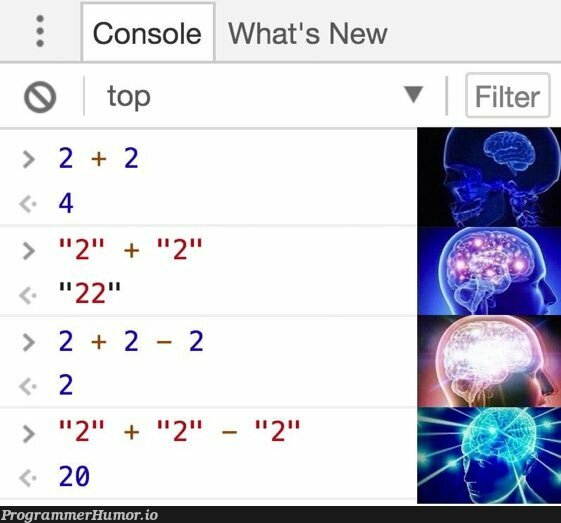

# Лекция 1. Введение в JavaScript: история, где используется, как запускается, базовый синтаксис


## Вступление

После `HTML` и `CSS` страница уже выглядит как сайт: есть структура, блоки, кнопки, формы, стили, адаптивность. Но по сути это всё ещё *“картинка”*. Она не умеет принимать решения, не умеет проверять данные, не умеет реагировать на действия пользователя так, как это делает настоящий продукт.

Как только вы добавляете в проект реальные сценарии, почти сразу появляется потребность в логике:

- нажали кнопку - открылась модалка
- ввели email - появилась подсказка или ошибка
- выбрали фильтр - список товаров перестроился
- нажали “Добавить в корзину” - изменился счётчик и сумма
- страница подгрузила данные с сервера и показала карточки

Эта логика и есть область ответственности `JavaScript`.

На этом курсе мы будем двигаться от простого к сложному: сначала разберём основы языка, затем научимся управлять страницей через `DOM`, дальше перейдём к асинхронности и работе с `API`, а после этого - к модульной структуре, сборке, тестам и деплою.

Но начинать нужно с правильного понимания: **JavaScript - это язык**, а всё то, чем он *“управляет”* в браузере (кнопки, события, `DOM`, `localStorage`, `fetch`) - это уже возможности среды, в которой этот язык выполняется.

---

## Короткая история JavaScript: почему он появился и почему выглядит именно так

`JavaScript` появился не как *“идеальный академический язык”*, а как практический инструмент для браузера.

В середине 90-х веб-страницы были в основном статическими. Пользователь открывал страницу - и всё. Никакой динамики, никаких интерактивных сценариев, минимум логики на клиенте. Но веб быстро развивался, и стало понятно, что браузеру нужен язык, который сможет:

- реагировать на действия пользователя
- менять содержимое страницы без полной перезагрузки
- выполнять простую логику прямо в браузере

В 1995 году в компании `Netscape` появился язык, который должен был решать эту задачу. Он создавался быстро, под конкретную цель - *“оживить”* страницы. Так и родился `JavaScript`.

### Почему название JavaScript и почему это не Java


Частая ошибка новичков - думать, что `JavaScript` связан с `Java`. На самом деле это разные языки.

Название появилось во многом по маркетинговым причинам: `Java` тогда была популярна, и слово *“Java”* в названии воспринималось как *“современно и серьёзно”*. Технически же `JavaScript` развивался по своей линии, с другой философией и другим назначением.

> Поэтому важно сразу запомнить: **JavaScript ≠ Java**.

### ECMAScript и стандарты

Дальше язык начали стандартизировать, чтобы он одинаково работал в разных браузерах. Так появился стандарт **ECMAScript**.

Когда вы слышите *“ES5”*, *“ES6”*, *“ES2020”* - это всё версии стандарта `ECMAScript`, то есть формально версии того, каким должен быть `JavaScript`.

### Почему ES6 (2015) - важная точка

Долгое время `JavaScript` развивался медленно, а код в проектах часто выглядел тяжело и неудобно. В 2015 году вышел стандарт, который сильно изменил повседневную разработку. Его часто называют **ES6**, хотя корректнее - **ES2015**.

Он добавил вещи, которые сегодня считаются базовыми:

- `let` и `const` вместо постоянного использования `var`
- стрелочные функции
- классы
- модули `import/export`
- удобные способы работы с объектами и массивами

Современный фронтенд почти всегда опирается на этот *“современный”* `JavaScript`. При этом в реальных проектах часто встречается старый код, и именно поэтому история языка важна: вы должны понимать, почему в старых примерах может быть одно, а в новых - другое.

---

## Где используется JavaScript?


`JavaScript` начинался как язык для браузера, но сейчас он вышел далеко за пределы “оживления кнопок”.

### В браузере (фронтенд)

Это то, с чем мы будем работать в первую очередь:

- управление `DOM` (изменение HTML-элементов)
- обработка событий (клики, ввод, отправка формы)
- хранение данных в браузере (`localStorage`, `cookies`)
- запросы к серверу (`fetch`)
- построение интерактивных интерфейсов

### На сервере (Node.js)

`JavaScript` также используется как серверный язык. Это означает, что на `JavaScript` можно писать `backend`: принимать запросы, работать с базой данных, строить `API`.

В рамках этого курса мы не будем углубляться в `Node.js` как в `backend`, но важно понимать, что `JavaScript` - это не *“только язык для браузера”*.

### В инструментах разработки

Даже если проект написан на HTML/CSS, инструменты вокруг него часто работают на JavaScript:

- сборщики (Vite, Webpack)
- тестирование (Jest)
- линтеры и форматирование (ESLint, Prettier)

Именно поэтому в конце курса у нас будут блоки про модули, сборку, тесты и деплой.

---

## Как подключить JavaScript к HTML

Чтобы `JavaScript` начал работать на странице, браузеру нужно “увидеть” скрипт в `HTML`. Для этого используется тег `<script>`.

Есть два основных варианта подключения:

- написать код прямо внутри HTML
- подключить отдельный файл (это основной способ в реальных проектах)

### Вариант 1. Код внутри HTML (для быстрых проверок)

```html
<script>
  console.log("Hello from JS");
</script>
```

Так можно делать для экспериментов, но в проекте этот подход быстро становится неудобным: код растёт, смешивается с HTML и его сложно поддерживать.

### Вариант 2. Подключение внешнего файла (основной способ)

Создаем файл `script.js` и подключаем его в `HTML`:

```html
<script src="script.js"></script>
```

Теперь браузер загрузит `script.js` и выполнит код внутри него.

Но здесь появляется важный вопрос: в какой момент этот код выполнится. И именно от этого зависит, будет ли `JavaScript` “видеть” элементы страницы.

### Где подключать скрипт: head или body

Если подключить скрипт в `<head>` вот так:

```html
<head>
  <script src="script.js"></script>
</head>
```

браузер может выполнить `JavaScript` раньше, чем построит `HTML`-разметку ниже по странице. Из-за этого позже (когда мы начнём работать с `DOM`) появится типовая проблема: *“элемент не найден”*.

Есть два распространённых решения:

**1. Подключать скрипт перед `</body>`**

```html
<body>
  <!-- весь HTML страницы -->

  <script src="script.js"></script>
</body>
```

В этом случае браузер сначала построит страницу, а потом выполнит `JavaScript`.

**2. Использовать defer (удобно как стандарт)**

```html
<head>
  <script src="script.js" defer></script>
</head>
```

Тут мы подключаем скрипт в `<head>`, но с атрибутом `defer`. Это говорит браузеру: *“скачай скрипт сейчас, но выполни его только после того, как вся страница будет загружена”*.

Для учебного курса это самый удобный вариант “по умолчанию”, потому что он экономит время и снижает количество ошибок.

**`async` (пока просто чтобы не путаться)**

Иногда рядом ставится атрибут `async`. Он тоже влияет на момент выполнения скрипта, но работает иначе. Скрипт с `async` выполняется сразу после загрузки, не дожидаясь полной загрузки страницы. Это может привести к проблемам, если скрипт зависит от элементов страницы.

```html
<script src="script.js" async></script>
```

> Для начала лучше избегать `async`, чтобы не усложнять себе жизнь. Ближе к концу курса мы вернёмся к этому атрибуту и разберём его подробнее.

## Базовый синтаксис JavaScript: команды, консоль и переменные


Когда человек только начинает учить `JavaScript`, у него обычно две параллельные задачи.

Первая - разобраться, как устроен язык: как писать команды, как сохранять данные, как строить простую логику.
Вторая - научиться понимать, что код вообще выполняется, и где искать ошибку, если что-то пошло не так.

Если вторую задачу не решить в самом начале, дальше становится тяжело: студент пишет код, ничего не происходит, он начинает “гадать”, менять случайные строки, и вместо обучения получается хаос.

Поэтому в этом блоке мы не просто посмотрим на синтаксис, а сразу закрепим привычку разработчика: любую гипотезу проверять.

Самый простой способ проверки в `JavaScript` - это консоль. Вы не должны угадывать, выполняется ли файл и какие значения сейчас лежат в переменных. Вы должны видеть это напрямую.

В рамках курса мы будем часто делать так:

- написали 2-3 строки кода
- вывели промежуточный результат в консоль
- убедились, что всё работает
- только после этого идём дальше

Это не “костыль”, а нормальный рабочий процесс. Даже опытные разработчики постоянно используют консоль - просто у них больше инструментов, но принцип тот же: проверить, а не гадать.

Для того чтобы открыть консоль в браузере, нажмите `F12` или `Ctrl+Shift+I` (Windows) / `Cmd+Option+I` (Mac), и перейдите на вкладку `Console`.


### Первая проверка: выполняется ли скрипт

Прежде чем разбираться в синтаксисе и переменных, нужно сделать одну базовую вещь: убедиться, что ваш `script.js` вообще выполняется.

Самый простой способ - вывести сообщение в консоль.

Пример проверки:

```javascript
console.log("Hello, JavaScript!");
```

Теперь открываем страницу и смотрим в `DevTools` → `Console`. Если сообщение появилось - значит файл загрузился и код выполняется.

Почему это важно: когда *“ничего не работает”*, чаще всего проблема не в логике, а в том, что скрипт не подключился или в файле ошибка, из-за которой выполнение остановилось.

Типовые причины, почему сообщения нет:

- неправильный путь в `src="..."` (файл не найден)
- файл лежит не там, где вы думаете
- допущена синтаксическая ошибка в `script.js` (код не смог выполниться)

Дальше мы будем использовать `console.log()` постоянно: не только чтобы “проверить подключение”, но и чтобы видеть значения переменных и понимать, что именно происходит в коде.

### Как выполняется JavaScript-код. Интерпретатор и компилятор (с примерами языков)

Когда браузер запускает ваш скрипт, `JavaScript` выполняет команды последовательно - строка за строкой. Поэтому порядок команд важен: сначала выполнится то, что написано выше, потом то, что ниже.

Простой пример:

```javascript
console.log("Первое сообщение");
console.log("Второе сообщение");
console.log("Третье сообщение");
```

В консоли вы увидите сообщения в том же порядке, в каком они написаны в коде.

Теперь логичный вопрос: кто выполняет этот код и почему он вообще запускается сразу после подключения файла?

В программировании есть два классических подхода к запуску кода: компиляция и интерпретация.

#### Компилируемые языки

Компилируемые языки обычно работают так: вы сначала *“собираете”* программу, а потом запускаете уже готовый результат.
Примеры языков, которые часто приводят в этом контексте: `C`, `C++`, `Rust`, `Go`.
Там типичный процесс выглядит как: `написал код` → `скомпилировал` → `получил исполняемый файл` → `запустил`.

#### Интерпретируемые языки

Интерпретируемые языки запускаются иначе: вы пишете исходный код и запускаете его напрямую через среду выполнения.
Примеры: `Python`, `Ruby`, `PHP`. Там процесс обычно такой: написал код → запустил файл → интерпретатор выполняет команды.

`JavaScript` исторически относят ко второй группе, потому что в браузере он работает именно так: подключили файл - и он сразу выполняется. Отдельного шага “сборки” на старте нет.

Но важно понимать современную реальность: движки `JavaScript` внутри (например, `V8` в `Chrome`) устроены сложнее. Они не просто “читают строку и выполняют”. Обычно происходит две стадии:

- Сначала движок разбирает код и проверяет, что он написан правильно.
- Потом выполняет команды, и делает это максимально быстро (в том числе за счёт внутренней компиляции и оптимизаций).

Для нас сейчас достаточно практической модели:

- если в коде есть синтаксическая ошибка, выполнение может не начаться вообще
- если синтаксис корректный, команды выполняются сверху вниз
- если ошибка возникла в процессе выполнения (например, неправильное имя переменной), выполнение может остановиться на этой строке

Отсюда важное следствие: если вы допустили ошибку в начале файла, то код ниже может вообще не выполниться. Поэтому `console.log()` и чтение ошибок в консоли - это не “дополнительная тема”, а основа работы с `JavaScript` с первого дня.

### Комментарии в JavaScript

Комментарии - это часть кода, которую `JavaScript` не выполняет. Они нужны не браузеру, а человеку: чтобы объяснить смысл, зафиксировать идею или временно отключить кусок кода.

В `JavaScript` есть два вида комментариев.

Однострочный комментарий начинается с //:

```javascript
// Это однострочный комментарий
console.log("Этот код выполнится");
```

Обычно его используют для коротких заметок.

Многострочный комментарий заключается между /* и */:

```javascript
/*
  Это многострочный комментарий.
  Его удобно использовать, когда нужно оставить пояснение на несколько строк.
*/
console.log("Продолжаем выполнение");
```

На практике многострочные комментарии часто используют ещё и как инструмент проверки: можно временно “выключить” несколько строк, чтобы понять, какая часть кода вызывает проблему.

Например, если в файле ошибка и вы хотите быстро сузить область поиска, вы можете временно закомментировать часть кода и проверить, запускается ли остальное.

Важно не превращать комментарии в “пересказ очевидного”. Хороший комментарий отвечает на вопрос *“зачем”*, а не *“что”*.

### Переменные: что это такое?

**Переменные** - именованная область памяти, в которой можно хранить данные для дальнейшего использования.

Проще говоря - переменная позволяет сохранить значение (число, текст, объект и т.д.) под определённым именем, чтобы потом к этому значению можно было обратиться по имени.

Переменная состоит из двух частей:

- имя (идентификатор), по которому мы будем к ней обращаться
- значение, которое хранится внутри переменной

Когда вы создаете переменную, вы выполняете две операции:

1. Объявление переменной - создание имени
2. Присвоение значения - сохранение данных в эту переменную

#### Как создать переменную в JavaScript: var, let, const

В `JavaScript` есть три ключевых слова для создания переменных: `var`, `let` и `const`.

- `var` - старый способ объявления переменных. Сейчас его используют редко из-за особенностей области видимости.
- `let` - современный способ создания переменных, которые могут менять своё значение.
- `const` - современный способ создания переменных, которые не могут менять своё значение после присвоения.

В ходе курса мы будем использовать в основном `let` и `const`.

`let` используется, когда значение переменной может измениться:

```javascript
let age = 25; // объявление и присвоение
console.log(age); // 25

age = 30; // изменение значения
console.log(age); // 30
```

`const` используется, когда значение переменной не должно изменяться. То есть, после присвоения новое значение дать нельзя:

```javascript
const name = "Alice"; // объявление и присвоение
console.log(name); // Alice
// name = "Bob"; // Ошибка! Нельзя изменить значение const
```

Здесь знак `=` - это оператор присвоения, который сохраняет значение справа в переменную слева.

### Как правильно называть переменные?

**Переменная** - это не просто *“место в памяти”*. Это имя, которое вы читаете в коде десятки раз. Если имя плохое - код становится непонятным, даже если он работает.

Поэтому у переменных есть базовые правила нейминга.

#### 1. Имена должны быть понятными

Плохие примеры:

- `a`, `b`, `x` (если это не математика и не короткий пример)
- `data`, `info`, `temp` (уже лучше, но слишком абстрактно)
- `value1`, `value2` (не объясняет смысл)

Хорошие примеры:

- `userName`
- `totalPrice`
- `isLoggedIn`
- `cartItemsCount`

> Смысл простой: по имени должно быть понятно, что хранится внутри.

#### 2. Имена не должны начинаться с цифры

Нельзя создавать переменные с именами, которые начинаются с цифры:

```javascript
let 1stPlace = "Gold"; // Ошибка!
```

#### 3. Имена не должны содержать пробелов

Нельзя создавать переменные с именами, которые содержат пробелы:

```javascript
let user name = "Alice"; // Ошибка!
```

#### 4. Используйте camelCase для составных имён

В `JavaScript` стандартный стиль для переменных - `camelCase`: первое слово с маленькой буквы, а каждое следующее - с заглавной.

Примеры: `firstName`, `totalAmount`, `selectedCategory`.

> Тут важно быть последовательным: если вы начали использовать `camelCase`, придерживайтесь этого стиля во всём проекте.

#### 5. Булевы переменные называем как вопрос

Если переменная хранит `true/false`, имя должно читаться как вопрос. Обычно используют префиксы: `is`, `has`, `can`, `should`.

Примеры:

- `isLoggedIn`;
- `hasAccess`;
- `canEdit`;
- `shouldShowModal`.

Так проще понять, что внутри булево значение.

#### 6. Резервированные имена в JavaScript

В JavaScript есть слова, которые **нельзя использовать** как имена переменных, функций и классов. Они называются зарезервированные (`reserved words`), потому что язык использует их для своего синтаксиса.

Если попытаться использовать зарезервированное слово, возникнет ошибка.

Примеры зарезервированных слов:

- `let`, `const`, `var`
- `if`, `else`, `switch`
- `for`, `while`, `do`
- `function`, `return`
- `class`, `extends`, `new`
- `try`, `catch`, `finally`, `throw`
- `import`, `export`
- `break`, `continue`

> На самом деле зарезервированных слов гораздо больше. Полный список можно найти в официальной документации [MDN](https://developer.mozilla.org/en-US/docs/Web/JavaScript/Reference/Lexical_grammar#keywords). Главное правило - не использовать эти слова для своих переменных и функций, чтобы избежать ошибок.

### Типы данных в JavaScript

Когда мы создаём переменные, мы сохраняем в них значения. У каждого значения в `JavaScript` есть тип данных. Тип определяет, как с этим значением можно работать и какие операции будут корректными.

Самые базовые типы, с которыми вы будете сталкиваться постоянно:

- `number` - числовой тип (например, `42`, `3.14`)
- `bigint` - тип для очень больших целых чисел (например, `9007199254741991n`)
- `string` - строковый тип (текст, например, `"Hello"`, `'JavaScript'`)
- `boolean` - логический тип (два значения: `true` или `false`)
- `null` - специальное значение, означающее *“нет значения”*
- `undefined` - значение по умолчанию для переменных, которым не было присвоено значение
- `object` - сложный тип для хранения коллекций данных (например, объекты и массивы)

#### number и bigint - числовые типы

Тип `number` используется для любых чисел: целых и вещественных

```javascript
let price = 19.99; // число с плавающей точкой
let quantity = 3;  // целое число
console.log(price)
console.log(quantity)
```

Тип `bigint` используется для очень больших целых чисел, которые выходят за пределы безопасного диапазона number.

```javascript
let bigNumber = 9007199254741991n; // большое целое число
console.log(bigNumber);
```

##### string - строки

Тип `string` используется для хранения текста. Строки можно создавать с помощью одинарных, двойных или обратных кавычек.

```javascript
let greeting = "Hello, World!"; // двойные кавычки
let name = 'Alice';              // одинарные кавычки
let template = `Welcome, ${name}!`; // обратные кавычки (шаблонные строки)
console.log(greeting);
console.log(name);
console.log(template);
```

Обратите внимание на шаблонные строки (обратные кавычки): они позволяют вставлять переменные и выражения внутрь строки с помощью `${...}`- это называется *интерполяция* или форматирование строк.

Интерполяция позволяет создавать динамические строки легко и удобно. Например:

```javascript
let age = 30;
let message = `I am ${age} years old.`;
console.log(message); // I am 30 years old.
```

#### boolean - логический тип

Тип `boolean` имеет всего два возможных значения: `true` (истина) и `false` (ложь). Он часто используется для условий и логических операций.

```javascript
let isLoggedIn = true;  // пользователь вошёл
let hasAccess = false;  // доступ запрещён
console.log(isLoggedIn);
console.log(hasAccess);
```

Понимание логических значений важно для построения условий и управления потоком выполнения программы.

#### null и undefined - специальные типы

`null` и `undefined` - это специальные типы, которые обозначают отсутствие значения.

- `null` - это явное указание на отсутствие значения. Его часто используют, когда нужно сбросить значение переменной или указать, что значение будет задано позже.

```javascript
let user = null; // пользователь не задан
console.log(user);
```

- `undefined` - это значение по умолчанию для переменных, которым не было присвоено значение.

```javascript
let data; // переменная объявлена, но не инициализирована
console.log(data); // undefined
```

> Понимание разницы между `null` и `undefined` важно для правильной работы с данными и предотвращения ошибок в коде. Undefined часто указывает на то, что переменная была объявлена, но не получила значение, тогда как null используется для явного обозначения отсутствия значения.

#### object - сложные типы данных

Тип `object` используется для хранения коллекций данных и более сложных структур. Сюда входят объекты и массивы. Подробнее об этих типах мы поговорим в следующих лекциях. Сейчас важно знать, что объекты позволяют хранить данные в виде пар *“ключ-значение”*, а массивы - это упорядоченные списки значений.

#### Проверка типа данных: оператор typeof

Мы узнали о разных типах данных в `JavaScript`. Иногда полезно проверить, к какому типу относится конкретное значение. Для этого используется оператор `typeof`.
Пример использования `typeof`:

```javascript
let age = 25;
let name = "Alice";
let isStudent = false;
console.log(typeof age);      // number
console.log(typeof name);     // string
console.log(typeof isStudent); // boolean
```

Оператор `typeof` возвращает строку, которая указывает тип переданного значения. Это полезно для отладки и понимания структуры данных в вашем коде.

---

## Типизация в языках программирования

Мы уже увидели, что у значений в `JavaScript` есть типы: `number`, `string`, `boolean` и т.д. Но кроме *“типов данных”* есть ещё более широкое понятие - типизация.

Типизация - это система правил, которая определяет, как язык программирования обрабатывает типы данных и как они взаимодействуют друг с другом.

### Статическая и динамическая типизация

В разных языках типы контролируются по-разному.

**Статическая типизация** означает, что тип переменной фиксируется заранее и строго проверяется. Обычно такие языки требуют, чтобы вы явно указали тип или чтобы компилятор однозначно его вывел.

Примеры: `C`, `C++`, `Java`, `C#`, `Go`, `Rust`.

Идея простая: если вы объявили переменную как число, вы не сможете потом *“случайно”* записать туда строку. Ошибка будет поймана до запуска программы (на этапе компиляции).

**Динамическая типизация** означает, что типы переменных могут меняться во время выполнения программы. В таких языках переменные не привязаны к конкретному типу, и вы можете присваивать им значения разных типов.

Примеры: `JavaScript`, `Python`, `Ruby`, `PHP`.

В динамически типизированных языках ошибки, связанные с типами, могут проявляться только во время выполнения программы. Это даёт больше гибкости, но требует от разработчика внимательности.

Подытожим:

```js
let age = 25;        // age - сейчас number
age = "twenty five"; // теперь age - string (в динамической типизации это допустимо)
```

В `JavaScript` мы имеем дело с динамической типизацией, что позволяет нам легко менять типы значений в переменных. Однако это также требует от нас внимательности, чтобы избежать ошибок, связанных с неправильным использованием типов.

### Слабая и сильная типизация

Помимо статической и динамической типизации часто говорят ещё про сильную и слабую. Здесь речь не о том, *“строгий язык или нет”*, а о том, насколько активно язык делает автоматические преобразования типов.

**Сильная типизация** означает, что язык строго контролирует операции между разными типами данных. Если вы пытаетесь выполнить операцию между несовместимыми типами, язык выдаст ошибку.
Примеры: `Python`, `Ruby`, `Java`.

Эти языки не позволяют неявные преобразования типов, что помогает избежать неожиданных результатов.

**Слабая типизация** означает, что язык позволяет выполнять операции между разными типами данных, автоматически преобразуя их при необходимости.
Примеры: `JavaScript`, `PHP`, `Perl`.

`JavaScript` относят к языкам со слабой типизацией, потому что он делает много неявных преобразований типов.

Именно из-за этого в `JavaScript` иногда возникают неожиданные результаты при операциях с разными типами.
Пример неявного преобразования типов в JavaScript:

```javascript
console.log(10 + 5);     // 15
console.log("10" + 5);   // "105"
```

Во втором случае `JavaScript` видит строку и приводит второе значение к строке, чтобы выполнить “склейку”(конкатенацию).

Но с другими операторами поведение отличается:

```javascript
console.log("10" - 5);   // 5
console.log("10" * 2);   // 20
```

Оператор `-` и `*` не умеют работать со строками, поэтому `JavaScript` пытается привести `"10"` к числу.

И так может быть много ситуаций, когда поведение кажется неожиданным из-за автоматических преобразований типов.
Чтобы избежать таких проблем, важно быть внимательным с типами и использовать явные преобразования, когда это необходимо.

### Выводы по типизации в JavaScript

Подытожим ключевые моменты по типизации в `JavaScript`:

- `JavaScript` - это язык с динамической и слабой типизацией.
- Типы переменных могут меняться во время выполнения программы.
- `JavaScript` выполняет автоматические преобразования типов, что может приводить к неожиданенным результатам.
- Важно быть внимательным с типами и использовать явные преобразования, чтобы избежать ошибок.

---

## prompt, alert и confirm: быстрый ввод и вывод в браузере

На первых шагах обучения удобно получать данные от пользователя и показывать результат без форм, `DOM` и сложного интерфейса. Для этого в браузере есть встроенные функции `alert`, `prompt` и `confirm`.

Важно понимать: в реальных проектах их используют редко (обычно делают свои модальные окна), но для обучения и проверки логики - это быстрый и понятный инструмент.

### alert - вывод сообщения

Функция `alert` показывает простое модальное окно с сообщением и кнопкой “ОК”. Она используется для вывода информации пользователю.

```javascript
alert("Добро пожаловать в JavaScript!");
```

`alert` удобно использовать, когда нужно быстро показать результат вычисления или убедиться, что код выполняется.

### prompt - ввод данных от пользователя

Функция `prompt` показывает модальное окно с полем ввода и кнопками “ОК” и “Отмена”. Она позволяет получить текстовый ввод от пользователя.

```javascript
let userName = prompt("Введите свое имя:");
alert(userName);
```

**Очень важно** `prompt()` всегда возвращает строку `string`. Даже если пользователь введёт число, результатом будет строка. Если нужно работать с числом, его нужно явно преобразовать.

```javascript
let age = prompt("Введите возраст:");
console.log(age);        // например "30"
console.log(typeof age); // "string"
```

Это напрямую связано с типизацией `JavaScript`: браузер не знает, что именно вы ожидали, поэтому возвращает строку. Если вам нужно именно число, значение придётся преобразовать вручную (мы это подробнее закрепим в блоке про операторы и преобразования типов).

Пример преобразования через `Number()`:

```javascript
let age = prompt("Введите возраст:");
let ageNumber = Number(age); // преобразование строки в число
console.log(ageNumber);
console.log(typeof ageNumber); // "number"
```

Если пользователь введёт не число, `Number()` может вернуть `NaN` (это отдельная тема, мы к ней вернёмся в следующих лекциях).

### confirm - подтверждение

Функция `confirm` показывает модальное окно с сообщением и кнопками “ОК” и “Отмена”. Она используется для получения простого булевого ответа от пользователя.

```javascript
let isConfirmed = confirm("Вы уверены?");
console.log(isConfirmed);        // true или false
console.log(typeof isConfirmed); // "boolean"
```

`confirm` возвращает `true`, если пользователь нажал “ОК”, и `false`, если нажал “Отмена”.

## Операции с переменными: присвоение, арифметические операции, конкатенация строк



Переменные нужны не *“ради хранения”*, а ради работы с данными. Как только значение попало в переменную, мы начинаем выполнять над ним операции: прибавлять, вычитать, сравнивать, склеивать строки, обновлять счётчики.

### Присвоение значений

Присвоение - это процесс сохранения значения в переменную. Мы уже видели это в примерах с `let` и `const`.

```javascript
let count = 0;
count = 13;
alert(count);//13
```

> Важно понимать, что `=` означает присвоить, в не *"равно"*.

#### Сокращённые операторы присваивания

Сокращённые операторы присваивания позволяют упростить запись операций, которые изменяют значение переменной на основе её текущего значения.Например :

- `+=` - добавление и присвоение
- `-=` - вычитание и присвоение
- `*=` - умножение и присвоение
- `/=` - деление и присвоение

```javascript
let score = 10;
score += 5; // то же самое, что score = score + 5
console.log(score); // 15

score -= 3; // то же самое, что score = score - 3
console.log(score); // 12

score *= 2; // то же самое, что score = score * 2
console.log(score); // 24

score /= 4; // то же самое, что score = score / 4
console.log(score); // 6
```

### Арифметические операции

Арифметические операции позволяют выполнять математические вычисления с числовыми значениями. Вот основные арифметические операторы в `JavaScript`:

- `+` - сложение
- `-` - вычитание
- `*` - умножение
- `/` - деление
- `%` - остаток от деления (модуль)
- `**` - возведение в степень

```javascript
let a = 10;
let b = 3;
console.log(a + b); // 13
console.log(a - b); // 7
console.log(a * b); // 30
console.log(a / b); // 3.3333...
console.log(a % b); // 1 (остаток от деления 10 на 3)
console.log(a ** b); // 1000 (10 в степени 3)
```

Оператор `%` часто используют чтобы понять чётность:

```javascript
console.log(10 % 2); // 0
console.log(11 % 2); // 1
```

Тут нужно разобраться с приоритетом операций: умножение и деление выполняются раньше сложения и вычитания. Скобки `()` позволяют явно задать порядок выполнения. Работает все так же, как в математике:

- Всегда первым выполняются выражения в скобках `()`
- степени `**` выполняются сразу после скобок
- Затем идут операции умножения `*`, деления `/`, и остатка от деления `%`
- И в конце выполняются операции сложения `+` и вычитания `-`

```javascript
let result = (2 + 3) * 4; // сначала 2 + 3, потом умножение на 4
let anotherResult = 2 + 3 * 4; // сначала 3 * 4, потом сложение с 2
console.log(result);        // 20
console.log(anotherResult); // 14

console.log(2 + 3 * 4 ** 2); // 50, сначала 4**2=16, потом 3*16=48, потом 2+48=50
console.log((2 + 3) * 4 ** 2); // 80, сначала (2+3)=5, потом 4**2=16, потом 5*16=80
```

### Инкремент и декремент

Иногда нужно увеличить или уменьшить число на 1. Для этого в `JavaScript` есть специальные операторы: инкремент `++` и декремент `--`.

```javascript
let counter = 5;
counter++; // увеличивает counter на 1
console.log(counter); // 6

counter--; // уменьшает counter на 1
console.log(counter); // 5
```

> Также часто можно встретить формы записи `counter += 1` и `counter -= 1`, которые делают то же самое.

`++counter` и `counter++` работают одинаково, когда используются как отдельные выражения. Но если они используются внутри других выражений, есть разница:

```javascript
let x = 5;
let y = ++x; // сначала увеличивает x до 6, потом присваивает y значение 6
console.log(x); // 6
console.log(y); // 6
let a = 5;
let b = a++; // сначала присваивает b значение 5, потом увеличивает a до 6
console.log(a); // 6
console.log(b); // 5
```

### Конкатенация строк

Конкатенация строк - это процесс объединения двух или более строк в одну. В `JavaScript` для этого используется оператор `+`.

```javascript
let firstName = "Петр";
let lastName = "Петров";
let fullName = firstName + " " + lastName;
console.log(fullName); // Петр Петров
```

Также можно использовать шаблонные строки (обратные кавычки) для более удобной конкатенации. Такой способ называется **Интерполяция строк**:

```javascript
let age = 30;
let fullName = "Иван Иванов";
let message = `Привет, меня зовут ${fullName} и мне ${age} лет.`;
console.log(message)
```

Интерполяция позволяет вставлять переменные и выражения прямо в строку, что делает код более читаемым и удобным для написания.

### Связь с prompt: почему важно помнить про строку

Когда мы получаем данные от пользователя через `prompt`, важно помнить, что результат всегда будет строкой. Поэтому при выполнении арифметических операций или других вычислений нужно быть внимательным и при необходимости преобразовывать строки в числа.

```javascript
let a = prompt("Введите первое число:");
let b = prompt("Введите второе число:");
alert(a + b); // это будет конкатенация строк, а не сумма чисел
```

Чтобы получить сумму чисел, нужно преобразовать строки в числа:

```javascript
let a = prompt("Введите первое число:");
let b = prompt("Введите второе число:");
let sum = Number(a) + Number(b); // преобразование строк в числа
alert(sum); // теперь это будет сумма чисел
```

Таким образом, понимание типов данных и операций с ними - ключевой навык для работы с `JavaScript`. В следующих лекциях мы продолжим изучать язык и его возможности.

## Операторы сравнения: `==` и `===` (и почему это важно)

Когда вы начинаете писать логику, вы очень быстро упираетесь в сравнения.

Например:

- число чётное или нет;
- пользователь ввёл именно 0 или просто пустую строку;
- переменная равна `null` или в ней “что-то есть”;

И тут появляется важный момент: в `JavaScript` есть два разных оператора *“равенства”* - `==` и `===`. Они выглядят похоже, но ведут себя по-разному.

### == - “нестрогое” сравнение (с приведением типов)

Оператор `==` сравнивает значения, но может автоматически приводить типы.

То есть `JavaScript` пытается *“договориться”*, как сравнить строку и число, и делает преобразование сам.

Примеры:

```javascript
console.log(5 == "5");   // true
console.log(0 == false); // true
console.log("" == 0);    // true
```

На уровне логики это выглядит опасно: мы сравнили разные типы и неожиданно получили `true`.
Почему так происходит: `JavaScript` делает неявное преобразование типов, чтобы сравнение *“сработало”*.

### === - строгое сравнение (без приведения типов)

Оператор `===` работает иначе: он сравнивает и значение, и тип. То есть чтобы получить `true`, должны совпасть оба параметра:

- само значение
- тип данных

Примеры:

```javascript
console.log(5 === "5");   // false
console.log(0 === false); // false
console.log("" === 0);    // false
```

И это поведение намного более предсказуемое.

В реальном коде почти всегда используют `===`, потому что он убирает *“магические”* преобразования и снижает количество ошибок.

### То же самое про “не равно”: != и !==

У `JavaScript` есть и обратные операторы:

- `!=`- нестрогое *“не равно”* (с приведением типов)
- `!==` - строгое *“не равно”* (с проверкой типа)

Пример:

```javascript
console.log(5 != "5");   // false  (потому что "5" превратили в 5)
console.log(5 !== "5");  // true   (разные типы)
```

## Заключение

В этой лекции мы заложили базу для работы с `JavaScript`. Разобрались, зачем он нужен в вебе, где используется и как подключается к `HTML`, чтобы код действительно выполнялся в нужный момент. Научились проверять работу скрипта через консоль и использовать `console.log()` как основной инструмент отладки.

Дальше мы разобрали переменные (`let`, `const`), правила нейминга и зарезервированные слова, чтобы код был понятным и не ломался из-за мелочей. Затем познакомились с типами данных и типизацией в `JavaScript`, чтобы понимать, почему язык иногда делает неявные преобразования и откуда берутся эффекты вроде `"10" + 5.` В конце посмотрели на `prompt/alert/confirm` и базовые операции с переменными: присваивание, арифметику и работу со строками.

## Практика

1) Запросите у пользователя `name` и `city`. Выведите через `alert` строку формата:` Hello, <name> from <city>!` (используйте шаблонную строку).
2) Запросите у пользователя `price` и `quantity` (как числа). Посчитайте `total = price * quantity` и выведите через результат `total`. Используйте шаблонную строку.
3) Запросите у пользователя `a` и `b`. Выведите через `alert` результат `a + b` (без преобразования). Затем выведите через `alert` результат `Number(a) + Number(b)`.
4) Запросите у пользователя целое число n. Выведите через alert true, если n делится на 5 без остатка, иначе `false`. Используйте оператор %.
5) Запросите у пользователя целое число n. Выведите через alert true, если число чётное, иначе `false`. Используйте `%`.
6) Запросите у пользователя `radius` (как число). Посчитайте площадь круга `S = π * r^2`, где `π` хранится в константе. Выведите результат через `alert`.

## Домашняя работа

> Условия:
>
> - Ввод только через `prompt()`
> - Вывод только через `alert()`
> - Если ожидаете число - используйте `Number(...)`

1) Запросите у пользователя `firstName` и `lastName`. Выведите через `alert` строку: `Full name: <firstName> <lastName>` (используйте шаблонную строку).
2) Запросите у пользователя `birthYear`. Задайте в коде константу `CURRENT_YEAR`. Посчитайте возраст и выведите через `alert`: `Age: <age>`.
3) Запросите у пользователя `a` и `b`. Выведите через `alert`:

   - результат `a + b` (без преобразования)
   - результат `Number(a) + Number(b)` (с преобразованием)
4) Запросите у пользователя `n`. Выведите через `alert` `true`, если `n` чётное, иначе `false`. Используйте `%` и строгое сравнение `===`
5) Запросите у пользователя `n`. Выведите через `alert` `true`, если `n` делится на 3 без остатка, иначе `false`. Используйте `%` и `===`.
6) Запросите у пользователя `price` и `discountPercent`. Посчитайте цену со скидкой и выведите через `alert` итоговую сумму. (Например, скидка 15 означает минус 15%.)
7) Запросите у пользователя `radius`. Задайте константу `PI`. Посчитайте длину окружности `L = 2 * PI * radius` и выведите через `alert`.
8) Запросите у пользователя `width` и `height`. Посчитайте площадь прямоугольника и выведите через `alert`. Затем выведите через `alert` `true`, если площадь больше 100, иначе `false` (используйте `>`).
9) Запросите у пользователя целое число `n` (трёхзначное). Выведите через `alert` сумму его цифр. Используйте `%` и деление `/`.
10) ** Запросите у пользователя целое число `n` (трёхзначное). Выведите через `alert` число, записанное задом наперёд. Используйте `%` и деление, строки не используйте.
