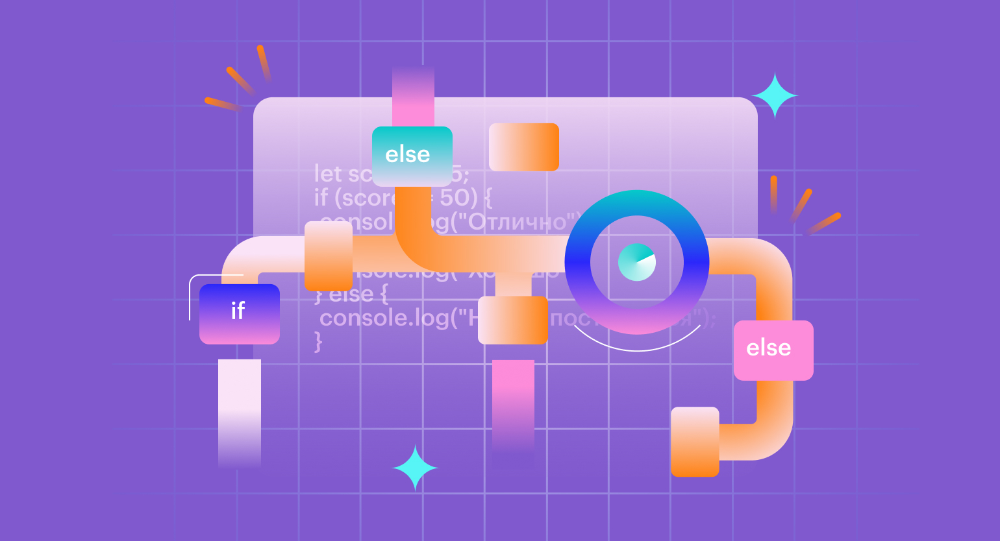

# Лекция 2. Условия и логика в JavaScript: boolean, truthy/falsy, if/else, тернарный оператор, проверки ввода



## Вступление

В первой лекции вы научились подключать `JavaScript`, проверять выполнение через консоль, создавать переменные, получать ввод через `prompt()` и выполнять базовые операции.

Но этого недостаточно для написания полноценных программ с разными сценариями поведения. В этой лекции мы рассмотрим, как использовать условия и логические операции для управления потоком выполнения программы.

## Почему нужно понимать переменные типа boolean?


Переменные типа `boolean` могут принимать только два значения: `true` (истина) и `false` (ложь). Они играют ключевую роль в принятии решений в программах. Сравнения возвращают boolean. А `&&` и `||` часто используются в условиях, но возвращают один из операндов - это важно помнить.

Чаще всего `boolean` не появляется явно, а получается в результате сравнения или логических операций.

### boolean: откуда берётся true и false

`boolean` в коде может появляться двумя путями:

1. **Явно**: когда мы напрямую присваиваем переменной значение `true` или `false`.

```javascript
let isLoggedIn = true;
let hasLicense = false;
```

2. **Неявно**: когда мы получаем `boolean` в результате сравнения или логических операций.

Это самый частый случай. Любое сравнение возвращает `boolean`.

```javascript
let age = 25;
let isAdult = age >= 18; // true
let isMinor = age < 18;  // false
```

Сейчас важно понять что `boolean` - это не просто слова `true` и `false`, а результат логических операций и сравнений.

## Сравнения как источник boolean

В первой лекции мы уже разобрали, почему в JavaScript важно использовать строгое сравнение `===` вместо `==`. В этой лекции нам важно другое: **любое сравнение возвращает boolean**, и именно это значение затем используется в `if`, тернарном операторе и логических выражениях.

```javascript
let a = Number(prompt("Введите a:"));
let b = Number(prompt("Введите b:"));

alert(a > b);     // true/false
alert(a === b);   // true/false
alert(a !== b);   // true/false
```

Главная идея простая: мы сначала получаем `true/false`, а потом на основе этого выбираем сценарий выполнения кода.

### Приоритет операторов сравнения

Когда в одном выражении несколько операторов, важно понимать порядок их выполнения (приоритет).

В JavaScript операторы сравнения имеют одинаковый приоритет и выполняются слева направо.

В основе этого лежит правило: сначала выполняются арифметические операции, затем сравнения, и наконец логические операции.

```javascript
let result = 5 + 3 > 6; // сначала 5 + 3 = 8, затем 8 > 6 => true
let check = 10 === 10 && 5 < 3; // сначала 10 === 10 => true, затем 5 < 3 => false, итог: true && false => false
```

### Приоритет с помощью скобок

Чтобы явно задать порядок выполнения, используйте круглые скобки `()`.

```javascript
let result = (5 + 3) > (2 * 4); // сначала выполняются операции в скобках
alert(result); // false
```

**Практическое правило**

- Если в условии больше одного логического оператора (&&, ||) - ставьте скобки.
- Если условие трудно прочитать за 2 секунды - перепишите или добавьте скобки.

## if / else: как JavaScript выбирает сценарий


До этого момента мы писали код, который выполняется линейно: сверху вниз, строка за строкой. Условия позволяют изменять этот поток выполнения, выбирая разные сценарии в зависимости от значений переменных.

Логика тут проста: Мы проверяем условие (выражение, которое возвращает `true` или `false`), и в зависимости от результата выполняем определённый блок кода.

### Базовая структура if

```javascript
if (условие) {
    // код, который выполняется, если условие истинно (true)
}
```

Пример:

```javascript
let age = 20;
if (age >= 18) {
    console.log("Вы совершеннолетний.");
}
```

Тут мы проверяем, больше ли или равно значение `age` 18. Если да, то выводим сообщение.

### Конструкция else

Очень часто нужно выполнять альтернативный код, если условие ложно. Для этого используется `else`.

```javascript
if (условие) {
    // код, если условие истинно
} else {
    // код, если условие ложно
}
```

Пример:

```javascript
let age = 16;
if (age >= 18) {
    console.log("Вы совершеннолетний.");
} else {
    console.log("Вы несовершеннолетний.");
}
```

В условиях нужно запомнить следующее:
- В `if` можно передать любое значение, но движок приведёт его к boolean (`truthy`/`falsy`).
- Само условие пишется в круглых скобках `()`.
- Блоки кода, которые выполняются в зависимости от условия, пишутся в фигурных скобках `{}`.

### Расширенная конструкция: else if

Иногда нужно проверить несколько условий подряд. Для этого используется `else if`.

```javascript
if (условие1) {
  // сценарий 1
} else if (условие2) {
  // сценарий 2
} else if (условие3) {
  // сценарий 3
} else {
  // сценарий по умолчанию
}
```

Пример:

```javascript
let score = Number(prompt("Введите балл (0-100):"));

if (score >= 90) {
  alert("Оценка: отлично");
} else if (score >= 75) {
  alert("Оценка: хорошо");
} else if (score >= 60) {
  alert("Оценка: удовлетворительно");
} else {
  alert("Оценка: неудовлетворительно");
}
```

Тут проверки идут сверху вниз. Как только одно из условий истинно, соответствующий блок выполняется, и остальные проверки пропускаются.

### Вложенная конструкция if
Иногда нужно проверять условия внутри других условий. Это называется вложенными `if`.
Пример:

```javascript
let age = 20;
if (age >= 18) {
    if (age >= 21) {
        console.log("Вы можете покупать алкоголь.");
    } else {
        console.log("Вы совершеннолетний, но не можете покупать алкоголь.");
    }
} else {
    console.log("Вы несовершеннолетний.");
}
```

Вложенные условия - это нормальная практика, но не стоит ими злоупотреблять, чтобы не усложнять код. Лучше стараться делать условия плоскими и понятными, в ином случае тяжело будет поддерживать такой код в будущем.

Главное во время сравнения не забывать про типы данных. Например, сравнение строки и числа может привести к неожиданным результатам.

```javascript
let input = prompt("Введите число:");
if (input == 10) { // здесь происходит неявное приведение типов
    console.log(`${input + 5} равно 105`);
} else {
    console.log("Вы ввели не 10");
}
```

В этом примере, если пользователь введёт строку `"10"`, условие сработает, потому что `==` приводит типы. Чтобы избежать таких ситуаций, лучше использовать строгое сравнение `===`, которое не приводит типы.

```javascript
let input = Number(prompt("Введите число:"));
if (input === 10) { // явное приведение к числу
    console.log(`${input + 5} равно 15`);
} else {
    console.log("Вы ввели не 10");
}
```

## Как строить условия, чтобы код был предсказуемым

У новичков самая частая проблема не в том, что они не знают `if`. Проблема в том, что условия пишутся хаотично: где-то сразу сравнения, где-то преобразования типов внутри `if`, где-то не обработан `Cancel`.
Чтобы условия были предсказуемыми, используйте один и тот же порядок:
1) **Получили ввод**
2) **Проверили отмену (`null`)**
3) **Проверили пустую строку (в том числе пробелы)**
4) **Преобразовали тип**
5) **Проверили валидность (например `NaN`)**
6) **Только потом бизнес-логика (сравнения, диапазоны, роли)**

Пример *“правильного”* шаблона:

```javascript
let raw = prompt("Введите возраст:");

if (raw === null) {
  alert("Отмена");
} else if (raw.trim() === "") {
  alert("Пустой ввод");
} else {
  let age = Number(raw);

  if (Number.isNaN(age)) {
    alert("Нужно ввести число");
  } else {
    alert(age >= 18 ? "Доступ разрешён" : "Доступ запрещён");
  }
}
```

## Truthy и Falsy: как if “решает”, что истинно, а что ложно

В `JavaScript` условие в `if (...)` не обязано быть строго `true` или `false`.

Когда вы пишете:

```javascript
if (значение) {
    // код
}
```

`JavaScript` автоматически приводит `value` к типу `boolean` и только потом принимает решение.

Отсюда появляются два понятия:
- **Truthy** (истинные значения): значения, которые при приведении к `boolean` становятся `true`.
- **Falsy** (ложные значения): значения, которые при приведении к `boolean` становятся `false`.

### Falsy значения в JavaScript
В JavaScript есть всего 8 значений, которые считаются `falsy`:
1. `false`
2. `0` (число ноль)
3. `-0`
4. `0n` (BigInt ноль)
5. `""` (пустая строка)
6. `null`
7. `undefined`
8. `NaN` (Not a Number)
Любое другое значение - `truthy`.

### Быстрая проверка: Boolean(...)

Чтобы увидеть, как значение превращается в `boolean`, можно использовать `Boolean()`:

```javascript
console.log(Boolean(""));        // false
console.log(Boolean("Hello"));   // true
console.log(Boolean(0));         // false
console.log(Boolean(10));        // true
console.log(Boolean(null));      // false
console.log(Boolean({}));        // true
console.log(Boolean([]));        // true
```

Важно: даже пустые объект `{}` и массив `[]` - `truthy`.

### Почему это важно для prompt()

`prompt()` всегда возвращает строку (или `null`, если нажали `Cancel`).

```javascript
let value = prompt("Введите что-нибудь:");
```

Возможные случаи:

- пользователь ввёл текст `→` `"abc"` (`truthy`)
- нажал `OK` не вводя ничего `→` `""` (`falsy`)
- нажал `Cancel` `→` `null` (`falsy`)

Отсюда типичная проверка *“ввод есть или нет”*:

```javascript
let name = prompt("Введите имя:");

if (!name) {
  alert("Вы ничего не ввели");
} else {
  alert(`Привет, ${name}!`);
}
```

## Логические операторы &&, ||, !: сложные условия и “подводные камни” типов

Когда одного сравнения недостаточно, мы начинаем комбинировать проверки.
Например:
- возраст от 18 до 65;
- пользователь ввёл корректный email и пароль;
- значение не равно null и не равно undefined.

Для этого используются логические операторы `&&` (логическое И), `||` (логическое ИЛИ) и `!` (логическое НЕ).

### Логическое И (&&)

Логическое И (`&&`) возвращает `true`, если оба операнда истинны. Пример таблицы истинности:

| A     | B     | A && B |
|-------|-------|---------|
| true  | true  | true    |
| true  | false | false   |
| false | true  | false   |
| false | false | false   |

```javascript
let age = Number(prompt("Введите возраст:"));

if (age >= 18 && age < 65) {
  alert("Доступ разрешён");
} else {
  alert("Доступ запрещён");
}
```

Здесь важно, что `age` приводится к числу, чтобы избежать ошибок при сравнении.

### Логическое ИЛИ (||)

Логическое ИЛИ (`||`) возвращает `true`, если хотя бы один из операндов истинен. Пример таблицы истинности:
| A     | B     | A || B |
|-------|-------|---------|
| true  | true  | true    |
| true  | false | true    |
| false | true  | true    |
| false | false | false   |

```javascript
let role = prompt("Введите вашу роль (admin/user/guest):");
if (role === "admin" || role === "user") {
  alert("Доступ разрешён");
} else {
  alert("Доступ запрещён");
}
```

### Логическое НЕ (!)

Логическое НЕ (`!`) инвертирует значение: `true` становится `false`, и наоборот.

```javascript
let name = prompt("Введите имя:");

if (!name) {
  alert("Имя не введено");
} else {
  alert(`Привет, ${name}!`);
}
```

Здесь `!name` проверяет, является ли `name` ложным значением (пустая строка, `null`, `undefined` и т.д.).

### Важно: && и || возвращают НЕ boolean

Логические операторы `&&` и `||` в JavaScript возвращают не просто `true` или `false`, а одно из значений операндов. Это может привести к неожиданным результатам, если не учитывать типы данных.

```javascript
let result = 0 || "Hello"; // вернёт "Hello"
let result2 = "World" && 42; // вернёт 42

alert("" || "Default"); // вернёт "Default"
alert("Hello" || "default"); // "Hello"
alert(0 && "Nope"); // вернёт 0
alert("Yes" && "Sure"); // вернёт "Sure"
```

Оператор `||` возвращает первый истинный операнд или последний, если все ложны. Оператор `&&` возвращает первый ложный операнд или последний, если все истинны.

## Тернарный оператор: короткая запись if/else

Иногда логика очень простая: нужно выбрать одно из двух значений и сразу вывести результат. В таких случаях `if/else` можно записать короче - через тернарный оператор.

Форма записи:

```javascript
условие ? значение_если_true : значение_если_false
```

Пример (с обычным `if/else`):

```javascript
let age = Number(prompt("Введите возраст:"));

if (age >= 18) {
  alert("Доступ разрешён");
} else {
  alert("Доступ запрещён");
}
```

То же самое через тернарный оператор:

```javascript
let age = Number(prompt("Введите возраст:"));
let message = age >= 18 ? "Доступ разрешён" : "Доступ запрещён";
alert(message);
```

Тернарный оператор полезен, когда:

- внутри веток короткие выражения (обычно одно значение);
- вы хотите сразу получить результат в переменную.

Важно: если внутри веток много действий, лучше использовать обычный `if/else`, чтобы код оставался читаемым.

## Проверки ввода из prompt(): пустая строка, Cancel и NaN

В реальных задачах пользователь может:

- нажать `OK` и ничего не ввести;
- нажать `Cancel`;
- ввести не число там, где вы ожидаете число.

Если это не учитывать - условия и вычисления начинают работать *“странно”*.

### Пустая строка и Cancel

Как мы уже выяснили, `prompt()` возвращает строку или `null`. Чтобы проверить, ввёл ли пользователь что-то осмысленное, можно использовать проверку на `falsy`:

```javascript
let input = prompt("Введите ваше имя:");
if (!input) {
  alert("Вы ничего не ввели");
} else {
  alert(`Привет, ${input}!`);
}
```

Но иногда важно различать пустую строку и `Cancel`.

```javascript
let value = prompt("Введите имя:");

if (value === null) {
  alert("Вы нажали Cancel");
} else if (value === "") {
  alert("Вы нажали OK, но ничего не ввели");
} else {
  alert(`Привет, ${value}!`);
}
```

### trim(): как отличить “пустой ввод” от пробелов

Когда мы проверяем ввод из `prompt()`, обычно мы думаем о двух случаях:

- пользователь нажал `Cancel` → `null`
- пользователь нажал `OK`, но ничего не ввёл → `""`

Но есть ещё один частый сценарий: пользователь вводит только пробелы (например `" "`). Формально это строка, и она `truthy`, поэтому такая проверка не сработает:

```javascript
let name = prompt("Введите имя:");

if (!name) {
  alert("Вы ничего не ввели");
} else {
  alert(`Привет, ${name}!`);
}
```

Если пользователь введёт `" "`, условие `!name` будет `false`, и программа подумает, что ввод есть. Чтобы корректно обработать пробелы, используют метод строки `trim()`. `trim()` удаляет пробелы (и переносы строк) в начале и конце строки.
```javascript
console.log("   hello   ".trim()); // "hello"
console.log("      ".trim());      // ""
```

Теперь мы можем считать ввод *“пустым”*, если после `trim()` строка стала пустой:
```javascript
let name = prompt("Введите имя:");

if (name === null) {
  alert("Вы нажали Cancel");
} else if (name.trim() === "") {
  alert("Вы нажали OK, но ничего не ввели");
} else {
  alert(`Привет, ${name.trim()}!`);
}
```

> В рамках этой лекции `trim()` нам нужен только для одной цели: правильно проверять ввод пользователя. Подробно методы строк мы разберём позже, в отдельной теме.

### Проверка на NaN

Если вы ожидаете число, вы делаете преобразование:

```javascript
let input = prompt("Введите число:");
let n = Number(input);
```

Проблема: если пользователь введёт не число, результатом будет `NaN`.

```javascript
console.log(Number("123"));   // 123
console.log(Number("12.5"));  // 12.5
console.log(Number("abc"));   // NaN
console.log(Number(""));      // 0 (важный момент!)
```
`NaN` - это *“не число”*. С ним есть важная особенность: `NaN` не равен сам себе. `NaN` нельзя проверить через обычное сравнение:

```javascript
console.log(NaN === NaN); // false
```

Чтобы проверить, является ли значение `NaN`, используйте `Number.isNaN()`:

```javascript
let input = prompt("Введите число:");
let n = Number(input);

if (Number.isNaN(n)) {
  alert("Это не число!");
} else {
  alert(`Вы ввели число: ${n}`);
}
```

## switch/case: множественные варианты на выбор

Когда нужно проверить одно значение на множество вариантов, вместо длинной цепочки `if/else if` можно использовать `switch/case`.

```javascript
let role = prompt("Введите вашу роль (admin/user/guest):");
switch (role) {
  case "admin":
    alert("Доступ для администратора");
    break;
  case "user":
    alert("Доступ для пользователя");
    break;
  case "guest":
    alert("Доступ для гостя");
    break;
  default:
    alert("Роль не распознана");
}
```

`switch` сравнивает значение `role` с каждым `case`. Когда находит совпадение, выполняет соответствующий блок кода до `break`. Если ни один `case` не подошёл, выполняется блок `default`.

### Зачем нужен break

Важно помнить про `break`, чтобы избежать “проваливания” в следующие кейсы. Если `break` опущен, выполнение продолжится в следующий `case`, что может привести к ошибкам.

```javascript
let role = prompt("Введите роль (admin/user/guest):");

switch (role) {
  case "admin":
    alert("Админ");
  case "user":
    alert("Пользователь");
  default:
    alert("Неизвестно");
}
```

Если `role === "admin"`, в таком коде сработают все `alert`, потому что нет `break`.

Правильный вариант:

```javascript
let role = prompt("Введите роль (admin/user/guest):");

switch (role) {
  case "admin":
    alert("Админ");
    break;
  case "user":
    alert("Пользователь");
    break;
  case "guest":
    alert("Гость");
    break;
  default:
    alert("Неизвестная роль");
}
```

> Простыми словами если выполнился `break` то выход из `switch`, иначе выполнение пойдёт дальше по следующему `case`.

### Типы данных в switch

`switch` использует строгое сравнение (`===`), поэтому типы данных должны совпадать.

```javascript
let dayInput = prompt("Введите номер дня недели (1-7):");
let day = Number(dayInput);

if (Number.isNaN(day)) {
  alert("Вы ввели не число");
} else {
  switch (day) {
    case 1:
      alert("Понедельник");
      break;
    case 2:
      alert("Вторник");
      break;
    case 3:
      alert("Среда");
      break;
    case 4:
      alert("Четверг");
      break;
    case 5:
      alert("Пятница");
      break;
    case 6:
      alert("Суббота");
      break;
    case 7:
      alert("Воскресенье");
      break;
    default:
      alert("Число должно быть от 1 до 7");
  }
}
```

## Заключение

В этой лекции мы разобрали, как в JavaScript строится логика выбора сценария. Вы увидели, что основа любых условий - это `boolean`, который чаще всего получается из сравнений и логических выражений.

Дальше мы научились управлять потоком выполнения через `if/else`, тернарный оператор и `switch/case`, а также разобрали `truthy/falsy` и особенности операторов `&&` и `||`, которые возвращают не boolean, а один из операндов.

Отдельно закрепили важную практическую часть: ввод из `prompt()` всегда нужно проверять - на `Cancel` (`null`), на пустую строку (и пробелы), и на `NaN`, если вы ожидаете число.

Следующая тема - циклы. Там мы будем использовать те же условия, но уже внутри повторяющихся действий.

## Практика

1) Запросите число `n`. Выведите `true`, если `n` в диапазоне `10..99`, иначе `false`.
2) Запросите `age`. Если `Cancel` - вывести “Отмена”. Если пусто - “Пустой ввод”. Если не число - “Не число”. Иначе вывести “Ок”.
3) Запросите `score` (0–100). Выведите оценку: A (90+), B (75+), C (60+), D (40+), F.
4) Запросите `role` (admin/user/guest). Реализуйте через `switch`.
5) Запросите `login` и `password`. Если любой пустой или Cancel - ошибка. Если `login === "admin"` и `password === "1234"` → “OK”, иначе “Denied”.
6) Запросите `year`. Выведите “високосный/не високосный” (кратен 400 или (кратен 4 и не кратен 100)).
7) Запросите `a` и `b`. Выведите большее. Если равны - отдельное сообщение.
8) Запросите строку. Выведите `true`, если она не пустая после `trim()`, иначе `false`.
9) Запросите `n`. Выведите “четное/нечетное” через тернарный оператор.
10) Запросите `day` (1–7). Через `switch` вывести день недели, иначе “ошибка”.

---

## Домашняя работа

> Условия:
>
> - Ввод только через `prompt()`
> - Вывод только через `alert()`
> - Если ожидаете число - используйте `Number(...)`
> - Обрабатывайте `Cancel` (`null`) и `NaN` через `Number.isNaN()` там, где это нужно

1) Запросите `username`.
   - если `Cancel` → `Отмена`
   - если пустая строка → `Вы ничего не ввели`
   - иначе → `Привет, <username>!`

2) Запросите `a` и `b` (как числа).
   - если любое из значений - не число → `Ошибка ввода`
   - иначе выведите: сумму, разность, произведение, частное  
     (каждое отдельным `alert()` или одним сообщением)

3) Запросите `n` (целое число).
   - если `n` - не число → `Ошибка ввода`
   - иначе выведите `true`, если `n` в диапазоне **10..99** включительно, иначе `false`

4) Запросите `n`.
   - если `n` - не число → `Ошибка ввода`
   - иначе выведите `true`, если число **не** делится на 2 (нечётное), иначе `false`  
     (используйте `!`)

5) Запросите `price` и `discount` (в процентах, как числа).
   - если что-то не число → `Ошибка ввода`
   - иначе посчитайте цену со скидкой и выведите итог

6) Запросите `hours` (0–23, как число).
   - если не число или вне диапазона → `Ошибка ввода`
   - иначе через `if / else if / else` выведите:
     - 6–11: `Доброе утро`
     - 12–17: `Добрый день`
     - 18–22: `Добрый вечер`
     - иначе: `Доброй ночи`

7) Запросите `day` (1–7, как число). Через `switch` выведите день недели.
   - если вне 1–7 → `Некорректный день`

8) Запросите `x`.
   - если `Cancel` → `Отмена`
   - иначе преобразуйте в число `Number(x)`
   - если `NaN` → `Это не число`
   - иначе выведите `true`, если `x > 0`, иначе `false`

9) Запросите `amount` (как число) и спросите через `confirm()`:
   `У вас есть промокод?`
   - если `amount` - не число → `Ошибка ввода`
   - иначе: если промокод есть - скидка 10%, если нет - без скидки  
     (выведите итоговую сумму)

10) Запросите `year` (как число).
   - если не число → `Ошибка ввода`
   - иначе выведите `високосный` или `не високосный` по правилу:
     год високосный, если он **кратен 400** или (**кратен 4** и **не кратен 100**)