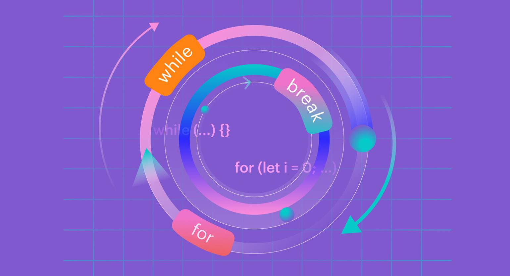
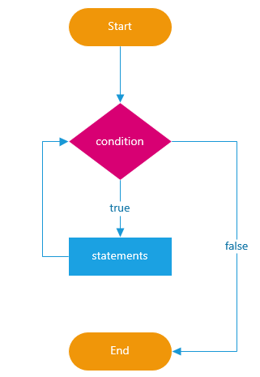

# Лекция 3. Циклы в JavaScript: while, do...while, for, break/continue и типовые паттерны



## Вступление: зачем нужны циклы и где они встречаются в реальных сценариях

В первых двух лекциях мы писали код, который выполняется линейно: сверху вниз, строка за строкой. Мы уже умеем принимать решения через `if/else`, то есть выбирать один из сценариев.

Но в реальных задачах очень часто нужен не выбор, а **повтор**.

Причём повтор бывает разным:

- повторить действие фиксированное количество раз (например, 10 раз вывести сообщение)
- повторять, пока не выполнится условие (например, пока пользователь не введёт корректное число)
- идти по значениям “шаг за шагом” (например, перебрать числа от 1 до 100)
- искать результат: “иди дальше, пока не найдёшь подходящее”
- показать карточки товаров на странице, пока не дойдёшь до конца списка
- и многое другое

Вот несколько примеров из реальной жизни:

- Вывод списка товаров на странице интернет-магазина
- Обработка данных, полученных с сервера (например, список пользователей)
- пользователь вводит числа, пока не введёт 0
- вычисление факториала числа (например, 5! = 5 × 4 × 3 × 2 × 1)
- нужно посчитать сумму чисел от 1 до `n`

Все эти задачи сводятся к повторению действий, и для этого в `JavaScript` есть специальные конструкции - **циклы**.

---

### Что такое цикл?

**Цикл** - это конструкция языка, которая позволяет повторять набор команд.

Цикл всегда содержит три ключевые идеи:

1. **Условие продолжения** - когда мы продолжаем повторять
2. **Тело цикла** - что именно повторяем
3. **Шаг** - как мы меняем ситуацию, чтобы в какой-то момент цикл смог закончиться



## Почему циклы идут сразу после условий

Условия (`if/else`) отвечают на вопрос:  
**“Что делать в этой ситуации?”**

Циклы отвечают на вопрос:  
**“Как делать это снова и снова, пока не будет нужного результата?”**

И почти всегда эти две темы связаны: внутри цикла обычно есть проверка (`if`), а условие самого цикла - это тоже логическое выражение (`true/false`).

В этой лекции мы разберём три основных вида циклов:

- `while` - когда важно условие (“делай, пока…”)
- `do...while` - когда нужно выполнить хотя бы один раз
- `for` - когда есть счётчик и понятные границы

А ещё - разберём `break` и `continue`, и соберём несколько типовых паттернов, которые вы будете использовать постоянно.

## Цикл while

Цикл `while` - это цикл с предусловием. Он проверяет условие перед каждой итерацией, и если условие истинно (`true`), выполняет тело цикла.

Он читается буквально как “пока (условие) истинно - делай (тело цикла)”.

Синтаксис:

```javascript
while (условие) {
  // тело цикла
}
```

> Важно: условие в `while (...)` должно в какой-то момент стать `false`, иначе цикл будет бесконечным.

### Пример 1: вывести числа от 1 до 5

```javascript
let i = 1; // начальное значение
while (i <= 5) {
  // условие продолжения
  console.log(i); // тело цикла
  i++; // шаг
}
```

Что здесь происходит:

1. Инициализируем переменную `i` значением `1`
2. Проверяем условие `i <= 5`. Пока оно истинно, выполняем тело цикла
3. В теле цикла выводим текущее значение `i`
4. Увеличиваем `i` на `1` (шаг)
5. Когда `i` станет `6`, условие станет ложным, и цикл завершится

### Пример 2. Сумма чисел от 1 до n

Задача пользователь вводит число `n`, а мы считаем сумму чисел от `1` до `n`.

```javascript
let n = Number(prompt("Введите число n:"));
let sum = 0;
let i = 1;

if (Number.isNaN(n) || n < 1) {
  alert("Пожалуйста, введите корректное положительное число.");
} else {
  while (i <= n) {
    sum += i; // добавляем i к сумме
    i++; // увеличиваем i на 1
  }
  alert("Сумма чисел от 1 до " + n + " равна " + sum);
}
```

В этот пример мы:

1. Запрашиваем у пользователя число `n`
2. Инициализируем переменную `sum` для хранения суммы и `i` для счётчика
3. Проверяем, что `n` - корректное положительное число
4. Используем цикл `while`, чтобы пройти от `1` до `n`, добавляя каждое число к `sum`
5. После завершения цикла выводим результат

### Ключевая ошибка новичков: забыли шаг

Если внутри цикла ничего не меняется, условие остаётся истинным, и цикл никогда не завершится.

```javascript
let i = 1;
while (i <= 5) {
  console.log(i);
  // Ошибка: забыли увеличить i
}
```

В этом примере `i` всегда равно `1`, условие `i <= 5` всегда истинно, и цикл будет выполняться бесконечно.

Поэтому в `While` всегда нужно помнить про **шаг** - изменение переменных, участвующих в условии.

## Цикл do...while с постусловием

Цикл `do...while` похож на `while`, но с одним важным отличием:

- В `do...while` тело цикла выполняется **хотя бы один раз**, а условие проверяется после этого.

Синтаксис:

```javascript
do {
  // тело цикла
} while (условие);
```

> Обратите внимание на `;` в конце - в `do...while` она обязательна.

---

### Пример 1. Запросить число хотя бы один раз

Ситуация простая: мы хотим обязательно спросить пользователя число, а потом - если он ввёл некорректно, попросить ещё раз.

```javascript
let num;
do {
  num = Number(prompt("Введите число больше 0:"));
} while (Number.isNaN(num) || num <= 0);
alert(`Спасибо! Вы ввели число: ${num}`);
```

В этом примере:
1. Мы объявляем переменную `num` без значения
2. В теле цикла `do` запрашиваем у пользователя число
3. После этого проверяем условие: если число некорректно, цикл повторяется
4. Как только пользователь введёт корректное число, цикл завершится, и мы выведем сообщение

### Пример 2. Меню выбора (повторять, пока не выберут “выход”)

Очень частый сценарий - показать пользователю меню с вариантами, и повторять его, пока он не выберет “выход”.

```javascript
let choice;
do {
  choice = prompt("Выберите действие:\n1. Сказать привет\n2. Посчитать до 5\n3. Выход");
  if (choice === "1") {
    alert("Привет!");
  } else if (choice === "2") {
    let count = 1;
    while (count <= 5) {    
      console.log(count);
      count++;
    }
  }
} while (choice !== "3");
alert("Вы вышли из меню.");
```

В этом примере:
1. Мы показываем меню пользователю в цикле `do...while`
2. В зависимости от выбора выполняем разные действия
3. Цикл продолжается, пока пользователь не выберет “выход” (вариант `3`)

### Когда выбирать do...while, а когда while ?

`do...while` подходит, когда:
- Нужно выполнить действие хотя бы один раз
- Условие зависит от результата этого действия

`while` подходит, когда:
- Нужно проверить условие перед выполнением
- Возможно, тело цикла не выполнится ни разу

> В реальной практике `while` встречается чаще, но `do...while` полезно знать - он идеально ложится на сценарии “спросить хотя бы раз”.


## Цикл for: когда известны границы и шаг

Цикл `for` удобен тогда, когда вы заранее понимаете границы повторения:

- сколько раз нужно повторить
- с какого значения начать
- какой шаг использовать

Он объединяет в себе инициализацию счётчика, условие продолжения и шаг в одной строке.

Синтаксис:

```javascript
for (инициализация; условие; шаг) {
  // тело цикла
}
```

### Пример 1. Вывести числа от 1 до 5 с помощью for

То же самое, что мы делали на `while`, но короче:

```javascript
for (let i = 1; i <= 5; i++) {
  console.log(i);
}
```

> for читается так: “для i, начиная с 1, пока i меньше или равно 5, увеличивай i на 1”.

### Пример 2. Сумма чисел от 1 до n с помощью for

```javascript
let n = Number(prompt("Введите число n:"));
let sum = 0;
if (Number.isNaN(n) || n < 1) {
  alert("Пожалуйста, введите корректное положительное число.");
} else {
  for (let i = 1; i <= n; i++) {
    sum += i; // добавляем i к сумме
  }
  alert("Сумма чисел от 1 до " + n + " равна " + sum);
}
```

В этом примере мы используем `for`, чтобы пройти от `1` до `n`, добавляя каждое число к `sum`.

### Пример 3. Шаг может быть любым (не только +1)

Например, вывести все чётные числа от 2 до 20:

```javascript
for (let i = 2; i <= 20; i += 2) {
    console.log(i);
}
```

Здесь мы начинаем с `2`, и на каждом шаге увеличиваем `i` на `2`, чтобы получить только чётные числа.

### Пример 4. Обратный счёт
Вывести числа от 10 до 1:

```javascript
for (let i = 10; i >= 1; i--) {
    console.log(i);
}
```

Здесь мы начинаем с `10`, и на каждом шаге уменьшаем `i` на `1`, пока не дойдём до `1`.

### Почему for часто читается легче

В `while` нужно следить за тремя вещами в разных местах:
- где объявили счётчик
- где условие
- где шаг

В `for` эти три элемента собраны в одной строке, поэтому часто он воспринимается проще, когда границы известны заранее.

### Практическое правило выбора

При таком обилии циклов, какой же выбрать?
- `for` - когда есть счётчик и известны границы
- `while` - когда нужно повторять, пока условие истинно, и шаг не обязателен
- `do...while` - когда нужно выполнить действие хотя бы один раз, и условие зависит от результата этого действия

---

## break и continue: как управлять циклом

Обычно цикл выполняется “по плану” - пока условие истинно, повторяем тело, затем делаем шаг.

Но иногда нужно управлять циклом вручную:

- остановить цикл раньше, чем условие станет `false`
- пропустить одну итерацию и перейти к следующей

Для этого используются два ключевых слова:

- `break` - полностью **прерывает** цикл
- `continue` - **пропускает текущую итерацию** и переходит к следующей

---

### break: выйти из цикла сразу

`break` мгновенно завершает цикл, даже если условие ещё `true`.

Пример: найти первое число, которое делится на 7 (в диапазоне 1..100):

```js
let result = null;

for (let i = 1; i <= 100; i++) {
  if (i % 7 === 0) {
    result = i;
    break;
  }
}

alert(`Первое число, кратное 7: ${result}`);
```

Тут как только мы нашли число, кратное 7, мы вызываем `break`, и цикл завершается.

### continue: пропустить текущую итерацию

`continue` полезен, когда нам нужно *“не выполнять”* часть тела цикла при определённых условиях.

Пример: вывести числа от 1 до 10, но пропустить 5:

```javascript
for (let i = 1; i <= 10; i++) {
  if (i === 5) {
    continue;
  }
  console.log(i);
}
```

В этом примере, когда `i` равно `5`, мы вызываем `continue`, и текущая итерация пропускается - `5` не выводится.

Разница между `break` и `continue`:
- `break` - полностью выходит из цикла
- `continue` - пропускает только текущую итерацию и продолжает цикл дальше

### Практическое правило использования break/continue
- Используйте `break`, когда нужно **завершить** цикл досрочно
- Используйте `continue`, когда нужно **пропустить** текущую итерацию и продолжить цикл

> Важно: `break` и `continue` работают одинаково в любых типах циклов: `for`, `while`, `do...while`. Они не упраляют условием цикла напрямую, а просто изменяют ход выполнения.


## Типовые паттерны использования циклов

Циклы в реальном коде почти никогда не используются *“просто так”*.Обычно вы решаете одну из типовых задач, которые встречаются снова и снова.

Ниже - три самых важных паттерна. Они простые, но именно на них строится большая часть практики.

---

### 1) Накопление результата: сумма / количество

**Смысл:** у нас есть переменная-накопитель, и на каждой итерации мы её обновляем.

#### посчитать количество чётных чисел от 1 до n

```javascript
let n = Number(prompt("Введите n:"));

if (Number.isNaN(n) || n <= 0) {
  alert("Нужно ввести положительное число");
} else {
  let count = 0;

  for (let i = 1; i <= n; i++) {
    if (i % 2 === 0) {
      count++;
    }
  }

  alert(`Количество чётных чисел: ${count}`);
}
```

### 2) Поиск первого подходящего значения (часто вместе с break)

**Смысл:** мы идём по значениям и выходим, как только нашли то, что нужно.

Пример: найти первое число, большее 100 и кратное 17

```javascript
let result = null;
for (let i = 101; ; i++) {
  if (i % 17 === 0) {
    result = i;
    break;
  }
}
alert(`Первое число больше 100, кратное 17: ${result}`);
```

### 3) Повторный ввод до корректного значения (валидируем prompt)

**Смысл:** запрашиваем у пользователя ввод, пока он не введёт корректное значение.

Пример: Запросить у пользователя username, пока он не введёт непустую строку

```javascript
let username;
do {
  username = prompt("Введите имя пользователя:");
} while (!username); // повторять, пока username пустая строка или null 
alert(`Добро пожаловать, ${username}!`);
```

### Главное что нужно помнить
- Циклы нужны для повторения действий
- Выбирайте тип цикла в зависимости от задачи: `for`, `while` или `do...while`
- Не забывайте про шаг и условие завершения цикла
- Используйте `break` и `continue` для управления ходом цикла
- Освойте типовые паттерны: накопление результата, поиск первого подходящего значения, повторный ввод до корректного значения

---

## Частые ошибки при работе с циклами

Циклы - тема достаточно простая, но у новичков часто возникают ошибки. Вот самые распространённые:
1. **Бесконечный цикл** - забыли изменить переменную, участвующую в условии.  
   Например, забыли увеличить счётчик в `while`.
2. **Неправильное условие** - условие не соответствует логике задачи, и цикл ведёт себя не так, как ожидалось.  
   Например, условие `i < 5` вместо `i <= 5`, из-за чего цикл выполняется на один раз меньше.
3. **Использование break/continue неправильно** - например, `break` используется там, где нужно было просто пропустить итерацию, или наоборот.
4. **Изменение счётчика внутри тела цикла** - если счётчик изменяется в теле цикла, это может привести к неожиданным результатам.
5. **Неинициализированные переменные** - использование переменных в условии или теле цикла до их объявления или инициализации.

### Куда смотреть при отладке
- Проверьте условие цикла: соответствует ли оно логике задачи?
- Убедитесь, что переменные, участвующие в условии, изменяются правильно.
- Если используете `break` или `continue`, проверьте, что они применяются в нужных местах.
- Добавьте `console.log` внутри цикла, чтобы видеть, как изменяются переменные на каждой итерации.

### Быстрый чек-лист перед запуском
Перед запуском цикла, проверьте:
- Правильно ли инициализированы все переменные?
- Соответствует ли условие логике задачи?
- Есть ли шаг, который изменяет переменные, участвующие в условии?
- Правильно ли используются `break` и `continue`, если они есть?

Если вы будете следовать этим рекомендациям, работа с циклами станет для вас простой и понятной задачей!

---

## Заключение

В этой лекции мы познакомились с циклами в JavaScript: `while`, `do...while` и `for`. Мы разобрали, когда и как использовать каждый из них, а также научились управлять циклом с помощью `break` и `continue`. Мы также рассмотрели типовые паттерны использования циклов, которые помогут вам в реальных задачах.

Циклы - это мощный инструмент для повторения действий, и освоение их использования значительно расширит ваши возможности в программировании на JavaScript. Практикуйтесь, экспериментируйте с разными типами циклов и не забывайте проверять свой код на наличие ошибок. Удачи в дальнейшем изучении JavaScript!

---

## Практика
> Условия:
> - Ввод через `prompt()`
> - Вывод через `alert()`
> - Если ожидаете число - используйте `Number(...)`
> - Обрабатывайте `Cancel` (`null`) и `NaN` через `Number.isNaN()`

1) Выведите числа от 1 до 10 (через `while`).

2) Выведите числа от 10 до 1 (в обратном порядке) через `for`.

3) Запросите `n`. Выведите все числа от 1 до `n`.

4) Запросите `n`. Выведите сумму чисел от 1 до `n`.

5) Запросите `n`. Выведите количество чётных чисел в диапазоне 1..`n`.

6) Запросите `n`. Найдите первое число от 1 до `n`, которое делится на 7.  
   Если таких чисел нет - выведите сообщение об этом.

7) Запросите `n`. Выведите все числа от 1 до `n`, **кроме** тех, которые делятся на 3 (используйте `continue`).

8) Запросите `n`. Остановитесь, как только встретили число, которое делится на 11 (используйте `break`).  
   Выведите найденное число или сообщение, что его нет.

9) Запросите число. Если пользователь ввёл некорректно - просите повторить ввод, пока не введёт корректное число (через `do...while`).

10) Запросите число `n`. Если `n` некорректное или `n <= 0`, просите ввод заново.  
    После этого выведите `true`, если `n` простое (делится только на 1 и на себя), иначе `false`.  
    *(Подсказка: достаточно проверить делители от 2 до n-1 и использовать `break`.)*

## Домашняя работа

> Условия:
> - Ввод через `prompt()`
> - Вывод через `alert()`
> - Если ожидаете число - используйте `Number(...)`
> - Обрабатывайте `Cancel` (`null`) и `NaN` через `Number.isNaN()`

1) Запросите `n`. Выведите через `alert` таблицу умножения на 5 (от 1 до 10).  
   *(Пример: `5 × 1 = 5` и так далее.)*

2) Запросите `n`. Выведите сумму всех чисел от 1 до `n`, которые делятся на 3.

3) Запросите `n`. Выведите произведение чисел от 1 до `n` (факториал).  
   Если `n <= 0` - просите ввод заново.

4) Запросите `n`. Выведите все делители числа `n` (которые делят `n` без остатка).

5) Запросите `n`. Выведите `true`, если число простое, иначе `false`.

6) Запросите `start` и `end` (оба числа). Выведите все числа в диапазоне `start..end`.  
   Если `start > end`, поменяйте их местами (без массивов).

7) Запросите число. Повторяйте ввод, пока пользователь не введёт число от 1 до 10 включительно.  
   После этого выведите: `Вы ввели: <число>`.

8) Игра “Угадай число” (упрощённая версия):
   - задайте в коде число `secret = 7`
   - просите пользователя угадать число
   - пока пользователь не угадал - выводите “Меньше” или “Больше”
   - если нажал `Cancel` - остановите игру

9) Запросите `n`. Выведите все числа от 1 до `n`, но:
   - пропускайте числа, которые делятся на 4 (`continue`)
   - остановитесь полностью, если встретили число, которое делится на 17 (`break`)

10) Запросите `n`. Посчитайте сумму цифр числа `n` **без строк**.  
    *(Подсказка: используйте `% 10` и `Math.floor(n / 10)`.)*
