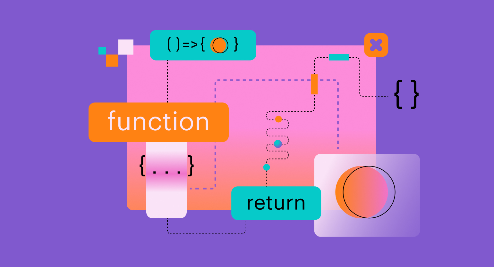

# Лекция 4. Функции в JavaScript: объявление, параметры, return и базовые правила



## Зачем нужны функции и какую проблему они решают?

Программирование делится на три основных парадигмы: процедурное, объектно-ориентированное и функциональное.

Процедурное программирования основано на написании последовательности инструкций, которые выполняются одна за другой.
Объектно-ориентированное программирование фокусируется на создании объектов, которые объединяют данные и поведение.
Функциональное программирование строится вокруг функций, которые принимают входные данные и возвращают выходные данные.

В предыдущих лекциях мы научились:
- использовать переменные для хранения данных;
- использовать условные операторы для принятия решений;
- использовать циклы для повторения действий.

До сегодняшнего дня, когда мы писали код, мы создавали длинные последовательности инструкций. Это может привести к нескольким проблемам:
1. **Повторение кода**: Если нам нужно выполнить одну и ту же задачу в нескольких местах, нам приходится копировать и вставлять один и тот же код, что приводит к дублированию и усложняет поддержку.
2. **Сложность понимания**: Длинные последовательности инструкций могут быть трудны для понимания и сопровождения, особенно если код написан разными людьми.
3. **Отсутствие модульности**: Без функций сложно разбить код на логические части, что затрудняет его повторное использование и тестирование.

Функции решают эти проблемы, позволяя нам:
- **Повторно использовать код**: Мы можем определить функцию один раз и вызывать её в разных местах программы.
- **Упрощать понимание**: Функции позволяют разбить код на логические части, что делает его более читаемым и понятным.
- **Повышать модульность**: Функции позволяют создавать независимые блоки кода, которые можно тестировать и использовать повторно.

## Что такое функция?


**Функция** - это именованный блок кода, который выполняет определённую задачу. Функции могут принимать входные данные (параметры) и возвращать выходные данные (результат).

Эту идею удобно держать в голове как схему:

- **вход** → **обработка** → **выход**

Например: “получить два числа → сложить → вернуть сумму”


### Какие бывают функции?

В `JavaScript` функции могут быть объявлены несколькими способами. В реальных проектах часто используются разные подходы в зависимости от контекста и стиля кода.

Мы разберем их по очереди начиная с самых простых переходя к более сложным и современным.


## 1) Function Declaration (объявление функции)

Это самый традиционный способ объявления функции. Он начинается с ключевого слова `function`, за которым следует имя функции, список параметров в круглых скобках и тело функции в фигурных скобках.

```javascript
function sayHello() {
  alert("Hello!");
}

sayHello();
```

- `sayHello` - имя функции.
- `()` - список параметров (в данном случае пустой).
- `{ ... }` - тело функции, где находится код, который будет выполнен при вызове функции.
- `sayHello();` - вызов функции, который выполняет код внутри неё.

### Параметры и аргументы

Функции могут принимать входные данные через параметры. Параметры указываются в круглых скобках при объявлении функции. Когда функция вызывается, мы передаем аргументы, которые соответствуют этим параметрам.

```javascript
function greet(name) {
  alert(`Hello, ${name}!`);
}
greet("Alice"); // Выведет: Hello, Alice!
greet("Bob");   // Выведет: Hello, Bob!
```

- `name` - параметр функции `greet`.
- `"Alice"` и `"Bob"` - аргументы, переданные при вызове функции.

Такой подход позволяет функции быть более гибкой и использоваться с разными входными данными.

### Возврат значения с помощью return

Функции могут не только принимать параметры, но и возвращать значения с помощью ключевого слова `return`. Когда функция достигает оператора `return`, она завершает своё выполнение и возвращает указанное значение.

```javascript
function add(a, b) {
  return a + b;
}

alert(add(2, 3)); // Выведет: 5
```

Важно помнить, что после выполнения `return` функция прекращает своё выполнение, и никакой код, написанный после `return`, не будет выполнен.

```javascript
function example() {
  return 42;
  alert("This will never be shown");
}
console.log(example()); // Выведет: 42
```

Это особенность функций, которая позволяет контролировать поток выполнения и возвращаемые значения.

### Ранний возврат

Иногда полезно использовать ранний возврат из функции для упрощения логики и уменьшения вложенности кода. Это особенно полезно при проверке условий.

```javascript
function calcDiscountPrice(price, discountPercent) {
  if (Number.isNaN(price) || Number.isNaN(discountPercent)) {
    return null;
  }

  if (price < 0 || discountPercent < 0 || discountPercent > 100) {
    return null;
  }

  return price - (price * discountPercent) / 100;
}

let price = Number(prompt("Введите цену:"));
let discount = Number(prompt("Введите скидку (%):"));

let finalPrice = calcDiscountPrice(price, discount);

if (finalPrice === null) {
  alert("Ошибка ввода");
} else {
  alert(`Итоговая цена: ${finalPrice}`);
}
```
Здесь функция `calcDiscountPrice` использует ранний возврат, чтобы сразу выйти из функции при обнаружении некорректных данных. Дальше мы можем проверить результат и обработать ошибку.

Это абсолютно нормальная практика, которая помогает сделать код чище и понятнее.

### Область видимости функций

Область видимости (scope) определяет, где переменные и функции доступны для использования. В JavaScript существуют две основные области видимости: глобальная и локальная.

- **Глобальная область видимости**: Переменные, объявленные вне функций, доступны в любом месте вашего кода.
- **Локальная область видимости**: Переменные, объявленные внутри функции, доступны только внутри этой функции.

Функции в JavaScript имеют свою собственную локальную область видимости. Это означает, что переменные, объявленные внутри функции, не видны снаружи неё.

```javascript
function myFunction() {
  let localVar = "I'm local";
  console.log(localVar); // Выведет: I'm local
}

myFunction();
console.log(localVar); // Ошибка: localVar is not defined
```

В этом примере `localVar` объявлена внутри функции `myFunction`, и попытка доступа к ней вне функции приводит к ошибке. Это помогает избежать конфликтов имен и защищает внутренние данные функции от внешнего воздействия.

Теперь рассмотрим ситуацию с глобальными переменными:

```javascript
let globalVar = "I'm global";
function myFunction() {
  console.log(globalVar); // Выведет: I'm global
}
myFunction();
console.log(globalVar); // Выведет: I'm global
```

Здесь `globalVar` объявлена в глобальной области видимости и доступна как внутри функции, так и вне её.

> Важно помнить, что чрезмерное использование глобальных переменных может привести к конфликтам имен и затруднить отладку кода. Рекомендуется минимизировать использование глобальных переменных и по возможности использовать локальные переменные внутри функций.

### Особенности Function Declaration

#### 1) Поднятие (Hoisting)

Функции, объявленные через `Function Declaration`, **поднимаются вверх** своей области видимости. Это означает, что такую функцию можно вызвать **до того, как она написана в коде**.

```javascript
alert(sum(2, 3)); // 5 - работает

function sum(a, b) {
  return a + b;
}
```

Почему это работает: движок JavaScript *“знает”* про объявление функции ещё до выполнения кода построчно.

> Важно: это не значит, что нужно всегда вызывать функции *“впереди”*. В учебном коде и в небольших проектах часто проще читать, когда функции описаны выше, а основной сценарий - ниже.

#### 2) У Function Declaration всегда есть имя

При таком объявлении у функции есть имя (`sum`, `sayHello`, `greet`), и это имя видно в стектрейсе ошибок (когда будете отлаживать код).

```javascript
function calculateTotal(price, quantity) {
  return price * quantity;
}
```

Имя функции `calculateTotal` помогает понять, что делает эта функция, и облегчает отладку, если что-то пойдет не так.

#### 3) Где чаще используют Function Declaration

`Function Declaration` удобно использовать, когда:

- вы пишете *“обычные”* функции утилиты (посчитать, проверить, преобразовать)
- вы хотите простой и читаемый синтаксис
- вам важно, чтобы функция была доступна до места вызова (`hoisting`)

## 2) Function Expression (функциональное выражение)

Другой способ создания функции - это функциональное выражение. В этом случае функция создается и присваивается переменной. Такой способ позволяет создавать анонимные функции (без имени) или именованные функции.

```javascript
const sayHello = function() {
  alert("Hello!");
};
sayHello();
```

Тут мы создаем анонимную функцию и присваиваем её переменной `sayHello`. Затем мы вызываем функцию через эту переменную.

### Параметры и возврат значения

Функции, созданные через функциональное выражение, также могут принимать параметры и возвращать значения так же, как и функции, объявленные через `Function Declaration`.

```javascript
const add = function(a, b) {
  return a + b;
};
alert(add(2, 3)); // Выведет: 5
```

### Главное отличие от Function Declaration: нет hoisting

Это самый важный практический момент. Если попытаться вызвать **Function Expression** до объявления, будет ошибка, потому что в этот момент переменная ещё не содержит функцию.

```javascript
// alert(add(2, 3)); // Ошибка: нельзя вызвать до объявления

const add = function (a, b) {
  return a + b;
};

alert(add(2, 3)); // 5 - работает
```

Почему так происходит:

 - `Function Declaration` поднимается целиком
 - `Function Expression` - это обычная переменная, которой значение присваивается только на этой строке

### Где чаще используют Function Expression

`Function Expression` особенно часто встречается, когда:

- функцию нужно передать как значение (позже мы увидим это в событиях и колбэках)
- вы хотите явно контролировать порядок: “сначала объявили - потом используем”
- код пишется в современном стиле, где всё хранится в `const/let`

## 3) Arrow Function (стрелочная функция)

Стрелочная функция - это более современный способ объявления функций, введённый в `ES6`.

То есть по смыслу она такая же, как и Function Expression, но с более кратким синтаксисом.

Базовый синтаксис стрелочной функции выглядит так:

```javascript
const add = (a, b) => {
  return a + b;
};
alert(add(2, 3)); // Выведет: 5
```

### Упрощённый синтаксис
Если функция принимает один параметр, круглые скобки можно опустить:

```javascript
const square = x => {
  return x * x;
};

alert(square(4)); // Выведет: 16
```

Если тело функции состоит из одного выражения, фигурные скобки и ключевое слово `return` можно опустить:

```javascript
const add = (a, b) => a + b;
alert(add(2, 3)); // Выведет: 5
```

Это работает только тогда, когда у вас действительно одно выражение. Если нужно несколько строк логики - возвращайтесь к блоку `{}` и пишите return явно.

### Пример в стиле “проверка входных данных + return”

Тот же подход с ранним выходом работает и в стрелочных функциях:

```javascript
const calcDiscountPrice = (price, discountPercent) => {
  if (Number.isNaN(price) || Number.isNaN(discountPercent)) {
    return null;
  }

  if (price < 0 || discountPercent < 0 || discountPercent > 100) {
    return null;
  }

  return price - (price * discountPercent) / 100;
};

let price = Number(prompt("Введите цену:"));
let discount = Number(prompt("Введите скидку (%):"));

let finalPrice = calcDiscountPrice(price, discount);

if (finalPrice === null) {
  alert("Ошибка ввода");
} else {
  alert(`Итоговая цена: ${finalPrice}`);
}
```

### Важное отличие стрелочных функций (пока просто запомнить)

Стрелочные функции не создают свой `this`. Это важно в объектах, классах и обработчиках событий - мы вернёмся к этому позже, когда тема станет актуальной.

Сейчас достаточно понимать практическую мысль:

- стрелочные функции - это современный формат
- они удобны для коротких функций и “функций как значений”
- но если вы пишете обычную “классическую” функцию, `Function Declaration` всё ещё полностью нормален

### Мини-итог по трём видам

`Function Declaration` - отдельное объявление, работает `hoisting`
`Function Expression` - функция как значение, `hoisting` не работает
`Arrow Function` - современная короткая форма `Function Expression`

> “Дальше эти идеи (параметры, return, scope) работают одинаково для всех видов функций.”

---
## Функции как значения, callback и замыкание

Выше мы использовали функцию как *инструмент* - объявляли и вызывали её. Но в JavaScript есть очень важная концепция: **функции как значения**. Это значит, что функции можно присваивать переменным, передавать как аргументы другим функциям и возвращать из функций. Такой подход позволяет создавать более гибкий и мощный код.

И именно на этом строятся такие концепции, как **callback-функции** и **замыкания**.

### Функция как значение: передача функции в функцию (callback)

Сначала посмотрим на самый частый сценарий: одна функция принимает другую и вызывает её внутри себя.

```javascript
function sayHi() {
  alert("Hi!");
}

function run(action) {
  action();
}

run(sayHi);
```

Важно обратить внимание на то, что при передаче функции `sayHi` в `run`, мы не вызываем её (нет круглых скобок), а просто передаем ссылку на неё. Внутри `run` мы вызываем эту функцию через `action()`.

То есть это разные вещи:

```javascript
run(sayHi); // передаём функцию как значение
run(sayHi()); // вызываем sayHi и передаём её результат (undefined)
```

Обратите внимание, что во втором случае `sayHi()` вызывается сразу, и его результат (который `undefined`, так как `sayHi` ничего не возвращает) передается в `run`.

### Зачем это нужно?

Такой подход позволяет создавать более абстрактные и переиспользуемые функции. Например, мы можем создать функцию `repeat`, которая будет вызывать переданную функцию несколько раз:

```javascript
function repeat(action, times) {
  for (let i = 0; i < times; i++) {
    action();
  }
}
repeat(sayHi, 3); // Выведет "Hi!" три раза
```

Здесь `repeat` принимает функцию `action` и количество раз `times`, и вызывает `action` в цикле.

### Замыкание (closure)

Замыкание - это функция, которая "запоминает" своё лексическое окружение, даже когда она выполняется вне своей первоначальной области видимости. Это позволяет функции иметь доступ к переменным из внешней функции, даже после того, как внешняя функция завершила своё выполнение.

Простым языком:
> Функция *помнит* окружение, в котором она была создана.

```javascript
function makeCounter() {
  let count = 0;

  return function() {
    count++;
    return count;
  };
}

const counter = makeCounter();
console.log(counter()); // 1
console.log(counter()); // 2
console.log(counter()); // 3
```

В этом примере `makeCounter` возвращает внутреннюю функцию, которая увеличивает и возвращает значение `count`. Переменная `count` сохраняет своё значение между вызовами функции `counter`, потому что внутренняя функция замыкает в себе это значение.

Замыкания широко используются в JavaScript для создания приватных переменных и функций, а также для реализации различных паттернов программирования. Детальнее мы рассмотрим эту тему в будущих лекциях.


### Почему это работает и где это применяется?

Замыкания позволяют хранить состояние без использования глобальных переменных. Если бы мы объявили `count` глобально, это могло бы привести к конфликтам и ошибкам в больших программах.
Использование замыканий помогает создавать более безопасный и модульный код, где внутренние данные функции защищены от внешнего воздействия.

К примеру если создать два счётчика:

```javascript
const counter1 = makeCounter();
const counter2 = makeCounter();
console.log(counter1()); // 1
console.log(counter1()); // 2
console.log(counter2()); // 1
console.log(counter2()); // 2
```

Это потому, что каждый вызов `makeCounter` создает новое лексическое окружение с собственной переменной `count`.

### Мини-вывод
- *Callback-функции* позволяют передавать функции как аргументы другим функциям для создания более абстрактного и переиспользуемого кода.
- *Замыкания* позволяют функциям "запоминать" своё лексическое окружение, что обеспечивает доступ к переменным из внешней функции даже после её завершения.

Дальше эти идеи будут постоянно встречаться:

- в DOM и событиях (обработчики - это callbacks)
- в таймерах (setTimeout)
- в работе с данными

---
## Частые ошибки новичков в функциях

Функции - это мощный инструмент, но при их использовании часто возникают ошибки. Вот некоторые из наиболее распространённых ошибок новичков и советы по их избеганию:

### 1) Передача не правильного количества аргументов

Функция может быть объявлена с определённым количеством параметров, но при вызове можно передать меньше или больше аргументов. В JavaScript это не вызывает ошибку, но может привести к неожиданным результатам.

```javascript
function greet(name, age) {
  alert(`Hello, ${name}. You are ${age} years old.`);
}
greet("Alice"); // age будет undefined
greet("Bob", 25, "extra argument"); // лишний аргумент игнорируется
```

### 2) Забыть использовать return для возврата значения

Если функция должна возвращать значение, но забыть использовать `return`, результат будет `undefined`.

```javascript
function add(a, b) {
  a + b; // забыли return
}
console.log(add(2, 3)); // Выведет: undefined
```

### Написали return, но забыли, что он завершает функцию

```javascript
function test() {
  return 42;
  alert("Не выполнится");
}
```

### 4) Ошибки в области видимости (scope)
Переменные, объявленные внутри функции, не доступны снаружи неё. Попытка доступа к таким переменным приведёт к ошибке.

```javascript
function myFunction() {
  let localVar = "I'm local";
}
console.log(localVar); // Ошибка: localVar is not defined
```

### 5) Попытались вызвать функцию до её объявления (для Function Expression и Arrow Function)

```javascript
// sayHello(); // Ошибка: нельзя вызвать до объявления
const sayHello = function() {
  alert("Hello!");
};
sayHello(); // Работает
```

### 6) Ожидали что состояние сбросится между вызовами функции (для замыканий)

Замыкание специально сохраняет состояние между вызовами. 

```javascript
function makeCounter() {
  let count = 0;
  return function () {
    count++;
    return count;
  };
}

const counter = makeCounter();
alert(counter()); // 1
alert(counter()); // 2
```

Если нужно сбросить счётчик, нужно создать новый экземпляр:

```javascript
const counter2 = makeCounter();
alert(counter2()); //
```

### 7) Путаница между параметрами и аргументами
Параметры - это переменные, указанные в объявлении функции. Аргументы - это реальные значения, переданные функции при вызове.

```javascript
function greet(name) { // name - параметр
  alert(`Hello, ${name}!`);
}
greet("Alice"); // "Alice" - аргумент
```

---
### Заключение

В этой лекции мы рассмотрели основные концепции функций в JavaScript, включая различные способы их объявления, использование параметров и возврат значений. Мы также обсудили важные темы, такие как область видимости, функции как значения, callback-функции и замыкания. 

Функции являются фундаментальной частью JavaScript и понимание их работы поможет вам писать более эффективный и организованный код. В следующих лекциях мы продолжим изучение функций и их применения в различных контекстах, таких как работа с DOM, событиями и асинхронным программированием.

---
## Практика

1. Напишите функцию `multiply`, которая принимает два числа в качестве параметров и возвращает их произведение. Проверьте работу функции с разными значениями.
2. Создайте функцию `isEven`, которая принимает число и возвращает `true`, если число чётное, и `false`, если нечётное. Используйте эту функцию для проверки нескольких чисел.
3. Напишите функцию `sum(a, b)`, которая возвращает сумму двух чисел.
4. Создайте функцию `repeat`, которая принимает функцию и число `n`, и вызывает переданную функцию `n` раз.
5. Напишите функцию `max(a, b)`, которая возвращает большее число.
6. Создайте функцию `makeCounter`, которая возвращает функцию-счётчик. Каждый вызов счётчика должен увеличивать значение на 1 и возвращать его.
7. Напишите функцию `calcDiscountPrice(price, percent)`, которая:
   - принимает цену и процент скидки;
   - проверяет корректность входных данных (числа, неотрицательные, процент от 0 до 100);
   - возвращает итоговую цену со скидкой или `null`, если данные некорректны.
8. Написать функцию, которая принимает длину и ширину прямоугольника и вычисляет его площадь. Если в функцию
передали 1 параметр, то она вычисляет площадь квадрата.(Задачу решить тремя способами: Function Declaration, Function Expression, Arrow Function)

---
## Домашняя работа

1. Напишите функцию `toNumber(value)`, которая:
   - принимает строку (например, из `prompt`);
   - преобразует её в число через `Number(...)`;
   - возвращает число или `null`, если результат `NaN`.

2. Напишите функцию `getValidNumber(message)`, которая:
   - запрашивает ввод через `prompt(message)`;
   - если пользователь нажал `Cancel` — возвращает `null`;
   - если введено не число или пустая строка — просит снова;
   - иначе возвращает число.

3. Напишите функцию `sumTo(n)`, которая возвращает сумму чисел от 1 до `n`.  
   Если `n <= 0` или `n` не число — возвращайте `null`.

4. Напишите функцию `countDivisible(start, end, divisor)`, которая возвращает количество чисел в диапазоне `start..end`, которые делятся на `divisor` без остатка.  
   Если `divisor === 0` — возвращайте `null`.

5. Напишите функцию `findFirstDivisible(start, end, divisor)`, которая возвращает первое число в диапазоне `start..end`, которое делится на `divisor`.  
   Если таких чисел нет — возвращайте `null`.

6. Напишите функцию `repeatWithIndex(n, action)`, которая вызывает `action(i)` `n` раз, где `i` — номер итерации (от 1 до `n`).  
   Проверьте: передайте callback, который выводит `alert(\`Итерация ${i}\`)`.

7. Напишите функцию `makeMultiplier(k)`, которая возвращает новую функцию.  
   Возвращённая функция принимает число `x` и возвращает `x * k`.  
   Проверьте работу для `k = 2` и `k = 10`.

8. Напишите функцию `makeRangeChecker(min, max)`, которая возвращает функцию-проверку.  
   Возвращённая функция принимает число `n` и возвращает `true`, если `n` находится в диапазоне `min..max`, иначе `false`.  
   Проверьте на нескольких значениях.

9. Напишите функцию `createPasswordChecker(correctPassword)`, которая возвращает функцию.  
   Возвращённая функция:
   - запрашивает пароль через `prompt`;
   - возвращает `true`, если пароль совпал с `correctPassword`, иначе `false`;
   - если `Cancel` — возвращает `null`.  
   Проверьте работу.

10. Напишите функцию `makeCounter(start)`, которая создаёт счётчик с начальным значением `start` (если `start` не передали — считать от 0).  
    Каждый вызов возвращаемой функции увеличивает значение на 1 и возвращает новое значение.  
    Проверьте работу на двух независимых счётчиках.