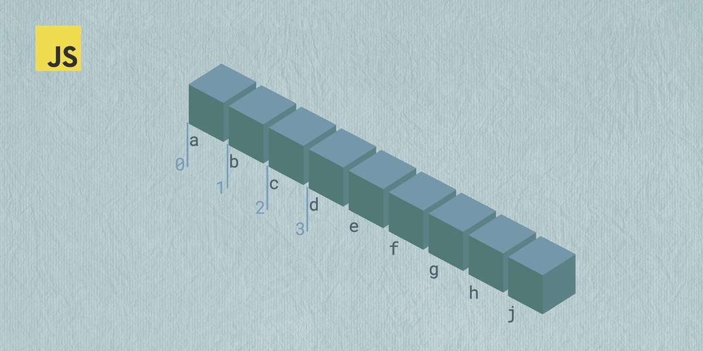

# Лекция 5. Массивы в JavaScript: хранение данных, перебор, методы и обработка



## Вступление

До этого момента мы работали с отдельными переменными для хранения данных. Например:

```javascript
let name = "Иван"; // строка
let age = 25; // число
let isStudent = true; // булево значение
```

Однако, когда нам нужно хранить множество значений, использование отдельных переменных становится неудобным и неэффективным. Например, если мы хотим хранить список имен студентов, нам придется создавать отдельную переменную для каждого имени:

```javascript
let student1 = "Иван";
let student2 = "Мария";
let student3 = "Петр";
```

Тут возникает проблема: если у нас много студентов, нам придется создавать множество переменных, что усложняет код и делает его менее читаемым.

Чтобы решить эту проблему, в JavaScript существуют массивы.

## Что такое массивы?

**Массивы** - упорядоченные коллекции данных, которые позволяют хранить несколько значений в одной переменной. Массивы могут содержать значения разных типов, включая строки, числа, булевы значения и даже другие массивы или объекты.

Для создания массива в JavaScript используются квадратные скобки `[]`. Вот пример создания массива с именами студентов:

```javascript
let students = ["Иван", "Мария", "Петр"];
```

Здесь у нас есть массив `students`, который содержит три строки - имена студентов.

### Индексы (нумерация элементов)

Каждый элемент массива имеет свой **индекс** - порядковый номер, который начинается с нуля. Это означает, что первый элемент массива имеет индекс `0`, второй - индекс `1`, третий - индекс `2` и так далее.

```javascript
// Индекс:          0        1        2
const students = ["Иван", "Мария", "Петр"];
```

Чтобы получить доступ к элементу массива, мы используем его индекс в квадратных скобках:

```javascript
console.log(students[0]); // Выведет "Иван"
console.log(students[1]); // Выведет "Мария"
console.log(students[2]); // Выведет "Петр"
```

Если мы попытаемся обратиться к индексу, которого нет в массиве, мы получим значение `undefined`:

```javascript
console.log(students[5]); // Выведет undefined
```

### Массив можно изменять

Массивы в JavaScript являются изменяемыми (mutable), что означает, что мы можем изменять их содержимое после создания. Мы можем добавлять, удалять или изменять элементы массива.

```javascript
let students = ["Иван", "Мария", "Петр"];
students[1] = "Анна"; // Изменяем второй элемент
console.log(students); // Выведет ["Иван", "Анна", "Петр"]
```

Если так же обратится к несуществующему индексу, то элемент будет добавлен в массив:

```javascript
students[3] = "Сергей"; // Добавляем новый элемент
console.log(students); // Выведет ["Иван", "Анна", "Петр", "Сергей"]
```

Но такой способ добавления элементов не рекомендуется использовать, так как он может привести к созданию "дыр" в массиве. Лучше использовать специальные методы для добавления элементов, о которых мы поговорим далее.

К примеру:

```javascript
let numbers = [1, 2, 3];
numbers[5] = 6; // Добавляем элемент по индексу 5
console.log(numbers);  // [1, 2, 3, empty × 2, 6]
```

В этом примере мы добавили элемент `6` по индексу `5`, но между `3` и `5` появились пустые элементы. Это усложняет обработку массива и может приводить к неожиданному поведению.

> Поэтому для добавления элементов обычно используют специальные методы (`push`, `unshift` и т.д.) - к ним мы перейдём дальше.

### Что можно хранить в массивах?

Чаще всего в массивах хранят однотипные данные, например, список имен, чисел или булевых значений. Однако в JavaScript массивы могут содержать элементы разных типов:

```javascript
let mixedArray = ["Иван", 25, true, null, { city: "Prague" }, [1, 2, 3]];
console.log(mixedArray);
```

В этом примере массив `mixedArray` содержит строку, число, булево значение, `null`, объект и другой массив.

Также можно хранить массив внутри массива:

```javascript
let matrix = [
  [1, 2, 3],
  [4, 5, 6],
  [7, 8, 9]
];
console.log(matrix[1][2]); // Выведет 6
```

Такая структура называется двумерным массивом и часто используется для представления таблиц или матриц.

### Длина массива length

У каждого массива есть свойство `length`, которое возвращает количество элементов в массиве.

```javascript
let students = ["Иван", "Мария", "Петр"];
console.log(students.length); // Выведет 3
```

### Доступ к последнему элементу

Так как индексация в массивах начинается с нуля, чтобы получить доступ к последнему элементу массива, нужно использовать индекс `length - 1`:

```javascript
let students = ["Иван", "Мария", "Петр"];
console.log(students[students.length - 1]); // Выведет "Петр"
```

Это очень частый приём, особенно когда размер массива может меняться.

```javascript
arr[arr.length - 1]
```

### Почему length важно понимать

`length` меняется, когда вы добавляете или удаляете элементы.

```javascript
const numbers = [10, 20, 30];
console.log(numbers.length); // 3

numbers[3] = 40;
console.log(numbers.length); // 4
```

А если *“прыгнуть”* на большой индекс, length тоже увеличится:

```javascript
const numbers = [1, 2, 3];

numbers[10] = 999;

console.log(numbers.length); // 11
console.log(numbers);        // [1, 2, 3, empty × 7, 999]
```

То есть `length` - это не количество реально существующих элементов, а **наибольший индекс + 1.**

Именно поэтому не рекомендуется добавлять элементы по большим индексам вручную, так как это может привести к созданию "дыр" в массиве и усложнить его обработку.

## Перебор массивов

Массивы очень редко используют только для хранения данных. Чаще всего нам нужно перебрать все элементы массива и выполнить с ними какие-то действия. Например:

- Вывести все имена студентов на экран
- Посчитать сумму всех чисел в массиве
- Найти определённое значение в массиве

В JavaScript есть два базовых способа перебора, которые нужно знать в самом начале:

- Цикл `for` - когда нужен индекс
- Цикл `for...of` - когда нужно просто значение

### Перебор с помощью цикла for

Цикл `for` позволяет нам перебрать массив, используя его индексы. Вот пример:

```javascript
const students = ["Иван", "Мария", "Петр"];
for (let i = 0; i < students.length; i++) {
  console.log(students[i]);
}
```

В этом примере:

- `i=0` - начинаем с первого индекса
- `i < students.length` - продолжаем, пока `i` меньше длины массива
- `i++` - увеличиваем `i` на `1` после каждой итерации

Частой ошибкой является неправильное условие окончания цикла. Например, если написать `i <= students.length`, то на последней итерации мы попытаемся обратиться к несуществующему индексу, и получим `undefined`.

```javascript
for (let i = 0; i <= students.length; i++) { // Ошибка!
  console.log(students[i]); // На последней итерации будет undefined
}
```

### Перебор с помощью цикла for...of

Цикл `for...of` позволяет перебрать массив, получая сразу значения его элементов, без необходимости работать с индексами. Вот пример:

```javascript
const students = ["Иван", "Мария", "Петр"];
for (const name of students) {
  console.log(name);
}
```

Этот вариант читается проще и удобнее, когда нам не нужен индекс элемента, а только его значение.

### Когда использовать for, а когда for...of

Используйте `for`, если:

- вам нужен индекс
- вы хотите менять элементы массива по индексу
- вы хотите идти в обратную сторону
- вы хотите менять шаг (например, i += 2)

Используйте `for...of`, если:

- вам нужен только элемент
- вы просто обрабатываете значения “по очереди”
- вы хотите код попроще и читаемее

### Мини-пример: изменить элементы массива (только через for)

`for...of` даёт нам значение, но не даёт индекс, поэтому менять элементы удобнее через `for`:

```javascript
const numbers = [1, 2, 3, 4];

for (let i = 0; i < numbers.length; i++) {
  numbers[i] = numbers[i] * 2;
}

console.log(numbers); // [2, 4, 6, 8]
```

## Базовые методы изменения массива: `push/pop`, `shift/unshift`

Выше мы уже сталкивались с тем, что массивы можно изменять. Но для добавления и удаления элементов существуют специальные методы, которые делают это удобнее и безопаснее.

В основе работы с массивами лежат четыре метода:

- `push` - добавляет элемент в конец массива
- `pop` - удаляет последний элемент массива
- `unshift` - добавляет элемент в начало массива
- `shift` - удаляет первый элемент массива

### Метод push - добавление в конец массива

Метод `push` добавляет один или несколько элементов в конец массива и возвращает новую длину массива.

```javascript
let students = ["Иван", "Мария"];
students.push("Петр");
console.log(students); // ["Иван", "Мария", "Петр"]
console.log(students.length); // 3
```

Если нужно добавить сразу несколько:

```javascript
students.push("Анна", "Сергей");
console.log(students); // ["Иван", "Мария", "Петр", "Анна", "Сергей"]
```

### Метод pop - удаление из конца массива

Метод `pop` удаляет последний элемент массива и возвращает его значение.

```javascript
let students = ["Иван", "Мария", "Петр"];
let lastStudent = students.pop();
console.log(lastStudent); // "Петр"
console.log(students); // ["Иван", "Мария"]
```

Это удобно когда нужно удалить последний элемент и сразу его использовать.

### Метод unshift - добавление в начало массива

Метод `unshift` добавляет один или несколько элементов в начало массива и возвращает новую длину массива.

```javascript
let students = ["Иван", "Мария"];
students.unshift("Петр");
console.log(students); // ["Петр", "Иван", "Мария"]
console.log(students.length); // 3
```

Если нужно добавить сразу несколько:

```javascript
students.unshift("Анна", "Сергей");
console.log(students); // ["Анна", "Сергей", "Петр", "Иван", "Мария"]
```

### Метод shift - удаление из начала массива

Метод `shift` удаляет первый элемент массива и возвращает его значение.

```javascript
let students = ["Иван", "Мария", "Петр"];
let firstStudent = students.shift();
console.log(firstStudent); // "Иван"
console.log(students); // ["Мария", "Петр"]
```

### Что важно помнить о методах изменения массива

1. Все эти методы изменяют исходный массив.
   То есть массив после вызова метода уже будет другим.

```javascript
let arr = [1, 2, 3];
arr.push(4);
console.log(arr); // [1, 2, 3, 4]
```

2. `push/pop` работают с концом, `shift/unshift` - с началом
3. `push` и `unshift` могут добавлять сразу несколько элементов
4. `pop` и `shift` возвращают удалённый элемент

### Мини-паттерн: очередь и стек

Эти методы часто используются для реализации двух распространённых структур данных:

- **Стек (Stack)** - структура данных, работающая по принципу "последний вошёл - первый вышел" (LIFO). Для реализации стека используются методы `push` и `pop`.
- **Очередь (Queue)** - структура данных, работающая по принципу "первый вошёл - первый вышел" (FIFO). Для реализации очереди используются методы `push` и `shift`.

пример стека:

```javascript
let stack = [];
stack.push(1);
stack.push(2);
console.log(stack.pop()); // 2
console.log(stack.pop()); // 1
```

пример очереди:

```javascript
let queue = [];
queue.push(1);
queue.push(2);
console.log(queue.shift()); // 1
console.log(queue.shift()); // 2
```

> На практике `shift/unshift` могут быть медленнее на больших массивах, потому что перестраивают индексы. Но на учебных примерах и небольших данных это нормально, главное - понять принцип.

## `slice` и `splice`: копия vs изменение массива

Методы `push/pop/shift/unshift` работают только с началом и концом массива. Но в реальных задачах часто нужно работать с элементами внутри массива - удалять, добавлять или копировать их. Для этого существуют методы `slice` и `splice`.

### Метод slice - создание копии части массива

Метод `slice` создаёт новый массив, копируя в него часть исходного массива. Он не изменяет исходный массив.
Синтаксис:

- `start` - индекс, с которого начинается копирование (включительно)
- `end` - индекс, на котором заканчивается копирование (не включительно). Если не указан, копирование идёт до конца массива.

```javascript
const numbers = [1, 2, 3, 4, 5];
const part = numbers.slice(1, 4); // Копируем элементы с индекса 1 по индекс 4 (не включая 4)
console.log(part); // [2, 3, 4]
console.log(numbers); // [1, 2, 3, 4, 5] - исходный массив не изменился
```

Если `end` не указан:

```javascript
const numbers = [1, 2, 3, 4, 5];
const part = numbers.slice(2); // Копируем с индекса 2 до конца
console.log(part); // [3, 4, 5]
```

Также можно использовать отрицательные индексы, чтобы считать с конца массива. Индекс `-1` соответствует последнему элементу, `-2` - предпоследнему и так далее.

```javascript
const numbers = [1, 2, 3, 4, 5];
const part = numbers.slice(-3); // Копируем последние 3 элемента
console.log(part); // [3, 4, 5]
```

### splice(start, deleteCount, ...items) - вырезать / вставить / заменить (меняет массив)

Метод `splice` **изменяет исходный массив**, позволяя удалять, добавлять или заменять элементы внутри массива.

Параметры:

- `start` - индекс, с которого начинается изменение массива
- `deleteCount` - количество элементов, которые нужно удалить, начиная с индекса `start`
- `...items` - (необязательный) элементы, которые нужно добавить в массив

#### Удаление элементов

```javascript
const numbers = [1, 2, 3, 4, 5];
const removed = numbers.splice(1, 2); // Удаляем 2 элемента, начиная с индекса 1
console.log(numbers); // [1, 4, 5]
console.log(removed); // [2, 3] - возвращённые удалённые элементы
```

Если `deleteCount` равен `0`, элементы не удаляются:

```javascript
const numbers = [1, 2, 3, 4, 5];
numbers.splice(2, 0); // Ничего не удаляем
console.log(numbers); // [1, 2, 3, 4, 5]
```

#### Добавление элементов

```javascript
const numbers = [1, 2, 5];
numbers.splice(2, 0, 3, 4); // Добавляем 3 и 4, начиная с индекса 2
console.log(numbers); // [1, 2, 3, 4, 5]
```

Пример добавления другим массивом:

```javascript
const numbers = [1, 2, 5];
const toAdd = [3, 4];
numbers.splice(2, 0, ...toAdd); // Добавляем элементы из toAdd
console.log(numbers); // [1, 2, 3, 4, 5]
```

Тут нужно использовать оператор расширения `...`, чтобы "распаковать" массив `toAdd` в отдельные аргументы. Этот прием часто используется в JavaScript. Своего рода "распаковка" массива в список значений.

> Важно: если не использовать `...`, массив вставится как один элемент:

```javascript
const numbers = [1, 2, 5];
const toAdd = [3, 4];

numbers.splice(2, 0, toAdd);
console.log(numbers); // [1, 2, [3, 4], 5]
```

А с `...toAdd`:

```javascript
const numbers = [1, 2, 5];
const toAdd = [3, 4];

numbers.splice(2, 0, ...toAdd);
console.log(numbers); // [1, 2, 3, 4, 5]
```

#### Замена элементов

```javascript
const numbers = [1, 2, 3, 4, 5];
numbers.splice(1, 2, 20, 30); // Удаляем 2 элемента с индекса 1 и добавляем 20 и 30
console.log(numbers); // [1, 20, 30, 4, 5]
```

Логика тут такая: сначала удаляются указанные элементы, а затем на их место вставляются новые. Важно следить за индексами и количеством удаляемых элементов, чтобы не запутаться.

### Мини-итог: что использовать и когда

`slice` - когда нужна копия

- получить часть массива
- не менять исходные данные
- безопасно для “данных как есть”

`splice` - когда нужно изменить массив

- удалить элементы из середины
- вставить элемент в середину
- заменить кусок массива

---

## Методы обработки данных: `map`, `filter`, `find`, `reduce`


Помимо методов для изменения массива, в JavaScript есть мощные методы для обработки данных в массивах. Они позволяют выполнять операции над элементами массива, создавая новые массивы или вычисляя значения на основе существующих данных.
Можно выделить четыре основных метода:

- `map` - преобразование каждого элемента массива
- `filter` - отбор элементов по условию
- `find` - поиск первого элемента, соответствующего условию
- `reduce` - свёртка массива в одно значение

### Метод map - преобразование массива

`map` проходит по каждому элементу массива, применяет к нему заданную функцию и возвращает новый массив с результатами.

```javascript
const numbers = [1, 2, 3, 4];
const doubled = numbers.map(function(num) {
  return num * 2;
});
console.log(doubled); // [2, 4, 6, 8]
```

Можно использовать стрелочные функции для более компактного кода:

```javascript
const numbers = [1, 2, 3, 4];
const doubled = numbers.map(num => num * 2);
console.log(doubled); // [2, 4, 6, 8]
```

> Важно: map всегда возвращает массив той же длины, просто элементы в нём *“преобразованы”*.

### Метод filter - отбор элементов

`filter` возвращает новый массив, в который попадают только те элементы, для которых условие вернуло `true`.

```javascript
const numbers = [1, 2, 3, 4, 5];
const evenNumbers = numbers.filter(num => num % 2 === 0);
console.log(evenNumbers); // [2, 4]
```

> Важно: filter может возвращать массив любой длины, включая пустой, если ни один элемент не подошёл под условие.

### Метод find - поиск элемента

`find` возвращает первый элемент массива, который удовлетворяет условию. Если такой элемент не найден, возвращается `undefined`.

```javascript
const numbers = [1, 2, 3, 4, 5];
const firstEven = numbers.find(num => num % 2 === 0);
console.log(firstEven); // 2
```

Если нет ни одного подходящего элемента:

```javascript
const numbers = [1, 3, 5];
const firstEven = numbers.find(num => num % 2 === 0);
console.log(firstEven); // undefined
```

### Метод reduce - свёртка массива

`reduce` используют, когда нужно получить одно итоговое значение из массива.

```javascript
const numbers = [1, 2, 3, 4];
const sum = numbers.reduce((accumulator, current) => accumulator + current, 0);
console.log(sum); // 10
```

В этом примере:

- `accumulator` - накопленное значение (начинается с `0`, указанного в конце)
- `current` - текущий элемент массива

`reduce` можно использовать для различных задач, например, для подсчёта количества элементов, создания объектов и т.д.

## ForEach - простой перебор без возврата

Метод `forEach` позволяет перебрать массив и выполнить функцию для каждого элемента, но в отличие от `map`, он не возвращает новый массив. Этот метод полезен, когда нужно просто выполнить действие для каждого элемента без создания нового массива.

```javascript
const numbers = [1, 2, 3, 4];
numbers.forEach(num => {
  console.log(num * 2);
});
// Выведет:
// 2
// 4
// 6
// 8
```

### Что важно понимать про forEach?

**1) `forEach` всегда возвращает `undefined`**
Частая ошибка - пытаться сохранить результат `forEach` в переменную, ожидая получить массив. На самом деле `forEach` ничего не возвращает.

```javascript
const numbers = [1, 2, 3];
const result = numbers.forEach(num => num * 2);
console.log(result); // undefined
```

**2) `forEach` нельзя прервать досрочно**
В отличие от циклов `for` или методов `map`, `filter`, `find`, `forEach` не поддерживает прерывание выполнения с помощью `break` или `return`.
Если нужно прервать перебор, лучше использовать обычный цикл `for` или метод `some`.
**3) `forEach` полезен для побочных эффектов**
`forEach` отлично подходит для выполнения действий, которые не требуют возврата значения, например, вывод на экран, изменение внешних переменных и т.д.
**4) Callback-функция принимает три аргумента**
Функция, передаваемая в `forEach`, может принимать до трёх аргументов:

- текущий элемент
- индекс текущего элемента
- сам массив

```javascript
const numbers = [10, 20, 30];
numbers.forEach((num, index, arr) => {
  console.log(`Элемент: ${num}, Индекс: ${index}, Массив: ${arr}`);
});
// Выведет:
// Элемент: 10, Индекс: 0, Массив: 10,20,30
// Элемент: 20, Индекс: 1, Массив: 10,20,30
// Элемент: 30, Индекс: 2, Массив: 10,20,30
```

### Когда forEach уместен

`forEach` стоит использовать, когда:

- вывести элементы в консоль (логирование)
- выполнить действие для каждого элемента (например, позже - создать `DOM`-элементы)
- накопить результат в переменную (хотя чаще для этого используют `reduce`)

Пример с накоплением суммы:

```javascript
const numbers = [10, 20, 30];
let sum = 0;

numbers.forEach((num) => {
  sum += num;
});

console.log(sum); // 60
```

## Типовые паттерны на массивах: как решать задачи, а не просто знать методы

Массивы и методы важны не сами по себе. Важно другое: уметь узнавать задачу и понимать, каким способом её решать.

Ниже - несколько типовых паттернов, которые будут встречаться постоянно (в учебных задачах, в проектах и в реальном фронтенде).

---

### 1) Посчитать сумму чисел

**Вариант 1: цикл `for`**

```js
const numbers = [10, 20, 30];
let sum = 0;

for (let i = 0; i < numbers.length; i++) {
  sum += numbers[i];
}

console.log(sum); // 60
```

**Вариант 2: reduce (современный стиль)**

```javascript
const numbers = [10, 20, 30];

const sum = numbers.reduce((acc, n) => acc + n, 0);

console.log(sum); // 60
```

### 2) Найти максимальное число

**Вариант 1: цикл `for`**

```javascript
const numbers = [10, 5, 30, 20];
let max = numbers[0];
for (let i = 1; i < numbers.length; i++) {
  if (numbers[i] > max) {
    max = numbers[i];
  }
}
console.log(max); // 30
```

**Вариант 2: reduce**

```javascript
const numbers = [10, 5, 30, 20];
const max = numbers.reduce((acc, n) => (n > acc ? n : acc), numbers[0]);
console.log(max); // 30
```

### 3) Найти элемент по условию

Когда нужен первый подходящий элемент - используем `find`.

```javascript
const numbers = [5, 12, 3, 27, 9];

const firstBig = numbers.find((n) => n > 10);

console.log(firstBig); // 12
```

### 4) Отфильтровать элементы по условию

Когда нужно получить все подходящие элементы - используем `filter`.

```javascript
const numbers = [5, 12, 3, 27, 9];
const bigNumbers = numbers.filter((n) => n > 10);
console.log(bigNumbers); // [12, 27]
```

### 5) Преобразовать элементы массива

Когда нужно изменить каждый элемент массива - используем `map`.

```javascript
const numbers = [1, 2, 3, 4];
const doubled = numbers.map((n) => n * 2);
console.log(doubled); // [2, 4, 6, 8]
```

### 6) Вывести элементы массива

Когда нужно просто выполнить действие для каждого элемента - используем `forEach`.

```javascript
const numbers = [1, 2, 3, 4];
numbers.forEach((n) => {
  console.log(n);
});
// Выведет:
// 1
// 2
// 3
// 4
```

---

Мини-вывод по паттернам

- сумма / итог → чаще `reduce` (или цикл)
- максимум / минимум → цикл или `reduce`
- один элемент по условию → `find`
- все элементы по условию → `filter`
- преобразование списка → `map`
- перебор для действия → `forEach`

--

## Как выбрать правильный метод?

Чтобы выбрать правильный метод для работы с массивом, полезно задать себе несколько вопросов.

---

### 1) Нужен новый массив?

Если да - чаще всего это:

- `map` - **преобразование** (новый массив той же длины)
- `filter` - **отбор** (новый массив, длина может уменьшиться)
- `slice` - **взять часть массива** (копия)

Если нужен **один элемент** - `find`.

```js
const numbers = [1, 2, 3, 4];

const doubled = numbers.map((n) => n * 2);               // [2, 4, 6, 8]
const evenNumbers = numbers.filter((n) => n % 2 === 0);  // [2, 4]
const firstEven = numbers.find((n) => n % 2 === 0);      // 2
```

Если нужен **итог** - `reduce`.

```js
const numbers = [1, 2, 3, 4];
const sum = numbers.reduce((acc, n) => acc + n, 0); // 10
```

Главная разница:

- `map`, `filter`, `slice` возвращают массив
- `find`, `reduce` возвращают одно значение

### 2) Нужно изменить исходный массив?

Если массив нужно изменить *“на месте”*, используйте методы, которые меняют его напрямую:

- `push`, `pop` - работа с концом массива
- `shift`, `unshift` - работа с началом массива
- `splice` - удалить / вставить / заменить в середине

Если нужно просто перебрать элементы без создания нового массива - используйте `forEach` или цикл `for`.

```javascript
const numbers = [1, 2, 3];

numbers.push(4);      // добавили в конец
numbers.splice(1, 1); // удалили элемент по индексу 1

console.log(numbers); // [1, 3, 4]

numbers.forEach((n) => console.log(n)); // перебор без результата
```

### 3) Нужен ли доступ к индексам?

Если нужен доступ к индексам - используйте:

- цикл `for`
- либо методы массива, где индекс доступен вторым параметром `callback`

Пример с циклом `for`:

```javascript
const numbers = [10, 20, 30];

for (let i = 0; i < numbers.length; i++) {
  console.log(`Индекс: ${i}, Значение: ${numbers[i]}`);
}
```

Если индексы не нужны - проще использовать for...of:

```javascript
const numbers = [10, 20, 30];

for (const num of numbers) {
  console.log(`Значение: ${num}`);
}
```

А в методах массива индекс можно получить вторым параметром:

```javascript
const numbers = [10, 20, 30];

const doubled = numbers.map((num, index) => {
  console.log(`Индекс: ${index}, Значение: ${num}`);
  return num * 2;
});

console.log(doubled); // [20, 40, 60]
```

## Заключение

В этой лекции мы разобрали, зачем в JavaScript нужны массивы и почему без них невозможно писать реальные программы.

Вы научились создавать массивы, понимать индексацию и работать с `length`, чтобы уверенно получать элементы и не выходить за границы массива. Разобрали базовые способы перебора (`for`, `for...of`) и поняли, когда важен индекс, а когда достаточно значения.

Дальше мы перешли к методам массива:

- методы изменения массива (`push/pop`, `shift/unshift`, `splice`)
- методы, которые возвращают новый результат без изменения исходных данных (`slice`, `map`, `filter`)
- методы поиска и получения одного значения (`find`, `reduce`)
- `forEach` как способ “пройтись по массиву и выполнить действие” без возврата результата

Главная мысль, которую важно унести:

> массив - это не просто “список значений”, а структура данных, с которой вы постоянно будете работать в проектах: фильтровать, преобразовывать, искать, считать, собирать результат.

В следующей лекции логично перейти к объектам - потому что в реальных задачах массивы почти всегда хранят не числа и строки, а **объекты** (товары, пользователи, задачи), и там начинается настоящая практика.

---

## Практика

1. Создайте массив `numbers = [10, 20, 30, 40, 50]`. Выведите в консоль:

   - первый элемент массива;
   - последний элемент массива (через `length - 1`);
   - длину массива (`length`).
2. Создайте массив `numbers = [5, 10, 15, 20]`. Посчитайте сумму всех чисел:

   - сначала через цикл `for`;
   - затем через `reduce`.
3. Создайте массив `numbers = [1, 2, 3, 4, 5, 6, 7, 8]`. Посчитайте количество чётных чисел:

   - через цикл `for...of`.
4. Создайте массив `items = ["A", "B", "C"]`.

   - добавьте в конец `"D"` и `"E"` с помощью `push`;
   - удалите последний элемент с помощью `pop` и сохраните его в переменную `last`;
   - выведите итоговый массив и значение `last`.
5. Создайте массив `queue = ["first", "second", "third"]`.

   - добавьте `"zero"` в начало с помощью `unshift`;
   - удалите первый элемент с помощью `shift` и сохраните его в переменную `removed`;
   - выведите итоговый массив и значение `removed`.
6. Создайте массив `nums = [1, 2, 3, 4, 5, 6, 7]`.

   - создайте новый массив `firstThree`, который содержит первые 3 элемента (`slice`);
   - создайте новый массив `lastTwo`, который содержит последние 2 элемента (`slice` с отрицательными индексами);
   - убедитесь, что исходный массив `nums` не изменился.
7. Создайте массив `letters = ["a", "b", "c", "d", "e"]`.

   - удалите 2 элемента, начиная с индекса `1`, через `splice` и сохраните удалённые элементы в `removed`;
   - вставьте на это место `"x"` и `"y"` через `splice`;
   - выведите `removed` и итоговый массив.
8. Создайте массив `numbers = [1, 2, 3, 4, 5]`. Создайте новый массив `squares`, где каждый элемент - квадрат исходного числа (`map`).
9. Создайте массив `numbers = [3, 10, 7, 20, 15, 2]`. Создайте новый массив `bigNumbers`, где остаются только числа больше `10` (`filter`).
10. Создайте массив `numbers = [5, 12, 8, 130, 44]`. Найдите первое число, которое больше `10` (`find`). Если элемент не найден - выведите сообщение `"Not found"`.
11. Создайте массив `numbers = [4, 9, 2, 7, 5]`.

- найдите сумму всех элементов через `reduce`;
- найдите максимальный элемент через `reduce`.

12. Создайте массив `numbers = [2, 4, 6, 8]`. С помощью `forEach` выведите в консоль строки вида:
    `Index: 0, Value: 2`, `Index: 1, Value: 4` и т.д.
13. Создайте массив `numbers = [1, 2, 3, 4, 5, 6, 7, 8]`.

- оставьте только чётные числа (`filter`);
- умножьте каждое из них на `10` (`map`);
- выведите итоговый массив (ожидаемый результат: `[20, 40, 60, 80]`).

## Домашняя работа

1. Создайте массив `names = ["Ivan", "Maria", "Petr", "Anna"]`.

   - добавьте в конец `"Sergey"`;
   - удалите последний элемент и сохраните его в `last`;
   - выведите итоговый массив и `last`.
2. Создайте массив `numbers = [3, 7, 2, 9, 5]`.

   - найдите сумму всех чисел;
   - найдите максимальное число;
   - выведите оба результата.
3. Создайте массив `numbers = [1, 2, 3, 4, 5, 6, 7, 8, 9, 10]`.

   - создайте новый массив `evenNumbers`, где остаются только чётные числа;
   - выведите `evenNumbers`.
4. Создайте массив `numbers = [2, 4, 6, 8, 10]`.

   - создайте новый массив `halved`, где каждое число делится на 2;
   - выведите `halved`.
5. Создайте массив `numbers = [5, 12, 8, 130, 44]`.

   - найдите первое число, которое больше 20;
   - если число не найдено - выведите `"Not found"`.
6. Создайте массив `nums = [1, 2, 3, 4, 5, 6, 7, 8, 9]`.

   - создайте массив `middle`, который содержит элементы с индекса 2 до 6 (не включая 6);
   - выведите `middle`.
7. Создайте массив `letters = ["a", "b", "c", "d", "e", "f"]`.

   - удалите 2 элемента, начиная с индекса 2;
   - вставьте на их место `"X"` и `"Y"`;
   - выведите итоговый массив.
8. Создайте массив `prices = [100, 250, 80, 120, 300]`.

   - создайте новый массив `discountedPrices`, где каждый элемент уменьшен на 10%;
   - создайте новый массив `bigDiscounted`, где остаются только значения больше 100 после скидки;
   - выведите оба массива.
9. Создайте массив `numbers = [10, 20, 30, 40]`.

   - с помощью `forEach` выведите в консоль строки вида:
     `Value: 10`, `Value: 20` и т.д.
10. **Задача “практика методов” (комбинация):**
    Создайте массив `numbers = [1, 3, 4, 6, 7, 8, 10, 11]`.

    - оставьте только чётные числа;
    - умножьте их на 5;
    - найдите сумму результата;
    - выведите итоговую сумму.
11. Создайте массив `students = ["Ivan", "Maria", "Petr", "Anna", "Sergey"]`.

    - удалите первого студента (`shift`) и сохраните его в `firstStudent`;
    - добавьте `"Olga"` в начало;
    - выведите `firstStudent` и итоговый массив.
12. Создайте массив `numbers = [1, 2, 3, 4, 5]`.

    - напишите код, который создаёт новый массив `reversed` в обратном порядке **без использования строковых методов**(можно использовать цикл и `push`, либо `reduce`).
    - выведите `reversed`.