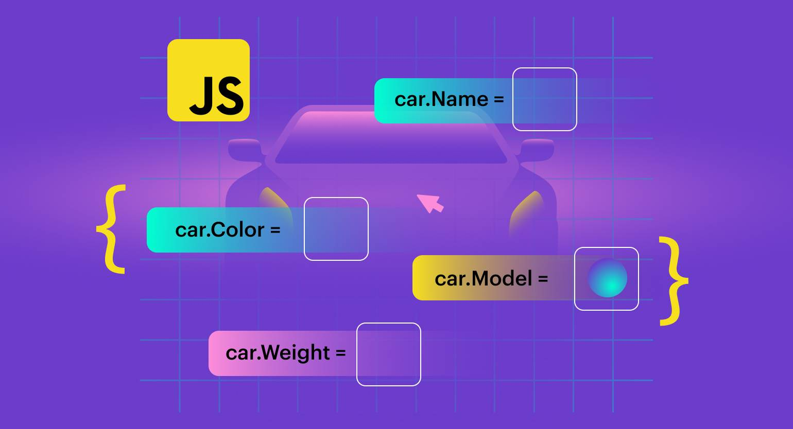

# Лекция 6. Объекты в JavaScript: свойства, методы, перебор, ссылки и работа с данными



## Вступление

Мы уже знакомы с примитивными типами данных в JavaScript, такими как числа, строки и булевы значения. Также мы знаем, что массивы позволяют хранить упорядоченные коллекции данных. Например:

```javascript
let numbers = [1, 2, 3, 4, 5];
console.log(numbers[0]); // Выведет: 1
```

Но как только нам нужно хранить более сложные структуры данных, например, информацию о пользователях, товарах или настройках, этого становится недостаточно.

### Проблема сущности с множеством свойств

Представим, что нам нужно хранить информацию о пользователе: его имя, возраст, адрес и телефон. Если использовать массив, это может выглядеть так:

```javascript
let user = ["Иван Иванов", 30, "Prague", "+420 123 456 7890"];
```

Для доступа к данным нам придется помнить, что имя находится по индексу 0, возраст по индексу 1 и так далее. Это неудобно и неочевидно.

```javascript
console.log(user[0]); // Какое это свойство?
console.log(user[1]); // А это?
```

> Нужно постоянно помнить, что за что отвечает в массиве.

А что если нужно хранить информацию о множестве пользователей? Тогда нам придется создавать массивы массивов, что усложнит доступ к данным ещё больше.

```javascript
let users = [
  ["Иван Иванов", 30, "Prague", "+420 123 456 7890"],
  ["Мария Петрова", 25, "Brno", "+420 987 654 3210"]
];

console.log(users[1][0]); // Какое это свойство?
```

А если мы захотим добавить ещё одно свойство, например, email? Нам придётся менять структуру всех массивов и помнить новые индексы.

```javascript
let users = [
  ["Иван Иванов", 30, "Prague", "+420 123 456 789", "example@gmail.com"],
  ["Мария Петрова", 25, "Brno", "+420 987 654 3210", "new@gmail.com"]
];
```

Это становится неудобно и сложно в управлении.

## Решение: Объекты

Когда у сущности много свойств, и мы хотим легко к ним обращаться по именам, на помощь приходят объекты.

Обьект - это коллекция свойств, где каждое свойство имеет имя (ключ) и значение. Например, мы можем создать объект для пользователя следующим образом:

```javascript
const user = {
  name: "Иван Иванов",
  age: 30,
  address: "Prague",
  phone: "+420 123 456 7890"
};
```

Теперь мы можем легко обращаться к свойствам по именам:

```javascript
console.log(user.name); // Выведет: Иван Иванов
console.log(user.age);  // Выведет: 30
```

Такой подход делает код более читаемым и понятным.

### Множество объектов
Если нам нужно хранить информацию о множестве пользователей, мы можем создать массив объектов:

```javascript
const users = [
  {
    name: "Иван Иванов",
    age: 30,
    address: "Prague",
    phone: "+420 123 456 7890"
  },
  {
    name: "Мария Петрова",
    age: 25,
    address: "Brno",
    phone: "+420 987 654 3210"
  }
];
```

Теперь доступ к данным становится интуитивно понятным:

```javascript
console.log(users[0].name); // Выведет: Иван Иванов
console.log(users[1].name); // Выведет: Мария Петрова
```

### Где обьекты встречаются в реальной жизни

Объекты широко используются в JavaScript и веб-разработке.
- пользовательские профили, `{ name: "John", age: 30 }`,
- товары в интернет-магазинах, `{ id: 1, title: "Laptop", price: 999.99 }`,
- настройки приложений, `{ theme: "dark", notifications: true }`,
- данные из API, `{ status: "success", data: [...] }`,
- конфигурационные файлы и многое другое. `{ host: "localhost", port: 8080 }`

Объекты позволяют структурировать данные, делая их более понятными и удобными для работы. В следующих лекциях мы подробно рассмотрим, как создавать, изменять и использовать объекты в JavaScript.

---
## Создание объектов и доступ к свойствам: точка и квадратные скобки

Выше мы уже увидели базовую идею объектов в JavaScript. Давайте теперь подробнее рассмотрим, как создавать объекты и получать доступ к их свойствам.

### 1) Создание объекта 

Объект можно создать с помощью фигурных скобок `{}`. Внутри фигурных скобок мы определяем свойства объекта в виде пар "ключ: значение", разделённых запятыми.

```javascript
const person = {
  name: "Peter Parker",
  age: 28,
  city: "New York"
};
```

Здесь `name`, `age` и `city` - это ключи (или свойства) объекта `person`, а `"Peter Parker"`, `28` и `"New York"` - соответствующие значения.

### 2) Доступ к свойствам объекта

Существует два основных способа доступа к свойствам объекта: через точку `.` и через квадратные скобки `[]`.

#### Доступ через точку

Мы можем получить значение свойства, указав имя объекта, затем точку и имя свойства.

```javascript
console.log(person.name); // Выведет: Peter Parker
console.log(person.age);  // Выведет: 28
```

> Точка используется, когда имя свойства известно заранее и является допустимым идентификатором JavaScript.

#### Доступ через квадратные скобки

Второй способ - использовать квадратные скобки с именем свойства в виде строки.

```javascript
console.log(person["city"]); // Выведет: New York
```

> Квадратные скобки полезны, когда имя свойства хранится в переменной или содержит пробелы или специальные символы.

```javascript
const propertyName = "age";
console.log(person[propertyName]); // Выведет: 28
```

##### Когда Квадратные скобки необходимы:

**1) Имя свойства хранится в переменной.**
```javascript
const prop = "name";
console.log(person[prop]); // Выведет: Peter Parker
```

если попробовать использовать точку:
```javascript
console.log(person.prop); // Выведет: undefined
```

**2) Имя свойства содержит пробелы или специальные символы.**

````javascript
const obj = {
  "first name": "John",
  "last-name": "Doe",
  "dark-mode": true
};

console.log(obj["first name"]); // "John"
console.log(obj["last-name"]);  // "Doe"
console.log(obj["dark-mode"]);  // true
````

если обратиться к свойству через точку, например `obj.first name`, это вызовет ошибку синтаксиса.

**3) Имя свойства является числом или начинается с цифры.**

```javascript
const data = {
  "2024": "Year of the Dragon",
  "1stPlace": "Gold Medal"
};

console.log(data["2024"]);    // "Year of the Dragon"
console.log(data["1stPlace"]); // "Gold Medal"

```
Через точку такие ключи не работают:
```javascript
// data.2024    // SyntaxError
// data.1stPlace // SyntaxError
```

**4) Если свойства нет - будет undefined**

Это важно: если обратиться к несуществующему ключу - ошибки не будет, просто вернётся `undefined`.

```javascript
console.log(person.email);      // undefined
console.log(person["email"]);   // undefined
```

Это нормальное поведение JavaScript, но из-за него легко пропустить ошибку в названии ключа.

---

## Добавление, изменение и удаление свойств объекта

После создания объекта мы можем добавлять новые свойства, изменять существующие и удалять ненужные. Давайте рассмотрим, как это сделать. Обьекты в JavaScript являются динамическими, что означает, что мы можем изменять их структуру в любое время.

### 1) Добавление новых свойств

Чтобы добавить новое свойство к объекту, мы можем просто присвоить значение новому ключу, используя либо точку, либо квадратные скобки.

```javascript
const person = {
  name: "Peter Parker",
  age: 28
};

person.city = "New York";      // добавили новое свойство
person["isStudent"] = false;   // добавили ещё одно

console.log(person);
// { name: "Peter Parker", age: 28, city: "New York", isStudent: false }
```

> Важно : Если свойство с таким именем уже существует, его значение будет перезаписано. Это еще одно свойство динамичности объектов.

### 2) Изменение существующих свойств
Чтобы изменить значение существующего свойства, мы просто присваиваем новое значение тому же ключу.

```javascript
person.name = "Bruce Wayne"; // изменили имя
console.log(person.name); // Выведет: Bruce Wayne
```

### 3) Удаление свойств
Чтобы удалить свойство из объекта, мы используем оператор `delete`.

```javascript
const person = {
  name: "Peter Parker",
  age: 28,
  city: "New York"
};

delete person.city;

console.log(person); // { name: "Peter Parker", age: 28 }

```
> delete удаляет свойство полностью из объекта. После удаления попытка доступа к этому свойству вернет `undefined`.

### 4) Важный момент: const и изменяемость объекта

Частая путаница у новичков:

- `const` запрещает перезаписать переменную
- но не запрещает менять содержимое объекта

То есть так можно:

```javascript
const person = { name: "Tony Stark" };
person.name = "Iron Man"; // изменение свойства - работает
console.log(person); // { name: "Iron Man"}
```

Но так нельзя:

```javascript
const person = { name: "Tony Stark" };
person = { name: "Bruce Banner" }; // Ошибка! Перезапись переменной
```

Потому что во втором случае мы пытаемся изменить ссылку `person` на новый объект, что запрещено для `const`.

---

## Свойства и методы объекта: функция внутри объекта и `this`

Пока мы работали только со *свойствами* - это просто значения по ключам (строка, число, массив и т.д.).

Но у объекта могут быть и **методы** - это свойства, значением которых является функция.

---

### 1) Что такое методы объекта ?

**Метод объекта** - это функция, которая является свойством этого объекта. Методы позволяют объектам выполнять действия и манипулировать своими данными.


```js
const user = {
  name: "Ivan",
  age: 25,
  sayHi: function () {
    console.log("Hi!");
  }
};

user.sayHi(); // Hi!
```

В этом примере `sayHi` - это метод объекта `user`. Мы вызываем его с помощью круглых скобок `()`, как обычную функцию.

### 2) Зачем нужны методы?

Методы позволяют хранить поведение рядом с данными. Например, у пользователя можно сделать метод, который выводит его информацию:

```js
const user = {
  name: "Ivan",
  age: 25,
  printInfo: function () {
    console.log(`Name: ${user.name}, Age: ${user.age}`);
  }
};

user.printInfo(); // Name: Ivan, Age: 25
```

Но тут есть проблема: внутри метода мы обращаемся к свойствам через имя объекта `user`. Если мы скопируем этот метод в другой объект, он сломается.

### 3) Ключевое слово `this`

Чтобы решить эту проблему, в JavaScript есть специальное ключевое слово `this`, которое внутри метода ссылается на текущий объект, которому принадлежит этот метод.

```js
const user = {
  name: "Ivan",
  age: 25,
  printInfo: function () {
    console.log(`Name: ${this.name}, Age: ${this.age}`);
  }
};

user.printInfo(); // Name: Ivan, Age: 25
```

Теперь, если мы скопируем метод `printInfo` в другой объект, он будет работать правильно, потому что `this` будет ссылаться на тот объект, которому принадлежит метод.

### 4) Почему this важен на практике

Допустим, мы “передали” объект в другую переменную:

```js
const user = {
  name: "Ivan",
  age: 25,
  printInfo: function () {
    console.log(`${this.name} (${this.age})`);
  }
};

const anotherRef = user;
anotherRef.printInfo(); // Ivan (25)
```

Метод продолжает работать, потому что `this` берётся не из переменной, а из контекста вызова: `anotherRef.printInfo()`.

### 5) Короткая запись метода (современный синтаксис)

В объектах есть более короткая форма записи методов:

```js
const user = {
  name: "Ivan",
  age: 25,
  printInfo() {
    console.log(`${this.name} (${this.age})`);
  }
};

user.printInfo(); // Ivan (25)
```

Эта запись встречается очень часто - используйте её, когда пишете методы объекта.

### Важно (пока просто запомнить)

`this` работает корректно, когда метод вызывается вот так:

```js
user.printInfo();
```

А вот дальше (когда мы будем передавать методы как `callbacks`) появятся нюансы. Мы это отдельно разберём позже.

---

## Перебор свойств объекта: цикл `for...in`, `Object.keys()`, `Object.values()`, `Object.entries()`

Иногда нам нужно пройтись по всем свойствам объекта, чтобы прочитать или обработать их. В JavaScript есть несколько способов сделать это.

### 1) Цикл `for...in`
Цикл `for...in` позволяет перебрать все перечисляемые свойства объекта.

```js
const user = {
  name: "Ivan",
  age: 25,
  city: "Prague"
};
for (let key in user) {
  console.log(key + ": " + user[key]);
}
// name: Ivan
// age: 25
// city: Prague
```

> Важно: `for...in` перебирает **перечисляемые свойства**, включая унаследованные.  
> В учебных и практических задачах чаще используют `Object.keys/values/entries`, потому что так проще контролировать, что именно вы перебираете.


### 2) `Object.keys()` - получение массива ключей

Метод `Object.keys(obj)` возвращает массив всех ключей (имен свойств) объекта. Очень полезно, когда нужно работать с ключами как с массивом.

```js
const user = {
  name: "Ivan",
  age: 25,
  city: "Prague"
};
const keys = Object.keys(user);
console.log(keys); // ["name", "age", "city"]
```

Данный способ позволяет использовать методы массивов, например `forEach`, `map`, `filter` и другие.

Примеры:
```js
const users = {
  user1: { name: "Ivan", age: 25 },
  user2: { name: "Maria", age: 30 },
  user3: { name: "Peter", age: 28 }
};

const keys = Object.keys(users);
keys.forEach(key => {
  console.log(users[key].name + ' - ' + users[key].age);
});
// Ivan - 25
// Maria - 30
// Peter - 28

const ages = keys.map(key => users[key].age);
console.log(ages); // [25, 30, 28]

const adults = keys.filter(key => users[key].age >= 28);
console.log(adults); // ["user2", "user3"]
```

Такой подход очень удобен для работы с объектами. Сначала получаем ключи, а потом уже работаем с ними как с массивом.
Можно также использовать `for...of` для перебора ключей:

```js
for (let key of Object.keys(user)) {
  console.log(key + ": " + user[key]);
}
```

Это даст тот же результат, но порядок перебора будет **более предсказуемым**, потому что мы перебираем массив ключей.

### 3) `Object.values()` - получение массива значений

Метод `Object.values(obj)` возвращает массив всех значений свойств объекта.

```js
const user = {
  name: "Ivan",
  age: 25,
  city: "Prague"
};

const values = Object.values(user);
console.log(values); // ["Ivan", 25, "Prague"]
```

Это полезно, когда нам нужны только значения без ключей.

### 4) `Object.entries()` - получение массива пар [ключ, значение]

Метод `Object.entries(obj)` возвращает массив массивов, где каждый внутренний массив содержит пару [ключ, значение] для каждого свойства объекта.

```js
const user = {
  name: "Ivan",
  age: 25,
  city: "Prague"
};
const entries = Object.entries(user);
console.log(entries);
// [["name", "Ivan"], ["age", 25], ["city", "Prague"]]
```

Это удобно для перебора и обработки как ключей, так и значений одновременно.

```js
for (const [key, value] of Object.entries(user)) {
  console.log(`${key}: ${value}`);
}
// name: Ivan
// age: 25
// city: Prague
```

---

## Ссылки на объекты: сравнение, копирование и типичная ловушка новичков

С объектами есть важная особенность, которая часто вызывает путаницу:

**объекты в JavaScript передаются и хранятся по ссылке.**

Это означает:
- переменная хранит не “сам объект”, а ссылку на него
- если создать вторую переменную, то обе будут указывать на один и тот же объект

### 1) Объект = ссылка

```js
const user = { name: "Ivan", age: 25 };

const anotherRef = user; // не копия, а ссылка на тот же объект

anotherRef.age = 30;

console.log(user.age);       // 30
console.log(anotherRef.age); // 30
```

> Важно: Изменение через одну ссылку влияет на объект, на который ссылаются обе переменные.

### 2) Сравнение объектов

Частый вопрос:

```js
const obj1 = { name: "Ivan" };
const obj2 = { name: "Ivan" };
console.log(obj1 === obj2);
```

Хотя визуально объекты одинаковые, это два **разных объекта в памяти**.

`===` сравнивает ссылки, а не содержимое объектов. Поэтому результат будет `false`.

Если две переменные ссылаются на один и тот же объект, то сравнение вернет `true`:

```js
const obj1 = { name: "Ivan" };
const obj2 = obj1;
console.log(obj1 === obj2); // true
```

### 3) Копирование объектов

Иногда нужно создать копию объекта, чтобы изменения в одной переменной не влияли на другую. Для этого можно использовать несколько способов: 

**1) Оператор spread (`...`)**

```js
const user = { name: "Ivan", age: 25 };
const copy = { ...user }; // создаём поверхностную копию
```

**2) `Object.assign()`**

```js
const user = { name: "Ivan", age: 25 };
const copy = Object.assign({}, user); // создаём поверхностную копию
```

Оба способа создают новый объект с теми же свойствами, но это **поверхностная копия**. Если свойства объекта сами являются объектами, то они всё равно будут ссылаться на те же вложенные объекты.

Например так:

```js
const user = {
  name: "Ivan",
  address: { city: "Prague", zip: "11000" }
};
const copy = { ...user };
copy.address.city = "Brno";
console.log(user.address.city); // Brno - изменилось в оригинале!
```

Почему так? Потому что `address` - это объект, и в копии хранится ссылка на тот же объект.
Фактически это выглядит так:

```
const user = {
  name: "Ivan",
  address: { city: "Prague", zip: "11000" } // ссылка на объект
};
const copy = {
  name: "Ivan",
  address: user.address // та же ссылка на объект
};
```

> Важно помнить об этом, чтобы избежать неожиданных изменений в данных. Тоже самое касается массивов внутри объектов.

### 4) Глубокое копирование объектов
Иногда нужно сделать **полную копию** объекта вместе со всеми вложенными объектами и массивами, чтобы копия была полностью независимой от оригинала.

Это называется **глубокое копирование (deep copy)**.

Мы не будем разбирать его в этой лекции, потому что тема объёмная и у неё есть нюансы (какие типы данных копируются, как ведут себя функции, даты и т.д.).

Сейчас важно запомнить главное:

> если внутри объекта есть вложенные объекты/массивы - поверхностная копия (`{...obj}`) копирует **ссылки**, и изменения могут “протекать” в оригинал.
---

## Объекты + массивы вместе: типичная структура данных (как в реальных проектах)

В реальной разработке вы почти не встретите ситуацию, где есть только “чистый массив чисел” или “один объект”.

Чаще всего данные выглядят так:

- **массив объектов** (список пользователей, товаров, задач)
- **объект, внутри которого лежат массивы/объекты** (настройки, ответ API)

И именно под такие структуры и заточены методы массивов (`map/filter/find/reduce`) и работа с объектами.

---

### 1) Массив объектов: список сущностей

Представим, что у нас есть список пользователей:

```js
const users = [
  { id: 1, name: "Ivan", age: 25, city: "Prague", isActive: true },
  { id: 2, name: "Maria", age: 30, city: "Brno", isActive: false },
  { id: 3, name: "Petr", age: 28, city: "Prague", isActive: true },
];
```

Теперь можно решать типовые задачи:

### 2) Найти одного пользователя по условию (find)

Например, найти пользователя по id:

```js
const user = users.find((u) => u.id === 2);
console.log(user); // { id: 2, name: "Maria", ... }
```
Если польлзователя с таким id нет, `find` вернёт `undefined`.

### 3) Отфильтровать пользователей по условию (filter)

Например, взять только активных:

```js
const activeUsers = users.filter((u) => u.isActive);
console.log(activeUsers);
```

Или выбрать всех из Праги:

```js
const pragueUsers = users.filter((u) => u.city === "Prague");
console.log(pragueUsers);
```

4) Создать новый массив объектов с изменениями (map)

Например, добавить к имени суффикс `_user` и увеличить возраст на 1 (важно: создаём новый массив):

```js
const updatedUsers = users.map((u) => ({
  ...u,
  name: u.name + "_user",
  age: u.age + 1
}));
console.log(updatedUsers);
```

> Обратите внимание, что мы используем оператор spread `...u`, чтобы скопировать все свойства пользователя, а затем переопределяем нужные.

### 5) Суммировать значения из объектов (reduce)

Например, посчитать средний возраст всех пользователей:

```js
const totalAge = users.reduce((sum, u) => sum + u.age, 0);
const averageAge = totalAge / users.length;
console.log(averageAge); // Средний возраст
```

Или посчитать количество активных пользователей:

```js
const activeCount = users.reduce((count, u) => u.isActive ? count + 1 : count, 0);
console.log(activeCount);
```

### 6) Изменение данных: важный момент про ссылки

Если вы меняете объект напрямую, вы меняете исходные данные. Например, так делать можно, но нужно понимать последствия:

```javascript
users[0].age = 99;
console.log(users[0].age); // 99
```

Если же вы хотите “безопасный стиль” (не трогать исходные данные) - используйте map и создавайте новый массив (как выше).


### Мини-вывод

Когда вы видите массив объектов, почти всегда вопрос сводится к одному из четырёх:

- нужен один объект → find
- нужен список по условию → filter
- нужно преобразовать данные → map
- нужен итог / сумма / количество → reduce

В следующих блоках мы будем всё чаще работать именно с такими структурами, потому что так выглядят данные в приложениях и в ответах `API`.

---

## Деструктуризация объектов: быстрый доступ к нужным свойствам

Когда вы работаете с объектами, часто нужно достать 1–3 свойства и использовать их в коде. Можно писать так:

```js
const user = { name: "Ivan", age: 25, city: "Prague" };

console.log(user.name);
console.log(user.age);
```

Но если свойств много, это становится громоздко. Вместо этого можно использовать **деструктуризацию**.

### 1) Базовая деструктуризация

Мы *“распаковываем”* свойства объекта в переменные с такими же именами:

```js
const user = { name: "Ivan", age: 25, city: "Prague" };

const { name, age } = user;

console.log(name); // Ivan
console.log(age);  // 25
```

Теперь у нас есть переменные `name` и `age`, которые содержат соответствующие значения из объекта `user`.

> Важно: имена переменных должны совпадать с ключами объекта.

### 2) Переименование переменных

Иногда имя ключа неудобное, или вам нужно другое имя переменной:

```js
const user = { name: "Ivan", age: 25, city: "Prague" };
const { name: userName, age: userAge } = user;
console.log(userName); // Ivan
console.log(userAge);  // 25
```

### 3) Значение по умолчанию (если свойства нет)

Если свойства нет, деструктуризация даст undefined.
Но можно указать значение по умолчанию:ию:

```js
const user = { name: "Ivan" };
const { name, age = 18 } = user;
console.log(name); // Ivan
console.log(age);  // 18 (значение по умолчанию)
```

### 4) Деструктуризация прямо в параметрах функции

Очень частый приём: когда функция принимает объект, мы сразу достаём нужные свойства в параметрах.

```js
function greet({ name, age }) {
  console.log(`Hello, ${name}. You are ${age} years old.`);
}
const user = { name: "Ivan", age: 25 };
greet(user); // Hello, Ivan. You are 25 years old.
```

Это удобно, когда объект большой, а функции нужны только конкретные поля.

### 5) Остаточные свойства (rest) - “всё остальное”

Если нужно отделить часть свойств, а остальные собрать в новый объект:

```js
const user = { name: "Ivan", age: 25, city: "Prague", isActive: true };

const { name, ...rest } = user;

console.log(name); // Ivan
console.log(rest); // { age: 25, city: "Prague", isActive: true }
```

`rest` будет новым объектом, содержащим все свойства, кроме `name`. `...rest` называется **оператором остаточных свойств**.

## Spread и Rest для объектов: копирование, объединение и “всё остальное”

В прошлых блоках мы уже несколько раз использовали оператор `...`:

- в массивах он “распаковывает” элементы;
- в объектах он “распаковывает” свойства.

В объектах это используется постоянно, потому что помогает удобно копировать данные, объединять их и переопределять отдельные поля.

---

### 1) Spread `...` - копия объекта (поверхностная)

Самый частый сценарий: нужно сделать копию объекта.

```js
const user = { name: "Ivan", age: 25 };

const copy = { ...user };

console.log(copy); // { name: "Ivan", age: 25 }
```

> Важно понимать: это поверхностная копия (мы уже обсуждали ссылки на вложенные объекты).

### 2) Spread - добавить новое свойство

Мы можем “скопировать” объект и добавить новое поле:

```js
const user = { name: "Ivan", age: 25 };

const userWithCity = { ...user, city: "Prague" };

console.log(userWithCity); // { name: "Ivan", age: 25, city: "Prague" }
```

### 3) Spread - изменить (переопределить) свойство

Если мы укажем свойство с тем же ключом, оно переопределится.

```js
const user = { name: "Ivan", age: 25 };
const updatedUser = { ...user, age: 30 };
console.log(updatedUser); // { name: "Ivan", age: 30 }
```

> Правило простое: если ключ повторяется - “побеждает” тот, кто стоит правее.

Сравните два примера:

```js
const user1 = { ...user, age: 30 }; // age из user переопределится на 30
const user2 = { age: 30, ...user }; // age из user останется
console.log(user1); // { name: "Ivan", age: 30 }
console.log(user2); // { age: 25, name: "Ivan" }
```

### 4) Объединение нескольких объектов
Мы можем объединить несколько объектов в один:

```js
const baseUser = { name: "Ivan", age: 25 };
const extra = { city: "Prague", isActive: true };

const merged = { ...baseUser, ...extra };

console.log(merged);
// { name: "Ivan", age: 25, city: "Prague", isActive: true }
```

Если у обьектов есть одинаковые ключи, то “побеждает” тот, кто стоит правее.

### 5) Rest ...rest - при деструктуризации

Rest используется в деструктуризации объектов, когда нужно забрать одно/несколько свойств, а остальные собрать в отдельный объект.

```js
const user = { name: "Ivan", age: 25, city: "Prague", isActive: true };

const { name, ...rest } = user;

console.log(name); // Ivan
console.log(rest); // { age: 25, city: "Prague", isActive: true }
```

`rest` - это новый объект со всеми оставшимися свойствами.

### 6) Типовой паттерн: “обновить объект без изменения исходного”
Это очень распространённый стиль: не менять исходный объект, а создавать новый.

```js
const user = { name: "Ivan", age: 25, city: "Prague" };

const updatedUser = { ...user, age: 26 };

console.log(user);        // { name: "Ivan", age: 25, city: "Prague" }
console.log(updatedUser); // { name: "Ivan", age: 26, city: "Prague" }
```

Этот подход полезен, когда вы хотите избежать “побочных эффектов” и случайных изменений данных. 

---

## Проверка наличия свойств и безопасный доступ: `in`, `hasOwnProperty`, optional chaining `?.`

Когда вы работаете с объектами, часто возникает две типовые ситуации:

1) нужно проверить, есть ли у объекта свойство  
2) нужно безопасно достать вложенное поле, чтобы не получить ошибку

---

### 1) Проверка через сравнение с `undefined` - не самый надёжный способ

Новички часто делают так:

```js
const user = { name: "Ivan" };

if (user.age === undefined) {
  console.log("Нет age");
}
```

Проблема в том, что свойство может существовать, но иметь значение `undefined`:

```js
const user = { age: undefined };

console.log(user.age); // undefined
```

В этом случае проверка даст ложный результат.

### 2) Оператор `in` - проверка наличия свойства

```js
const user = { name: "Ivan" };

console.log("name" in user); // true
console.log("age" in user);  // false

```

Важно: `in` возвращает `true`, даже если значение `undefined`, главное - что ключ существует:

```js
const user = { age: undefined };

console.log("age" in user); // true
```

### 3) Метод `hasOwnProperty()` - проверка только собственных свойств

`in` может найти свойства, которые пришли из прототипа. На практике чаще хотят проверить именно “свои” ключи объекта.

```js
const user = { name: "Ivan" };

console.log(user.hasOwnProperty("name")); // true
console.log(user.hasOwnProperty("toString")); // false
```

> Сейчас вам достаточно понимать идею: `hasOwnProperty` - это проверка только того, что записано прямо в объекте.

### 4) Optional chaining ?. - безопасный доступ к вложенным свойствам

Очень частая ошибка:

```js
const user = { name: "Ivan" };
console.log(user.address.city); // Ошибка! address is undefined
```

Чтобы избежать ошибок при доступе к вложенным свойствам, используется оператор **optional chaining** `?.`.

```js
const user = { name: "Ivan" };
console.log(user.address?.city); // undefined, но ошибки нет
```

Если `address` не существует, выражение вернёт `undefined`, не вызывая ошибку.

### 5) Optional chaining в глубину

```js
const user = {
  name: "Ivan",
  address: {
    city: "Prague"
  }
};

console.log(user.address?.city); // Prague
console.log(user.contacts?.phone); // undefined
```

### 6) Optional chaining при вызове метода

Иногда метод может отсутствовать. Тогда можно вызвать безопасно:

```js
const user = {
  name: "Ivan",
  sayHi() {
    console.log("Hi!");
  }
};

user.sayHi?.(); // Hi!

const admin = { name: "Admin" };
admin.sayHi?.(); // ничего не произойдёт, ошибки нет
```
---
## Заключение

Объекты - это фундаментальная часть JavaScript, позволяющая структурировать и организовывать данные. Они предоставляют удобный способ хранения связанных свойств и методов, делая код более читаемым и поддерживаемым. Важно понимать, как создавать объекты, работать с их свойствами, использовать методы и эффективно перебор данных. Освоение работы с объектами откроет перед вами множество возможностей в разработке на JavaScript.

Объекты часто используются вместе с массивами, образуя сложные структуры данных, которые встречаются в реальных приложениях. Понимание этих концепций является ключевым шагом на пути к становлению опытным разработчиком. Без хорошего понимания объектов сложно представить эффективную работу с JavaScript в целом.

Вся Web-разработка, включая работу с фреймворками и библиотеками, строится на манипуляции объектами. Поэтому уделите время практике и экспериментам с объектами, чтобы укрепить свои знания и навыки в этой области.

## Практика 

1. Создайте объект `user` со свойствами:
   - `name`, `age`, `city`.
   Выведите в консоль значение каждого свойства двумя способами: через точку и через `[]`.

2. Создайте объект `car` со свойствами:
   - `brand`, `model`, `year`.
   Добавьте новое свойство `color`, затем измените `year`, затем удалите `model`. Выведите итоговый объект.

3. Создайте объект `person` со свойствами `name` и `age`. Добавьте метод `sayHello()`, который выводит:
   `Hello, my name is <name>`.
   Используйте `this`.

4. Создайте объект `product`:
   - `title`, `price`, `quantity`.
   Добавьте метод `getTotal()`, который возвращает `price * quantity`.
   Проверьте результат.

5. Создайте объект `settings` с ключами:
   - `"dark-mode": true`
   - `"font size": 16`
   Выведите значения этих свойств. Обязательно используйте квадратные скобки.

6. Создайте объект `user` с свойствами: `name`, `age`, `city`. Переберите его свойства через `for...in` и выведите строки вида:
`key: value`.

7. Создайте объект user (как выше) и получите:

- массив ключей через `Object.keys`
- массив значений через `Object.values`
- массив пар через `Object.entries`

Выведите каждый результат в консоль.

8. Создайте объект и вторую ссылку на него: Поменяйте свойство через вторую ссылку. Проверьте, что изменилось в оригинальном объекте. Сравните две переменные через `===`.

9. Создайте объект `original` с несколькими свойствами. Сделайте его копию через spread. Измените свойство в копии. Проверьте, что в оригинале оно не изменилось.

10. Создайте массив объектов `users`, где каждый объект имеет свойства: `id`, `name`, `age`, `isActive`. Выполните следующие задачи:
- Найдите пользователя с определённым `id` (используйте `find`).
- Отфильтруйте активных пользователей (используйте `filter`).
- Создайте новый массив, где к имени каждого пользователя добавлен суффикс `_user` (используйте `map`).
- Посчитайте общее количество активных пользователей (используйте `reduce`).

11. Создайте объект `user` с несколькими свойствами. Используйте деструктуризацию, чтобы получить `name` и `age` в отдельные переменные. Переименуйте `name` в `userName`. Задайте значение по умолчанию для `city`, если его нет в объекте.

12 Создайте массив объектов `products`, где каждый объект имеет свойства: `id`, `title`, `price`, `quantity`. Используйте оператор spread, чтобы создать новый массив продуктов, где у каждого продукта цена увеличена на 10% и добавлено новое свойство `inStock`, равное `true`.


## Домашняя работа

1. Создайте объект `profile` со свойствами:
   - `firstName`, `lastName`, `age`, `city`.  
   Выведите в консоль:
   - полное имя одной строкой (склейка `firstName + lastName`);
   - возраст двумя способами: через точку и через `[]`.

2. Создайте объект `book` со свойствами:
   - `title`, `author`, `year`.  
   Затем:
   - добавьте `pages`;
   - измените `year`;
   - удалите `author`;
   - выведите итоговый объект.

3. Создайте объект `account` со свойствами:
   - `owner`, `balance`.  
   Добавьте методы:
   - `deposit(amount)` (увеличивает баланс),
   - `withdraw(amount)` (уменьшает баланс, но не даёт уйти в минус),
   - `getBalance()` (возвращает текущий баланс).  
   Внутри методов используйте `this`.

4. Создайте объект `cartItem` со свойствами:
   - `title`, `price`, `quantity`.  
   Добавьте метод `print()` который выводит строку:
   `"<title> x<quantity> = <total>"`  
   где `total = price * quantity`.

5. Создайте объект `config` с ключами (обязательно со спец-символами):
   - `"api-url": "https://example.com"`
   - `"retry count": 3`
   - `"timeout-ms": 5000`  
   Выведите каждое значение **только через квадратные скобки**.

6. Создайте объект `student` со свойствами:
   - `name`, `grades` (массив оценок).  
   Посчитайте среднюю оценку:
   - через цикл `for...of`;
   - через `reduce`.  
   Выведите результат.

7. Создайте объект `user` со свойствами `name`, `age`, `city`.  
   Получите массив:
   - ключей (`Object.keys`)
   - значений (`Object.values`)
   - пар (`Object.entries`)  
   Затем переберите `entries` и выведите строки:
   `"key => value"`.

8. Создайте объект `original = { a: 1, b: 2 }`.  
   Сделайте:
   - `ref = original` (ссылка),
   - `copy = { ...original }` (копия).  
   Измените `ref.a`, затем измените `copy.b`.  
   Выведите `original`, `ref`, `copy` и сравнения:
   - `original === ref`
   - `original === copy`

9. Создайте массив объектов `orders`, где каждый заказ имеет:
   - `id`, `customer`, `items` (массив товаров).  
   Каждый товар: `{ title, price, quantity }`  
   Задачи:
   - найдите заказ по `id` (find);
   - посчитайте сумму заказа (reduce внутри заказа);
   - создайте массив сумм по каждому заказу (map).

10. Создайте массив `users` (объекты: `id`, `name`, `roles` (массив строк), `isActive`).  
    Задачи:
    - отфильтруйте только активных;
    - оставьте только тех, у кого есть роль `"admin"` (используйте `includes`);
    - создайте новый массив имён в формате `"NAME (admin)"` (map).

11. Создайте объект `product` со свойствами:
    - `id`, `title`, `price`, `meta` (объект), где `meta` содержит:
      - `category`, `tags` (массив строк).  
    Используйте деструктуризацию, чтобы достать:
    - `title`, `price`,
    - `category` из `meta`,
    - первый тег из `tags`.  
    Если тегов нет - пусть будет `"no-tag"` по умолчанию.

12. **Сложная структура (объект + вложенные массивы):**  
    Создайте объект `store`, где:
    - `products` - массив товаров `{ id, title, price, stock }`
    - `customers` - массив покупателей `{ id, name, cart: [{ productId, qty }] }`  

    Реализуйте задачи:
    - найдите покупателя по `id`;
    - для каждого товара в корзине найдите цену по `productId` и посчитайте итог корзины;
    - создайте новый массив покупателей, где добавлено поле `total` (map + find/reduce);
    - получите список товаров, которые нужно докупить: `stock < 3` (filter).