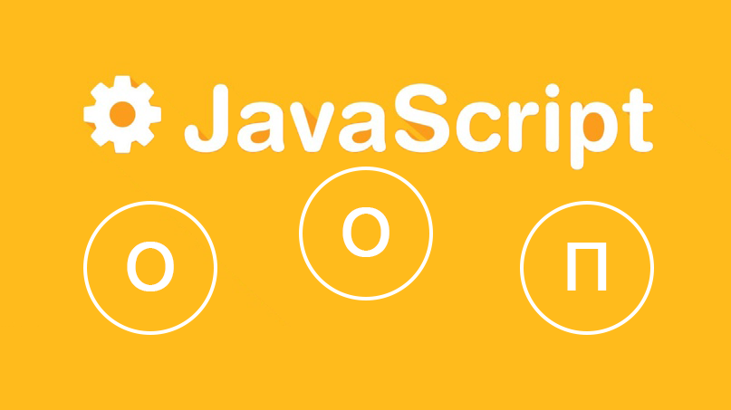
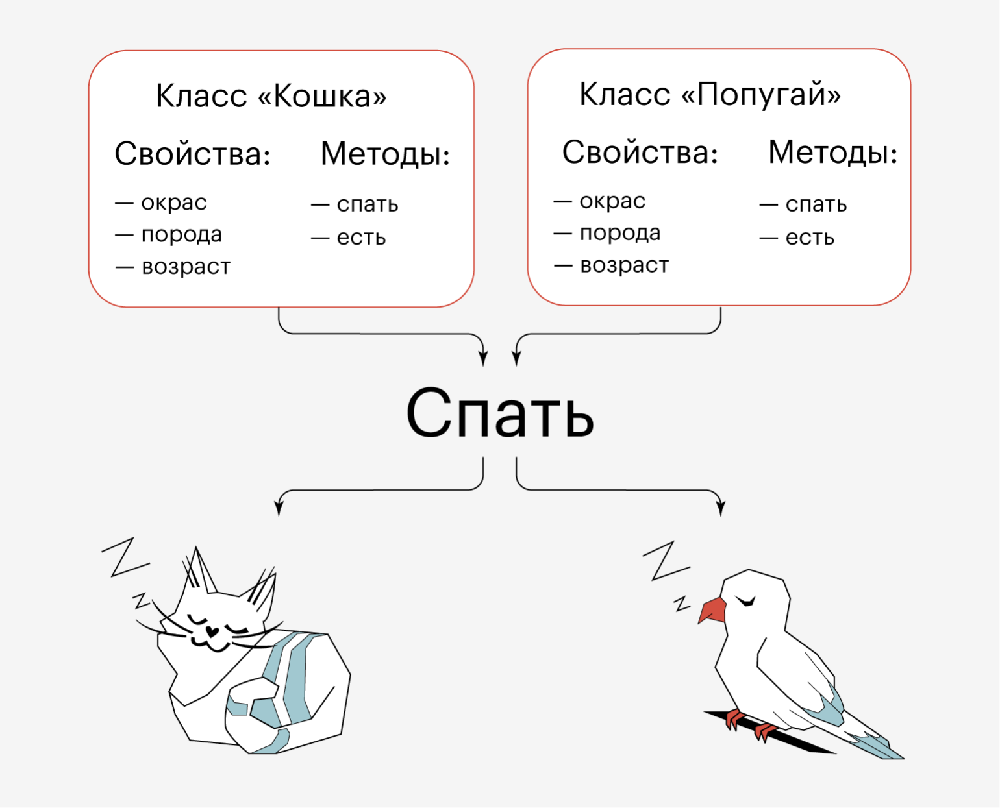
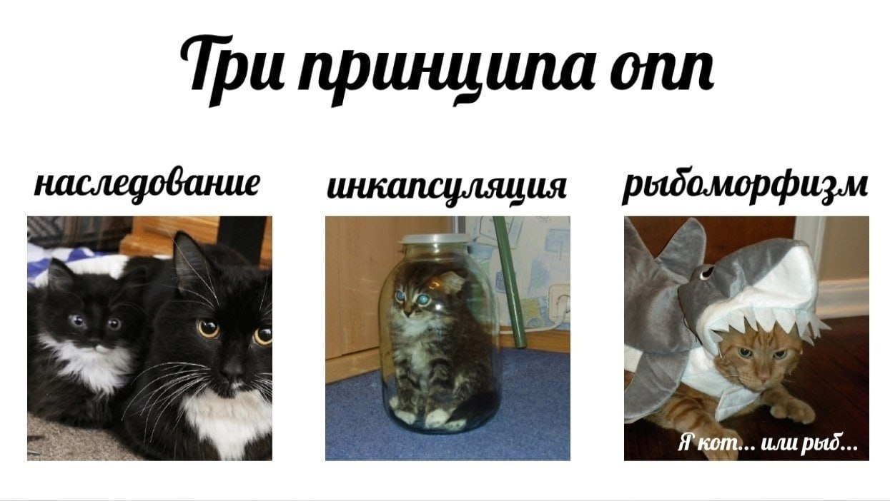

# Лекция 7. Основы ООП в JavaScript



## Введение

Когда мы пишем маленькие программы, мы почти всегда решаем задачу *“в лоб”*: данные получили, обработали, вывели. И этого хватает. Но в реальных проектах код очень быстро перестаёт быть *“одной задачей”* и превращается в систему, где много сущностей и много правил. И главная проблема в этот момент - не *“как написать функцию”, а “как организовать код так, чтобы он оставался понятным и не ломался от изменений”*.

`ООП` появляется именно здесь: как способ структурировать программу так, чтобы её можно было расширять, поддерживать и не переписывать заново при каждом новом требовании.

### Что предлагает ООП как решение?

`ООП` предлагает очень простую идею: мы объединяем данные и логику работы с этими данными в одной сущности.

То есть у нас появляется объект, который не просто хранит поля, а ещё и содержит методы - действия, которые можно выполнять с этой сущностью. И самое важное - именно эти методы становятся “официальным способом” менять состояние.

Например, если у сущности есть поле “баланс”, мы не хотим, чтобы где угодно писали `balance = -100`. Мы хотим, чтобы существовали действия вроде *“пополнить”* и *“снять”*, которые внутри проверяют ограничения. Тогда правила становятся частью объекта.

Именно из-за этого ООП часто описывают фразой:

“Сущность должна знать, как правильно управлять самой собой.”

### Что такое ООП?


**ООП** - это парадигма программирования, в которой код организуют вокруг сущностей. Каждая сущность хранит данные (состояние) и умеет выполнять действия (поведение). В коде это выглядит как объекты со свойствами и методами.

Если сказать максимально просто: **ООП** - это способ писать программы так, чтобы данные и логика работы с этими данными жили рядом, в одном месте. Тогда правила не *“размазаны”* по проекту, а находятся там, где им и место - внутри самой сущности.

В основе `ООП` обычно выделяют два ключевых понятия: класс и объект. Но здесь важно сразу уточнить одну вещь именно про JavaScript.

В классических языках (например, Java, C#, Python) `ООП` почти всегда строится вокруг классов: сначала вы описываете класс, потом создаёте объекты.

В `JavaScript` исторически всё устроено чуть иначе: в основе языка лежат объекты и прототипы. А `class` в современном `JS` - это удобный синтаксис, который позволяет описывать сущности *“как в классических языках”*, но внутри всё равно работает механизм прототипов. Мы к нему обязательно придём и разберём, что именно происходит *“под капотом”*.

### Классы и объекты



**Класс** - это шаблон (чертёж) для создания объектов. Он описывает, какие свойства и методы будут у объектов, созданных на его основе. Класс задаёт структуру и поведение, но сам по себе не является конкретной сущностью с конкретными данными.

**Объект** - это конкретный экземпляр сущности. Он содержит реальные значения свойств и может выполнять методы, которые описаны в классе. Когда мы создаём объект по классу, мы говорим, что мы *“инстанцируем”* класс.

Класс - это чертёж кота, а объект - это конкретный кот, который живёт у вас дома. Класс описывает, что у кота есть имя, возраст, цвет шерсти и может мяукать. А объект - это Мурзик, которому 3 года и который серый. Такая же аналогия работает для товаров, пользователей, банковских счетов и любых других сущностей, которые мы хотим моделировать в программе.

И дальше для нас важен практический момент: в JavaScript объект можно создавать по-разному. Можно создать его напрямую через литерал `{}`, можно через функцию-конструктор, можно через `class`. Но в любом случае мы будем стремиться к одному: чтобы сущность хранила своё состояние и управляла им через методы.

---

## Как ООП реализовано в JavaScript: прототипы и цепочка прототипов

Когда вы слышите слово **“ООП”**, чаще всего у вас в голове появляется картина из других языков: есть класс, и от него создаются объекты. В современном JavaScript так тоже можно писать - для этого есть `class`. Но если мы хотим действительно понимать язык, а не просто повторять синтаксис, нужно сделать один шаг назад и разобраться, как это работает внутри.

Исторически JavaScript устроен так, что в основе языка лежат не классы, а объекты. И механизм, который позволяет переиспользовать поведение, *“наследоваться”* и находить методы, называется прототип.

### Что такое прототип?

У любого объекта в JavaScript есть скрытая внутренняя ссылка на другой объект. Этот *“другой объект”* и называется прототипом.

**Зачем он нужен?**
Чтобы объект мог “доставать” свойства и методы не только из себя, но и из того объекта, на который он ссылается.

То есть объект в JavaScript - это не *“коробка со всем содержимым”*, а скорее:

- у него есть свои собственные свойства,
- и есть *“родитель”*, у которого можно найти то, чего не хватает.

Эта идея и является фундаментом ООП в `JS`.

### Как JavaScript ищет свойства и методы?

Давайте представим, что вы обращаетесь к свойству:

```javascript
obj.someMethod()
```

Если `someMethod` не найдено в `obj`, JavaScript автоматически смотрит на объект, который является прототипом `obj`. Если там тоже нет `someMethod`, он продолжает искать дальше по цепочке прототипов, пока не найдёт или не достигнет конца (который обычно является `null`).

Эта цепочка поиска и называется **цепочкой прототипов**. Она позволяет нам создавать объекты, которые могут наследовать поведение от других объектов, не копируя код, а просто ссылаясь на него.

### Пример: прототипы в действии

Создадим обьект `animal` с методом `speak`, а затем создадим объект `cat`, который будет наследовать от `animal`:

```javascript
const animal = {
  speak() {
    console.log("Animal speaks");
  }
};

const cat = Object.create(animal);
cat.speak(); // Выведет: "Animal speaks"
cat.name = "Мурзик";
console.log(cat.name); // Выведет: "Мурзик"
```

В этом примере `cat` не имеет собственного метода `speak`, но он может его вызвать, потому что его прототипом является `animal`, который содержит этот метод. Это и есть суть ООП в JavaScript: объекты могут наследовать поведение от других объектов через прототипы.

### Как проверить, что метод не найден в объекте, а в его прототипе?

Очень полезно отличать, где именно находится метод - в самом объекте или в его прототипе. Для этого можно использовать оператор `hasOwnProperty`:

```javascript
console.log(cat.hasOwnProperty("name"));   // true
console.log(cat.hasOwnProperty("speak"));  // false
```

В этом примере `cat` имеет собственное свойство `name`, но не имеет собственного метода `speak`. Метод `speak` доступен через прототип, но не является частью самого объекта `cat`.

**Второй способ** - это оператор `in`, который проверяет наличие свойства в объекте или его прототипе:

```javascript
console.log("name" in cat);   // true
console.log("speak" in cat);  // true
```

Здесь `in` возвращает `true` для обоих случаев, потому что он проверяет наличие свойства в объекте и его прототипе. Поэтому `hasOwnProperty` - это более точный способ узнать, принадлежит ли свойство самому объекту или оно унаследовано через прототип.

### Где заканчивается прототипная цепочка?

Любая цепочка прототипов не бесконечна. В какой-то момент вы доходите до объекта `Object.prototype`, а дальше уже `null`.

Можно проверить это так:

```javascript
console.log(Object.getPrototypeOf(cat) === animal); // true
console.log(Object.getPrototypeOf(animal) === Object.prototype); // true
console.log(Object.getPrototypeOf(Object.prototype)); // null
```

И получается следующее, что `cat` наследует от `animal`, который наследует от `Object.prototype`, а дальше уже нет ничего. Это и есть конец цепочки прототипов.

### Почему это важно для ООП?

Прототипы дают JavaScript то, что нужно для реализации ООП: возможность создавать объекты, которые могут наследовать поведение от других объектов. Это позволяет нам строить сложные системы, где сущности могут делиться общими методами и при этом иметь свои уникальные свойства.

> **То есть в JavaScript обьект может получать поведение не потому,что он был создан по классу, а потому что он ссылается на другой объект, который содержит это поведение. И это фундаментальная идея ООП в JavaScript.**

---

## Переход к классам

Мы разобрали главное: в JavaScript *“наследование”* работает через прототипы. Если свойства или метода нет в объекте, язык ищет его в прототипе и дальше по цепочке.

`class` появился не потому, что JavaScript *“стал другим”*, а потому что так удобнее писать. Это синтаксис, который позволяет описывать сущности привычнее: шаблон + создание экземпляров, методы, наследование. Но внутри всё равно остаются прототипы.

### Функции-конструкторы и оператор new

До появления `class` в JavaScript разработчики всё равно делали одно и то же: описывали *“шаблон”* сущности и создавали много однотипных объектов. Для этого использовали функции-конструкторы и оператор new. Этот блок нужен нам не ради *“старого синтаксиса”*, а чтобы понять, что `class` потом делает то же самое, только красивее.

Начнём с идеи. Есть сущность *“пользователь”*. У каждого пользователя свои данные (например, имя), но поведение должно быть общим (например, метод `sayHi`).

**1) Создадим функцию-конструктор:**

```javascript
function User(name) {
  this.name = name;
}

const u1 = new User("Alex");
const u2 = new User("Maria");

console.log(u1.name); // Alex
console.log(u2.name); // Maria
```

Мы создали два объекта. Важно понять, почему это работает.

**2) Что делает new**

Когда вы пишете:

```javascript
const u1 = new User("Alex");
```

Происходит несколько шагов:

1. Создаётся новый пустой объект.
2. Этот объект получает ссылку на прототип, который указывает на `User.prototype`.
3. Функция `User` вызывается с `this`, указывающим на новый объект. Внутри функции мы присваиваем `this.name = name`, и это добавляет свойство `name` в новый объект.
4. Новый объект возвращается и сохраняется в `u1`.

**3) Где хранить методы**

Если написать метод внутри конструктора, он будет создаваться заново для каждого объекта:

```javascript
function User(name) {
  this.name = name;
  this.sayHi = function () {
    return `Hi, I am ${this.name}`;
  };
}
```

Работает, но это лишнее дублирование. Поэтому общие методы выносят в прототип:

```javascript
function User(name) {
  this.name = name;
}

User.prototype.sayHi = function () {
  return `Hi, I am ${this.name}`;
};

console.log(u1.sayHi()); // Hi, I am Alex
```

Здесь `sayHi` доступен всем объектам, созданным через `User`, потому что он находится в прототипе. Это экономит память и позволяет легко обновлять поведение для всех объектов сразу.

**4) Мост к классам**

И вот здесь главное: `class` в JavaScript делает ту же самую работу:

- создаёт экземпляры
- хранит методы в прототипе
- связывает всё через прототип

Просто запись становится более современной и читаемой.

---

## Классы (class) в JavaScript: тот же new, только современнее

Теперь мы можем спокойно перейти к `class`, потому что идея у нас уже есть: нужен *“шаблон”* сущности и много экземпляров, а общие методы должны лежать не в каждом объекте отдельно, а в одном месте.

В JavaScript `class` - это удобный синтаксис, который позволяет описывать такой шаблон привычным способом: есть конструктор, есть методы, есть создание объектов через `new`.

### Синтаксис классов

Перепишем пример с пользователем, но уже через `class`:

```javascript
class User {
  constructor(name) {
    this.name = name;
  }

  sayHi() {
    return `Hi, I am ${this.name}`;
  }
}

const u1 = new User("Alex");
const u2 = new User("Maria");

console.log(u1.name);     // Alex
console.log(u2.name);     // Maria
console.log(u1.sayHi());  // Hi, I am Alex
console.log(u2.sayHi());  // Hi, I am Maria
```

Давайте разберём, что здесь происходит:

1. `class User` - объявляем класс с именем `User`.
2. `constructor(name)` - это специальный метод, который вызывается при создании нового объекта через `new`. Внутри конструктора мы присваиваем `this.name = name`, что добавляет свойство `name` в новый объект.
3. `sayHi()` - это метод класса. Он автоматически добавляется в прототип всех объектов, созданных через `User`. Поэтому `u1` и `u2` могут его вызывать, и он будет работать, используя их собственное имя.

Важно: метод `sayHi` не копируется в каждый объект. Он хранится в прототипе, а объекты получают к нему доступ через прототипную цепочку. Это можно быстро проверить

```javascript
console.log(u1.hasOwnProperty("name"));  // true
console.log(u1.hasOwnProperty("sayHi")); // false
console.log(User.prototype.sayHi === u1.sayHi); // true
```

То есть:

- `name` - это собственное свойство объекта `u1`.
- `sayHi` - это не собственное свойство, а метод, который находится в прототипе `User.prototype`. И оба объекта `u1` и `u2` ссылаются на один и тот же метод `sayHi` в прототипе, что экономит память и позволяет легко обновлять поведение для всех объектов сразу.

---

## Парадигма ООП: какие идеи стоят за объектами и классами


Когда мы говорим “ООП”, часто создаётся впечатление, что это просто “писать через классы”. Но классы - это только инструмент. ООП - это именно подход к построению программы.

Смысл подхода в том, что мы описываем систему через сущности: пользователь, товар, заказ, корзина. У каждой сущности есть состояние (данные) и поведение (методы). И дальше мы договариваемся, как эти сущности должны быть устроены, чтобы код можно было поддерживать.

В классическом понимании ООП обычно выделяют четыре идеи. Иногда говорят “три”, потому что абстракцию считают частью остальных, но для понимания картины полезно проговорить все четыре. Мы не будем заучивать определения “как в учебнике”, мы будем понимать, что это значит в коде.

### Инкапсуляция


**Инкапсуляция** - это принцип ООП, который отвечает за контроль доступа к данным объекта. Идея простая: у объекта есть состояние (данные), и это состояние нельзя изменять из любого места программы. Объект должен сам управлять своими важными полями и давать наружу понятные способы работы с ними.

На практике инкапсуляция означает, что мы не хотим, чтобы кто-то мог напрямую изменить важные свойства объекта. Вместо этого мы предоставляем методы, которые внутри себя проверяют все условия и правила.

В JavaScript инкапсуляция может быть двух видов:

1. **Условная инкапсуляция** - когда мы просто договорились не трогать определённые поля и не писать код, который напрямую меняет состояние. Это работает, но не гарантирует защиту от ошибок.
2. **Настоящая инкапсуляция** - когда мы используем синтаксис `#` для создания приватных полей. Это гарантирует, что эти поля нельзя будет изменить извне, и все взаимодействия будут проходить через методы.

#### Условная инкапсуляция

В JavaScript до появления приватных полей разработчики часто просто соглашались не трогать определённые свойства. И это работает, если все в команде придерживаются договорённостей. Но это не гарантирует защиту от ошибок, потому что кто-то может случайно написать `balance = -100` и нарушить логику.

Для условной инкапсуляции приняли символ подчёркивания `_` в качестве соглашения, что это поле не должно трогаться напрямую:

```javascript
class BankAccount {
  constructor(owner, startBalance = 0) {
    this.owner = owner;
    this._balance = startBalance; // условно "внутреннее" поле
  }

  deposit(amount) {
    if (amount <= 0) return "Сумма должна быть больше 0";
    this._balance += amount;
    return this._balance;
  }

  withdraw(amount) {
    if (amount <= 0) return "Сумма должна быть больше 0";
    if (amount > this._balance) return "Недостаточно средств";
    this._balance -= amount;
    return this._balance;
  }
}

const acc = new BankAccount("Alex", 100);

console.log(acc.deposit(50));   // 150
console.log(acc.withdraw(70));  // 80
```

С точки зрения *“культуры кода”* мы сделали правильно: баланс меняется только через `deposit()` и `withdraw()`. Но важно понимать слабое место такого подхода: внешний код всё равно может полезть в поле:

```javascript
acc._balance = -100; // Нарушаем договорённость и напрямую меняем баланс
console.log(acc._balance); // -20, и теперь логика нарушена
```

То есть условная инкапсуляция - это просто договорённость, которая может быть нарушена. Поэтому в реальных проектах часто используют настоящую инкапсуляцию, чтобы гарантировать защиту от таких ошибок.

#### Настоящая инкапсуляция: приватные поля

В современном JavaScript появилась возможность создавать настоящие приватные поля с помощью синтаксиса `#`. Это гарантирует, что эти поля нельзя будет изменить извне, и все взаимодействия будут проходить через методы.

```javascript
class BankAccount {
  #balance = 0;

  constructor(owner, startBalance = 0) {
    this.owner = owner;
    this.#balance = startBalance;
  }

  deposit(amount) {
    if (amount <= 0) return "Сумма должна быть больше 0";
    this.#balance += amount;
    return this.#balance;
  }

  withdraw(amount) {
    if (amount <= 0) return "Сумма должна быть больше 0";
    if (amount > this.#balance) return "Недостаточно средств";
    this.#balance -= amount;
    return this.#balance;
  }
}

const acc = new BankAccount("Alex", 100);
console.log(acc.deposit(50)); // 150
console.log(acc.withdraw(70)); // 80
```

И теперь попытка напрямую обратится к приватному полю `#balance` вызовет ошибку:

```javascript
console.log(acc.#balance); // SyntaxError: Private field '#balance' must be declared in an enclosing class
```

Такой подход гарантирует, что никто не сможет нарушить логику работы с балансом, потому что он полностью скрыт от внешнего кода. Все взаимодействия с балансом должны проходить через методы `deposit()` и `withdraw()`, которые внутри себя проверяют все условия и правила. Это и есть настоящая инкапсуляция.

#### Геттеры и сеттеры: красивый доступ к данным с проверками

Иногда нам хочется, чтобы объект выглядел удобнее: читать и менять значения как свойства, но при этом сохранять контроль и валидацию. Для этого существуют геттеры и сеттеры.

- `get` - это специальный метод, который позволяет нам читать значение как свойство, но при этом выполнять какую-то логику внутри.
- `set` - это специальный метод, который позволяет нам присваивать значение как свойство, но при этом выполнять проверки и логику внутри.

Сделаем пример с возрастом пользователя. Возраст должен быть числом и не может быть отрицательным.

```javascript
class Person {
  constructor(name, age) {
    this.name = name;
    this._age = 0;  // будем хранить возраст "внутри"
    this.age = age; // важно: это попадёт в setter
  }

  get age() {
    return this._age;
  }

  set age(value) {
    if (typeof value !== "number") {
      throw new Error("Возраст должен быть числом");
    }
    if (value < 0) {
      throw new Error("Возраст не может быть отрицательным");
    }
    this._age = value;
  }
}

const p = new Person("Alex", 26);

console.log(p.age); // 26 (getter)

p.age = 30;         // setter
console.log(p.age); // 30
```

**Почему мы здесь используем _age, а не просто age?**
Потому что если внутри `set age(value)` писать `this.age = value`, мы попадём в бесконечный вызов сеттера. Поэтому обычно:

- наружное имя: `age (через get/set)`
- внутреннее хранилище: `_age` или `#age`

`throw` - это способ сигнализировать об ошибке. Если кто-то попытается присвоить неправильное значение, мы выбросим исключение, и программа не позволит нарушить логику. Это важная часть инкапсуляции: мы не просто скрываем данные, но и контролируем, как с ними взаимодействовать.

#### Геттеры/сеттеры + приватные поля #

Если выв хотите сделать максимально защищённый и чистый код, можно использовать геттеры и сеттеры вместе с приватными полями. Тогда данные будут полностью скрыты, а доступ к ним будет только через методы, которые выполняют все проверки.

```javascript
class Person {
  #age = 0;

  constructor(name, age) {
    this.name = name;
    this.age = age; // setter
  }

  get age() {
    return this.#age;
  }

  set age(value) {
    if (typeof value !== "number") {
      throw new Error("Возраст должен быть числом");
    }
    if (value < 0) {
      throw new Error("Возраст не может быть отрицательным");
    }
    this.#age = value;
  }
}

const p = new Person("Alex", 26);
console.log(p.age); // 26
```

Теперь `#age` полностью скрыт от внешнего кода, и единственный способ изменить возраст - это использовать сеттер `age`, который внутри себя проверяет все условия. Это обеспечивает максимальную инкапсуляцию и защиту данных.

### Наследование


**Наследование** - это принцип ООП, который позволяет создавать новый класс на основе уже существующего. Идея здесь практическая: когда у вас есть несколько похожих сущностей, вы не хотите копировать один и тот же код. Вы хотите один раз описать общую часть, а затем расширять её там, где нужно.

Например, в проекте почти всегда появляется ситуация *“базовый пользователь”* и *“администратор”*. У них общие поля (`имя`, `email`), общие действия (приветствие, вывод информации), но у администратора есть дополнительные возможности (банить, модерировать, управлять ролями).

Если вы не используете наследование, обычно получается два варианта:

- вы копируете код (а потом исправляете ошибки в двух местах),
- или делаете кучу условий `if (user.role === "admin")` (и логика расползается по проекту).

Наследование решает это аккуратно: общий код остаётся в базовом классе, а дочерний класс добавляет то, что отличает его от родителя.

#### Базовый класс и дочерний класс

Сделаем базовую сущность `User`:

```javascript
class User {
  constructor(name, email) {
    this.name = name;
    this.email = email;
  }

  greet() {
    return `Hi, I am ${this.name}`;
  }
}

const user = new User("Bob", "user1@gmail.com");
console.log(user.greet()); // Hi, I am Bob
```

Теперь если нам нужен администратор, который имеет всё то же, что и обычный пользователь, плюс дополнительные возможности, мы можем создать класс `AdminUser`, который наследует от `User`. Для этого используется ключевое слово `extends`:

```javascript
class AdminUser extends User {
  constructor(name, email, role = "admin") {
    super(name, email); // вызываем конструктор родителя
    this.role = role;  // добавляем новое поле
  }

  banUser(user) {
    return `${user.name} has been banned by ${this.name}`;
  }
}
```

Проверим, что получилось:

```javascript
const admin = new AdminUser("Admin", "admin@gmail.com", "superAdmin");
console.log(admin.greet()); // Hi, I am Admin
console.log(admin.banUser(user)); // Bob has been banned by Admin
```

Здесь `Admin` наследует от `User`, поэтому он получает все свойства и методы `User` (в нашем случае `name`, `email` и метод `greet`). Но при этом мы можем добавить свои поля (`role`) и свои методы (`banUser`), которые будут доступны только для администраторов.

#### Почему super() обязателен в constructor

Когда у дочернего класса есть свой `constructor`, JavaScript требует первым делом вызвать `super(...)`. Это вызов конструктора родительского класса. Смысл очень простой: родительская часть объекта должна быть создана и инициализирована до того, как мы начнём работать с `this`. Если не вызвать `super()`, то `this` будет недоступен, и попытка обратиться к нему вызовет ошибку. Это логично, потому что без инициализации родительской части объекта мы не можем гарантировать, что он будет работать корректно. Поэтому `super()` - это обязательный шаг при создании дочернего класса с собственным конструктором.

Пример ошибки:

```javascript
class AdminUser extends User {
  constructor(name, email, role) {  
    this.role = role; // Ошибка: Must call super constructor in derived class before accessing 'this' or returning from derived constructor
  }
}
```

> то код упадёт, потому что this ещё *“не готов”*. Сначала должен отработать `super()`, и только потом вы можете добавлять поля в текущий объект.

#### Переопределение методов (overriding)

Дочерний класс может не только добавлять новые методы, но и переопределять существующие. Это значит, что если в родительском классе есть метод `greet`, то в дочернем классе мы можем написать свой `greet`, который будет работать по-другому.

```javascript
class AdminUser extends User {
  constructor(name, email, role = "admin") {
    super(name, email);
    this.role = role;
  }

  greet() {
    return `Hello, I am ${this.name}, and I am an admin!`;
  }
}
```

Теперь если мы вызовем `greet` у объекта `admin`, он будет использовать переопределённый метод, а не тот, что в `User`:

```javascript
const admin = new AdminUser("Admin", "admin@gmail.com", "superAdmin");
console.log(admin.greet()); // Hello, I am Admin, and I am an admin!
```

Переопределение методов - это мощный инструмент, который позволяет нам изменять поведение дочернего класса, не трогая родительский класс. Это особенно полезно, когда у нас есть общая логика в родителе, но для некоторых сущностей нужно сделать что-то по-другому.

Важно понимать, что не обязательно полностью заменять метод. Вы можете внутри переопределённого метода вызвать родительский метод через `super` и добавить к нему свою логику:

```javascript
class AdminUser extends User {
  constructor(name, email, role = "admin") {
    super(name, email);
    this.role = role;
  }

  greet() {
    const parentGreeting = super.greet(); // вызываем родительский метод
    return `${parentGreeting} I am also an admin!`; // добавляем свою логику
  }
}
```

Теперь `greet` будет использовать родительский приветствие и добавлять к нему свою часть:

```javascript
const admin = new AdminUser("Admin", "admin@gmail.com", "superAdmin");
console.log(admin.greet()); // Hi, I am Admin I am also an admin!
```

Тут мы сохраняем общую часть приветствия из `User`, но добавляем информацию о том, что это администратор. Это позволяет нам переиспользовать код и не дублировать общую логику, а при этом адаптировать поведение для конкретных случаев.

#### Наследование и prototypes

В JavaScript наследование классов всё равно работает через прототипы: `AdminUser` получает доступ к методам `User` через цепочку прототипов. Поэтому такие проверки будут истинными:

```javascript
console.log(admin instanceof AdminUser); // true
console.log(admin instanceof User);      // true
```

### Полиморфизм


**Полиморфизм** - это принцип ООП, который позволяет работать с разными объектами одинаковым способом. **На практике это означает очень простую вещь: у разных объектов может быть метод с одним и тем же именем, но работать он будет по-разному.**

Почему это удобно? Потому что тогда ваш код не *“завязан”* на конкретные классы. Вы можете писать универсальную логику: “вызови `greet()` у каждого”, и не думать, кто перед вами - обычный пользователь или администратор. Каждый объект сам решит, как именно он должен выполнять этот метод.

#### Полиморфизм на примере User и AdminUser

У нас уже есть базовый класс `User`, и есть `AdminUser`, который переопределяет метод `greet()`. Это идеальная ситуация для демонстрации полиморфизма.

```javascript
class User {
  constructor(name, email) {
    this.name = name;
    this.email = email;
  }

  greet() {
    return `Hi, I am ${this.name}`;
  }
}

class AdminUser extends User {
  constructor(name, email, role = "admin") {
    super(name, email);
    this.role = role;
  }

  greet() {
    return `Hello, I am ${this.name}, and I am an admin!`;
  }
}
```

Теперь создадим несколько объектов разных типов и положим их в один массив:

```javascript
const users = [
  new User("Bob", "bob@gmail.com"),
  new AdminUser("Admin", "admin@gmail.com", "superAdmin"),
  new User("Maria", "maria@gmail.com"),
  new AdminUser("Kate", "kate@gmail.com", "moderator"),
];
```

А теперь самое важное: мы перебираем массив и вызываем один и тот же метод `greet()`:

```javascript
for (const u of users) {
  console.log(u.greet());
}
```

Результат будет таким (логика):

- обычные пользователи скажут `Hi, I am ...`
- администраторы скажут `Hello, I am ..., and I am an admin!`

То есть внешний код вообще не думает о типах объектов. Он просто вызывает `greet()`. А поведение определяется тем, какой реальный объект лежит в переменной `u`.

Вот это и есть полиморфизм.

### Абстракция


**Абстракция** - это принцип ООП, который помогает нам скрывать детали реализации и оставлять наружу только то, что действительно нужно для работы с сущностью.

Если упростить: абстракция отвечает на вопрос - “что должен уметь объект?”, а не “как именно он это делает внутри?”.

В реальных проектах это критично, потому что сложность почти всегда растёт. И если наружу “видны” детали реализации, то любая внутренняя правка начинает ломать половину проекта. Абстракция делает наоборот: снаружи у нас остаётся понятный интерфейс, а внутри мы можем менять реализацию почти свободно.

#### Абстракция на примере “оплаты”

Представим, что в проекте есть процесс оформления заказа. В какой-то момент мы должны выполнить оплату.

И вот важный момент: коду оформления заказа (например, `checkout`) не должно быть важно, как именно происходит оплата: картой, телефоном, криптой, чем угодно. Ему важно только одно: у объекта оплаты есть метод *“оплатить”*.

То есть мы выделяем общий интерфейс: `pay(amount)`

И дальше разные способы оплаты реализуют этот метод по-своему. Снаружи же мы работаем одинаково.

##### “Контракт” в JavaScript: базовый класс, который требует реализовать метод

В JavaScript нет встроенных интерфейсов как в некоторых языках, но мы можем сделать понятный “контракт” через базовый класс: если дочерний класс не реализовал метод, мы явно кидаем ошибку.

```javascript
class PaymentMethod {
  pay(amount) {
    throw new Error("Метод pay(amount) должен быть реализован в дочернем классе");
  }
}
```

Здесь идея не в том, чтобы “создавать PaymentMethod”, а в том, что мы задаём правила: любой способ оплаты обязан уметь `pay()`.

Дальше вы создаёте дочерние классы и реализуете `pay()`:

```javascript
class CreditCardPayment extends PaymentMethod {
  pay(amount) {
    return `Paid ${amount} with credit card`;
  }
}

class MobilePayPayment extends PaymentMethod {
  pay(amount) {
    return `Paid ${amount} with mobile pay`;
  }
}
```

А внешний код работает одинаково и не зависит от деталей:

```javascript
function checkout(amount, paymentMethod) {
  return paymentMethod.pay(amount);
}

console.log(checkout(500, new CreditCardPayment())); // Paid 500 with credit card
console.log(checkout(500, new MobilePayPayment()));  // Paid 500 with mobile pay
```

Вот здесь и проявляется абстракция: `checkout` видит только *“интерфейс”* (`pay`), но не знает, что внутри.

**Зачем это вообще нужно?**

Потому что это делает систему расширяемой.

Сегодня способов оплаты два. Завтра добавился третий: `CryptoWalletPayment`

И если мы всё сделали правильно, checkout не нужно менять вообще. Мы просто добавляем новый класс, который реализует `pay()`.

Это и есть практический смысл абстракции: внешний код стабилен, а внутренние детали можно менять и расширять без переписывания системы.

### Static методы (static): методы класса, а не объекта

`static` - это способ объявить метод, который **принадлежит самому классу**, а не его экземплярам.

То есть:

- обычный метод вызывается у объекта: `user.greet()`
- `static` метод вызывается у класса: `User.isValidEmail(...)`

#### Зачем вообще нужны static методы?

Потому что иногда логика **не зависит от конкретного объекта**, но относится к сущности в целом.

Например:

- проверка `email`
- генерация случайного `id`
- простая фабрика (создать объект по данным)
- вспомогательные функции, которые логично хранить рядом с классом

Если сделать такую функцию обычным методом, придётся создавать объект *“ради проверки”*, и это выглядит странно.

---

Например, если у нас есть класс `User`, мы можем добавить статический метод для валидации `email`:

```javascript
class User {
  constructor(name, email) {
    this.name = name;
    this.email = email;
  }

  static isValidEmail(email) {
    return typeof email === "string" && email.includes("@");
  }
}

console.log(User.isValidEmail("test@gmail.com")); // true
console.log(User.isValidEmail("wrong-email"));    // false
```

Мы создали статический метод `isValidEmail`, который позволяет нам проверять валидность email без необходимости создавать объект `User`. Это часть абстракции, потому что мы предоставляем удобный способ взаимодействия с классом, который не зависит от конкретного экземпляра. Такой подход помогает нам организовать код и держать полезные функции рядом с классом, к которому они относятся, но при этом не загромождать объекты лишними методами.

### Итог по принципам ООП

- **Инкапсуляция** отвечает за контроль доступа к данным: важные поля не должны меняться напрямую, правила должны быть внутри объекта.
- **Наследование** помогает переиспользовать общий код: базовая сущность описывает общую часть, а дочерняя расширяет её.
- **Полиморфизм** позволяет работать с разными объектами одинаково: мы вызываем один и тот же метод, но поведение зависит от конкретного объекта.
- **Абстракция** скрывает детали реализации: наружу остаётся понятный интерфейс, а внутри можно менять реализацию без переписывания внешнего кода.



## Домашнее задание (ООП в JavaScript)

Сделаем одну маленькую систему, где сразу видно все принципы: у нас есть **пользователь**, **админ**, **заказ** и **оплата**. Мы не пишем “огромный интернет-магазин”, мы делаем минимальный скелет, чтобы руками почувствовать, зачем вообще нужно ООП.

Идея простая: пользователь создаёт заказ на сумму, потом оплачивает её разным способом. При этом:

- баланс нельзя менять напрямую (инкапсуляция),
- админ - это “тот же пользователь, но с доп. правами” (наследование),
- разные способы оплаты вызываются одинаково (полиморфизм),
- базовый способ оплаты задаёт правило “у всех должен быть pay” (абстракция),
- проверка суммы делается “на уровне класса” через `static`.

---

### Требования

#### 1) User (инкапсуляция)

Создайте класс `User`:

- `name`, `email`
- приватное поле `#balance`
- методы:
  - `deposit(amount)` - пополнить (amount > 0)
  - `withdraw(amount)` - снять (amount > 0 и хватает средств)
  - `greet()` - возвращает строку `Hi, I am <name>`
- геттер `balance` (только чтение)

---

#### 2) AdminUser (наследование + overriding)

Создайте класс `AdminUser`, который наследуется от `User`:

- поле `role = "admin"`
- метод `banUser(user)` - возвращает строку `"<user.name> banned by <admin.name>"`
- переопределите `greet()` так, чтобы использовать `super.greet()` и дописать роль.

---

#### 3) PaymentMethod (абстракция)

Создайте базовый класс `PaymentMethod`:

- метод `pay(amount, user)` **не реализуется**, а кидает ошибку:
  - `throw new Error("pay() must be implemented")`

Добавьте `static isValidAmount(amount)`:

- возвращает `true`, если `amount` - число и больше 0

---

#### 4) Два способа оплаты (полиморфизм)

Создайте два класса, которые наследуются от `PaymentMethod` и реализуют `pay(amount, user)`:

- `BalancePayment` - списывает деньги с баланса пользователя через `user.withdraw(amount)` и возвращает строку `Paid <amount> CZK from balance`
- `CashPayment` - баланс не трогает, возвращает строку `Paid <amount> CZK in cash`

Важно: сигнатура одна и та же - `pay(amount, user)`.

---

#### 5) Order (связываем всё)

Создайте класс `Order`:

- поля: `user`, `total`
- метод `checkout(paymentMethod)`:
  1) проверяет сумму через `PaymentMethod.isValidAmount(this.total)` (если нет - ошибка)
  2) вызывает `paymentMethod.pay(this.total, this.user)`
  3) возвращает результат оплаты

---

### Проверка

Напишите код, который:

1) создаёт `User` с балансом 1000
2) создаёт `Order` на сумму 500
3) оплачивает заказ через `BalancePayment`
4) создаёт второй `Order` на сумму 200 и оплачивает через `CashPayment`
5) создаёт `AdminUser` и вызывает:
   - `admin.greet()`
   - `admin.banUser(user)`

---

### Критерии

- Нельзя менять баланс напрямую (приватное поле `#balance` действительно приватное).
- `AdminUser` наследуется от `User` и использует `super(...)`.
- `Order.checkout()` не содержит условий вида `if payment === ...` - он вызывает `pay()` у переданного метода оплаты.
- `PaymentMethod.pay()` в базовом классе кидает ошибку, если его не переопределили.
- `PaymentMethod.isValidAmount()` сделан через `static` и используется в `checkout()`.
