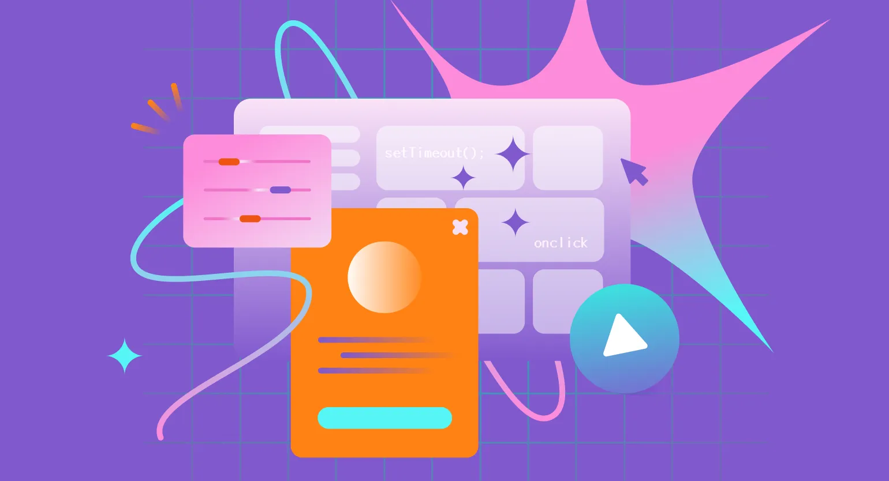
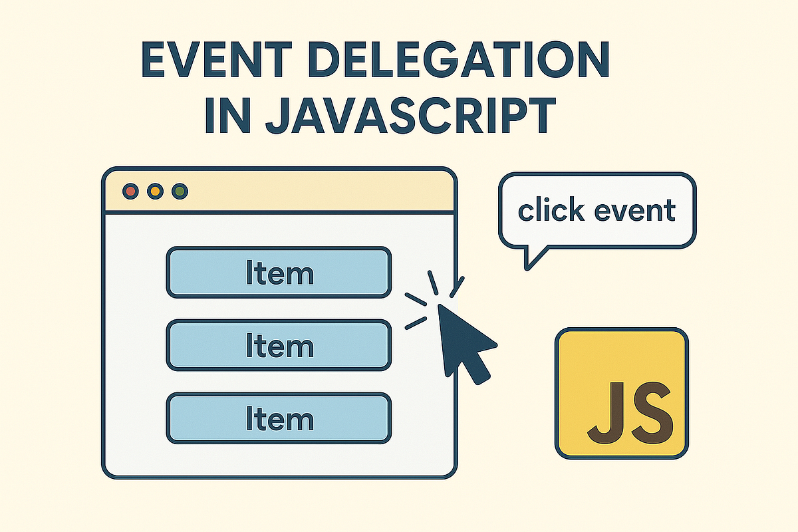

# Лекция 9. События и формы: как страница «реагирует» на пользователя



## Вступление

В прошлой лекции мы рассмотрели, как браузер отображает страницу, и узнали о том, что такое DOM.  
Но сам по себе DOM - это просто структура данных, которая описывает элементы на странице.

Чтобы сделать страницу интерактивной и позволить ей реагировать на действия пользователя, нам нужны **события**.

Например:
- пользователь *кликает* по кнопке,
- заполняет форму,
- перемещает мышь по странице,
- нажимает клавиши.

Браузер фиксирует эти действия и может вызывать ваш код в нужный момент.

### Что такое события

**События (events)** - это действия или происшествия, которые происходят в браузере и могут быть обнаружены с помощью JavaScript.  
События могут быть вызваны пользователем (клики мышью, нажатия клавиш, отправка форм) или происходить автоматически (загрузка страницы, изменение размера окна). [Документация по событиям](https://doka.guide/js/events/)

Примеры событий:
- `click` - происходит при клике мышью на элемент
- `submit` - происходит при отправке формы
- `keydown` - происходит при нажатии клавиши на клавиатуре
- `load` - происходит, когда страница полностью загружена

То есть события позволяют нам “слушать” действия пользователя и реагировать на них, выполняя код или изменяя содержимое страницы.

> **Важно:** события - фундаментальная часть взаимодействия между пользователем и веб-страницей. Они позволяют создавать динамические и интерактивные интерфейсы, которые реагируют на действия пользователя в реальном времени.

### Обработчик событий - это реакция на событие

Главная идея проста: есть элемент на странице, на нём происходит событие, и мы хотим, чтобы при этом событии выполнялась функция.  
Эта функция называется **обработчиком события**.

Схема взаимодействия:

```text
Событие → Обработчик события → Реакция (код)
```

Пример:
1. пользователь кликает по кнопке “Добавить в корзину”
2. код реагирует на это событие и добавляет товар в корзину
3. счётчик товаров увеличивается
4. пользователь видит, что товар добавлен

### Почему формы важны

Форма - один из самых распространённых способов взаимодействия пользователя с веб-страницей.

Регистрация, логин, поиск, отправка комментариев, фильтры - всё это формы.

Форма почти всегда требует одного и того же:
1. прочитать данные, которые пользователь ввёл в форму
2. проверить данные на валидность
3. обработать “отправку” (в этой лекции - без API)
4. показать результат пользователю (успех или ошибки)

И тут важный момент: браузер по умолчанию отправляет форму и перезагружает страницу.  
Но с помощью JavaScript мы можем предотвратить это поведение и управлять формой самостоятельно.

---

## Обработчики событий

Чтобы работать с событиями, нам нужно уметь делать главное:
- найти элемент в DOM
- “подписаться” на событие
- выполнить код, когда событие произошло

### Способ 1. События в HTML

Самый простой способ назначить обработчик - использовать атрибуты в HTML.

```html
<button onclick="alert('Button clicked!')">Click me</button>
```

При клике по кнопке выполнится код из `onclick`. Но этот способ не рекомендуется, потому что:
- смешивает разметку и логику
- сложно поддерживать и масштабировать
- нельзя назначить несколько обработчиков на одно событие


### Способ 2. `addEventListener` - основной способ работать с событиями

Самый распространённый способ добавить обработчик - использовать метод `addEventListener()`.

Синтаксис:

```javascript
element.addEventListener("event", handler);
```

**Пример:**

```html
<button id="myButton">Нажми меня</button>
```

```javascript
const btn = document.getElementById("myButton");

btn.addEventListener("click", function () {
  alert("Кнопка была нажата!");
});
```

Теперь при клике по кнопке выполняется обработчик.

### Важный момент: передаём функцию, а не вызываем её

Очень частая ошибка:

```javascript
btn.addEventListener("click", handleClick());
```

Так делать нельзя, потому что `handleClick()` вызовется сразу, а в `addEventListener` попадёт результат вызова.

**Правильно:**

```javascript
function handleClick() {
  console.log("Кнопка была нажата!");
}

btn.addEventListener("click", handleClick);
```

Или так (для коротких обработчиков):

```javascript
btn.addEventListener("click", () => {
  console.log("Кнопка была нажата!");
});
```

**Мини-правило:**
> в `addEventListener` мы передаём ссылку на функцию.

### Почему обработчик лучше выносить в отдельную функцию

Вынесенный обработчик:
- проще читать
- проще переиспользовать
- можно удалить через `removeEventListener`

```javascript
const buyBtn = document.getElementById("buy-btn");

function addToCart() {
  console.log("Product added");
}

buyBtn.addEventListener("click", addToCart);
```

### Несколько обработчиков на один элемент

`addEventListener` позволяет добавлять несколько обработчиков на одно событие:

```javascript
buyBtn.addEventListener("click", () => console.log("Log 1"));
buyBtn.addEventListener("click", () => console.log("Log 2"));
```

Обе функции выполнятся при клике.

### Удаление обработчика события: `removeEventListener`

Иногда обработчик нужно удалить. Это делается через `removeEventListener()`.

```javascript
const buyBtn = document.getElementById("buy-btn");

function addToCart() {
  console.log("Added once");
  buyBtn.removeEventListener("click", addToCart);
}

buyBtn.addEventListener("click", addToCart);
```

**Важно:** удалить можно только ту функцию, на которую есть ссылка.

Неправильно (не сработает):

```javascript
buyBtn.addEventListener("click", () => console.log("Click"));
buyBtn.removeEventListener("click", () => console.log("Click"));
```

Правильно:

```javascript
const handleClick = () => console.log("Click");

buyBtn.addEventListener("click", handleClick);
buyBtn.removeEventListener("click", handleClick);
```

### Способ 3. `onclick` - альтернативный способ

Можно назначить обработчик как DOM-свойство:

```javascript
buyBtn.onclick = function () {
  console.log("Clicked");
};
```

Но если назначить обработчик повторно, предыдущий будет перезаписан:

```javascript
buyBtn.onclick = function () {
  console.log("First handler");
};

buyBtn.onclick = function () {
  console.log("Second handler");
};
```

Поэтому в проектах чаще используют `addEventListener()`.

---

#### События, которые чаще всего используют на практике

Событий в браузере много, но в реальных проектах постоянно встречаются одни и те же. Удобно держать их “группами”.

**1) События мыши**
- `click` - обычный клик
- `dblclick` - двойной клик
- `contextmenu` - клик правой кнопкой
- `mousedown / mouseup` - нажал / отпустил кнопку мыши
- `mousemove` - движение мыши (осторожно: событие частое)
- `mouseenter / mouseleave` - курсор вошёл / вышел (не всплывают)
- `mouseover / mouseout` - навёл / ушёл (всплывают)

Мини-правило: для “наведения” чаще используют `mouseenter / mouseleave`.

**2) События клавиатуры**
- `keydown` - клавиша нажата
- `keyup` - клавиша отпущена

`keypress` сейчас почти не используют.

**3) События фокуса (важны для форм)**
- `focus` - поле получило фокус
- `blur` - поле потеряло фокус
- `focusin / focusout` - то же самое, но всплывают

Мини-правило: валидацию часто делают на `blur`, а подсказки - на `focus`.

**4) События ввода**
- `input` - значение меняется “в реальном времени”
- `change` - значение зафиксировано
- `paste` - вставка из буфера
- `cut` - вырезание
- `copy` - копирование

**5) События формы**
- `submit` - отправка формы
- `reset` - сброс формы

**6) События документа и окна**
- `DOMContentLoaded` - DOM построен
- `load` - страница полностью загрузилась
- `scroll` - прокрутка (событие частое)
- `resize` - изменение размера окна

Мини-правило: если нужно работать с DOM - чаще хватает `DOMContentLoaded`.

---

## Объект события `event`



Мы научились слушать события и реагировать на них.  
Но как узнать, что именно произошло и на каком элементе?

Для этого браузер передаёт в обработчик объект события - `event`.

### Что такое `event`

Когда вы вешаете обработчик, браузер вызывает его с аргументом `event`.

```javascript
const buyBtn = document.getElementById("buy-btn");

buyBtn.addEventListener("click", function (event) {
  console.log(event);
});
```

`event` содержит информацию о событии: тип, целевой элемент, координаты, нажатые клавиши и т.д.

Примерный вид (упрощённо):

```text
{
  type: "click",
  target: button#buy-btn,
  clientX: 100,
  clientY: 200,
  ...
}
```

### `event.type` - какое событие произошло

```javascript
buyBtn.addEventListener("click", function (event) {
  console.log(event.type); // "click"
});
```

### `event.target` - на каком элементе произошло событие

`event.target` указывает на элемент, по которому кликнули реально.

```html
<button id="buy-btn">
  <span class="icon">🛒</span>
  Buy
</button>
```

Если кликнуть по `span.icon`, то `target` будет `span`, а не `button`:

```javascript
buyBtn.addEventListener("click", function (event) {
  console.log(event.target);
});
```

### `event.currentTarget` - элемент, на котором висит обработчик

`event.currentTarget` - элемент, на который повешен обработчик.

```javascript
buyBtn.addEventListener("click", function (event) {
  console.log(event.currentTarget); // button#buy-btn
});
```

**Мини-правило:**
- `target` - где событие произошло
- `currentTarget` - где стоит обработчик

### `event.preventDefault()` - отменить стандартное поведение

Иногда браузер выполняет действие сам (переход по ссылке, отправка формы).  
Если мы хотим управлять этим - используем `event.preventDefault()`.

**Пример со ссылкой:**

```html
<a href="https://google.com" id="link">Go</a>
```

```javascript
const link = document.getElementById("link");

link.addEventListener("click", function (event) {
  event.preventDefault();
  console.log("Ссылка не перешла, потому что мы отменили поведение");
});
```

**Пример с формой:**

```javascript
const form = document.getElementById("login-form");

form.addEventListener("submit", function (event) {
  event.preventDefault();
  console.log("Форма отправлена, но страница не перезагрузилась");
});
```

### `event.stopPropagation()` - остановить всплытие (база)

Иногда нужно остановить распространение события вверх по DOM:

```javascript
const child = document.getElementById("child");

child.addEventListener("click", function (event) {
  event.stopPropagation();
  console.log("Клик обработан, но не всплывает дальше");
});
```

### Мини-вывод

- `event.type` - тип события
- `event.target` - где событие произошло
- `event.currentTarget` - где стоит обработчик
- `event.preventDefault()` - отмена стандартного поведения
- `event.stopPropagation()` - остановка всплытия

---

## Делегирование событий

`Делегирование событий` - это техника, которая позволяет обрабатывать события на родительском элементе вместо того, чтобы назначать обработчики на каждый дочерний элемент.

В реальных проектах элементы часто:
- добавляются динамически
- удаляются
- изменяются
- появляются после фильтрации или поиска
- отображаются списками

Если на каждый элемент вешать обработчик вручную, код усложняется и легче допустить ошибки.

Делегирование решает проблему проще:
- назначаем один обработчик на родительский элемент
- внутри обработчика используем `event.target`, чтобы определить, где произошло событие, и реагируем на это

### Почему делегирование работает: всплытие событий

Делегирование работает благодаря механизму `всплытия событий`.  
Событие “поднимается” от дочернего элемента к его родителям.

Пример структуры:

```html
<div id="products">
  <div class="product">
    <button data-action="cart">Add</button>
  </div>
</div>
```

Схема всплытия клика:

```text
document
  |
  div#products (обработчик)
    |
    div.product
      |
      button[data-action] (клик)
```

### Как использовать делегирование на практике

У каждой карточки товара есть две кнопки:
- добавить в избранное
- добавить в корзину

```html
<div id="products">
  <div class="product" data-id="1">
    <h3 class="title">Milk</h3>
    <button class="btn" data-action="favorite">☆ Favorite</button>
    <button class="btn" data-action="cart">🛒 Add to cart</button>
  </div>

  <div class="product" data-id="2">
    <h3 class="title">Bread</h3>
    <button class="btn" data-action="favorite">☆ Favorite</button>
    <button class="btn" data-action="cart">🛒 Add to cart</button>
  </div>

  <div class="product" data-id="3">
    <h3 class="title">Eggs</h3>
    <button class="btn" data-action="favorite">☆ Favorite</button>
    <button class="btn" data-action="cart">🛒 Add to cart</button>
  </div>
</div>
```

Один обработчик на контейнер:

```javascript
const products = document.getElementById("products");

products.addEventListener("click", function (event) {
  const button = event.target.closest("button[data-action]");
  if (!button) return;

  const action = button.dataset.action; // "favorite" или "cart"
  const product = button.closest(".product");
  const productId = product.dataset.id;

  if (action === "favorite") {
    product.classList.toggle("is-favorite");
    console.log("toggle favorite:", productId);
  }

  if (action === "cart") {
    console.log("add to cart:", productId);
  }
});
```

Тут важно:
- обработчик висит на `#products`, а не на каждой кнопке
- кнопку ищем через `closest("button[data-action]")`
- `data-action` говорит, что именно нажали
- `data-id` говорит, какой товар нажали

### Про `closest()`

`closest()` поднимается вверх по DOM и ищет ближайшего родителя (или сам элемент), который подходит под селектор.

Мы используем `closest()` по двум причинам:
1) клик может быть по вложенному элементу внутри кнопки
2) нужно быстро найти “контекст” - карточку товара `.product`

### Мини-вывод

- делегирование позволяет назначить один обработчик на родителя и обрабатывать события от всех дочерних элементов
- это работает благодаря всплытию
- в делегировании часто используют `event.target` + `closest()`

---

## Формы: чтение данных


Форма - это главный способ получить данные от пользователя.  
Регистрация, логин, поиск, фильтры, оформление заказа - всё это формы.

Чтобы работать с формой в JavaScript, нужно уметь:
- получить доступ к форме и полям
- прочитать значения полей
- понимать разницу между `input`, `checkbox`, `radio`, `select`, `textarea`

### Главная идея

Форма - это DOM-элемент.  
А её поля - DOM-элементы внутри формы.

---

### 1) Как найти форму

```html
<form id="login-form">
  <input type="email" name="email" placeholder="Email" />
  <input type="password" name="password" placeholder="Password" />
  <button type="submit">Login</button>
</form>
```

```javascript
const form = document.getElementById("login-form");
console.log(form);
```

---

### 2) `form.elements` - доступ ко всем полям формы

`form.elements` содержит все поля управления формы.

```javascript
console.log(form.elements);
```

#### Доступ к полю по `name`

```javascript
const emailInput = form.elements.email;
const passwordInput = form.elements.password;

console.log(emailInput.value);
console.log(passwordInput.value);
```

---

### 3) `input` и `textarea`: читаем через `value`

```html
<input type="text" name="username" />
<textarea name="about"></textarea>
```

```javascript
const username = form.elements.username.value;
const about = form.elements.about.value;

console.log(username, about);
```

---

### 4) `checkbox`: читаем через `checked`

```html
<label>
  <input type="checkbox" name="agree" />
  I agree
</label>
```

```javascript
const agree = form.elements.agree.checked;
console.log(agree); // true/false
```

---

### 5) `radio`: читаем выбранную

```html
<label><input type="radio" name="delivery" value="pickup" /> Pickup</label>
<label><input type="radio" name="delivery" value="courier" /> Courier</label>
```

```javascript
const selected = form.querySelector('input[name="delivery"]:checked');
console.log(selected?.value); // "pickup" или "courier"
```

---

### 6) `select`: читаем через `value`

```html
<select name="city">
  <option value="prague">Prague</option>
  <option value="brno">Brno</option>
  <option value="ostrava">Ostrava</option>
</select>
```

```javascript
const city = form.elements.city.value;
console.log(city);
```

---

### 7) Чтение данных формы: вручную vs `FormData`

#### Вручную (когда важны типы и логика)

```javascript
const data = {
  email: form.elements.email.value.trim(),
  password: form.elements.password.value,
  agree: form.elements.agree.checked,
};

console.log(data);
```

#### `FormData` (собрать всё разом)

```javascript
const data = Object.fromEntries(new FormData(form).entries());
console.log(data);
```

**Важно:** `FormData` работает “как форма”:
- неотмеченный checkbox может не попасть в данные
- отмеченный checkbox обычно приходит как `"on"` или как заданный `value`

---

### Мини-правила

- текстовые поля читаем через `value`
- чекбоксы читаем через `checked`
- radio читаем через `:checked`
- `select` читаем через `value`
- если нужно собрать всё разом - `FormData`
- если нужны типы и логика - читаем вручную

---

## Формы: отправка (`submit`)

Главное действие формы - отправка.

Когда пользователь нажимает кнопку `type="submit"` или жмёт `Enter`, браузер генерирует событие `submit`.

### Что делает браузер по умолчанию

По умолчанию браузер:
1. собирает данные
2. отправляет форму на URL из `action`
3. перезагружает страницу

В этой лекции мы будем **перехватывать отправку** и управлять ей самостоятельно.

### Событие `submit`

```javascript
form.addEventListener("submit", function (event) {
  console.log("form submitted");
});
```

Но страница всё равно перезагрузится, если не отменить поведение браузера.

### `event.preventDefault()` при `submit`

```javascript
form.addEventListener("submit", function (event) {
  event.preventDefault();
  console.log("page not reloaded");
});
```

### Чтение данных формы при `submit`

```javascript
form.addEventListener("submit", function (event) {
  event.preventDefault();

  const email = form.elements.email.value.trim();
  const password = form.elements.password.value;

  console.log({ email, password });
});
```

---

## Валидация и `preventDefault()` (практика)

Валидация - это проверка данных формы перед обработкой.

### Разметка: поля + места под ошибки

```html
<form id="login-form" novalidate>
  <div class="field">
    <label>Email</label>
    <input type="email" name="email" />
    <small class="error" data-error-for="email"></small>
  </div>

  <div class="field">
    <label>Password</label>
    <input type="password" name="password" />
    <small class="error" data-error-for="password"></small>
  </div>

  <div class="field">
    <label>
      <input type="checkbox" name="agree" />
      I agree
    </label>
    <small class="error" data-error-for="agree"></small>
  </div>

  <button type="submit">Send</button>
</form>
```

`novalidate` отключает встроенную браузерную валидацию, чтобы мы управляли всем сами.

### Инструменты: показать ошибку и очистить ошибки

```javascript
function setError(fieldName, message) {
  const errorEl = form.querySelector(`[data-error-for="${fieldName}"]`);
  if (errorEl) errorEl.textContent = message;
}

function clearErrors() {
  form.querySelectorAll(".error").forEach((el) => (el.textContent = ""));
}
```

### Функция валидации

```javascript
function validateForm() {
  const errors = {};

  const email = form.elements.email.value.trim();
  const password = form.elements.password.value;
  const agree = form.elements.agree.checked;

  if (!email) {
    errors.email = "Email is required";
  } else if (!email.includes("@")) {
    errors.email = "Email must contain @";
  }

  if (!password) {
    errors.password = "Password is required";
  } else if (password.length < 6) {
    errors.password = "Password must be at least 6 characters";
  }

  if (!agree) {
    errors.agree = "You must accept the agreement";
  }

  return errors;
}
```

### Валидация на `submit`

```javascript
form.addEventListener("submit", function (event) {
  event.preventDefault();

  clearErrors();

  const errors = validateForm();

  if (Object.keys(errors).length > 0) {
    for (const [field, message] of Object.entries(errors)) {
      setError(field, message);
    }
    return;
  }

  const data = {
    email: form.elements.email.value.trim(),
    password: form.elements.password.value,
    agree: form.elements.agree.checked,
  };

  console.log("Form is valid:", data);
});
```

### Когда валидировать: `input` vs `submit`

В базовом варианте достаточно валидации на `submit`.  
Но чтобы улучшить UX, можно очищать ошибку при вводе:

```javascript
form.addEventListener("input", function (event) {
  const field = event.target.name;
  if (!field) return;

  setError(field, "");
});
```

И валидировать поле, когда пользователь закончил ввод.

Чтобы не усложнять `blur` и capture, используем `focusout` (он всплывает):

```javascript
function validateField(fieldName) {
  const errors = validateForm();
  return errors[fieldName] ?? "";
}

form.addEventListener("focusout", function (event) {
  const field = event.target.name;
  if (!field) return;

  setError(field, validateField(field));
});
```
---

## Заключение

В этой лекции мы узнали, как работать с событиями и формами в JavaScript.
Теперь вы понимаете, как устроена интерактивность в браузере:
- события - это способ реагировать на действия пользователя
- обработчики событий - это функции, которые выполняются при событии
- делегирование позволяет эффективно обрабатывать события на множестве элементов
- формы - это способ получить данные от пользователя, и их можно валидировать и обрабатывать с помощью JavaScript.

## Практика

1. Создайте кнопку:
   ```html
   <button id="btn">Click</button>
   ```
   В JavaScript:
   - найдите кнопку через `getElementById`;
   - повесьте обработчик `click`;
   - при клике выводите в консоль: `Button clicked`.

2. В обработчике клика из задания 1:
   - выведите в консоль `event.type`;
   - убедитесь, что в консоли появляется `"click"`.

3. Создайте разметку:
   ```html
   <button id="buy-btn">
     <span class="icon">🛒</span>
     Buy
   </button>
   ```
   В JavaScript:
   - повесьте обработчик `click` на кнопку;
   - выведите в консоль `event.target` и `event.currentTarget`;
   - проверьте два сценария: клик по `Buy` и клик по иконке `🛒`.

4. Создайте ссылку:
   ```html
   <a id="link" href="https://google.com">Go</a>
   ```
   В JavaScript:
   - повесьте обработчик `click`;
   - отмените переход через `event.preventDefault()`;
   - выведите в консоль: `Link prevented`.

5. Создайте каталог товаров:
   ```html
   <div id="products">
     <div class="product" data-id="1">
       <h3>Milk</h3>
       <button data-action="favorite">Favorite</button>
       <button data-action="cart">Add</button>
     </div>

     <div class="product" data-id="2">
       <h3>Bread</h3>
       <button data-action="favorite">Favorite</button>
       <button data-action="cart">Add</button>
     </div>
   </div>
   ```
   Реализуйте делегирование:
   - повесьте один обработчик `click` на `#products`;
   - внутри обработчика найдите кнопку через `event.target.closest("button[data-action]")`;
   - если кнопки нет - завершайте обработчик (`return`);
   - получите:
     - `action` из `button.dataset.action`;
     - `productId` из `data-id` карточки товара;
   - выведите в консоль: `action: <action>, id: <productId>`.

6. В продолжение задания 5:
   - найдите карточку товара через `button.closest(".product")`;
   - выведите в консоль заголовок товара (`h3.textContent`).

7. Создайте форму:
   ```html
   <form id="login-form">
     <input type="email" name="email" placeholder="Email" />
     <input type="password" name="password" placeholder="Password" />
     <label>
       <input type="checkbox" name="agree" />
       I agree
     </label>
     <button type="submit">Send</button>
   </form>
   ```
   В JavaScript:
   - найдите форму;
   - прочитайте значения:
     - `email` через `value`;
     - `password` через `value`;
     - `agree` через `checked`;
   - выведите в консоль объект: `{ email, password, agree }`.

8. Для формы из задания 7:
   - повесьте обработчик `submit` на форму;
   - сделайте `event.preventDefault()`;
   - выведите в консоль: `Form submitted`;
   - выведите в консоль объект данных формы: `{ email, password, agree }`.

9. Добавьте в обработчик `submit` валидацию:
   - `email` не пустой;
   - `password` не пустой;
   - `password.length >= 6`;
   - `agree === true`.

   Если проверка не проходит:
   - выводите в консоль `Validation error`;
   - завершайте обработчик (`return`).

   Если всё ок:
   - выводите в консоль `Form is valid`.

10. Обновите HTML формы и добавьте блоки ошибок:
    ```html
    <form id="login-form" novalidate>
      <div class="field">
        <input type="email" name="email" placeholder="Email" />
        <small class="error" data-error-for="email"></small>
      </div>

      <div class="field">
        <input type="password" name="password" placeholder="Password" />
        <small class="error" data-error-for="password"></small>
      </div>

      <div class="field">
        <label>
          <input type="checkbox" name="agree" />
          I agree
        </label>
        <small class="error" data-error-for="agree"></small>
      </div>

      <button type="submit">Send</button>
    </form>
    ```
    В JavaScript:
    - реализуйте `setError(fieldName, message)` - вывод ошибки рядом с полем;
    - реализуйте `clearErrors()` - очистка всех ошибок;
    - при `submit`:
      - очищайте ошибки;
      - валидируйте данные;
      - показывайте ошибки рядом с полями.

11. Добавьте очистку ошибок на `input`:
    - повесьте обработчик `input` на форму;
    - берите имя поля через `event.target.name`;
    - когда пользователь вводит данные - очищайте ошибку только для этого поля.

12. Добавьте валидацию поля на `focusout`:
    - повесьте обработчик `focusout` на форму;
    - определяйте поле через `event.target.name`;
    - валидируйте только это поле и показывайте ошибку рядом с ним.

## Домашнее задание

Сделайте мини-страницу **"Каталог + форма заказа"**, чтобы закрепить:

- `addEventListener`
- объект события `event`
- `preventDefault()`
- делегирование событий
- чтение данных формы
- `submit`
- валидацию формы

---

### 1. Блок каталога товаров (делегирование)

Создайте разметку контейнера `#products` с минимум **4 карточками товаров**.

Требования к карточке:

- класс `.product`
- атрибут `data-id`
- заголовок (`h3`)
- кнопка `Favorite` (`data-action="favorite"`)
- кнопка `Add to cart` (`data-action="cart"`)

Пример структуры одной карточки:

```html
<div class="product" data-id="1">
  <h3>Milk</h3>
  <button class="btn" data-action="favorite">Favorite</button>
  <button class="btn" data-action="cart">Add to cart</button>
</div>
```

Реализуйте:

1. Один обработчик `click` на контейнер `#products`.
2. Поиск кнопки через `event.target.closest("button[data-action]")`.
3. Если клик не по нужной кнопке -> `return`.
4. Получение:
   - `action` из `button.dataset.action`
   - `productId` из `closest(".product").dataset.id`
   - `title` из `h3.textContent`
5. Логику:
   - `favorite` -> переключать класс `.is-favorite` у карточки
   - `cart` -> увеличивать счётчик корзины на странице
6. Вывод в консоль строки вида:
   - `action: cart, id: 1, title: Milk`

---

### 2. Счётчик и базовые события

Добавьте на страницу:

- кнопку `#clear-cart`
- ссылку `#catalog-link` (любая ссылка)
- элемент счётчика корзины (`#cart-count`)

Реализуйте:

1. Клик по `#clear-cart` обнуляет счётчик корзины.
2. Клик по `#catalog-link`:
   - отменяет переход через `event.preventDefault()`
   - пишет в консоль `Link prevented`
3. В обработчиках выведите и сравните:
   - `event.target`
   - `event.currentTarget`

---

### 3. Форма заказа / заявки

Создайте форму `#order-form` с `novalidate`.

Минимальные поля:

- `email` (`type="email"`)
- `name` (`type="text"`)
- `delivery` (`radio`: `pickup` / `courier`)
- `payment` (`select`)
- `comment` (`textarea`)
- `agree` (`checkbox`)
- кнопка `submit`

Для полей `email`, `name`, `agree` добавьте блоки ошибок:

```html
<small class="error" data-error-for="email"></small>
```

---

### 4. Отправка формы (`submit`)

Повесьте обработчик `submit` на форму:

1. Сделайте `event.preventDefault()`.
2. Считайте данные формы:
   - через `form.elements` и свойства (`value`, `checked`)
   - `delivery` (`radio`) прочитайте через `querySelector('input[name="delivery"]:checked')?.value`
   - `payment`, `comment` прочитайте через `value`
3. Соберите объект `formValues`.
4. Выведите объект в консоль.

Дополнительно (обязательно): покажите второй способ чтения данных через `FormData` и выведите результат в консоль.

---

### 5. Валидация формы

Реализуйте функции:

- `setError(fieldName, message)`
- `clearErrors()`
- `validateForm(values)` -> возвращает объект ошибок

Правила валидации:

- `email` не пустой
- `email` содержит `@`
- `name` не пустое (минимум 2 символа)
- `agree === true`

Поведение на `submit`:

1. Очистить старые ошибки.
2. Провалидировать данные.
3. Если есть ошибки:
   - показать ошибки рядом с полями
   - вывести `Validation error` в консоль
   - остановить отправку (`return`)
4. Если ошибок нет:
   - вывести `Form is valid` в консоль
   - показать пользователю сообщение об успехе (текст на странице)

---

### 6. Живая работа с ошибками (`input` и `focusout`)

Добавьте обработчики на форму:

1. `input`
   - брать имя поля через `event.target.name`
   - очищать ошибку только у этого поля
2. `focusout`
   - валидировать только поле, с которого ушёл фокус
   - показывать/обновлять ошибку рядом с ним

Подсказка: `focusout` всплывает, поэтому удобно вешать обработчик на форму.

---

## Требования к решению

- Использовать `addEventListener` (не `onclick` как основной способ).
- Для каталога использовать **делегирование**, а не обработчик на каждую кнопку.
- Не перезагружать страницу при отправке формы.
- Ошибки выводить рядом с полями, а не только в `alert`.
- Код разбить на небольшие функции (например: `getFormValues`, `validateForm`, `handleProductsClick`, `updateCartCount`).