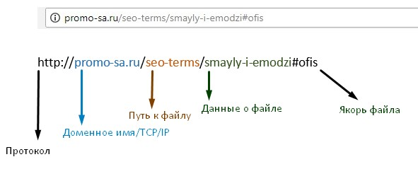
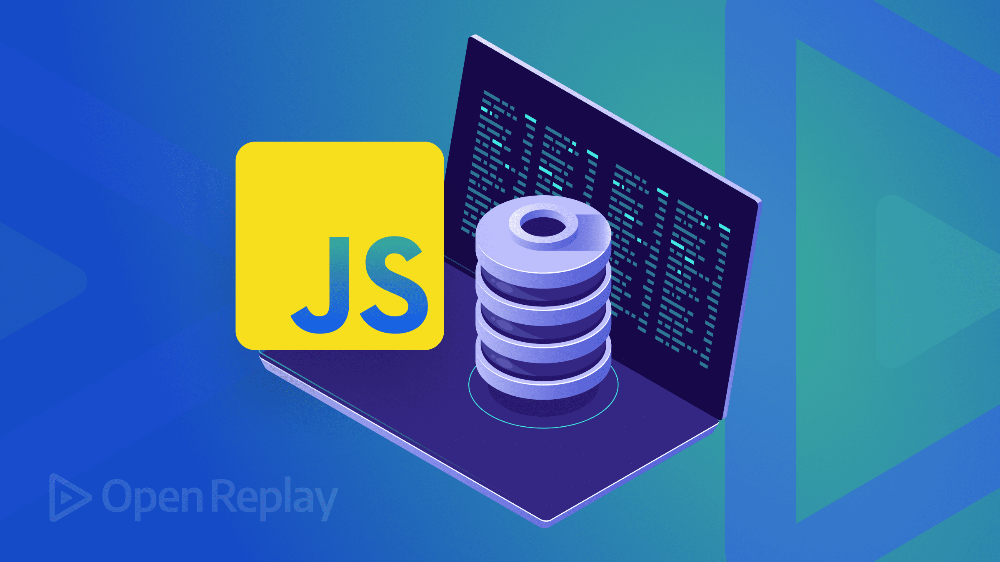

# Лекция 10. BOM и Storage: окружение браузера и хранение данных


## Вступление

В прошлых лекциях мы работали с `DOM`. То есть с тем, что находится внутри страницы: элементы, текст, классы, формы, события.

DOM - это когда JavaScript взаимодействует с  HTML:
нашли кнопку → повесили событие → поменяли текст → добавили класс → показали сообщение.

Но браузер - это не только `HTML`.

Когда вы открываете сайт, вокруг страницы есть ещё целая среда: адресная строка, история переходов, вкладка, таймеры, хранилище данных.
И JavaScript тоже умеет с этим работать. Вот эта часть и называется `BOM`.

### Что такое BOM?

`BOM (Browser Object Model)`, то есть модель объектов браузера. Это набор объектов, которые предоставляет браузер для взаимодействия с ним.

Если сказать простыми словами:
- `DOM` - это модель объектов документа, то есть всего, что внутри страницы.
- `BOM` - это модель объектов браузера, то есть всего, что вокруг страницы.

`DOM` - отвечает за `document` и его элементы. А `BOM` - отвечает за `window` и его свойства и методы.

### Как понять разницу между DOM и BOM?

`DOM` - это когда вы меняете интерфейс страницы:
- показать/скрыть элемент
- изменить текст
- добавить класс
- отследить событие

`BOM` - это когда вы взаимодействуете с браузером:
- получить URL страницы
- открыть новое окно
- установить таймер
- сохранить данные в хранилище

## Взаимодействие с BOM

Главная идея в том, что для взаимодействия с BOM мы используем глобальный объект `window`. Он представляет собой окно браузера и содержит все свойства и методы для работы с ним.

Через `window` вы получаете доступ к:
- `location` - для работы с URL
- `history` - для работы с историей переходов
- `navigator` - для информации о браузере и устройстве
- `setTimeout` и `setInterval` - для работы с таймерами
- `localStorage` и `sessionStorage` - для хранения данных

И важный момент: в браузерном JavaScript `document` доступен как `window.document`. Поэтому, когда вы пишете `document`, вы на самом деле обращаетесь к `window.document`.

```javascript
console.log(window.document === document); // true
```

### window - глобальный объект

Мы уже сказали ключевую мысль:

если мы работаем с окружением браузера, то почти всегда это начинается с объекта `window`.

`window` - это глобальный объект, который представляет окно браузера, в котором открыт ваш сайт.

И важно понимать: `window` существует всегда, даже если вы его не пишете явно. А значит мы можем обращаться к его свойствам и методам напрямую, без указания `window`.

```javascript
console.log(document === window.document); // true
console.log(location === window.location); // true
console.log(history === window.history);   // true
```

JavaScript в браузере просто позволяет нам опускать `window` для удобства. Но если нужно, мы всегда можем его указать.

### navigator - информация о браузере и устройстве

`navigator` даёт информацию о среде пользователя: язык интерфейса, состояние сети, платформу, поддержку сенсорного ввода и другие возможности.

Примеры:

```javascript
console.log(navigator.language); // например, "ru-RU"
console.log(navigator.onLine); // true / false
console.log(navigator.maxTouchPoints); // 0, 1, 5...
```

**Практика: отслеживание сети**

```javascript
window.addEventListener("online", () => {
  console.log("Интернет снова доступен");
});

window.addEventListener("offline", () => {
  console.log("Соединение потеряно");
});
```

**Важно про `userAgent`**

`navigator.userAgent` можно прочитать, но строить логику приложения только на нём не стоит. Строка `userAgent` может меняться и подделываться, поэтому для реальных проверок лучше использовать feature detection (проверку наличия конкретных API).

### location - работа с URL

`location` - это объект, который содержит информацию о текущем URL и позволяет управлять навигацией.
Через `location` мы можем:
- получить текущий URL
- перейти на другую страницу
- перезагрузить страницу
- прочитать query-параметры `(?page=2&sort=price)`;
- прочитать `hash (#section)`.

> Помним: `location` - это свойство объекта `window`.

```javascript
console.log(location === window.location); // true
```

#### Основные части URL



Возьмем пример адреса: 

```
https://example.com/products?page=2&sort=price#top
```

Внутри него есть несколько частей:
- протокол: https:
- домен: example.com
- путь: /products
- query: ?page=2&sort=price
- hash: #top

#### Самые полезные свойства `location`

**`location.href` - полный URL страницы**

```javascript
console.log(location.href); // https://example.com/products?page=2&sort=price#top
```

**`location.pathname` - путь страницы**

```javascript
console.log(location.pathname); // "/products"
```

Это удобно, если вы хотите понять *“на какой странице мы сейчас”*.

**`location.search` - query-параметры**

```javascript
console.log(location.search); // "?page=2&sort=price"
```

Важно: `search` возвращает строку, которая начинается с `?`. Если вам нужно получить конкретные параметры, то можно использовать `URLSearchParams`.

```javascript
const params = new URLSearchParams(location.search);
console.log(params.get('page')); // "2"
console.log(params.get('sort')); // "price"
```

**`location.hash` - хэш страницы**

```javascript
console.log(location.hash); // "#top"
```

`Hash` часто используют для:
- навигации внутри страницы (например, к определённому разделу)
- хранения состояния (например, открыто ли модальное окно)

**Практический пример:**

Часто делают так: если `page` не указан, считаем что это страница `1`.
```javascript
const params = new URLSearchParams(location.search);
const page = params.get('page') || '1';
console.log(`Текущая страница: ${page}`);
```

#### Методы `location`

**`location.assign(url)` - перейти на другую страницу**

```javascript
location.assign('https://google.com');
```
Этот метод изменяет URL и загружает новую страницу. Важно: при использовании `assign` текущая страница сохраняется в истории, то есть пользователь может нажать “Назад” и вернуться.

**`location.replace(url)` - заменить текущую страницу**

Разница между `assign` и `replace` в том, что `replace` не сохраняет текущую страницу в истории. То есть после вызова `replace` пользователь не сможет вернуться на предыдущую страницу.

```javascript
location.replace('https://google.com');
```

**location.reload() - перезагрузка страницы**

```javascript
location.reload();
```

Этот метод перезагружает текущую страницу.
Раньше можно было встретить `location.reload(true)`, но сейчас этот параметр считается устаревшим и в современных браузерах обычно игнорируется.

### history - история переходов

`history` - это объект, который позволяет управлять историей переходов пользователя. Через `history` мы можем:
- перейти на предыдущую страницу
- перейти на следующую страницу
- перейти на определённую страницу в истории
- добавить новую запись в историю

Как и раньше, `history` - это свойство объекта `window`.
```javascript
console.log(history === window.history); // true
```

#### Основные методы `history`

**history.length - количество записей в истории**

`history.length` возвращает количество записей в истории. Это может быть полезно, если вы хотите понять, сколько страниц пользователь уже посетил.

```javascript
console.log(history.length); // например, 5
```

Это не *“количество страниц на сайте”*, а длина истории вкладки.

**history.back() - перейти на предыдущую страницу**

```javascript
history.back();
```

Этот метод аналог кнопки “Назад” в браузере. Он возвращает пользователя на предыдущую страницу в истории.

**history.forward() - перейти на следующую страницу**

```javascript
history.forward();
```

Этот метод аналог кнопки “Вперёд” в браузере. Он возвращает пользователя на следующую страницу в истории, если он уже нажимал “Назад”.

**history.go(n) - перейти на n страниц в истории**

`go(n)` принимает число:
- если `n` положительное, то переходит вперёд на `n` страниц
- если `n` отрицательное, то переходит назад на `n` страниц

```javascript
history.go(-2); // вернуться на 2 страницы назад
history.go(3);  // перейти на 3 страницы вперёд
```

#### История без перезагрузки: `pushState` и `replaceState`

Эти методы позволяют изменять `URL` без перезагрузки страницы, что полезно для одностраничных приложений `SPA(Single Page Application)`.

Сейчас нам важна идея того, что мы можем менять URL и историю без перезагрузки, а не детали реализации. Поэтому мы не будем углубляться в эти методы сейчас, а вернёмся к ним в следующих лекциях.

**history.pushState(state, title, url)**

Этот метод добавляет новую запись в историю с указанным `state`, `title` и `url`. Страница не перезагружается, но URL меняется.

```javascript
history.pushState({ page: "products" }, "", "/products");
```

После этого URL изменится на `/products`, но страница не перезагрузится. И в истории появится новая запись.

`state` - это объект, который может содержать любые данные, связанные с этим состоянием. Он доступен через `history.state`.

**history.replaceState(state, title, url)**

Этот метод заменяет текущую запись в истории на новую с указанным `state`, `title` и `url`. Страница не перезагружается, но URL меняется.

```javascript
history.replaceState({ page: "products" }, "", "/products");
```

Разница между `pushState` и `replaceState` в том, что `pushState` добавляет новую запись в историю, а `replaceState` заменяет текущую запись. После `replaceState` нельзя вернуться именно к заменённой записи, но более ранние записи истории остаются.

**Событие popstate**

Когда пользователь нажимает “Назад” или “Вперёд”, или когда вызывается `history.go()`, браузер генерирует событие `popstate`. Это событие позволяет нам отследить изменения в истории и реагировать на них.

```javascript
window.addEventListener("popstate", function (event) {
  console.log("popstate:", event.state);
});
```

`event.state` - это то, что вы передавали в `pushState/replaceState`.

#### Мини-пример: мини-роутер на `pushState + popstate`

Ниже упрощённая схема клиентского роутинга без библиотек:

```javascript
const routes = {
  "/": "<h1>Главная</h1>",
  "/about": "<h1>О нас</h1>",
  "/contacts": "<h1>Контакты</h1>",
};

function renderRoute(pathname) {
  const app = document.getElementById("app");
  app.innerHTML = routes[pathname] || "<h1>404 (client)</h1>";
}

document.addEventListener("click", (event) => {
  const link = event.target.closest("[data-link]");
  if (!link) return;

  event.preventDefault();
  const url = link.getAttribute("href");

  history.pushState({ pathname: url }, "", url);
  renderRoute(url);
});

window.addEventListener("popstate", () => {
  renderRoute(location.pathname);
});

renderRoute(location.pathname);
```

Для ссылок используйте:

```html
<a href="/" data-link>Home</a>
<a href="/about" data-link>About</a>
<a href="/contacts" data-link>Contacts</a>
```

Важно: если пользователь обновит страницу на адресе вроде `/about`, сервер тоже должен уметь отдавать ваш `index.html` для этого пути. Без server fallback вы получите серверный 404.

### Таймеры: setTimeout и setInterval

Таймеры - это функции, которые позволяют выполнять код с задержкой или периодически. Они тоже являются частью `BOM`, так как управляют временем в браузере.

Смысл таймеров простой:
- `setTimeout` - выполняет функцию один раз после заданной задержки
- `setInterval` - выполняет функцию периодически с заданным интервалом

#### setTimeout
```javascript
setTimeout(callback, delay);
```

`setTimeout` принимает два аргумента:
- функцию, которую нужно выполнить
- задержку в миллисекундах

Пример использования `setTimeout`:
```javascript
setTimeout(function () {
  console.log("Привет через 2 секунды!");
}, 2000);
```

Можно также передавать ссылку на функцию:
```javascript
function sayHello() {
  console.log("Привет через 2 секунды!");
}
setTimeout(sayHello, 2000);
```

**Важный момент: setTimeout возвращает id**

Когда вы вызываете `setTimeout`, он возвращает идентификатор таймера.

```javascript
const timerId = setTimeout(() => {
  console.log("Это сообщение может не появиться");
}, 3000);

console.log(timerId);
```

Этот id можно использовать для отмены таймера с помощью `clearTimeout`.

**clearTimeout - отменить setTimeout**
```javascript
const timerId = setTimeout(() => {
  console.log("Не выполнится");
}, 3000);

clearTimeout(timerId);
```

Если `clearTimeout` вызывается до того, как таймер сработает, то функция не будет выполнена.

**Практический пример: авто-сообщение на 3 секунды**

Допустим, у нас есть блок:
```html
<p id="notice"></p>
```

```javascript
const notice = document.getElementById("notice");
notice.textContent = "Это сообщение исчезнет через 3 секунды";
setTimeout(() => {
  notice.textContent = "";
}, 3000);
```

#### setInterval

`setInterval` - это функция, которая выполняет код периодически с заданным интервалом.

```javascript
setInterval(callback, delay);
```

Пример: выводим в консоль сообщение каждую 1 секунду:
```javascript
setInterval(() => {
  console.log("тик");
}, 1000);
```

**setInterval тоже возвращает id**

Так же, как и `setTimeout`, `setInterval` возвращает идентификатор, который можно использовать для отмены с помощью `clearInterval`.

```javascript
const intervalId = setInterval(() => {
  console.log("тик");
}, 1000);

console.log(intervalId);
```

**clearInterval - отменить setInterval**
```javascript
const intervalId = setInterval(() => {
  console.log("тик");
}, 1000);

setTimeout(() => {
  clearInterval(intervalId);
  console.log("остановлено");
}, 5000);
```
Здесь интервал будет работать 5 секунд, потом остановится.

**Практический пример: таймер обратного отсчёта**

```html
<p id="timer"></p>
```

```javascript
const timerEl = document.getElementById("timer");

let seconds = 10;

timerEl.textContent = seconds;

const intervalId = setInterval(() => {
  seconds -= 1;
  timerEl.textContent = seconds;

  if (seconds === 0) {
    clearInterval(intervalId);
    timerEl.textContent = "Готово";
  }
}, 1000);
```

В этом примере мы создаём таймер обратного отсчёта от 10 до 0. Каждую секунду значение уменьшается на 1, и когда достигает 0, интервал останавливается и выводится сообщение *"Готово"*.


**Важная особенность таймеров**

Таймеры не гарантируют идеальную точность.

Если вкладка перегружена, или если есть другие задачи, которые занимают много времени, то выполнение функции может задержаться. Поэтому `setTimeout` и `setInterval` - это не инструменты для точного измерения времени, а скорее для создания задержек и периодических действий в интерфейсе.

Мини-правило:
- для простых UI задач таймеров достаточно
- для точного времени лучше опираться на реальное время (`Date.now()`), но это уже другой уровень

**Пример с `Date.now()`**

```javascript
const start = Date.now();
const intervalId = setInterval(() => {
  const elapsed = Date.now() - start;
  console.log(`Прошло ${Math.round(elapsed / 1000)} секунд`);

  if (elapsed >= 10000) { // 10 секунд
    clearInterval(intervalId);
    console.log("Готово");
  }
}, 1000);
```

В этом примере мы используем `Date.now()` для отслеживания реального времени, а не полагаемся на точность `setInterval`. Даже если интервал будет работать с задержкой, мы всё равно будем знать, сколько времени прошло.

### Storage: localStorage и sessionStorage



`Storage` - это механизм для хранения данных в браузере. Он позволяет сохранять данные в виде пар ключ-значение, которые остаются доступными даже после перезагрузки страницы. 
Есть два основных типа хранилищ:
- `localStorage` - данные сохраняются навсегда, пока пользователь не удалит их вручную
- `sessionStorage` - данные сохраняются только в рамках одной сессии, то есть до закрытия вкладки браузера.

Примеры использования: 
- пользователь включил тёмную тему → обновил страницу → тема должна остаться
- пользователь выбрал язык → перезагрузил страницу → язык не должен сброситься
- пользователь уже вводил данные → случайно обновил страницу → хочется восстановить (хотя бы частично) к примеру форму.

#### localStorage vs sessionStorage: точная разница

- `localStorage` живёт долго: до ручной очистки пользователем, очистки браузера или кода (`removeItem/clear`).
- `sessionStorage` живёт в рамках конкретной вкладки (tab session) и очищается при её закрытии.
- Обе сущности переживают перезагрузку страницы (`F5`) в текущей вкладке.
- `localStorage` общий для вкладок одного origin.
- `sessionStorage` изолирован по вкладкам: другая вкладка того же сайта получает своё отдельное хранилище.
- В приватном режиме данные обычно удаляются после закрытия приватного окна (точное поведение зависит от браузера).

#### Как работает Storage?

`localStorage` и `sessionStorage` - это объекты, которые предоставляют методы для работы с данными. Они позволяют сохранять данные в виде строк, и эти данные доступны только для того же `origin` (протокол + домен + порт).

**Важно: данные в `localStorage` и `sessionStorage` сохраняются в виде строк. Если вы хотите сохранить объект, массив или другое значение, вам нужно сначала преобразовать его в строку с помощью `JSON.stringify()`, а при получении данных - обратно в объект с помощью `JSON.parse()`.**


#### Основные методы Storage

У обоих хранилищ есть одинаковые методы для работы с данными:
- `setItem(key, value)` - сохраняет пару ключ-значение
- `getItem(key)` - получает значение по ключу
- `removeItem(key)` - удаляет пару по ключу
- `clear()` - удаляет все данные из хранилища
- `key(index)` - возвращает ключ по индексу
- `length` - возвращает количество пар ключ-значение в хранилище

**setItem(key, value) - сохранить данные**

```javascript
localStorage.setItem("theme", "dark");
sessionStorage.setItem("language", "en");
```

**getItem(key) - получить данные**

```javascript
const theme = localStorage.getItem("theme");
const language = sessionStorage.getItem("language");
console.log(theme); // "dark"
console.log(language); // "en"
```

Тут главное помнить, какие ключи вы используете, чтобы не запутаться.
Если ключа нет, `getItem` вернёт `null`.

```javascript
const nonExistent = localStorage.getItem("nonExistentKey");
console.log(nonExistent); // null
```
**removeItem(key) - удалить данные**

```javascript
localStorage.removeItem("theme");
const theme = localStorage.getItem("theme");
console.log(theme); // null
```

**clear() - очистить все данные**

```javascript
localStorage.clear();
const theme = localStorage.getItem("theme");
console.log(theme); // null
```

> Тут нужно быть осторожным, так как `clear()` удаляет все данные, и это может повлиять на другие части вашего приложения, которые тоже используют `localStorage` или `sessionStorage`.

**key(index) - получить ключ по индексу**

```javascript
localStorage.setItem("theme", "dark");
localStorage.setItem("language", "en");
console.log(localStorage.key(0)); // "theme"
console.log(localStorage.key(1)); // "language"
```

Такой способ доступа к ключам может быть полезен, если вы хотите перебрать все данные в хранилище. Например, можно использовать цикл для получения всех ключей и значений:

```javascript
for (let index = 0; index < localStorage.length; index += 1) {
  const key = localStorage.key(index);
  if (!key) continue;
  const value = localStorage.getItem(key);
  console.log(`${key}: ${value}`);
}
```

**length - количество пар ключ-значение**

```javascript
localStorage.setItem("theme", "dark");
localStorage.setItem("language", "en");
console.log(localStorage.length); // 2
```

#### Событие `storage`: синхронизация между вкладками

Когда данные в `localStorage` меняются в одной вкладке, другие вкладки того же origin получают событие `storage`.

```javascript
window.addEventListener("storage", (event) => {
  console.log("key:", event.key);
  console.log("old:", event.oldValue);
  console.log("new:", event.newValue);
});
```

Практический сценарий: в первой вкладке пользователь переключил тему, а во второй вкладке вы сразу применили ту же тему.

Важно:
- `storage` срабатывает в других вкладках, но не в той, где вы сделали `setItem`.
- чаще всего для синхронизации используют именно `localStorage`, а не `sessionStorage`.

#### Решение проблемы с типами данных

Как уже говорилось, `localStorage` и `sessionStorage` сохраняют данные в виде строк. Поэтому, если вы хотите сохранить объект, массив или другое значение, вам нужно сначала преобразовать его в строку с помощью `JSON.stringify()`, а при получении данных - обратно в объект с помощью `JSON.parse()`.

Простой пример:
```javascript
localStorage.setItem("age", 25);
console.log(localStorage.getItem("age")); // "25"
```
В данном случае число `25` сохраняется как строка `"25"`. Если вы хотите сохранить число, то нужно использовать `JSON.stringify()`:

```javascript
localStorage.setItem("age", JSON.stringify(25));
console.log(JSON.parse(localStorage.getItem("age"))); // 25
```

Пример с объектом:
```javascript
const user = {
  name: "Alice",
  age: 30,
};

localStorage.setItem("user", JSON.stringify(user));
const storedUser = JSON.parse(localStorage.getItem("user"));
console.log(storedUser); // { name: "Alice", age: 30 }
```

#### Безопасность: что нельзя хранить в `localStorage`

В `localStorage` не стоит хранить чувствительные данные:
- пароли;
- refresh/access токены аутентификации;
- секретные персональные данные.

Причина: любой JavaScript на странице может прочитать `localStorage`. Если в проекте появится XSS-уязвимость, злоумышленник сможет получить эти значения.

`localStorage` хорошо подходит для несекретных настроек интерфейса: тема, язык, вид сетки, последние фильтры.

#### Практический пример: сохранение темы сайта

Допустим у нас на сайте есть checkbox для переключения темы:

```html
<label>
  <input type="checkbox" id="theme-toggle"> Тёмная тема
</label>
``` 

Когда пользователь переключает тему, мы сохраняем его выбор в `localStorage`, чтобы при следующем посещении сайта тема сохранялась.

```javascript
const toggle = document.getElementById("theme-toggle");

toggle.addEventListener("change", function () {
  if (this.checked) {
    document.body.classList.add("dark-theme");
    localStorage.setItem("theme", "dark");
  } else {
    document.body.classList.remove("dark-theme");
    localStorage.setItem("theme", "light");
  }
});
```

> this.checked - это свойство, которое возвращает `true`, если checkbox отмечен, и `false`, если нет.

А при загрузке страницы мы проверяем сохранённую тему и применяем её:

```javascript
function applySavedTheme() {
  const savedTheme = localStorage.getItem("theme");
  if (savedTheme === "dark") {
    document.body.classList.add("dark-theme");
    toggle.checked = true;
  }
}
applySavedTheme();
```

В этом примере мы сохраняем выбор пользователя в `localStorage`, и при следующем посещении сайта тема будет автоматически применяться. Это улучшает пользовательский опыт, так как не нужно каждый раз настраивать тему заново.

## Мини проект: сохранение и переключение темы и языка на сайте

В этом мини проекте мы создадим простую страницу с возможностью переключения темы (светлая/тёмная) и языка (русский/английский). Мы будем использовать `localStorage` для сохранения этих настроек, чтобы при следующем посещении сайта пользователь видел свои предпочтения.

Минимальный HTML для нашего проекта может выглядеть так:

```html
<div class="settings">
  <h2>Settings</h2>

  <label>
    <input type="checkbox" id="theme-toggle">
    Dark mode
  </label>

  <label>
    Language:
    <select id="lang-select">
      <option value="en">EN</option>
      <option value="ru">RU</option>
    </select>
  </label>

  <hr>

  <h1 data-i18n="title"></h1>
  <p data-i18n="subtitle"></p>
  <button data-i18n="buy"></button>
</div>
```

Здесь важно:
- `theme-toggle` - это checkbox для переключения темы
- `lang-select` - это select для выбора языка
- `data-i18n` - это атрибут, который мы будем использовать для перевода текста на странице в зависимости от выбранного языка

**Минимальный CSS для темы:**

```css
.dark-theme {
  background: #111;
  color: #fff;
}

.dark-theme button {
  background: #fff;
  color: #111;
}
```

**JS: словарь переводов**

```javascript
const translations = {
  en: {
    title: "Welcome to our shop",
    subtitle: "Choose products and enjoy shopping",
    buy: "Buy now",
  },
  ru: {
    title: "Добро пожаловать в магазин",
    subtitle: "Выбирайте товары и покупайте",
    buy: "Купить",
  },
};
```

Функция для применения перевода на страницу:

```javascript
function applyLanguage(lang) {
  const elements = document.querySelectorAll("[data-i18n]");

  elements.forEach((el) => {
    const key = el.dataset.i18n;
    el.textContent = translations[lang][key];
  });
}
```

Функция находит все элементы с атрибутом `data-i18n`, получает ключ из этого атрибута и устанавливает текст элемента в соответствии с выбранным языком.

**Восстановление настроек при загрузке страницы**

Основная идея в том, что при загрузке страницы мы проверяем `localStorage` на наличие сохранённых настроек и применяем их :
- читаем `theme` и `lang` из `localStorage`
- если `theme` - это `dark`, то добавляем класс `dark-theme` к `body` и устанавливаем `theme-toggle` в `checked`
- если `lang` - это `en` или `ru`, то вызываем `applyLanguage` с этим языком и устанавливаем `lang-select` в соответствующее значение

```javascript
const themeToggle = document.getElementById("theme-toggle");
const langSelect = document.getElementById("lang-select");

// Тема
const savedTheme = localStorage.getItem("theme");
if (savedTheme === "dark") {
  document.body.classList.add("dark-theme");
  themeToggle.checked = true;
}

// Язык
const savedLang = localStorage.getItem("lang") || "en";
langSelect.value = savedLang;
applyLanguage(savedLang);
```

**Сохраняем тему при изменении**

```javascript
themeToggle.addEventListener("change", function () {
  if (this.checked) {
    document.body.classList.add("dark-theme");
    localStorage.setItem("theme", "dark");
  } else {
    document.body.classList.remove("dark-theme");
    localStorage.setItem("theme", "light");
  }
});
```

**Сохраняем язык при изменении**

```javascript
langSelect.addEventListener("change", function () {
  const lang = this.value;
  localStorage.setItem("lang", lang);
  applyLanguage(lang);
});
```

**Синхронизация темы и языка между вкладками**

```javascript
window.addEventListener("storage", function (event) {
  if (event.key === "theme") {
    const isDark = event.newValue === "dark";
    document.body.classList.toggle("dark-theme", isDark);
    themeToggle.checked = isDark;
  }

  if (event.key === "lang" && event.newValue) {
    langSelect.value = event.newValue;
    applyLanguage(event.newValue);
  }
});
```

**Итог**

В этом мини проекте мы создали простую страницу с возможностью переключения темы и языка. Мы использовали `localStorage` для сохранения этих настроек, чтобы при следующем посещении сайта пользователь видел свои предпочтения. Это улучшает пользовательский опыт и делает сайт более персонализированным.

На самом деле, это базовый пример, который можно расширять и улучшать. Например, можно добавить больше языков, более сложные темы, или даже использовать `sessionStorage` для временных настроек. Но главное - понять, как работает `BOM` и `Storage`, и как они могут помочь нам создавать более удобные и функциональные веб-приложения.

### Типичные ошибки и как их избежать

1. Запуск нескольких `setInterval` одновременно.  
   Решение: храните `intervalId` и не запускайте новый интервал, пока старый не остановлен.
2. Забытый `clearTimeout` или `clearInterval`.  
   Решение: очищайте таймеры при повторном действии пользователя и при размонтировании компонентов.
3. Использование `localStorage.clear()` без необходимости.  
   Решение: удаляйте только нужные ключи через `removeItem`.
4. Несогласованные ключи (`lang` в одном месте и `language` в другом).  
   Решение: заведите список констант ключей и используйте только их.
5. Ожидание, что `storage` сработает в той же вкладке.  
   Решение: текущую вкладку обновляйте сразу после `setItem`, `storage` оставляйте для других вкладок.
6. Использование `pushState` без обработки `popstate` и серверного fallback.  
   Решение: рендерите маршрут на `popstate` и настройте сервер на возврат `index.html` для клиентских путей.


## Заключение

В этой лекции мы вышли за пределы “страницы” и посмотрели на то, что окружает ваш сайт в браузере.

Если раньше основной инструмент был `DOM` (элементы, классы, события), то теперь добавился **BOM** - всё, что относится к работе браузера вокруг документа.

---

## Практика

Цель практики - закрепить BOM и Storage на маленьких заданиях. Делайте по шагам, проверяя результат в консоли и в интерфейсе.

1. Выведите в консоль:
   - `location.href`
   - `location.pathname`
   - `location.search`
   - `location.hash`

2. Откройте любую страницу с query-параметром, например:  
   `...?page=2&sort=price`  
   И в JS:
   - создайте `URLSearchParams(location.search)`
   - выведите `page` и `sort` через `params.get()`

3. Сделайте правило “значение по умолчанию”:
   - если `page` отсутствует, считать что `page = 1`

4. Создайте кнопку:
   ```html
   <button id="reload">Reload</button>
   ```
   В JS:
   - по клику делайте `location.reload()`

5. Создайте кнопку:
   ```html
   <button id="back">Back</button>
   ```
   В JS:
   - по клику делайте `history.back()`

6. Создайте кнопку:
   ```html
   <button id="forward">Forward</button>
   ```
   В JS:
   - по клику делайте `history.forward()`

7. `setTimeout`: создайте блок:
   ```html
   <p id="notice"></p>
   ```
   В JS:
   - по клику на кнопку показывайте текст `Saved`
   - через `setTimeout` очищайте текст через 3 секунды

8. `setTimeout + clearTimeout`: сделайте так, чтобы новое сообщение “перезапускало” таймер.  
   Подсказка: храните `timerId` в переменной и вызывайте `clearTimeout(timerId)` перед новым `setTimeout`.

9. `setInterval`: сделайте секундомер:
   - блок `<p id="timer"></p>`
   - кнопка Start запускает интервал (1 сек)
   - кнопка Stop останавливает интервал

10. Сделайте так, чтобы нельзя было запустить несколько интервалов сразу:
   - если интервал уже запущен - повторный Start ничего не делает

11. `localStorage`: сохраните значение:
   - `localStorage.setItem("theme", "dark")`
   - прочитайте через `getItem` и выведите в консоль

12. Проверьте, что данные в `localStorage` не пропадают после перезагрузки страницы.

### Дополнительные задания

13. `sessionStorage`: сохраните значение:
   - `sessionStorage.setItem("step", "2")`
   - прочитайте и выведите в консоль
   - закройте вкладку и откройте снова - проверьте, что значение исчезло

14. Сохранение объекта:
   - создайте объект `settings = { theme: "dark", lang: "ru" }`
   - сохраните в localStorage через `JSON.stringify`
   - прочитайте обратно и восстановите объект через `JSON.parse`

15. `navigator`: выведите в консоль:
   - `navigator.language`
   - `navigator.onLine`
   - `navigator.maxTouchPoints`

16. `storage` event:
   - откройте страницу в двух вкладках
   - во вкладке A меняйте `localStorage.setItem("theme", "...")`
   - во вкладке B слушайте событие `storage` и выводите `event.key` и `event.newValue`

17. Мини-роутер:
   - сделайте 3 ссылки (`/`, `/about`, `/contacts`) с `data-link`
   - реализуйте рендер по `location.pathname`
   - при клике обновляйте URL через `history.pushState`
   - обрабатывайте кнопку Назад/Вперёд через `popstate`

---

## Домашняя работа

1. Сделайте мини-интерфейс **“Настройки сайта”**:
   - чекбокс `#theme-toggle` (Dark mode)
   - select `#lang-select` (EN/RU)
   - блок текста, который переводится через `data-i18n`:
     - `h1[data-i18n="title"]`
     - `p[data-i18n="subtitle"]`
     - `button[data-i18n="buy"]`

2. Реализуйте словарь переводов `translations` минимум для 3 ключей: `title`, `subtitle`, `buy`:
   - `en` и `ru` обязательны.

3. Реализуйте функцию `applyLanguage(lang)`:
   - находит все элементы `[data-i18n]`
   - берёт ключ из `dataset.i18n`
   - подставляет текст из словаря переводов.

4. Реализуйте переключение темы:
   - при включении чекбокса добавляется класс `dark-theme` на `body`
   - при выключении - класс удаляется.

5. Реализуйте сохранение темы в `localStorage`:
   - ключ `theme`
   - значения: `dark` или `light`.

6. Реализуйте сохранение языка в `localStorage`:
   - ключ `lang`
   - значения: `en` или `ru`.

7. Реализуйте восстановление настроек при загрузке страницы:
   - если `theme === "dark"` → применить тему и выставить `theme-toggle.checked = true`
   - если `lang` отсутствует → язык по умолчанию `en`
   - после восстановления языка вызвать `applyLanguage(lang)`.

8. Добавьте кнопку “Reset settings”:
   - очищает ключи `theme` и `lang` из `localStorage`
   - возвращает тему в light и язык в `en`
   - обновляет интерфейс (класс на body, select, тексты).

9. Добавьте небольшой отчёт в комментарии в конце JS-файла:
   - какие ключи вы сохраняли в `localStorage` и почему
   - где использовали `JSON.stringify/JSON.parse` (если использовали)
   - какой обработчик событий использовали для темы и языка (`change`/`click`) и почему

10. Добавьте синхронизацию темы и языка между двумя вкладками:
   - используйте событие `storage`
   - при изменении `theme` или `lang` в одной вкладке обновляйте интерфейс во второй.

11. Добавьте простую навигацию без перезагрузки (`pushState + popstate`):
   - минимум 3 маршрута
   - рендер содержимого по `location.pathname`
   - корректная работа кнопок Назад/Вперёд.

12. Добавьте короткий комментарий в конце файла:
   - какие данные нельзя хранить в `localStorage` и почему
   - какие данные в вашем проекте безопасно хранить в `localStorage`.