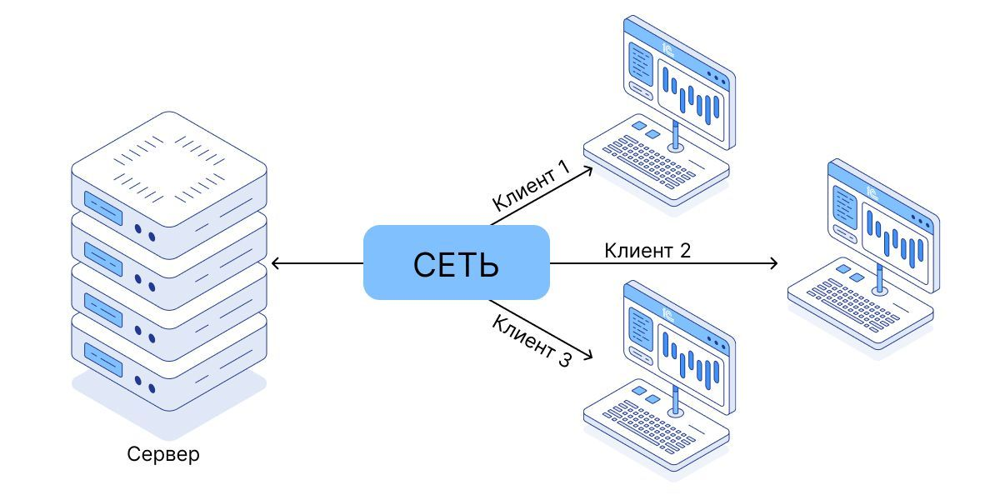
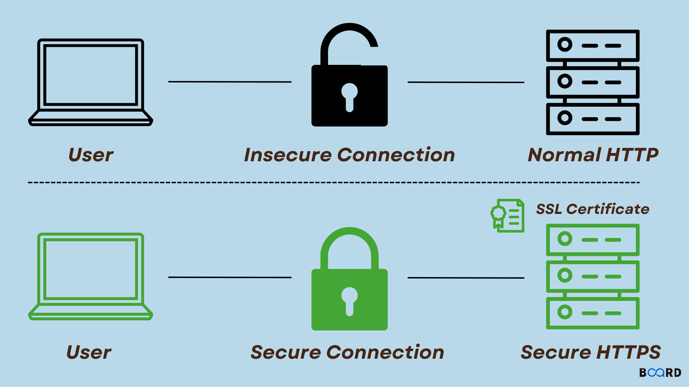
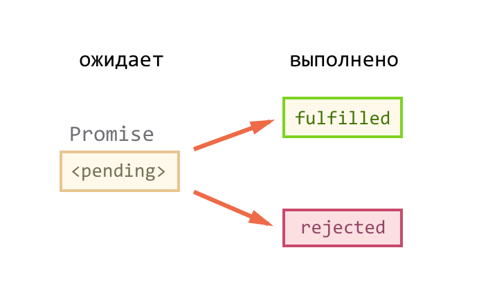

# Лекция 11. Асинхронность и API


## Введение

В прошлых лекциях мы много работали с тем, что происходит *“здесь и сейчас”*:
`нажали кнопку → обработчик сработал → DOM изменился → пользователь увидел результат`.

Но в реальных приложениях есть задачи, которые не решаются мгновенно:
- запросить данные с сервера;
- подождать таймер;
- получить результат от другого окна или вкладки;
- получить ответ от API;
- и многое другое.

И вот тут возникает вопрос:
> **Что будет, если JavaScript столкнется с задачей, которая не может быть выполнена мгновенно?**

### Синхронный код

**Синхронный код** выполняется строго по порядку: строка за строкой. Следующая операция начнётся только тогда, когда закончится предыдущая.

Это удобно, потому что всё предсказуемо:

```javascript
console.log("1");
console.log("2");
console.log("3");
```

Результат всегда будет: `1 2 3`.

Но синхронность имеет важное ограничение:

> **Если одна из операций занимает много времени, весь код останавливается, пока она не завершится.**

А в браузере это может привести к тому, что все остальные действия (клики, анимации, обновление интерфейса) будут заморожены.

> **Главная проблема синхронного ожидания в браузере - блокировка потока выполнения, а значит и интерфейса.**

#### Почему нельзя блокировать UI?

Представьте простой сценарий: нажали *“Загрузить товары”*. Если бы JavaScript выполнял ожидание синхронно, то на время ожидания:

- кнопки перестанут реагировать,
- скролл может тормозить,
- текст в input вводится с задержкой,
- страница выглядит “замороженной”.

Пользователь почти всегда интерпретирует это одинаково: **“Сайт сломался”**.

### Асинхронный код

Асинхронный код устроен иначе:

- мы запускаем *“долгую операцию”* (например, запрос или таймер),
- не ждём результат прямо в этом месте,
- продолжаем выполнение программы,
- а когда результат будет готов - выполняем заранее подготовленную логику.

Такой подход позволяет не блокировать интерфейс и поддерживать отзывчивость приложения.

**Мини-пример: асинхронный таймер**

```javascript
console.log("Начало");

setTimeout(() => {
  console.log("Это выполнится через 1 секунду");
}, 1000);

console.log("Конец");
```

Здесь важно заметить, что `setTimeout` запускает таймер, но не блокирует выполнение. Поэтому результат будет:

- `Начало`
- `Конец`
- `Это выполнится через 1 секунду` (через 1 секунду после `Конец`)

Асинхронность - это базовый принцип, который лежит в основе многих современных веб-приложений. Она позволяет создавать динамичные, отзывчивые интерфейсы, которые не “зависают” при выполнении долгих операций.

## Сеть и клиент-серверная архитектура

Современные веб-приложения часто взаимодействуют с удалёнными серверами для получения данных, отправки форм, загрузки ресурсов и т.д. Это взаимодействие происходит через сеть, и оно по своей природе асинхронное.

Сеть - это сложная система, которая обеспечивает обмен данными между клиентом (браузером) и сервером. Когда мы отправляем запрос на сервер, мы не знаем точно, когда он ответит - это может занять миллисекунды, секунды или даже больше. Поэтому важно уметь работать с асинхронными операциями, чтобы не блокировать интерфейс и обеспечить хороший пользовательский опыт.

**ПОЧТИ** все современные веб-приложения построены на основе клиент-серверной архитектуры, где клиент (браузер) отправляет запросы на сервер, а сервер обрабатывает эти запросы и возвращает ответы.

### Клиент-серверная архитектура



В этой архитектуре:
- **Клиент** - это приложение, которое взаимодействует с пользователем (например, браузер). Он отправляет запросы на сервер и отображает полученные данные.
- **Сервер** - это мощный компьютер, который обрабатывает запросы от клиентов, выполняет бизнес-логику и возвращает ответы. Сервер может взаимодействовать с базой данных, другими сервисами и выполнять сложные операции.

Важно понимать, что пока серверу не придёт запрос от клиента, он не формирует ответ для клиента.  
И наоборот, клиент может отправлять запросы в любое время - не блокируя интерфейс и не “замораживая” страницу в ожидании ответа.

### HTTP и HTTPS

Для обмена данными между клиентом и сервером используется протокол `HTTP` (`HyperText Transfer Protocol`). Это стандартный протокол для передачи данных в интернете. Когда мы вводим URL в браузере, он отправляет `HTTP`-запрос на сервер, который обрабатывает его и возвращает `HTTP`-ответ.



Существует также `HTTPS` (`HTTP Secure`) - это расширение `HTTP`, которое обеспечивает безопасное соединение между клиентом и сервером с помощью шифрования. Это особенно важно для защиты конфиденциальных данных, таких как пароли, номера кредитных карт и т.д.

Что нам сегодня нужно знать о `HTTP` и `HTTPS` запросах и ответах:

**HTTP-запрос (Request)** состоит из:
- URL (адрес ресурса) - куда мы отправляем запрос;
- Метод (GET, POST, PUT, DELETE и т.д.) - что мы хотим сделать с ресурсом;
- Заголовки (Headers) - дополнительная информация о запросе (например, тип данных, авторизация и т.д.);
- Тело запроса (Body) - данные, которые мы отправляем на сервер (например, при POST-запросе).

**HTTP-ответ (Response)** состоит из:
- Статус-код (Status Code) - код, который указывает результат обработки запроса (например, 200 - OK, 404 - Not Found, 500 - Internal Server Error и т.д.);
- Заголовки (Headers) - дополнительная информация об ответе (например, тип данных, кэширование и т.д.);
- Тело ответа (Body) - данные, которые сервер возвращает клиенту (например, HTML, JSON, изображения и т.д.).

Основные методы HTTP-запросов:

| Метод  | Описание                                      |
|--------|-----------------------------------------------|
| GET    | Получить данные с сервера                     |
| POST   | Отправить данные на сервер (например, форму)  |
| PUT    | Обновить существующий ресурс на сервере       |
| PATCH  | Частично обновить ресурс на сервере           |
| DELETE | Удалить ресурс на сервере                     |

Основные статус-коды HTTP-ответов:

| Код  | Описание                                   |
|------|--------------------------------------------|
| 200  | OK - запрос успешно обработан              |
| 201  | Created - ресурс успешно создан            |
| 400  | Bad Request - неверный запрос              |
| 401  | Unauthorized - требуется авторизация       |
| 403  | Forbidden - доступ запрещён                |
| 404  | Not Found - ресурс не найден               |
| 500  | Internal Server Error - ошибка на сервере  |

> **Важно:** статус `404` или `500` - это **ответ сервера**, а не “ошибка сети”.  
> В `fetch` это проявится так: запрос может выполниться, но `response.ok` будет `false`.

### API (Application Programming Interface)


**API** - это интерфейс, который позволяет разным программам взаимодействовать друг с другом. В контексте веб-разработки `API` обычно используется для обмена данными между клиентом и сервером.

API может быть реализован в виде набора `URL`-адресов, которые принимают определённые `HTTP`-запросы и возвращают данные в определённом формате (например, JSON).

Например, если у нас есть сервер, который предоставляет информацию о товарах, он может иметь `API` с такими эндпоинтами:
- `GET /api/products` - получить список всех товаров;
- `GET /api/products/{id}` - получить информацию о конкретном товаре по его ID;
- `POST /api/products` - создать новый товар;
- `PUT /api/products/{id}` - обновить информацию о товаре по его ID;
- `DELETE /api/products/{id}` - удалить товар по его ID.

`API` позволяет клиенту (браузеру) запрашивать данные с сервера и использовать их для отображения информации пользователю. Это ключевой элемент в построении динамичных веб-приложений, которые могут взаимодействовать с удалёнными ресурсами и предоставлять пользователю актуальную информацию.

### Как это связано с JavaScript

Когда вы работаете в браузере, вы не “открываете базу данных” напрямую и не берёте данные из сервера как из переменной.  
Вы всегда делаете сетевой запрос, и ответ приходит **позже**.

Именно поэтому работа с `API` в `JavaScript` почти всегда выглядит так:

1) запустить запрос (например, `fetch(...)`);
2) не блокировать интерфейс;
3) дождаться ответа;
4) обработать данные и отрисовать их в DOM;
5) обработать ошибки.

Дальше мы разберём, какие инструменты даёт `JavaScript` для такого ожидания:  
сначала **callback**, затем **Promise**, и в конце **async/await**.

## Callback: первый способ работать с асинхронностью

Когда результат приходит позже, `JavaScript` должен как-то понять:

- что сделать после того, как операция завершится;
- когда именно выполнить этот код.

Самый старый и простой механизм для этого - callback.

### Что такое callback

**Callback** - это функция, которая передаётся в другую функцию в качестве аргумента и вызывается после завершения определённого действия. Это был первый способ работать с асинхронностью в `JavaScript`.

То есть мы буквально говорим: *“Когда закончится эта операция, вызови эту функцию”*.

Это встречается в JavaScript постоянно:

- обработчики событий - это `callbacks`;
- `setTimeout` и `setInterval` - это `callbacks`;
- многие API браузера используют `callbacks`.

**Callback на примере событий**

Рассмотрим пример, который мы уже видели в прошлых лекциях:

```javascript
button.addEventListener('click', function() {
  console.log('Кнопка была нажата!');
});
```

Здесь браузер вызывает переданную функцию не сейчас, а только тогда, когда произойдёт событие `click`.

**Callback на примере таймера**

```javascript
console.log("Старт");

setTimeout(() => {
  console.log("Прошла 1 секунда");
}, 1000);

console.log("Код продолжает выполняться");
```

Здесь тот же принцип: `setTimeout` запускает таймер, а когда он истекает, вызывается переданная функция.

### Проблемы с callback

`Callback` отлично работают, пока логика простая:
- подождать таймер;
- отреагировать на клик;
- выполнить действие после события.

Но в реальном приложении часто нужно делать последовательные асинхронные операции, например:
1. отправить запрос за товарами;
2. когда товары пришли - отрисовать список;
3. когда список отрисован - повесить обработчики кнопок;
4. если произошла ошибка - показать сообщение.

И вот тут начинаются проблемы с `callback`:
> **Код начинает уходить во вложенность, становится сложным для чтения и поддержки.**

#### Пример “адского коллбэка” (Callback Hell)

Пример на таймерах:

```javascript
setTimeout(() => {
  console.log("1 секунда");
  setTimeout(() => {
    console.log("2 секунды");
    setTimeout(() => {
      console.log("3 секунды");
      // И так далее...
    }, 1000);
  }, 1000);
}, 1000);
```

Код становится:
- трудным для понимания;
- сложно отлавливать ошибки;
- сложно изменять логику (например, добавить условие или обработку ошибок).

> **Важно:** проблема не в том, что callback - плохой инструмент, а в том, что он плохо масштабируется для сложных сценариев.

## Promise: второй способ работать с асинхронностью



Решением проблем с `callback` стал новый инструмент - `Promise`. Он был введён в стандарте `ECMAScript 2015` и стал стандартом де-факто для работы с асинхронностью в JavaScript.

### Что такое Promise

**Promise** - это объект, который представляет результат асинхронной операции. Он может находиться в одном из трёх состояний:
- **pending** (ожидание) - операция ещё не завершилась;
- **fulfilled** (выполнено) - операция успешно завершилась, и результат доступен;
- **rejected** (отклонено) - операция завершилась с ошибкой.

Важно понимать: `Promise` создаётся сразу, но его результат появится позже, когда асинхронная операция завершится.

### Как создается Promise

Promise создаётся с помощью конструктора `Promise`, который принимает функцию с двумя аргументами: `resolve` и `reject`. Эти функции используются для изменения состояния `Promise`:

```javascript
const promise = new Promise((resolve, reject) => {
  setTimeout(() => {
    resolve("Данные готовы");
    // reject(new Error("Ошибка получения данных"));
  }, 1000);
});
```

Здесь мы имитируем асинхронную операцию с помощью `setTimeout`. Через 1 секунду мы вызываем `resolve`, что переводит `Promise` в состояние `fulfilled` и передаёт результат. Если бы произошла ошибка, мы могли бы вызвать `reject`, что перевело бы `Promise` в состояние `rejected`.

#### then: обработка успешного результата

Чтобы получить результат `Promise`, мы используем метод `then`:

```javascript
const promise = new Promise((resolve) => {
  setTimeout(() => resolve("Готово"), 1000);
});

promise.then((result) => {
  console.log("Результат:", result);
});
```

Смысл простой: **когда Promise успешно выполнится, вызови эту функцию и передай ей результат.**

#### catch: что делать при ошибке

Если операция завершилась с ошибкой, мы можем обработать её с помощью метода `catch`:

```javascript
const promise = new Promise((resolve, reject) => {
  setTimeout(() => reject(new Error("Что-то пошло не так")), 1000);
});
promise
  .then((result) => {
    console.log("Результат:", result);
  })
  .catch((error) => {
    console.error("Ошибка:", error);
  });
```

#### finally: что делать в любом случае

Иногда нам нужно выполнить код независимо от того, успешно ли завершилась операция или произошла ошибка. Для этого есть метод `finally`:
- убрать "loading" индикатор;
- очистить ресурсы;
- выполнить общую логику, которая должна работать в любом случае.

```javascript
const promise = new Promise((resolve) => {
  setTimeout(() => resolve("Готово"), 1000);
});

promise
  .then((result) => {
    console.log("Результат:", result);
  })
  .catch((error) => {
    console.error("Ошибка:", error);
  })
  .finally(() => {
    console.log("Операция завершилась (успех или ошибка)");
  });
```

#### Главное преимущество Promise: цепочки

Основная причина, почему Promise удобнее `callbacks` - возможность строить цепочки без вложенности.

Основная идея: каждый `then` возвращает новый `Promise`, который может быть обработан следующим `then`. Это позволяет писать код, который читается сверху вниз, без глубокой вложенности.

```javascript
new Promise((resolve) => {
  setTimeout(() => resolve(1), 500);
})
  .then((value) => {
    console.log("Шаг 1:", value);
    return value + 1;
  })
  .then((value) => {
    console.log("Шаг 2:", value);
    return value + 1;
  })
  .then((value) => {
    console.log("Шаг 3:", value);
  })
  .catch((error) => {
    console.log("Ошибка:", error);
  });
```

Здесь мы последовательно выполняем три шага, каждый из которых зависит от результата предыдущего. Код читается легко, и нет глубокой вложенности, как в случае с `callbacks`.

#### Зачем вручную вызывать resolve и reject?

Когда мы создаём `Promise` сами, мы должны явно сказать, чем закончилась операция:

- `resolve(...)` - всё прошло успешно;
- `reject(...)` - произошла ошибка.

Если этого не сделать, `Promise` так и останется в состоянии `pending`, а `then/catch` никогда не сработают.

**Пример: проверка условия с "успехом" или "ошибкой"**

Представьте ситуацию: есть правило *“доступ разрешён с 18 лет”*. Это не запрос в сеть и не таймер, но нам удобно вернуть результат так, чтобы дальше код работал единообразно - через `then/catch`.

```javascript
function checkAge(age) {
  return new Promise((resolve, reject) => {
    if (age >= 18) {
      resolve("Доступ разрешён");
    } else {
      reject(new Error("Доступ запрещён"));
    }
  });
}

checkAge(16)
  .then((message) => {
    console.log("Успех:", message);
  })
  .catch((error) => {
    console.log("Ошибка:", error.message);
  });
```

Здесь важно увидеть механику:
- если условие выполнено → мы явно вызываем `resolve(...);`
- если условие не выполнено → мы явно вызываем `reject(...);`
- снаружи результат попадает либо в `then`, либо в `catch`.

> В реальных проектах `new Promise(...)` вручную используют не так часто - многие API уже возвращают Promise (например, `fetch`).  
> Но понимать `resolve/reject` важно, чтобы разбираться в механике и уметь “оборачивать” старые callback-API.

`Promise` решают основную проблему `callbacks`: код становится более линейным, ошибки можно собирать в одном месте, шаги можно *“цеплять”* один за другим.

Но если шагов много, цепочки из `.then().then().then()` всё равно начинают выглядеть громоздко.

Поэтому решением является `async/await`: это тот же `Promise`-механизм, но записанный в виде более читаемого кода.

## async/await - третий способ работать с асинхронностью

В прошлом разделе мы разобрали `Promise` и увидели, что он решает многие проблемы с `callbacks`, но код с длинными цепочками `.then()` всё равно может быть сложным для чтения.

Поэтому в стандарте `ECMAScript 2017` был введён новый синтаксис для работы с асинхронностью - `async/await`. Он позволяет писать асинхронный код, который выглядит как синхронный, что значительно улучшает читаемость и поддержку.

> `async/await` - это более читаемая запись работы с `Promise`.

### async: функция, которая возвращает Promise

Если функция помечена ключевым словом `async`, то она всегда возвращает `Promise`. Даже если внутри вы просто возвращаете строку или число - наружу всё равно выходит `Promise`.

```javascript
async function getMessage() {
  return "Привет";
}

console.log(getMessage()); // Promise
```

Чтобы получить результат, нужно использовать `then`:

```javascript
getMessage().then((value) => console.log(value)); // "Привет"
```

То есть правило такое:
- `async`-функция возвращает `Promise`;
- значение, которое вы вернули через `return`, становится результатом этого `Promise`.

Если внутри `async`-функции происходит ошибка (например, выбрасывается исключение), то `Promise` будет отклонён с этой ошибкой:

```javascript
async function getMessage() {
  throw new Error("Что-то пошло не так"); // специально выбрасываем ошибку
}

getMessage()
  .then((value) => console.log(value))
  .catch((error) => console.error("Ошибка:", error.message));
```

> Ошибки из `async`-функции превращаются в `rejected Promise`. Поэтому их можно ловить через `.catch()`.  
> А дальше в лекции мы разберём второй способ - `try/catch`, который используется вместе с `await`.

### await: ожидание результата Promise

`await` - это оператор, который можно использовать только внутри `async`-функции. Он позволяет “остановить” выполнение функции до тех пор, пока `Promise`, который стоит после `await`, не будет выполнен или отклонён.

Когда вы пишете `await somePromise`, вы как будто говорите:

> “Подожди, пока Promise завершится, и дай мне его результат”.

Пример с таймером. Сначала создадим функцию `wait`, которая возвращает `Promise` и завершается через `N` миллисекунд:

```javascript
function wait(ms) {
  return new Promise((resolve) => {
    setTimeout(resolve, ms);
  });
}
```

Теперь используем `async/await` для последовательного ожидания:

```javascript
async function run() {
  console.log("Начало");

  await wait(1000);
  console.log("Прошла 1 секунда");

  await wait(1000);
  console.log("Прошла ещё 1 секунда");

  console.log("Конец");
}

run();
```

Здесь код читается сверху вниз, как обычный синхронный код, но при этом мы не блокируем интерфейс, потому что `await` работает с `Promise` и позволяет другим операциям выполняться параллельно.

### Важно: await не блокирует страницу

Частая ошибка новичков - думать, что `await` “замораживает браузер”. Это не так.

`await` делает паузу только внутри текущей `async`-функции, а браузер продолжает работать:

- интерфейс реагирует на клики;
- анимации продолжаются;
- остальной код может выполняться.

То есть `await` - это удобный способ дождаться результата **без блокировки UI**.

## Обработка ошибок в асинхронном коде

До этого момента мы уже видели два важных факта:
1. `Promise` позволяет обрабатывать ошибки через `.catch()`;
2. `async` - функция, которая возвращает `Promise`, и если внутри неё происходит ошибка, то `Promise` будет отклонён.

Мы уже умеем ловить ошибки в `Promise` через `.catch()`, но с `async/await` есть ещё более удобный способ - использовать конструкцию `try/catch`.

### try/catch для обработки ошибок

`try/catch` - это конструкция, которая позволяет “поймать” ошибку и не уронить выполнение программы.

Синхронный код:

```javascript
try {
  console.log("До ошибки");
  throw new Error("Что-то пошло не так");
  console.log("После ошибки"); // эта строка не выполнится
} catch (error) {
  console.error("Поймали ошибку:", error.message);
}
```

Тут:
- код внутри `try` выполняется до тех пор, пока не произойдёт ошибка;
- если ошибка произошла, выполнение переходит в блок `catch`, и мы можем обработать эту ошибку.
- `throw` - это способ вручную вызвать ошибку, которая будет поймана `catch`.

### throw: как “создать” ошибку вручную

Иногда нужно не ждать ошибку *“саму по себе”*, а явно прервать выполнение и сказать:
*“это ошибка, дальше продолжать нельзя”*.

Для этого используется `throw`.

```javascript
function checkNumber(value) {
  if (typeof value !== "number") {
    throw new Error("Ожидалось число");
  }
  return value * 2;
}

try {
  console.log(checkNumber("10"));
} catch (error) {
  console.log("Ошибка:", error.message);
}
```

`throw` полезен, когда вы проверяете входные данные или хотите явно остановить выполнение при неправильном состоянии.

#### Ошибки в Promise: .catch()

Когда мы используем `await`, ошибка из `Promise` *“всплывает”* как обычная ошибка.
Поэтому её можно ловить `try/catch`.

```javascript
function failAfter(ms) {
  return new Promise((resolve, reject) => {
    setTimeout(() => reject(new Error("Что-то пошло не так")), ms);
  });
}

async function run() {
  try {
    console.log("Старт");
    await failAfter(1000);
    console.log("Этот код не выполнится");
  } catch (error) {
    console.log("Поймали ошибку:", error.message);
  }
}

run();
```

Здесь важно увидеть:

- внутри `try` мы используем `await`;
- если Promise отклоняется - управление переходит в `catch`.

#### finally: что выполнить в любом случае

Иногда нужно выполнить действие независимо от успеха или ошибки:
- остановить спиннер;
- разблокировать кнопку;
- вернуть интерфейс в нормальное состояние.

Для этого используется `finally`.

```javascript
function wait(ms) {
  return new Promise((resolve) => setTimeout(resolve, ms));
}

async function load() {
  try {
    console.log("Показываем loading...");
    await wait(1000);
    console.log("Получили данные");
  } catch (error) {
    console.log("Ошибка:", error.message);
  } finally {
    console.log("Убираем loading (в любом случае)");
  }
}

load();
```

## fetch: работа с сетью и API

Мы с вами обсудили инструменты как работать с асинхронностью и как устроен клиент-серверный обмен данными. Теперь давайте посмотрим, как в JavaScript отправлять запросы на сервер и получать ответы.

### Что такое fetch

`fetch()` - это функция, которая отправляет `HTTP`-запрос и возвращает `Promise`.

Воспользуемся публичным API для тестирования - `jsonplaceholder`. Это сервис, который предоставляет фейковые комментарии и посты для разработки и тестирования. Например, чтобы получить пост с ID 1, мы можем отправить запрос на URL `https://jsonplaceholder.typicode.com/posts/1`.

```javascript
const responsePromise = fetch("https://jsonplaceholder.typicode.com/posts/1");
console.log(responsePromise); // Promise
```

Вы запускаете запрос на сервер, и `fetch` возвращает `Promise`, который будет выполнен, когда придёт ответ от сервера.

#### Простой GET-запрос

Самый базовый вариант - получить объект `Response`:

```javascript
fetch("https://jsonplaceholder.typicode.com/posts/1")
  .then((response) => {
    console.log(response); // Ответ, а не данные
  })
  .catch((error) => {
    console.log("Ошибка сети:", error);
  });
```

Но здесь есть важный момент: `response` - это не данные, а объект ответа. Чтобы получить данные, их нужно прочитать из `response`.

#### Объект Response: что в нём есть

`Response` - это объект, который содержит информацию о статусе ответа, заголовках и методы для чтения тела ответа.
Основные свойства `Response`:
- `status` - числовой код статуса (например, 200, 404, 500);
- `ok` - булевое значение, которое равно `true`, если статус в диапазоне 200-299;
- `headers` - объект с заголовками ответа;
- `url` - URL, с которого пришёл ответ.
Основные методы `Response` для чтения данных:
- `response.text()` - возвращает тело ответа как строку;
- `response.json()` - возвращает тело ответа, распарсенное как JSON;
- `response.blob()` - возвращает тело ответа как Blob (например, для изображений);

Проверим статус и `ok`:

```javascript
fetch("https://jsonplaceholder.typicode.com/posts/1")
  .then((response) => {
    console.log("status:", response.status); // 200
    console.log("ok:", response.ok);         // true
  });
```

#### Почему fetch не “падает” на 404 и 500

Очень важный момент, на котором постоянно ошибаются новички. Когда вы отправляете запрос на несуществующий ресурс (например, `https://jsonplaceholder.typicode.com/posts/9999`), сервер может ответить статусом `404 Not Found`. Но `fetch` **не считает это ошибкой сети** - он успешно получил ответ от сервера, просто этот ответ содержит статус `404`. Поэтому `fetch` не “падает” и не переходит в `catch`.

Вместо этого нужно проверять `response.ok` или `response.status` внутри `then`, чтобы понять, был ли запрос успешным с точки зрения сервера. Если `response.ok` - `false`, значит сервер ответил с ошибкой (например, 404 или 500), и нужно обработать эту ситуацию отдельно.

```javascript
fetch("https://jsonplaceholder.typicode.com/posts/9999")
  .then((response) => {
    if (!response.ok) {
      throw new Error(`Ошибка сервера: ${response.status}`);
    }
    return response.json();
  })
  .then((data) => {
    console.log("Данные:", data);
  })
  .catch((error) => {
    console.error("Ошибка:", error.message);
  });
```

Здесь мы явно проверяем `response.ok` и выбрасываем ошибку, если сервер ответил с ошибкой. Это позволяет нам обрабатывать такие ситуации в блоке `catch`.

> В разных API поведение может отличаться: иногда вместо 404 возвращают пустой объект, иногда 200 с сообщением об ошибке. Поэтому всегда важно читать документацию к API, с которым вы работаете, чтобы понимать, как он обрабатывает ошибки.

## JSON в API-контексте

Мы уже увидели строку:

```javascript
return response.json();
```

Теперь важно понять, что такое `JSON` и почему этот метод возвращает `Promise`.

### Что такое JSON

`JSON (JavaScript Object Notation)` - это текстовый формат для передачи данных. Чаще всего сервер и клиент обмениваются данными именно в `JSON`.

Главная мысль:
- `JavaScript`-объект живёт внутри кода.
- `JSON` - это строка (текст), которую удобно отправлять по сети.

Пример, у нас есть объект:

```javascript
const user = {
  name: "Alex",
  age: 27
};
```

Чтобы отправить его на сервер, нужно превратить в строку:

```javascript
const jsonString = '{"name":"Alex","age":27}';
```

### Как преобразовать JavaScript-объект в JSON

Для этого используется метод `JSON.stringify()`:

```javascript
const user = {
  name: "Alex",
  age: 27
};
const jsonString = JSON.stringify(user);
console.log(jsonString); // '{"name":"Alex","age":27}'
```

Теперь `jsonString` - это строка, которую можно отправить на сервер.

### Как преобразовать JSON в JavaScript-объект

Когда мы получаем `JSON`-строку от сервера, нам нужно превратить её обратно в `JavaScript`-объект, чтобы работать с данными. Для этого используется метод `JSON.parse()`:

```javascript
const jsonString = '{"name":"Alex","age":27}';
const user = JSON.parse(jsonString);
console.log(user); // { name: "Alex", age: 27 }
```

### Почему `response.json()` возвращает `Promise`

`response.json()`:
- читает тело ответа (это поток данных);
- превращает текст в объект (парсит JSON).

Это занимает время и выполняется асинхронно, поэтому метод возвращает `Promise`.

```javascript
fetch("https://jsonplaceholder.typicode.com/posts/1")
  .then((response) => response.json())
  .then((data) => {
    console.log(data.title);
  });
```

Здесь `response.json()` возвращает `Promise`, который выполняется, когда данные будут прочитаны и распарсены. Поэтому мы можем использовать `then` для получения результата.

### POST-запрос: отправляем JSON в body

Чтобы отправить объект на сервер, его нужно превратить в `JSON`-строку через `JSON.stringify()` и указать заголовок `Content-Type`.

```javascript
const newPost = {
  title: "Новый пост",
  body: "Содержимое поста",
  userId: 1
};

fetch("https://jsonplaceholder.typicode.com/posts", {
  method: "POST",
  headers: {
    "Content-Type": "application/json"
  },
  body: JSON.stringify(newPost)
})
  .then((response) => response.json())
  .then((data) => {
    console.log("Ответ сервера:", data);
  })
  .catch((error) => {
    console.error("Ошибка:", error);
  });
```

Что здесь важно увидеть:
- мы используем `method: "POST"` для указания типа запроса;
- в `headers` указываем, что отправляем `JSON`;
- в `body` передаём строку, полученную через `JSON.stringify()`.
- после отправки мы обрабатываем ответ так же, как и в случае с `GET` - через `response.json()`.

### PUT и PATCH

Для обновления данных на сервере используются методы `PUT` и `PATCH`. Они работают аналогично `POST`, но имеют разные семантики:
- `PUT` - полностью заменяет ресурс на сервере;
- `PATCH` - частично обновляет ресурс, изменяя только указанные поля.

**JSONPlaceholder** поддерживает эти запросы в учебном режиме, поэтому примеры можно проверить.

Пример для `PATCH`:

```javascript

const updatedPost = {
  title: "Обновлённый заголовок"
};

fetch("https://jsonplaceholder.typicode.com/posts/1", {
  method: "PATCH",
  headers: {
    "Content-Type": "application/json"
  },
  body: JSON.stringify(updatedPost)
})
  .then((response) => response.json())
  .then((data) => {
    console.log("Ответ сервера:", data);
  })
  .catch((error) => {
    console.error("Ошибка:", error);
  });
```

Здесь мы отправляем `PATCH`-запрос, который обновляет только заголовок поста с ID 1. Ответ сервера будет содержать обновлённые данные.

### Один универсальный request() для работы с API

В реальных проектах часто создают универсальную функцию `request()`, которая оборачивает `fetch` и позволяет легко отправлять запросы на сервер, не повторяя код для обработки ошибок, заголовков и т.д.


**Универсальная функция request(url, method, data)**
```javascript
async function request(url, method = "GET", data = null) {
  const options = { method };

  // Если мы отправляем данные (POST / PUT / PATCH) - добавляем JSON в body
  if (data !== null) {
    options.headers = {
      "Content-Type": "application/json; charset=UTF-8",
    };
    options.body = JSON.stringify(data);
  }

  const response = await fetch(url, options);

  // fetch не падает на 404/500, поэтому проверяем вручную
  if (!response.ok) {
    throw new Error(`HTTP ошибка: ${response.status}`);
  }

  // Некоторые методы (например DELETE) могут вернуть пустое тело (204 No Content)
  const contentLength = response.headers.get("content-length");
  if (response.status === 204 || contentLength === "0") {
    return null;
  }

  return response.json();
}
```

Теперь мы можем использовать эту функцию для всех типов запросов:

**Один полный цикл работы с постом (получение, создание, обновление, удаление)**

```javascript
const newPost = {
  title: "Новый пост",
  body: "Содержимое поста",
  userId: 1,
};
const url = "https://jsonplaceholder.typicode.com/posts";

async function run(url, newPost) {
  try {
    // Создаём новый пост
    const createdPost = await request(url, "POST", newPost);
    console.log("Созданный пост:", createdPost);

    // Получаем пост по ID
    let postId = 1;
    const fetchedPost = await request(`${url}/${postId}`);
    console.log("Полученный пост:", fetchedPost);

    // Обновляем пост
    const updatedData = { title: "Обновлённый заголовок" };
    const updatedPost = await request(`${url}/${postId}`, "PATCH", updatedData);
    console.log("Обновлённый пост:", updatedPost);

    // Удаляем пост
    await request(`${url}/${postId}`, "DELETE");
    console.log("Пост удалён");
  } catch (error) {
    console.error("Ошибка:", error.message);
  }
}
run(url, newPost);
```

Здесь мы последовательно выполняем все операции с постом:
1. Создаём новый пост через `POST`;
2. Получаем любой пост через `GET`;
3. Обновляем любой пост через `PATCH`;
4. Удаляем любой пост через `DELETE`.

В каждом шаге мы используем нашу универсальную функцию `request()`, которая обрабатывает все детали работы с `fetch` и позволяет нам сосредоточиться на логике приложения.


> **JSONPlaceholder - учебный API: он имитирует создание/обновление/удаление и возвращает ответ, но реально данные на сервере не сохраняются.**

## Интеграция API в интерфейс: состояния loading / success / empty / error

При работе с API важно не только отправлять запросы и получать данные, но и правильно отображать состояние интерфейса в зависимости от результата запроса. Обычно выделяют следующие состояния:
- **Loading** - данные загружаются, и пользователь видит индикатор загрузки;
- **Success** - данные успешно получены и отображаются пользователю;
- **Empty** - запрос выполнен успешно, но данных нет (например, пустой список);
- **Error** - произошла ошибка при загрузке данных, и пользователь видит сообщение об ошибке.

Именно эти состояния делают приложение *“живым”* и понятным для пользователя.

Сделаем пример, который показывает эти состояния при загрузке списка постов с `API`.

**Минимальный пример разметки для отображения состояний**

```html
<div id="status"></div>
<ul id="posts"></ul>

<button id="loadBtn">Загрузить посты</button>
```

- `status` - элемент для отображения текущего состояния (loading, error, empty);
- `posts` - элемент для отображения списка постов;
- `loadBtn` - кнопка для запуска загрузки данных.

**Подготовим универсальный request() (как в предыдущем блоке)**

Добавим в него небольшую искусственную задержку для демонстрации состояния загрузки:

```javascript
function wait(ms) {
  return new Promise((resolve) => setTimeout(resolve, ms));
}

async function request(url, method = "GET", data = null) {
  const options = { method };

  if (data !== null) {
    options.headers = { "Content-Type": "application/json; charset=UTF-8" };
    options.body = JSON.stringify(data);
  }
  await wait(1000); // искусственная задержка для демонстрации loading
  const response = await fetch(url, options);

  if (!response.ok) {
    throw new Error(`HTTP ошибка: ${response.status}`);
  }

  const contentLength = response.headers.get("content-length");
  if (response.status === 204 || contentLength === "0") {
    return null;
  }

  return response.json();
}
```

Функции для UI: показываем статус и рисуем список

```javascript
const statusEl = document.getElementById("status");
const postsEl = document.getElementById("posts");

function setStatus(text) {
  statusEl.textContent = text;
}

function clearPosts() {
  postsEl.innerHTML = "";
}

function renderPosts(posts) {
  postsEl.innerHTML = posts
    .map((post) => `<li><strong>${post.title}</strong><br>${post.body}</li>`)
    .join("");
}
```

**Основная логика: загрузка постов с состояниями**

```javascript
const API_URL = "https://jsonplaceholder.typicode.com/posts";
const loadBtn = document.getElementById("loadBtn");

async function loadPosts() {
  try {
    // 1) loading
    setStatus("Загрузка...");
    clearPosts();

    const posts = await request(API_URL);

    // 2) empty
    if (!posts || posts.length === 0) {
      setStatus("Постов нет");
      return;
    }

    // 3) success
    setStatus("");
    renderPosts(posts.slice(0, 10)); // чтобы не рисовать 100 сразу
  } catch (error) {
    // 4) error
    setStatus(`Ошибка: ${error.message}`);
  }
}

loadBtn.addEventListener("click", loadPosts);
```

**небольшие улучшения для UX**
- отключать кнопку во время загрузки, чтобы предотвратить повторные клики;
- гарантированно вернуть интерфейс в нормальное состояние после загрузки (например, убрать статус “Загрузка...” даже при ошибке).


**обновим функцию loadPosts с улучшениями для UX**

```javascript
const API_URL = "https://jsonplaceholder.typicode.com/posts";
const loadBtn = document.getElementById("loadBtn");

async function loadPosts() {
  // Если кнопка уже отключена - значит запрос в процессе
  if (loadBtn.disabled) return;

  loadBtn.disabled = true;

  try {
    setStatus("Загрузка...");
    clearPosts();

    const posts = await request(API_URL);

    if (!posts || posts.length === 0) {
      setStatus("Постов нет");
      return;
    }

    setStatus("");
    renderPosts(posts.slice(0, 10));
  } catch (error) {
    setStatus(`Ошибка: ${error.message}`);
  } finally {
    // Этот блок выполнится всегда: и при успехе, и при ошибке
    loadBtn.disabled = false;
  }
}

loadBtn.addEventListener("click", loadPosts);
```

Что изменилось:
- `loadBtn.disabled = true` - кнопка блокируется на время запроса.
- `finally` гарантирует, что кнопка включится обратно независимо от результата.
- Проверка `if (loadBtn.disabled) return;` защищает от повторного запуска, если функция вызвана ещё раз.

### Query params: параметры запроса в URL

Очень часто `API` позволяет не получать *“всё подряд”*, а запрашивать данные с параметрами: фильтрация, пагинация, лимиты, сортировка.

Такие параметры обычно передаются прямо в `URL` после знака `?` и называются `query params`.

Общий вид:

```text
/posts?userId=1&_limit=5
```

Здесь:
- `userId=1` - фильтр по пользователю с `ID 1`;
- `_limit=5` - ограничение количества возвращаемых постов до `5`.

**Пример с JSONPlaceholder**

`JSONPlaceholder` поддерживает query params, поэтому можно сразу проверить.

Получим 5 постов пользователя с `userId = 1`:

```javascript
fetch("https://jsonplaceholder.typicode.com/posts?userId=1&_limit=5")
  .then((response) => {
    if (!response.ok) {
      throw new Error(`HTTP ошибка: ${response.status}`);
    }
    return response.json();
  })
  .then((posts) => {
    console.log("Постов получено:", posts.length);
    console.log("Первый пост:", posts[0]);
  })
  .catch((error) => {
    console.log("Ошибка:", error.message);
  });
```

Здесь мы отправляем запрос с параметрами `userId=1` и `_limit=5`, и в ответ получаем массив из 5 постов, принадлежащих пользователю с `ID 1`.

**Как собирать query params безопасно (URLSearchParams)**

Когда параметров много, лучше не собирать строку руками. Для этого есть `URLSearchParams` - встроенный инструмент для работы с `query params`.

```javascript
const params = new URLSearchParams({
  userId: 1,
  _limit: 5,
});

const url = `https://jsonplaceholder.typicode.com/posts?${params.toString()}`;

fetch(url)
  .then((response) => {
    if (!response.ok) {
      throw new Error(`HTTP ошибка: ${response.status}`);
    }
    return response.json();
  })
  .then((posts) => {
    console.log("URL:", url);
    console.log("Постов получено:", posts.length);
  })
  .catch((error) => {
    console.log("Ошибка:", error.message);
  });
```

> Такой способ удобен тем, что параметры корректно кодируются, и вы меньше ошибаетесь при сборке URL.

## Заключение

В этой лекции вы разобрали, как работает асинхронность и как применять её для работы с API:

- поняли разницу между синхронным и асинхронным кодом и почему нельзя блокировать `UI`;
- разобрали `callback`, `Promise`, `async/await`;
- научились обрабатывать ошибки через `.catch()` и `try/catch/finally`;
- научились работать с `fetch`, проверять `response.ok` и читать данные через `response.json()`;
- разобрали `JSON.stringify()` и `JSON.parse()`;
- научились выстраивать работу интерфейса через состояния `loading / success / empty / error`;
- увидели, как использовать `query params` для фильтрации и ограничения данных.

На практике это означает, что вы уже можете:

- получать данные с сервера,
- отправлять данные на сервер,
- обрабатывать ошибки,
- и делать интерфейс понятным для пользователя во время загрузки.

## Домашнее задание

В этом домашнем задании вы соберёте небольшой мини-проект, который имитирует реальную работу фронтенд-приложения с сервером: мы будем загружать данные, показывать пользователю состояние загрузки, обрабатывать ошибки, фильтровать результаты, создавать новые записи и удалять их из интерфейса.

Чтобы вам не пришлось поднимать свой сервер, мы используем бесплатный учебный API **JSONPlaceholder**. Он удобен тем, что отвечает как настоящий сервер и возвращает JSON-данные.

**База API:** `https://jsonplaceholder.typicode.com`

> Важно: JSONPlaceholder - учебный сервис. Он “делает вид”, что создаёт/обновляет/удаляет записи, и возвращает ответ, но реально данные у него не сохраняются навсегда. Для обучения это нормально.

---

## Что нужно создать

Сделайте папку проекта, например `hw11_async_api/`.

Внутри должны быть файлы:

- `index.html` - разметка страницы (кнопки, поля ввода, контейнер для постов)
- `style.css` - стили (может быть пустым, но файл должен быть)
- `main.js` - вся логика: запросы, обработка данных, рендер в DOM

Идея простая: вы открываете `index.html`, нажимаете кнопки, вводите `userId`, создаёте/удаляете посты - и видите результат на странице.

---

## 1) Главное: универсальная функция `request()`

### Зачем она нужна

Если писать `fetch` “в лоб” в каждом месте, у вас начнёт повторяться один и тот же код:

- настройка `method`, `headers`, `body`
- проверка `response.ok`
- чтение JSON через `response.json()`
- обработка ошибок

В реальных проектах это почти всегда выносят в одну функцию. Тогда вся логика “как правильно ходить в API” хранится в одном месте, а вы дальше пишете уже бизнес-логику: “загрузить посты”, “создать пост”, “удалить пост”.

### Что нужно сделать

В `main.js` создайте функцию:

```js
async function request(url, method = "GET", data = null) { ... }
```

Эта функция должна работать так:

1) В начале вы создаёте объект `options`, минимум с методом: `options = { method }`.

2) Если вы передаёте данные (`data !== null`), то вы должны:
- добавить заголовки `Content-Type: application/json`
- положить тело запроса в `body`, но важно помнить: тело должно быть строкой, поэтому используем `JSON.stringify(data)`

3) Выполняете запрос: `const response = await fetch(url, options)`.

4) Проверяете ответ:
- если `response.ok === false`, значит сервер вернул 404/500/403 и т.д.
- в таком случае нужно выбросить ошибку через `throw new Error(...)`, чтобы дальше эта ошибка попала в `catch`

5) Некоторые ответы могут быть пустыми (например `DELETE` иногда возвращает `204 No Content`). Если ответ пустой - верните `null`.

6) Если тело не пустое - верните `await response.json()`.

Главная цель: **все запросы в вашем проекте должны идти через `request()`**, а не через `fetch` напрямую.

---

## 2) Интерфейс: что должно быть на странице

Теперь вам нужен интерфейс, чтобы тестировать работу запросов “как в приложении”.

В `index.html` создайте:

1) Блок для сообщений (статус). Туда вы будете писать: “Загрузка…”, “Ошибка…”, “Постов нет”.
   Например: `<div id="status"></div>`

2) Контейнер для списка постов. Туда вы будете рендерить посты, которые пришли с сервера.
   Например: `<ul id="posts"></ul>`

3) Кнопку **“Загрузить посты”**, которая запускает загрузку всех постов:
   `<button id="loadBtn">Загрузить посты</button>`

4) Дополнительно (обязательно): фильтрация по `userId`.
   Добавьте поле ввода и кнопку:
   - `<input id="userId" type="number" min="1" max="10">`
   - `<button id="filterBtn">Фильтр</button>`

---

## 3) Состояния интерфейса (очень важно)

Когда вы работаете с сетью, результат не приходит мгновенно. Поэтому хороший интерфейс всегда показывает пользователю “что происходит”.

В вашем проекте должны быть четыре состояния:

1) **loading** - запрос начался, данные ещё не пришли  
   Например: `Загрузка...`

2) **success** - данные пришли, вы их отображаете  
   В статусе при успехе можно ничего не писать или очистить текст.

3) **empty** - запрос выполнен успешно, но данных нет  
   Например: `Постов нет`

4) **error** - произошла ошибка (HTTP-ошибка или сеть)  
   Например: `Ошибка: HTTP 404`

Эти состояния должны управляться через ваш элемент `#status`.

---

## 4) Задания

### Задание 1 - загрузка постов (GET)

Когда пользователь нажимает кнопку **“Загрузить посты”**, нужно сделать полноценный сценарий “как в приложении”:

1) Сразу показать статус **“Загрузка…”**  
2) Очистить список постов на странице (чтобы не оставались старые данные)  
3) Отправить запрос: `GET https://jsonplaceholder.typicode.com/posts`  
4) Взять из ответа **только первые 10 постов** и отобразить их на странице  
5) Если сервер вернул пустой массив, показать состояние `empty` - “Постов нет”  
6) Если что-то пошло не так - показать `error` и текст ошибки

**Требование UX:** пока идёт запрос, кнопка должна быть `disabled` (чтобы не было повторных кликов и 10 запросов подряд).  
И включаться обратно она должна через `finally`, чтобы включилась и при успехе, и при ошибке.

---

### Задание 2 - фильтр по userId (GET + query params)

Пользователь вводит `userId` (1–10) и нажимает кнопку **“Фильтр”**.

Ваша задача - получить посты только этого пользователя.

Запрос должен выглядеть так:

`GET /posts?userId=1&_limit=10`

То есть вы добавляете query params:
- `userId` - кого фильтруем
- `_limit=10` - ограничиваем количество

**Требование:** query params нужно собирать через `URLSearchParams`, а не строкой руками.

Дальше логика такая же, как в Задании 1:
- показать loading
- очистить список
- загрузить данные
- если пусто → empty
- если ошибка → error

---

### Задание 3 - создание поста (POST)

Добавьте на страницу форму:

- поле `title` (input)
- поле `body` (textarea)
- кнопка “Создать пост”

Когда пользователь отправляет форму:

1) отправьте запрос: `POST https://jsonplaceholder.typicode.com/posts`  
2) в `body` должны уйти данные в JSON формате:
   - используйте `JSON.stringify(...)`
   - не забудьте заголовок `Content-Type: application/json`
3) после успешного ответа:
   - добавьте созданный пост **в начало списка** (первым)
   - очистите форму (чтобы пользователь видел, что действие завершилось)
4) если ошибка - показать её через `#status`

---

### Задание 4 - удаление поста (DELETE)

У каждого поста в списке должна быть кнопка **“Удалить”**.

По клику:

1) отправьте запрос: `DELETE /posts/{id}`  
2) если всё хорошо - удалите пост из DOM (чтобы пользователь увидел результат)  
3) если ошибка - покажите её в `#status`

---

### Задание 5 - обновление поста (PATCH)

Добавьте кнопку **“Изменить title”** рядом с каждым постом.

По клику:

1) спросите новый title через `prompt`  
2) отправьте запрос: `PATCH /posts/{id}` и в `body` отправьте `{ title: "..." }`  
3) после успеха обновите title у поста на странице (в DOM)