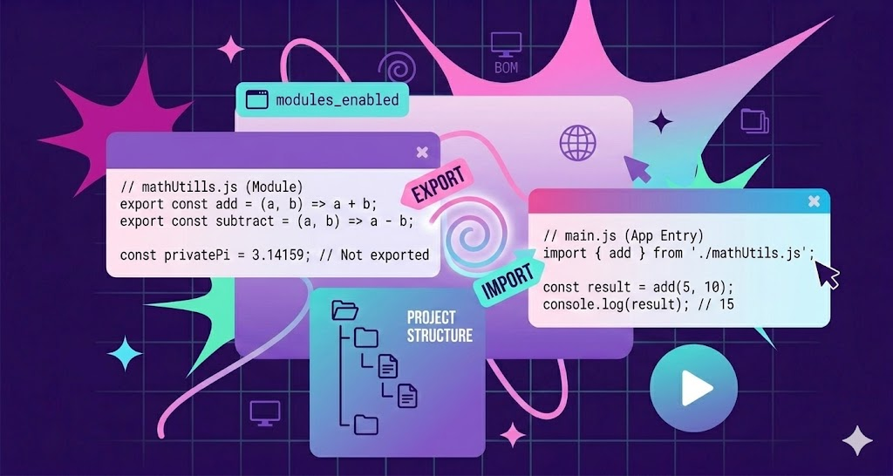

# Лекция 12. Модули в JavaScript: import/export, структура проекта, разделение кода



## Введение

В прошлых лекциях мы уже написали достаточно серьёзные вещи: работа с `DOM` и `BOM`, события, формы, асинхронность, `fetch`, `request()`, `UI`-состояния `loading / error / empty / success`. По мере написания кода мы видели, что он становится всё больше и больше, и его становится сложнее поддерживать.

Сначала это не проблема. Когда у вас 50-100 строк - всё выглядит нормально. Но как только появляется _“настоящее”_ приложение (пусть и учебное), в одном файле начинают жить разные куски логики:

- функции для работы с сетью (`fetch`, `request`, проверка `response.ok`);
- функции для интерфейса (`setStatus`, `renderPosts`, очистка списка);
- обработчики событий (кнопка _“Загрузить”_, форма создания поста, удаление по кнопке);
- вспомогательные функции (`wait`, форматирование и т.д.).

И вот здесь появляется проблема:

> **Код начинает смешиваться. Вы открываете файл и видите всё сразу: и сеть, и UI, и обработчики.**

Файл становится трудно читать, трудно поддерживать и легко случайно сломать. Вы добавили одну мелочь - и задели часть кода, которая вообще относится к другой задаче.

Это не вопрос **«красивого»** кода. Это вопрос **структуры**. Когда код структурирован, он становится более понятным, легче поддерживается и расширяется.

### Что с этим делать

Здесь возникает логичный вопрос:

> **Как правильно разнести код по файлам так, чтобы проект стал понятнее, но при этом всё продолжало работать?**

И именно для этого в `JavaScript` существуют модули.

Модули дают нам возможность:

- хранить разные части логики в отдельных файлах;
- явно указывать, что мы хотим использовать из другого файла;
- создавать более чистую и понятную структуру проекта.

**То есть вместо одного большого `main.js` мы получим набор файлов, связанных через `import/export`.**

## Что такое модуль в JavaScript

Когда мы говорим _“модуль”_, важно не представлять это как что-то отдельное от обычного кода. Модуль - это всё тот же JavaScript, но с одним принципиальным отличием:

> **модуль - это файл, у которого есть своя область видимости, и который может явно экспортировать и импортировать код.**

То есть модуль - это не просто _“ещё один файл”_. Это файл, который умеет:

- отдавать наружу функции, переменные, классы через `export`;
- получать нужные вещи из других файлов через `import`.

Почитать про модули можно [здесь](https://doka.guide/js/modules/).

### Чем модули отличаются от обычных скриптов

Когда вы подключаете обычный файл так:

```html
<script src="main.js"></script>
```

браузер загружает этот скрипт и выполняет его, а переменные и функции (если они объявлены в глобальной области) могут оказаться доступными _“везде”_. На маленьких проектах это выглядит удобно, но на больших быстро приводит к конфликтам: вы случайно переопределили переменную, назвали две функции одинаково, и начинаются странные ошибки.

С модулями идея другая: у каждого файла есть своя область видимости, и _“просто так”_ из файла наружу ничего не выходит.

### Как сделать файл модулем

Чтобы браузер понял, что файл является модулем, нужно подключить его так:

```html
<script type="module" src="main.js"></script>
```

Ключевой момент здесь - `type="module"`. Именно он говорит браузеру:

- этот файл можно использовать с `import/export`;
- у файла будет модульная область видимости;
- и браузер будет загружать импортируемые файлы как зависимости.

### Что меняется при `type="module"`

Когда в теге `<script>` указан `type="module"`, браузер включает для файла модульный режим. На практике это даёт три важных эффекта:

- у каждого модуля своя область видимости, без “засорения” глобального пространства;
- код модуля работает в строгом режиме (`"use strict"` по умолчанию);
- модульный скрипт выполняется после разбора HTML (по поведению похоже на `defer`).

> **“Теперь, когда браузер умеет работать с модулями, разберём главный механизм, который связывает файлы между собой: export и import.”**

## `export`: как “отдать” код из файла

Когда мы разбиваем проект на несколько файлов, появляется простая задача: у нас есть файл с полезными функциями, и мы хотим использовать их в другом файле.

Но модуль по умолчанию _“закрыт”_. Всё, что вы объявили внутри файла, остаётся внутри этого файла. Чтобы что-то стало доступно снаружи, это нужно **явно экспортировать**.

Для этого в JavaScript используется ключевое слово `export`.

---

### Именованный экспорт (named export)

Именованный экспорт - это когда вы экспортируете сущность под её именем.

Представим, что у нас есть файл `utils.js`, где лежат полезные функции:

```javascript
// utils.js
function formatTitle(title) {
  return title.trim().toUpperCase();
}

function wait(ms) {
  return new Promise((resolve) => setTimeout(resolve, ms));
}
```

Пока это просто функции внутри модуля. Другие файлы о них не знают. Чтобы сделать их доступными снаружи, мы добавляем `export`.

#### Способ 1: export прямо при объявлении

Это самый простой и самый часто используемый вариант:

```javascript
// utils.js
export function formatTitle(title) {
  return title.trim().toUpperCase();
}

export function wait(ms) {
  return new Promise((resolve) => setTimeout(resolve, ms));
}
```

Теперь `formatTitle` и `wait` экспортируются из файла `utils.js`.

#### Способ 2: экспорт в конце файла

Иногда удобнее объявить функции обычным образом, а экспорт сделать внизу, чтобы сразу видеть “что именно этот модуль отдаёт наружу”.

```javascript
// utils.js
function formatTitle(title) {
  return title.trim().toUpperCase();
}

function wait(ms) {
  return new Promise((resolve) => setTimeout(resolve, ms));
}

export { formatTitle, wait };
```

Смысл тот же самый, разница только в стиле оформления.

#### Экспорт переменных и констант

Экспортировать можно не только функции:

```javascript
// config.js
export const API_URL = "https://jsonplaceholder.typicode.com/posts";
export const LIMIT = 10;
```

#### Экспорт с переименованием

Иногда у вас есть имя внутри файла одно, а наружу вы хотите отдать другое (например, чтобы избежать конфликтов).

```javascript
// utils.js
function renderPosts(posts) {
  console.log(posts);
}

export { renderPosts as renderList };
```

Теперь снаружи этот экспорт будет называться `renderList`.

#### Экспорт по умолчанию (default export)

Кроме именованных экспортов, в JavaScript есть **экспорт по умолчанию** - `export default`.

Он используется в ситуациях, когда модуль _“в целом”_ отдаёт наружу одну главную сущность: одну функцию, один класс или один объект.

Главная идея такая:

> **в одном файле может быть только один `default export`.**

Допустим, файл отвечает только за одну задачу - например, форматирование текста:

```javascript
// formatTitle.js
export default function formatTitle(title) {
  return title.trim().toUpperCase();
}
```

Такой экспорт называется _“по умолчанию”_, потому что импортировать его можно без фигурных скобок.

**Пример: default export для класса**

Если файл содержит один основной класс, это тоже типичный кейс для default export:

```javascript
// ApiClient.js
export default class ApiClient {
  constructor(baseUrl) {
    this.baseUrl = baseUrl;
  }
}
```

**Пример: default export для объекта**

Если у вас есть файл, который просто хранит конфигурацию, можно экспортировать объект по умолчанию:

```javascript
// config.js
export default {
  API_URL: "https://jsonplaceholder.typicode.com",
  LIMIT: 10,
};
```

#### Что нужно помнить про `export`

- `export` делает сущность доступной для других файлов;
- именованный экспорт позволяет экспортировать несколько сущностей из одного файла;
- `export default` используется, когда файл отдаёт одну главную вещь;

## `import`: как “получить” код из другого файла

Выше мы разобрали, как отдать код из файла с помощью `export`. Но это только половина дела. Чтобы использовать эти функции, переменные или классы в другом файле, нам нужно **импортировать** их.

Для этого используется ключевое слово `import`.

### Базовый синтаксис `import`

Представим, что у нас есть файл `utils.js`:

```javascript
// utils.js
export function formatTitle(title) {
  return title.trim().toUpperCase();
}

export function wait(ms) {
  return new Promise((resolve) => setTimeout(resolve, ms));
}
```

Теперь в `main.js` мы можем _“взять”_ эти функции:

```javascript
// main.js
import { formatTitle, wait } from "./utils.js";

console.log(formatTitle("  hello  "));
wait(1000).then(() => console.log("Прошла 1 секунда"));
```

**Важно:**

1. Фигурные скобки `{}` используются для именованных импортов. Внутри них перечисляются имена экспортированных сущностей, которые мы хотим использовать.
2. В этом примере путь начинается с `./` - это означает “файл рядом с текущим файлом”.

### Почему в этом примере нужно указывать расширение `.js`

Очень важный момент: при импорте модулей в браузере в этом формате нужно указывать расширение `.js`. Это связано с тем, что браузер не может угадать, какой файл вы хотите импортировать, и требует точного указания.

```javascript
import { formatTitle } from "./utils.js"; // правильно
import { formatTitle } from "./utils"; // ошибка
```

### Импорт с переименованием

Иногда имя функции в модуле вам подходит, но в вашем файле оно конфликтует с другим именем. Тогда вы можете переименовать импорт:

```javascript
import { wait as delay } from "./utils.js";

delay(500).then(() => console.log("Задержка 0.5 сек"));
```

То есть `wait` внутри `utils.js` будет доступна как `delay` в вашем файле.

### Импорт всего модуля целиком

Иногда удобно импортировать весь модуль целиком, особенно если там много экспортов. Для этого используется `* as`:

```javascript
import * as utils from "./utils.js";

console.log(utils.formatTitle("  hi  "));
utils.wait(1000).then(() => console.log("OK"));
```

В этом случае все экспортированные сущности из `utils.js` будут доступны через объект `utils`.

> Не рекомендуется использовать `import * as` для больших модулей, так как это может привести к путанице и неочевидности, какие именно функции используются в вашем файле. Лучше импортировать только то, что нужно.

### Импорт по умолчанию (default import)

Если в модуле есть `export default`, то его можно импортировать без фигурных скобок:

Например, файл `config.js`:

```javascript
// config.js
export default {
  API_URL: "https://jsonplaceholder.typicode.com",
  LIMIT: 10,
};
```

Тогда в `main.js` мы можем импортировать его так:

```javascript
import config from "./config.js";
console.log(config.API_URL);
```

Здесь важно запомнить правило:

- `import { ... }` - для именованных экспортов
- `import something` - для `default export`

### Комбинированный импорт

Если в одном файле есть и именованные экспорты, и `default export`, то их можно импортировать вместе:

```javascript
// utils.js
export function formatTitle(title) {
  return title.trim().toUpperCase();
}

const config = {
  API_URL: "https://jsonplaceholder.typicode.com",
  LIMIT: 10,
};

export default config;
```

Пример импорта в `main.js`:

```javascript
import config, { formatTitle } from "./utils.js";
```

Такой синтаксис позволяет импортировать и `default export`, и именованные экспорты из одного файла одновременно.

## Структура проекта: как разделить код по файлам

Разделение кода на модули - это не только про синтаксис `import/export`. Это ещё и про **структуру проекта**. Когда у вас появляется несколько файлов, важно продумать структуру проекта. Хорошая структура помогает быстро ориентироваться в коде и понимать, где что лежит.

### Пример структуры проекта

Сделаем приближенную структуру к реальному проекту:

```text
project/
  index.html

  css/
    style.css

  js/
    main.js

    components/
      header.js
      footer.js
      main.js

    config/
      config.js

    utils/
      request.js
      wait.js
```

Подключим `css` и `js` в `index.html`:

```html
<link rel="stylesheet" href="./css/style.css" />
<script type="module" src="./js/main.js"></script>
```

Дальше в `main.js` мы будем импортировать нужные модули из папок `components`, `config` и `utils`.

Такой подход позволяет:

- логически разделить код по папкам (компоненты, утилиты, конфигурация);
- быстро находить нужные файлы;
- поддерживать чистоту и порядок в проекте.

> Часто структура `js` папки повторяет структуру компонентов в интерфейсе. Например, если у вас есть `Header`, `Footer` и `Main`, то логично создать папку `components` и положить туда соответствующие файлы. Это помогает сразу понять, где искать код, связанный с конкретной частью интерфейса. Аналогично со структурой папки `css` или `scss`.

### Практика: собираем страницу из модулей (Header / Main / Footer) и вставляем в #root

Сделаем базовый каркас страницы, который будет состоять из трёх основных компонентов: `Header`, `Main` и `Footer`. Каждый компонент будет жить в своём файле, и мы будем импортировать их в `main.js`, чтобы собрать страницу.

Для этого добавим в `index.html` элемент с id `root`, куда будем вставлять нашу страницу:

```html
<body>
  <div id="root"></div>
</body>
```

И проверим, что все нужные файлы подключены к `index.html`:

```html
<link rel="stylesheet" href="./css/style.css" />
<script type="module" src="./js/main.js"></script>
```

### Первый шаг: Компоненты

Будем заполнять наши файлы `header.js`, `main.js` и `footer.js` следующим образом:

**js/components/header.js**

```javascript
export function Header() {
  return `
    <header class="header">
      <h1>Мой проект на модулях</h1>
      <nav>
        <a href="#">Главная</a>
        <a href="#">Посты</a>
        <a href="#">Контакты</a>
      </nav>
    </header>
  `;
}
```

**js/components/main.js**

```javascript
export function Main() {
  return `
    <main class="main">
      <h2>Добро пожаловать!</h2>
      <p>Это пример страницы, собранной из модулей.</p>
    </main>
  `;
}
```

**js/components/footer.js**

```javascript
export function Footer() {
  const year = new Date().getFullYear();

  return `
    <footer class="footer">
      <p>&copy; ${year} Мой проект</p>
    </footer>
  `;
}
```

### Второй шаг: Собираем страницу в main.js

Теперь в `main.js` мы будем импортировать эти компоненты и вставлять их в `#root`:

```javascript
import { Header } from "./components/header.js";
import { Main } from "./components/main.js";
import { Footer } from "./components/footer.js";

const root = document.getElementById("root");

function App() {
  return `
    ${Header()}
    ${Main()}
    ${Footer()}
  `;
}

root.innerHTML = App();
```

Дальше можно добавить стили в `style.css`, чтобы страница выглядела более красиво:

```css
body {
  font-family: Arial, sans-serif;
  margin: 0;
  padding: 0;
}

.header,
.footer {
  padding: 16px;
  background: #f3f3f3;
}

.main {
  padding: 16px;
}

nav a {
  margin-right: 12px;
  text-decoration: none;
}
```

## Практика: мини SPA на модулях (ru/en/cs), события в отдельных файлах

Давайте усложним задачу и сделаем мини SPA (Single Page Application) с поддержкой трёх языков: русский, английский и чешский.

Суть в том, что у нас будет одна страница, которая может отображать контент на разных языках. И при этом мы будем держать логику переключения языков в отдельном файле, чтобы не смешивать её с остальной частью приложения.

На самом деле, это не полноценное SPA, так как мы не будем использовать роутинг и не будем менять URL. Но идея в том, что у нас будет одна страница, которая может динамически менять своё содержимое в зависимости от выбранного языка.

---

## Структура проекта

```text
project/
  index.html

  css/
    style.css

  js/
    app.js
    main.js
    render.js

    components/
      header.js
      main.js
      footer.js

    handlers/
      lang.js

    i18n/
      ru.js
      en.js
      cs.js
      index.js

    services/
      langStorage.js
```

### HTML 

```html
<!DOCTYPE html>
<html lang="ru">
<head>
  <meta charset="UTF-8" />
  <meta name="viewport" content="width=device-width, initial-scale=1.0" />
  <title>Lecture 12 - Modules i18n</title>
  <link rel="stylesheet" href="./css/style.css" />
</head>
<body>
  <div id="root"></div>

  <script type="module" src="./js/main.js"></script>
</body>
</html>
```

### Минимальный CSS

```css
body {
  font-family: Arial, sans-serif;
  margin: 0;
}

.header, .footer {
  padding: 16px;
  background: #f3f3f3;
}

.main {
  padding: 16px;
}

.langs__btn {
  margin-right: 8px;
}

[data-active="1"] {
  font-weight: bold;
}
```

### js/services/langStorage.js
Этот файл отвечает только за сохранение и получение языка из localStorage.

```javascript
const STORAGE_KEY = "lang";

export function getSavedLang(defaultLang = "ru") {
  const lang = localStorage.getItem(STORAGE_KEY);
  if (lang === "ru" || lang === "en" || lang === "cs") return lang;
  return defaultLang;
}

export function saveLang(lang) {
  localStorage.setItem(STORAGE_KEY, lang);
}
``` 

### Переводы как JS-модули

**js/i18n/ru.js**

```javascript
export default {
  app_title: "Мой сайт на модулях",
  main_title: "Добро пожаловать!",
  main_text: "Это пример одностраничного сайта с модулями и переводами.",
  footer_text: "Все права защищены"
};
```

**js/i18n/en.js**

```javascript
export default {
  app_title: "My Modular Site",
  main_title: "Welcome!",
  main_text: "This is an example of a single-page site with modules and translations.",
  footer_text: "All rights reserved"
};
```

**js/i18n/cs.js**

```javascript
export default {
  app_title: "Můj modulární web",
  main_title: "Vítejte!",
  main_text: "Toto je příklad jednostránkového webu s moduly a překlady.",
  footer_text: "Všechna práva vyhrazena"
};
```

**js/i18n/index.js**

Здесь мы объединяем все словари в один объект и делаем простую функцию `t(key)`, которая возвращает перевод по текущему языку.

```javascript
import ru from "./ru.js";
import en from "./en.js";
import cs from "./cs.js";

import { getSavedLang } from "../services/langStorage.js";

const translations = { ru, en, cs };

export function getCurrentLang() {
  return getSavedLang("ru");
}

export function t(key) {
  const lang = getCurrentLang();
  return translations[lang]?.[key] ?? `[[${key}]]`;
}
```

### Компоненты

**js/components/header.js**

```javascript
import { t, getCurrentLang } from "../i18n/index.js";

export function Header() {
  const lang = getCurrentLang();

  return `
    <header class="header">
      <h1>${t("app_title")}</h1>

      <div class="langs">
        <button class="langs__btn" data-lang="ru" ${lang === "ru" ? "data-active='1'" : ""}>RU</button>
        <button class="langs__btn" data-lang="en" ${lang === "en" ? "data-active='1'" : ""}>EN</button>
        <button class="langs__btn" data-lang="cs" ${lang === "cs" ? "data-active='1'" : ""}>CS</button>
      </div>
    </header>
  `;
}
```

**js/components/main.js**

```javascript
import { t } from "../i18n/index.js";

export function Main() {
  return `
    <main class="main">
      <h2>${t("main_title")}</h2>
      <p>${t("main_text")}</p>
    </main>
  `;
}
```

**js/components/footer.js**

```javascript
import { t } from "../i18n/index.js";

export function Footer() {
  const year = new Date().getFullYear();

  return `
    <footer class="footer">
      <p>© ${year} - ${t("footer_text")}</p>
    </footer>
  `;
}
```

### Сборка приложения

**js/app.js**

```javascript
import { Header } from "./components/header.js";
import { Main } from "./components/main.js";
import { Footer } from "./components/footer.js";

export function App() {
  return `
    ${Header()}
    ${Main()}
    ${Footer()}
  `;
}
```

**js/render.js**

```javascript
import { App } from "./app.js";

export function renderApp(root) {
  root.innerHTML = App();
}
```

### Обработчики кликов

**js/handlers/lang.js**
Здесь логика очень простая:
- пользователь нажал кнопку языка;
- мы сохранили язык в `localStorage`;
- перерисовали интерфейс

```javascript
import { saveLang } from "../services/langStorage.js";
import { renderApp } from "../render.js";

export function initLangHandlers(root) {
  root.addEventListener("click", (e) => {
    const btn = e.target.closest("[data-lang]");
    if (!btn) return;

    const lang = btn.dataset.lang;
    if (lang !== "ru" && lang !== "en" && lang !== "cs") return;

    saveLang(lang);
    renderApp(root);
  });
}
```

### Точка входа
**js/main.js**

`main.js` делает две вещи:
- рендерит приложение в `#root`;
- подключает обработчики кликов.

```javascript
import { renderApp } from "./render.js";
import { initLangHandlers } from "./handlers/lang.js";

const root = document.getElementById("root");

renderApp(root);
initLangHandlers(root);
```

### Что важно увидеть в этом примере

- Компоненты лежат в `components/` и отвечают только за `UI`.
- Обработчики лежат в `handlers/` и отвечают только за события.
- Переводы лежат в `i18n/` как обычные `JS`-модули.
- `LocalStorage` вынесен в `services/langStorage.js`.
- `main.js` - точка входа: минимум логики, только запуск приложения.

## Заключение

В этой лекции мы разобрали модули в `JavaScript` и наконец сделали то, что делает любой реальный проект: перестали складывать всё в один файл.

Теперь вы понимаете:
- что такое модуль и почему у него своя область видимости;
- как включить модульный режим через `type="module"`;
- как работает `export` (именованный и `export default`);
- как работает `import` и почему важны пути и расширение `.js`;
- как строить структуру проекта по папкам (`components`, `handlers`, `services`, `i18n`);
- как собирать страницу в `#root` из компонентов через `main.js`.

Главная мысль этой лекции:

> модули - это не про синтаксис, а про структуру и порядок в проекте.