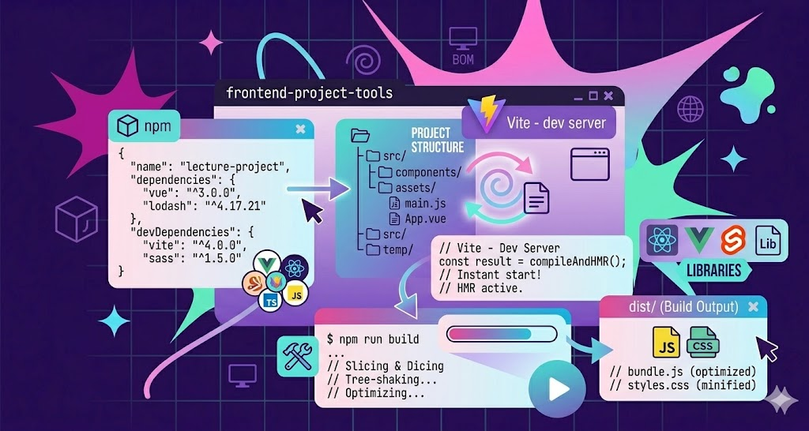
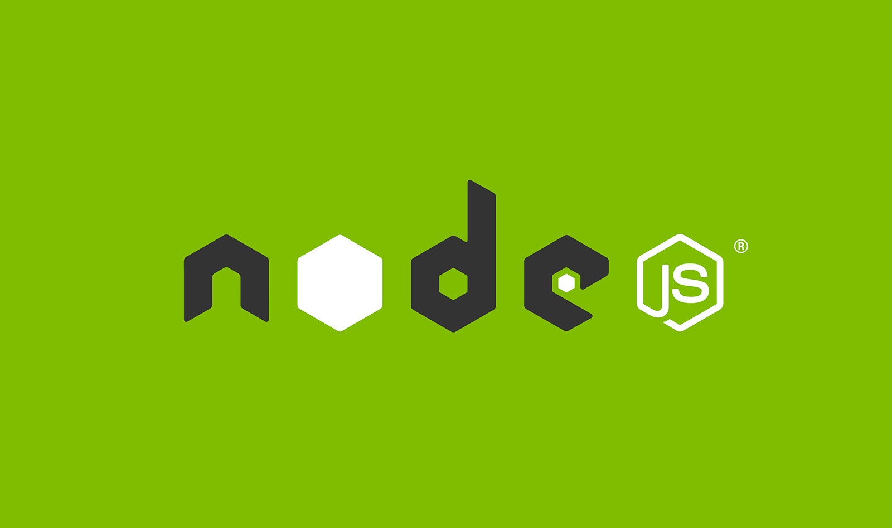
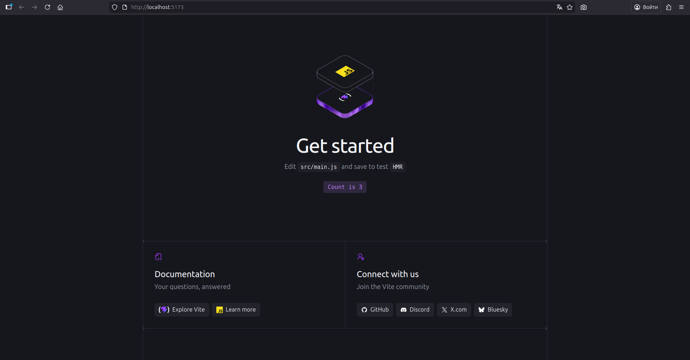

# Лекция 13. Tooling во frontend: npm, Vite, структура проекта, сборка и библиотеки



## Что такое tooling и зачем он нужен

На прошлых лекциях мы с вами постепенно собирали фундамент frontend-разработки.

Сначала мы изучали `HTML`, затем `CSS`, потом перешли к `JavaScript`. После этого начали разбирать уже более практические темы: работу с `DOM`, обработку событий, модули, запросы, разбиение кода на части.

То есть до этого момента мы в основном говорили именно о самом frontend-коде:

- как создать страницу;
- как оформить её стилями;
- как добавить поведение через `JavaScript`;
- как реагировать на действия пользователя;
- как разделять код по файлам;
- как импортировать функции и модули.

На начальном этапе этого действительно достаточно.

Например, у нас может быть очень простой проект:

- `index.html`
- `style.css`
- `script.js`

Мы подключаем стили и скрипт в `HTML`, открываем файл в браузере - и всё работает.

Для первых шагов это нормальный и правильный подход.  
Потому что пока проект маленький, нам важно не запутаться в лишних инструментах, а спокойно понять основу.

Но по мере роста проекта начинает появляться следующая проблема.

Проект становится больше.

Сначала в нём появляется не один `JavaScript`-файл, а несколько.  
Потом код разбивается на модули.  
Потом возникает необходимость подключить стороннюю библиотеку.  
Потом хочется, чтобы проект автоматически обновлялся в браузере после сохранения файла.  
Потом становится важно подготовить проект к публикации, а не просто открыть `index.html` двойным кликом.

И вот здесь старый подход начинает уже не помогать, а ограничивать.

### Где возникает проблема

Пока у вас маленький учебный пример, всё выглядит удобно. Есть страница. Есть стили. Есть скрипт. Открыли браузер - посмотрели результат.

Но как только проект становится больше, появляются новые задачи, которых раньше почти не было.

Например:

- файлов становится больше;
- структура папок становится сложнее;
- появляется код, разбитый на модули;
- нужно подключать внешние библиотеки;
- нужно запускать проект в более удобной среде;
- нужно готовить итоговую версию проекта для публикации.

И здесь важно понять одну мысль.

Проблема уже не в том, что вы не знаете `HTML` или `JavaScript`.  
Проблема в другом:

> проекту становится тесно в формате «просто открыли html-файл в браузере».

То есть сам `frontend` становится больше, а значит и среда, в которой вы его разрабатываете, тоже должна стать более удобной.

### Что меняется по мере роста проекта

Когда вы только начинаете изучать frontend, кажется, что браузера вполне достаточно.

И в каком-то смысле это правда:  
браузер действительно выполняет ваш `HTML`, применяет `CSS` и запускает `JavaScript`.

Но для разработки чего-то крупнее, чем один-два маленьких примера, одного браузера уже мало.

Нужны дополнительные вещи:

- удобно запускать проект;
- быстро видеть изменения;
- управлять зависимостями;
- поддерживать структуру проекта;
- собирать итоговую версию перед публикацией.

То есть появляется уже не просто код, а **инфраструктура вокруг кода**.

И именно здесь мы подходим к понятию `tooling`.

### Что такое tooling

`Tooling` - это набор инструментов, которые помогают разрабатывать проект.

Здесь очень важно не запутаться.

`Tooling` - это не новый язык. Это не замена `HTML`, `CSS` или `JavaScript`. Это не что-то отдельное от frontend.

Наоборот.

Сначала у нас есть основа:

- `HTML`
- `CSS`
- `JavaScript`

А потом поверх этой основы появляются инструменты, которые делают работу с проектом удобнее.

Если сказать совсем просто:

> **Tooling - это всё, что помогает frontend-разработчику работать с проектом.**

Например, `tooling` помогает:

- устанавливать библиотеки;
- запускать проект;
- автоматически обновлять страницу при изменениях;
- собирать production-версию;
- организовывать структуру проекта.

То есть `tooling` нужен не для того, чтобы «вместо нас писать интерфейс», а для того, чтобы сделать сам процесс разработки нормальным, современным и удобным.

### Почему без tooling становится неудобно

Давайте посмотрим на очень простой пример.

Представьте, что вы хотите подключить в проект внешнюю библиотеку.

Если проект маленький и учебный, иногда можно подключить её вручную через `<script>`.  
Но если библиотек становится несколько, если нужно следить за версиями, если проект хранится в репозитории, если его запускают на другом компьютере - такой подход быстро становится неудобным.

Или другой пример.

Пока у вас маленький файл, вы можете после каждого изменения вручную обновлять страницу. Но когда вы постоянно редактируете проект, такой способ начинает только тормозить работу.

Или ещё один пример.

Когда проект нужно выложить на сервер, уже недостаточно просто сказать:  
«вот у меня есть папка с исходниками».

Нужно понимать:

- какие файлы являются исходными;
- как они собираются;
- какая версия проекта должна попасть в итоговую папку для публикации.

Получается, что по мере роста проекта у `frontend`-разработчика появляются уже не только задачи по интерфейсу, но и задачи по **организации процесса разработки**.

И именно их решает `tooling`.

### Что именно мы будем изучать в этой лекции

В этой лекции нас будут интересовать не все возможные инструменты сразу, а самые базовые и самые важные для старта.

Мы разберём:

- что такое `Node.js` и зачем он нужен frontend-разработчику;
- что такое `npm`;
- как создать первый проект с `package.json`;
- как работать с `Vite`;
- как устроена структура проекта;
- что такое сборка;
- как подключать библиотеки через `npm`.

То есть в этой лекции мы переходим от вопроса:

> «Как написать frontend-код?»

к вопросу:

> «Как нормально организовать и запустить frontend-проект?»

И начать этот разговор нужно с `Node.js`, потому что именно он является основой для многих современных инструментов frontend-разработки.

## Node.js и зачем он нужен frontend-разработчику



Прежде чем переходить к `npm`, `Vite` и созданию первого современного frontend-проекта, нам нужно разобраться с ещё одной очень важной вещью - с `Node.js`.

У начинающих часто возникает путаница уже на этом этапе.

Когда вы только начинаете изучать `frontend`, у вас формируется довольно понятная картина:

- есть `HTML`, который создаёт структуру страницы;
- есть `CSS`, который отвечает за оформление;
- есть `JavaScript`, который добавляет логику и поведение;
- всё это работает в браузере.

И на первых этапах обучения это действительно так выглядит.

Мы подключаем `script.js` в `HTML`, открываем страницу в браузере и видим, что `JavaScript` выполняется именно там.  
Браузер читает наш код, обрабатывает его и выполняет те действия, которые мы описали: меняет текст, реагирует на события, отправляет запросы, показывает данные на странице.

Поэтому у многих студентов возникает логичный вопрос:

> Если `JavaScript` и так работает в браузере, тогда зачем нам ещё нужен `Node.js`?

Это очень правильный вопрос.

Чтобы ответить на него, нужно разделить две разные вещи:

1. `JavaScript` как язык, на котором мы пишем код;
2. среда, в которой этот код выполняется.

### JavaScript и среда выполнения

Сам по себе `JavaScript` - это язык программирования. Но любой язык должен где-то выполняться.

Например, наш frontend-код до этого момента выполнялся в браузере. Именно браузер был той средой, которая запускала `JavaScript` и давала нам доступ к `DOM`, событиям, `window`, `document`, `localStorage`, `fetch` и другим браузерным возможностям.

То есть браузер - это одна среда выполнения `JavaScript`. Но браузер - не единственное место, где можно запускать `JavaScript`.

Существует ещё `Node.js`.

### Что такое Node.js

`Node.js` - это среда выполнения, которая позволяет запускать `JavaScript` **вне браузера**. Вот это основная мысль, которую здесь нужно запомнить.

[Node.js](https://nodejs.org/en) даёт возможность выполнять `JavaScript` не внутри страницы, а отдельно - как обычную программу.

То есть если раньше вы воспринимали `JavaScript` только как язык для работы в браузере, то теперь нужно расширить это представление.

`JavaScript` может использоваться не только для интерфейса, но и для запуска различных инструментов, утилит, серверов и служебных процессов.

И именно здесь `Node.js` становится очень важным для frontend-разработчика.

### Зачем Node.js нужен именно во frontend

Здесь есть один очень важный момент.

Когда мы говорим про `Node.js` в рамках этой лекции, мы **не переходим в backend**. Мы не начинаем сейчас изучать серверы, базы данных или API на `Node.js`.

В рамках frontend-разработки `Node.js` нужен нам по другой причине.

Он нужен как основа для запуска инструментов разработки.

То есть важно разделять:

- **браузер** выполняет frontend-код, который работает на странице;
- **Node.js** запускает инструменты, которые помогают этот frontend разрабатывать.

Это принципиально важно.

Например, когда вы нажимаете кнопку на странице, работает код браузера. Когда вы устанавливаете пакет через `npm` или запускаете проект через `Vite`, работает уже `Node.js`. (Об этом мы поговорим чуть позже.)

То есть сам пользователь в браузере не взаимодействует с `Node.js` напрямую.
`Node.js` нужен прежде всего разработчику.

### Какие инструменты работают через Node.js

Очень многие современные инструменты frontend-разработки завязаны именно на `Node.js`.

Например:

- `npm`;
- `Vite`;
- форматтеры;
- тестовые утилиты;
- сборщики;
- dev-серверы;

Получается следующая картина.

Раньше у нас был только браузер и несколько файлов проекта.  Теперь между разработчиком и итоговым проектом появляется ещё один важный слой - инструменты.

А эти инструменты чаще всего работают именно через `Node.js`.

### Важно не перепутать роли браузера и Node.js

На этом этапе студенты часто начинают смешивать роли браузера и `Node.js`, поэтому здесь важно очень чётко разграничить их.

#### Что делает браузер

Браузер:

- отображает `HTML`;
- применяет `CSS`;
- выполняет клиентский `JavaScript`;
- даёт доступ к `DOM`;
- реагирует на действия пользователя;
- показывает интерфейс на экране.

Именно браузер отвечает за то, что пользователь видит и с чем взаимодействует.

#### Что делает Node.js

`Node.js`:

- запускает инструменты разработки;
- позволяет устанавливать зависимости;
- позволяет запускать dev-сервер;
- участвует в сборке проекта;
- помогает организовать процесс разработки.

То есть `Node.js` нужен не для того, чтобы “заменить браузер”, а для того, чтобы обеспечить разработчику современную рабочую среду.

### Почему без Node.js дальше будет сложно

До определённого этапа можно писать frontend и без `Node.js`.

Например, если вы делаете совсем маленький учебный пример, вам действительно может хватить просто `HTML`, `CSS`, `JS` и браузера.

Но как только вы захотите перейти к более современному и удобному формату работы, почти сразу возникнут ограничения.

Например:

- вы не сможете нормально использовать `npm`;
- вы не сможете создать проект через `Vite`;
- вы не сможете устанавливать пакеты привычным способом;
- вы не сможете запускать многие современные frontend-инструменты.

То есть без `Node.js` вам будет трудно перейти от небольших учебных файлов к нормальному рабочему проекту.

### Что нужно запомнить на этом этапе

На этом этапе вам не нужно глубоко изучать внутреннее устройство `Node.js`.

Сейчас для нас важна более практическая мысль:

> `Node.js` - это основа, на которой работают многие современные инструменты frontend-разработки.

Поэтому в рамках этой лекции мы воспринимаем `Node.js` не как тему про backend, а как обязательную часть современной frontend-среды.

Именно благодаря `Node.js` мы дальше сможем:

- использовать `npm`;
- создавать проекты через `Vite`;
- устанавливать библиотеки;
- запускать dev-сервер;
- собирать production-версию проекта.

## Установка Node.js и проверка окружения

Для того, чтобы начать работать с `Node.js`, нам нужно его установить.

### Как установить Node.js

На **windows**:

1. Перейдите на [официальный сайт Node.js](https://nodejs.org/en).
2. Вы увидите две версии: LTS (Long Term Support) и Current. Рекомендуется выбирать LTS, так как она более стабильная и поддерживается дольше.
3. Нажмите на кнопку для скачивания LTS-версии.
4. Запустите скачанный установщик и следуйте инструкциям на экране.

На **macOS**:

1. Перейдите на [официальный сайт Node.js](https://nodejs.org/en).
2. Выберите LTS-версию и скачайте её.
3. Запустите установщик и следуйте инструкциям. 

Либо можно установить `Node.js` через менеджер пакетов `Homebrew`:

```bash
brew install node
```

На **Linux**:
1. Откройте терминал.
2. Введите следующую команду для установки `Node.js` через менеджер пакетов `apt` (для Debian/Ubuntu):

```bash
sudo apt update
sudo apt install nodejs npm
```

После установки `Node.js` вместе с ним обычно устанавливается и `npm`.

### Как проверить, что Node.js установлен

После установки важно убедиться, что `Node.js` и `npm` действительно установлены и работают.

Для этого нужно открыть терминал. В зависимости от вашей операционной системы это может быть:
- **Windows**: PowerShell, Command Prompt или `git bash` (ставится вместе с Git);
- **macOS**: Terminal;
- **Linux**: Terminal.

В терминале введите следующие команды:

```bash
node -v
```

Эта команда покажет установленную версию `Node.js`. Если вы видите номер версии, значит `Node.js` установлен правильно.

```bash
npm -v
```

Эта команда покажет установленную версию `npm`. Если вы видите номер версии, значит `npm` тоже установлен правильно.

Если обе команды отработали без ошибок и показали версии, значит вы успешно установили `Node.js` и `npm`, и теперь готовы использовать их для разработки frontend-проектов.

### Что делать, если команды не работают

Если после установки `Node.js` и `npm` команды `node -v` и `npm -v` не работают, это может означать, что:
- `Node.js` не был установлен правильно;
- переменные окружения не настроены, и терминал не может найти исполняемые файлы `node` и `npm`.

В этом случае рекомендуется:
1. Перезагрузить компьютер, чтобы обновить переменные окружения.
2. Если проблема сохраняется, попробуйте переустановить `Node.js`, внимательно следуя инструкциям.
3. Убедитесь, что вы используете терминал, который поддерживает `Node.js` (например, `PowerShell` или `git bash` на `Windows`).
4. Если проблема всё ещё не решена, можно обратиться к официальной документации или сообществу разработчиков для получения помощи.

### Почему терминал становится важной частью frontend-разработки

До этого момента вы чаще всего работали через браузер и редактор кода. Но начиная с этой лекции появляется ещё один постоянный инструмент - терминал.

Именно через него дальше будут выполняться основные команды проекта:
- установка зависимостей;
- запуск dev-сервера;
- сборка проекта;
- управление версиями.

Поэтому важно привыкать к терминалу и понимать, что он - не просто «чёрное окно», а мощный инструмент для управления вашим проектом.

## Что такое npm

После `Node.js` мы переходим к следующему важному инструменту - `npm`.

Очень часто `Node.js` и `npm` упоминаются вместе, поэтому у начинающих может возникнуть ощущение, что это одно и то же. Но это не так.

Важно сразу разделить:

- `Node.js` - это среда выполнения `JavaScript` вне браузера;
- `npm` - это пакетный менеджер, который обычно устанавливается вместе с `Node.js`.

То есть `Node.js` запускает среду для работы инструментов, а `npm` помогает управлять пакетами и командами проекта.

### Зачем нужен npm

Когда проект становится больше, в нём появляются внешние зависимости.

Например, может понадобиться библиотека:

- для HTTP-запросов;
- для работы с датами;
- для анимаций;
- для уведомлений;
- для слайдеров.

Конечно, небольшие библиотеки иногда можно подключить вручную. Но если проект развивается, такой подход быстро становится неудобным.

Начинаются типичные проблемы:

- библиотек становится больше;
- трудно следить за версиями;
- непонятно, какие зависимости использует проект;
- неудобно переносить проект на другой компьютер.

Именно здесь и нужен `npm`.

### Что делает npm

С помощью `npm` можно:

- устанавливать пакеты;
- удалять пакеты;
- обновлять зависимости;
- хранить информацию о зависимостях проекта;
- запускать команды проекта.

То есть `npm` нужен не только для установки библиотек, но и вообще для управления проектом.

### Что такое пакет

Пакет - это готовый набор кода, который можно подключить и использовать в проекте.

Пакетом может быть:

- библиотека;
- утилита;
- инструмент сборки;
- линтер;
- вспомогательный модуль.

То есть пакет - это не обязательно что-то, что влияет только на интерфейс.  
Пакетом может быть и инструмент, который нужен только в процессе разработки.

### Почему npm стал стандартом

Пока проект маленький, можно обойтись и без `npm`.

Но как только проект становится серьёзнее, появляется необходимость:

- управлять зависимостями;
- фиксировать версии;
- быстро устанавливать всё окружение на другом компьютере;
- запускать команды проекта.

Поэтому `npm` стал стандартной частью современной frontend-разработки.

### Что важно запомнить

На этом этапе нужно зафиксировать простую мысль:

- `Node.js` - это среда выполнения;
- `npm` - это пакетный менеджер.

Они связаны между собой, но задачи у них разные.

## Первый npm-проект: создаём `package.json`

Прежде чем переходить к `Vite`, полезно один раз руками увидеть, как вообще начинается `npm`-проект.

Это важный момент, потому что у начинающих часто возникает ощущение, что проект "появляется сам" после одной команды.  
На самом деле в основе любого такого проекта лежит обычный файл конфигурации, который называется `package.json`.

Именно с него и начинается работа с `npm`.

### Шаг 1. Создаём папку проекта

Для начала создадим отдельную папку для простого учебного проекта.

```bash
mkdir my-first-npm-project
cd my-first-npm-project
```

Первая команда создаёт папку проекта, а вторая сразу переводит нас внутрь неё.

### Шаг 2. Инициализируем npm-проект

Теперь выполним команду:

```bash
npm init -y
```

Эта команда создаёт в текущей папке файл `package.json`.

Флаг `-y` нужен для того, чтобы автоматически заполнить все поля в `package.json` стандартными значениями.

После выполнения команды в папке появится файл `package.json` со следующим содержимым:

```json
{
  "name": "my-first-npm-project",
  "version": "1.0.0",
  "description": "",
  "main": "index.js",
  "scripts": {
    "test": "echo \"Error: no test specified\" && exit 1"
  },
  "keywords": [],
  "author": "",
  "license": "ISC"
}
```

#### Что такое package.json

`package.json` - это основной конфигурационный файл npm-проекта.

Можно сказать, что `package.json` - это "паспорт" вашего проекта. В нём хранится вся важная информация о проекте:
- название;
- версия;
- описание;
- точка входа;
- скрипты;
- ключевые слова;
- автор;
- лицензия;
- зависимости.

После команды `npm init -y` у вас уже есть базовый `package.json`, который можно дальше редактировать и дополнять по мере развития проекта.

Например, он может выглядеть так:

```json
{
  "name": "lesson13",
  "version": "1.0.0",
  "description": "",
  "main": "index.js",
  "scripts": {
    "test": "echo \"Error: no test specified\" && exit 1"
  },
  "keywords": [],
  "author": "",
  "license": "ISC"
}
```

Что означают эти поля

- `name` - имя проекта;
- `version` - текущая версия проекта;
- `description` - краткое описание проекта;
- `main` - основной файл проекта;
- `scripts` - команды, которые можно запускать через npm;
- `keywords` - ключевые слова для описания проекта;
- `author` - автор проекта;
- `license` - лицензия проекта.

#### Что такое scripts

Поле `scripts` содержит команды, которые можно запускать через npm.

Например, сейчас в `package.json` у нас есть такой скрипт:

```json
"scripts": {
  "test": "echo \"Error: no test specified\" && exit 1"
}
```

Это означает, что команду `test` можно запустить так:

```bash
npm run test
```

Позже в реальных проектах здесь появятся и другие команды, например:

- запуск проекта - `start`;
- сборка проекта - `build`;
- запуск тестов - `test`;
- preview проекта - `preview`;
- и т.д.

То есть `scripts` - это способ организовать команды проекта и запускать их через `npm`.

### Почему мы разбираем это перед Vite

Может возникнуть вопрос: зачем вообще отдельно создавать такой простой `npm`-проект, если дальше мы всё равно будем использовать `Vite`?

Потому что важно сначала понять основу.

Когда вы позже создадите проект через `Vite`, внутри него всё равно будет находиться тот же самый `package.json`.

Разница только в том, что `Vite` создаст проект уже с готовой структурой и заранее настроенными командами.

Но если вы заранее понимаете, что такое `package.json` и зачем он нужен, то и работа с `Vite` будет восприниматься намного понятнее.

## `Vite`: первый реальный проект

После того, как мы разобрались с `Node.js` и `npm`, можно переходить к созданию первого реального проекта с помощью `Vite`.

### Что такое Vite

`Vite` - это современный инструмент для разработки frontend-проектов.

Он помогает решить сразу несколько задач:

- быстро создать проект;
- запустить локальный dev-сервер;
- автоматически обновлять страницу при изменениях;
- собрать итоговую production-версию проекта.

То есть `Vite` нужен не для того, чтобы заменить `HTML`, `CSS` или `JavaScript`, а для того, чтобы дать нам нормальную рабочую среду. Официальный сайт: [https://vitejs.dev/](https://vitejs.dev/)

### Создаём первый проект

Теперь, когда мы понимаем, зачем нужен `Vite`, можно перейти к практике и создать первый проект.

Для этого откроем терминал и выполним команду:

```bash
npm create vite@latest
```

После запуска этой команды `Vite` начнёт пошагово задавать вопросы для создания нового проекта.

Обычно вы увидите примерно такую последовательность:

1. **Project name**: Здесь нужно ввести имя папки, в которой будет создан проект.
2. **Select a framework**: здесь нужно выбрать основу или шаблон проекта
3. **Select a variant**: Здесь нужно выбрать вариант для выбранного фреймворка.
4. **Install with npm and start now?** - установить зависимости и сразу запустить проект или нет.

Наши настройки будут выглядеть так:
```bash
Project name: my-vite-project
Select a framework: Vanilla
Select a variant: JavaScript
Install with npm and start now? Yes
```

Здесь важно отдельно пояснить каждый выбор.

- *Project name* - это имя папки проекта;
- *Vanilla* - означает, что мы не используем дополнительный framework и работаем на чистом JavaScript;
- *JavaScript* - выбираем обычный `JavaScript`, а не `TypeScript`;
- *Yes* на последнем шаге означает, что `Vite` сразу выполнит установку зависимостей и запустит проект.

После этого `Vite` создаст папку проекта со всеми необходимыми файлами, установит зависимости и сразу поднимет `dev`-сервер.

Если вы выберете `No`, это тоже нормально.
Просто тогда следующие шаги нужно будет выполнить вручную:

```bash
cd my-vite-project
npm install
npm run dev
```

В результате у вас появится готовый `frontend`-проект, который уже можно открыть в браузере и использовать для дальнейшей работы.



> Обратите внимание с какого URL открывает проект `Vite`. Обычно это `http://localhost:5173/`, но может быть и другой порт, если 5173 уже занят. Важно запомнить этот адрес, потому что именно по нему вы будете открывать свой проект в браузере.

## Структура проекта `Vite`

После создания проекта через `Vite` внутри папки вы увидите примерно такую структуру:

```bash
my-vite-project/
├── node_modules/
├── public/
├── src/
├── .gitignore
├── index.html
├── package-lock.json
├── package.json
└── vite.config.js
```

В зависимости от версии `Vite` и выбранного шаблона структура может немного отличаться.
Например, где-то может быть файл vite.config.js, а где-то его может не быть сразу. Это нормально.

Главное сейчас - понять назначение основных частей проекта.

### Папка node_modules

Одна из первых папок, которая бросается в глаза, - это `node_modules`. Именно сюда устанавливаются все зависимости проекта.

Когда вы устанавливаете пакет через `npm`, он попадает именно в эту папку.

На этом этапе важно запомнить две вещи:
1. `node_modules` создаётся автоматически;
2. вручную редактировать её не нужно.

То есть это не та папка, в которой вы будете писать свой код.

Это служебная папка, где хранятся библиотеки и зависимости, необходимые для работы проекта.

Главное правило:
> **Папку node_modules не нужно трогать руками. И она должна быть добавлена в `.gitignore`, чтобы не попадать в репозиторий.**

### Папка src

Папка `src` - одна из самых важных в проекте. Здесь происходит вся основная разработка.

Внутри этой папки вы будете размещать:
- свои `JavaScript`-файлы;
- свои `CSS`-файлы;
- модули;
- компоненты интерфейса.

Если говорить простыми словами, папка `src` - это место, где живёт весь ваш исходный код.

### Папка public

Папка `public` предназначена для статических файлов, которые нужно отдать в проект почти без обработки.

Например, сюда можно положить:
- иконки;
- изображения;
- файлы, к которым нужен прямой доступ;
- другие публичные ресурсы.

На начальном этапе можно запомнить простую мысль:

- `src` - это основная рабочая зона проекта;
- `public` - это папка для статических файлов.

### Файл index.html

Файл `index.html` - это точка входа в ваш проект. Именно `index.html` остаётся основной HTML-точкой входа в проект.

Через него браузер получает начальную структуру страницы и подключает основной JavaScript-модуль.

То есть `index.html` - это не просто шаблон, а реальный файл, который используется в процессе разработки и публикации проекта.

### Файл package.json

Файл package.json мы уже видели в предыдущем блоке. Он создаётся при инициализации `npm`-проекта и содержит всю важную информацию о проекте, его зависимостях и командах.

Если мы откроем его сейчас, то увидим уже более сложный `package.json`, который был создан `Vite`:

```json
{
  "name": "my-vite-project",
  "version": "0.0.0",
  "private": true,
  "type": "module",
  "scripts": {
    "dev": "vite",
    "build": "vite build",
    "preview": "vite preview"
  },
  "devDependencies": {
    "vite": "^8.0.1"
  }
}
```

в `scripts` уже есть команды:
- `dev` - для запуска dev-сервера;
- `build` - для сборки проекта;
- `preview` - для просмотра собранной версии.

То есть `package.json` отвечает не за содержимое интерфейса, а за конфигурацию и управление проектом.

### Файл package-lock.json
Рядом с `package.json` обычно появляется ещё один файл - `package-lock.json`.

На начальном этапе он может выглядеть непонятно, но его задача довольно практическая.

`package-lock.json` фиксирует точные версии установленных зависимостей.

Это важно для того, чтобы проект устанавливался одинаково на разных компьютерах и у разных разработчиков.

То есть:
- `package.json` говорит, какие зависимости нужны;
- `package-lock.json` фиксирует, какие версии этих зависимостей были установлены.

На этом этапе не нужно разбирать его глубоко.
Достаточно понимать, что этот файл создаётся автоматически и помогает сохранять стабильность проекта.

### Файл vite.config.js

Иногда в проекте можно увидеть файл `vite.config.js`.

Это файл конфигурации `Vite`.

На начальном этапе он может быть либо очень простым, либо вообще отсутствовать - в зависимости от версии и шаблона проекта.

Когда проект становится сложнее, именно через этот файл можно настраивать поведение `Vite`.

Но в начале обучения не нужно пытаться сразу глубоко изучать его содержимое.

Сейчас нам достаточно понимать, что это файл настроек самого инструмента сборки и разработки.

### Что для нас самое важное на старте

Если посмотреть на всю структуру проекта целиком, то у начинающего может возникнуть ощущение, что файлов слишком много.

Но на практике на старте нас больше всего интересуют вот эти части:

- `src/` - здесь находится основной код проекта;
- `index.html` - основная HTML-точка входа;
- `package.json` - конфигурация, зависимости и команды;
- `public/` - статические файлы.

Именно с этими частями вы будете работать чаще всего.

Остальные файлы и папки тоже важны, но пока они играют скорее вспомогательную роль.

> В дальнейшем, по мере роста проекта, вы будете всё больше взаимодействовать с `package.json` и `vite.config.js`, а папка `node_modules` будет расти и обновляться автоматически при установке новых пакетов. Но на начальном этапе главное - не запутаться в структуре и понять, где находится основной код и как он организован.

## Режим разработки в `Vite`: `npm run dev`

После того, как проект создан, возникает следующий важный вопрос:

как теперь его правильно запускать во время разработки?

Если раньше в маленьких учебных примерах нам было достаточно просто открыть `index.html` в браузере, то в случае с проектом на `Vite` подход уже немного меняется.

Теперь проект запускается через специальную команду:

```bash
npm run dev
```

Именно она включает режим разработки.

### Что делает команда `npm run dev`

Команда `npm run dev` запускает `dev`-сервер проекта.

Проще говоря, `Vite` поднимает локальную среду разработки, в которой ваш проект начинает работать не как просто набор файлов, а как настоящее приложение, обслуживаемое специальным сервером.

После запуска команды в терминале обычно появляется локальный адрес, например:

```bash
http://localhost:5173/
```

Именно этот адрес нужно открыть в браузере, чтобы увидеть проект.

Если порт `5173` уже занят, `Vite` может использовать другой порт.
Это нормально.

### Почему уже нельзя просто открыть index.html

У начинающих здесь часто возникает логичный вопрос:

> Если в проекте всё ещё есть index.html, почему нельзя просто открыть его напрямую через браузер?

Технически файл `index.html` никуда не исчез. Но теперь проект уже работает не так, как раньше.

Внутри него есть:

- модули;
- зависимости;
- `dev`-сервер;
- логика сборки;
- служебная обработка файлов.

Поэтому для корректной работы проект должен запускаться именно через `Vite`.

То есть теперь недостаточно просто открыть `HTML`-файл двойным кликом. Нужно запустить среду разработки, которая правильно обслуживает проект.

### Что даёт dev-сервер

`Dev`-сервер нужен не только для того, чтобы открыть проект по адресу `localhost`.

Он даёт сразу несколько важных преимуществ:

- корректный запуск проекта в современной среде;
- работу с модулями и зависимостями;
- автоматическое обновление страницы при изменениях;
- удобную локальную разработку.

То есть `dev`-сервер делает процесс работы с проектом намного комфортнее, чем обычное открытие `HTML`-файла вручную.

### Как выглядит типичный процесс работы

После этого ваша работа с проектом обычно выглядит так:

1. вы открываете проект в редакторе кода;
2. запускаете в терминале команду npm run dev;
3. открываете адрес, который покажет Vite;
4. начинаете редактировать файлы проекта;
5. сразу видите изменения в браузере.

Именно так и работает обычный режим разработки в современных `frontend`-проектах.

## Автоматическое обновление страницы и HMR

Одно из самых удобных преимуществ `Vite` во время разработки - это автоматическое обновление проекта в браузере.

Когда вы меняете файл и сохраняете его, `Vite` старается сразу показать результат без ручной перезагрузки страницы.

Это делает процесс разработки намного быстрее и удобнее.

### Что такое HMR

`HMR` расшифровывается как `Hot Module Replacement`.

Это механизм, который позволяет обновлять изменённые части проекта без полной перезагрузки всей страницы.

Проще говоря, если вы изменили какой-то файл, `Vite` может подставить только это изменение, а не перезапускать всё приложение целиком.

### Почему это удобно

Без такого механизма вам приходилось бы постоянно:

- сохранять файл;
- вручную обновлять страницу;
- снова доходить до нужного состояния интерфейса.

С `HMR` работа становится намного комфортнее, потому что изменения появляются почти сразу.

Именно поэтому современная среда разработки ощущается заметно удобнее, чем обычная работа с отдельными `HTML`-файлами.

## Приводим проект к рабочей структуре

После создания проекта `Vite` мы получили стартовый шаблон.  
Он нужен для того, чтобы быстро проверить, что проект запускается и среда работает правильно.

Но в реальной разработке такой шаблон почти всегда сразу приводят в более удобный вид.

Почему?

Потому что стартовый проект содержит демонстрационный код, который нужен только для знакомства с `Vite`, но не нужен для нашего собственного приложения.

Поэтому следующим шагом мы сделаем то, что обычно делают в начале работы над проектом:

- удалим лишние файлы;
- очистим стартовый код;
- организуем структуру папки `src`;
- создадим отдельные части страницы;
- подключим стили;
- добавим первый собственный контент.

### Удаляем лишнее из стартового шаблона

На этом этапе нам не нужен демонстрационный код, который `Vite` создал по умолчанию.

Поэтому сначала можно удалить лишние файлы, например:

- `counter.js`;
- стартовые изображения, если они есть;
- другие демонстрационные ресурсы шаблона.

После этого нужно открыть файл `main.js` и удалить из него стартовый код, который был создан автоматически.

То же самое стоит сделать и с файлом `style.css`.

По умолчанию в нём уже находятся демонстрационные стили шаблона `Vite`, но для нашего проекта они не нужны.

Поэтому на этом этапе мы:

- удаляем лишние файлы;
- очищаем содержимое `main.js`;
- очищаем содержимое `style.css`.

После этого у нас останется чистая база, на которой уже можно собирать собственную структуру проекта.

### Организуем структуру папки `src`

Теперь, когда стартовый шаблон очищен, можно привести папку `src` к более понятной и рабочей структуре.

На маленьком примере можно держать весь код в одном-двух файлах.
Но как только проект начинает расти, такой подход быстро становится неудобным.

Поэтому уже на старте полезно приучать себя к аккуратной организации проекта.

Внутри `src` создадим такую структуру:

```bash
src/
├── components/
│   ├── Header/
│   │   ├── Header.js
│   │   └── Header.scss
│   ├── Main/
│   │   ├── Main.js
│   │   └── Main.scss
│   └── Footer/
│       ├── Footer.js
│       └── Footer.scss
├── utils/
│   └── helpers.js
├── styles/
│   └── global.scss
└── main.js
```

Давайте разберём, зачем нужна такая структура.
- `components` - здесь будут находиться отдельные части интерфейса;
- `Header` - отвечает за верхнюю часть страницы;
- `Main` - отвечает за основное содержимое страницы;
- `Footer` - отвечает за нижнюю часть страницы;
- `utils` - здесь можно хранить вспомогательные функции;
- `styles` - папка для общих глобальных стилей;
- `main.js` - точка входа, с которой начинается запуск проекта.

Такой подход помогает сразу приучаться к порядку.

Если позже проект станет больше, вам не придётся искать всё в одном файле, потому что структура уже будет разделена по смыслу.

### Что мы будем делать дальше

Если в проекте вырешили использовать `SCSS`, то для него нужно установить поддержку через npm:

```bash
npm install -D sass
```

Здесь важно понять одну вещь:

`SCSS` не работает сам по себе только потому, что мы создали файл с таким расширением. Чтобы `Vite` смог обработать такие стили, ему нужен установленный пакет `sass`.

Именно поэтому этот шаг обязателен.

Теперь когда у нас есть поддержка `SCSS`, можно создавать файлы стилей для каждого компонента и подключать их внутри этих компонентов.

### Добавляем `index.js` в папки компонентов

Чтобы структура проекта была более аккуратной, добавим файл `index.js` не только в каждую папку компонента, но и в саму папку `components`.

Это даст нам более удобную систему экспортов.

В результате структура будет такой:

```bash
src/
├── components/
│   ├── Header/
│   │   ├── Header.js
│   │   ├── Header.scss
│   │   └── index.js
│   ├── Main/
│   │   ├── Main.js
│   │   ├── Main.scss
│   │   └── index.js
│   ├── Footer/
│   │   ├── Footer.js
│   │   ├── Footer.scss
│   │   └── index.js
│   └── index.js
├── utils/
│   └── helpers.js
├── styles/
│   └── global.scss
└── main.js
```

Теперь:
- каждый компонент экспортируется через свой `index.js`;
- папка `components` собирает все экспорты в одном месте;
- в `main.js` можно делать короткий и удобный импорт.

### Создаём файлы компонентов и настраиваем экспорты через `index.js`

Теперь, когда структура папок готова, можно переходить к следующему шагу - создать файлы компонентов и настроить удобную систему экспортов.

Наша задача состоит в том, чтобы:

- создать отдельные файлы для `Header`, `Main` и `Footer`;
- рядом с каждым компонентом создать свой файл стилей;
- добавить `index.js` в каждую папку компонента;
- добавить общий `index.js` в папку `components`.

Такой подход делает структуру проекта чище и позволяет писать более аккуратные импорты.

В итоге папка `src` будет выглядеть так:

```bash
src/
├── components/
│   ├── Header/
│   │   ├── Header.js
│   │   ├── Header.scss
│   │   └── index.js
│   ├── Main/
│   │   ├── Main.js
│   │   ├── Main.scss
│   │   └── index.js
│   ├── Footer/
│   │   ├── Footer.js
│   │   ├── Footer.scss
│   │   └── index.js
│   └── index.js
├── utils/
│   └── helpers.js
├── styles/
│   └── global.scss
└── main.js
```

#### Создаём компонент Header

В папке `src/components/Header/` создадим файл `Header.js`:

```javascript
const links = [
  { name: 'Главная', href: '#' },
  { name: 'О нас', href: '#' },
  { name: 'Контакты', href: '#' },
];

export function Header() {
  return `
    <header class="header">
      <div class="container">
        <div class="header__inner">
          <a href="#" class="logo">MySite</a>
          <nav class="nav">
            ${links.map(link => `<a href="${link.href}" class="nav__link">${link.name}</a>`).join('')}
          </nav>
        </div>
      </div>
    </header>
  `;
}
```

Здесь мы создали простой компонент `Header`, который возвращает `HTML`-разметку для верхней части страницы.

Добавим стили для `Header` в файл `Header.scss`:

```scss
.header {
  padding: 20px 0;
  background-color: #111;
  color: #fff;

  .header__inner {
    display: flex;
    justify-content: space-between;
    align-items: center;
  }

  .logo {
    color: #fff;
    text-decoration: none;
    font-size: 24px;
    font-weight: 700;
  }

  .nav {
    display: flex;
    gap: 20px;
  }

  .nav__link {
    color: #fff;
    text-decoration: none;
    font-size: 16px;
  }
}
```

Экспортируем компонент через `index.js`:

```javascript
export { Header } from './Header';
import './Header.scss';
```

#### Создаём компонент Main

Теперь в папке `src/components/Main/` создадим файл `Main.js`:

```javascript
export function Main() {
  return `
    <main class="main">
      <div class="container">
        <section class="hero">
          <h1 class="hero__title">Мой первый проект на Vite</h1>
          <p class="hero__text">
            Мы уже не просто открываем HTML-файл в браузере, а работаем с полноценной frontend-средой.
          </p>
          <button class="hero__button">Подробнее</button>
        </section>
      </div>
    </main>
  `;
}
```

Добавим стили для `Main` в файл `Main.scss`:

```scss
.main {
  padding: 60px 0;
}

.hero {
  padding: 80px 20px;
  text-align: center;
  border-radius: 16px;
  background-color: #f5f5f5;
}

.hero__title {
  margin-bottom: 20px;
  font-size: 42px;
}

.hero__text {
  margin-bottom: 30px;
  font-size: 18px;
  color: #555;
}

.hero__button {
  padding: 12px 24px;
  border: none;
  border-radius: 8px;
  background-color: #111;
  color: #fff;
  cursor: pointer;
}
```

Экспортируем компонент через `index.js`:

```javascript
export { Main } from './Main';
import './Main.scss';
```

#### Создаём компонент Footer

Теперь в папке `src/components/Footer/` создадим файл `Footer.js`:

```javascript
export function Footer() {
  return `
    <footer class="footer">
      <div class="container">
        <p class="footer__text">© 2026 MySite. Все права защищены.</p>
      </div>
    </footer>
  `;
}
```

Добавим стили для `Footer` в файл `Footer.scss`:

```scss
.footer {
  padding: 20px 0;
  background-color: #111;
  color: #fff;
  text-align: center;
}

.footer__text {
  font-size: 14px;
}
```

И добавим в index.js:
```javascript
export { Footer } from './Footer';
import './Footer.scss';
```
### Экспортируем компоненты в общем index.js
Теперь, когда у нас есть три отдельных компонента, нужно добавить их экспорт в общий `index.js` внутри папки `components`.
```javascript
// src/components/index.js
export { Header } from './Header';
export { Main } from './Main';
export { Footer } from './Footer';
```

#### Зачем нужна такая система экспортов

На этом этапе может возникнуть вопрос: зачем мы добавляем столько файлов `index.js`, если можно было бы импортировать всё напрямую?

Потому что такой подход делает проект более аккуратным.

Например, без `index.js` импорт выглядел бы так:


```javascript
import { Header } from './components/Header/Header.js';
import { Main } from './components/Main/Main.js';
import { Footer } from './components/Footer/Footer.js';
```

А с такой структурой можно будет писать короче и чище:

```javascript
import { Header, Main, Footer } from './components';
```

Кроме того, стили каждого блока находятся рядом с самим блоком, а не лежат все вместе в одном большом файле. Это помогает быстрее ориентироваться в проекте и не запутаться в структуре.

### Подключаем глобальные стили

Теперь, когда структура компонентов готова, нужно добавить общие стили проекта.

Для этого в папке `src/styles/` создадим файл `global.scss`.

Именно в нём удобно хранить базовые стили, которые относятся не к одному конкретному блоку, а ко всей странице в целом.

Например, здесь можно задать:

- сброс базовых отступов;
- общие настройки для `body`;
- универсальный класс `.container`;
- базовые стили для ссылок, кнопок и других элементов.

Создадим такой файл:

```scss
* {
  margin: 0;
  padding: 0;
  box-sizing: border-box;
}

body {
  font-family: Arial, sans-serif;
  background-color: #f8f8f8;
  color: #222;
}

a {
  color: inherit;
  text-decoration: none;
}

button {
  font: inherit;
}

.container {
  width: 100%;
  max-width: 1200px;
  margin: 0 auto;
  padding: 0 15px;
}
```
Теперь этот файл нужно подключить в `main.js`, потому что именно `main.js` является точкой входа в проект.

Позже, когда мы соберём страницу через `Header`, `Main` и `Footer`, глобальные стили автоматически применятся ко всему приложению.

То есть логика здесь такая:

стили конкретного блока лежат рядом с самим блоком;
общие стили всего проекта выносятся в `global.scss`.

Такой подход помогает не смешивать локальные и глобальные стили в одном месте.

### Подключаем всё в `main.js` и собираем первую страницу

Теперь, когда у нас уже есть:

- компоненты `Header`, `Main` и `Footer`;
- локальные стили для каждого блока;
- глобальные стили в `global.scss`;

можно собрать первую страницу проекта.

Для этого откроем файл `main.js`, который находится в папке `src`.

Именно `main.js` является точкой входа в приложение.  
Это значит, что именно отсюда начинается запуск нашего кода и именно здесь мы будем собирать страницу из отдельных частей.

Содержимое файла `main.js` будет таким:

```javascript
import { Header, Main, Footer } from './components';
import './styles/global.scss';

const app = document.querySelector('#app');

app.innerHTML = `
  ${Header()}
  ${Main()}
  ${Footer()}
`;
```

Давайте разберём, что здесь происходит.

**Импортируем компоненты**

В первой строке мы импортируем все наши блоки:

```javascript
import { Header, Main, Footer } from './components';
```
Здесь мы используем удобную систему экспортов, которую настроили через `index.js` в папке `components`.

**Импортируем глобальные стили**
Затем мы импортируем глобальные стили:

```javascript
import './styles/global.scss';
```
Это нужно для того, чтобы базовые стили применились ко всему проекту.

Находим контейнер для вывода

Дальше мы получаем элемент `#app`:

```javascript
const app = document.querySelector('#app');
```

Этот элемент уже есть в `index.html`, и именно внутрь него мы будем вставлять содержимое нашей страницы.

Собираем страницу из частей

Затем мы записываем в `app.innerHTML` всю структуру страницы:

```javascript
app.innerHTML = `
  ${Header()}
  ${Main()}
  ${Footer()}
`;
```
Здесь происходит очень важная вещь.

Мы не пишем всю разметку в одном большом файле.
Вместо этого мы берём три отдельные функции:
```javascript
Header()
Main()
Footer()
```

Каждая из них возвращает свою `HTML`-разметку, а в `main.js` мы просто соединяем их вместе в одну страницу.

### Что важно понять на этом этапе

На данном этапе у нас уже появляется очень полезная привычка:

- не хранить всю страницу в одном файле;
- делить интерфейс на отдельные блоки;
- подключать стили по смыслу;
- собирать приложение из независимых частей.

Пока это ещё не `React`, не `Vue` и не какой-то другой framework.

Но сама идея уже очень близка к современному подходу:

- интерфейс делится на части;
- каждая часть отвечает за свой участок страницы;
- точка входа собирает всё вместе.

### Что мы получили в результате

После этого шага у нас уже есть первая полноценная страница проекта:

- с `Header`;
- с основным блоком `Main`;
- с `Footer`;
- с глобальными стилями;
- с локальными стилями каждого блока.

И самое главное - теперь это уже не демонстрационный шаблон `Vite`, а наш собственный проект с понятной структурой и первой собранной страницей.

### Проверяем результат в браузере

После всех изменений возвращаемся в браузер и смотрим результат.

Если `dev`-сервер всё ещё запущен через команду:

```bash
npm run dev
```

страница обновится автоматически после сохранения файлов.

Теперь вместо стандартного шаблона `Vite` у нас уже должна отображаться собственная страница с тремя основными блоками:

- `Header`;
- `Main`;
- `Footer`.

Это значит, что мы уже не просто используем готовый шаблон, а собираем свой собственный `frontend`-проект с понятной структурой.

## Сборка проекта: `npm run build`

До этого момента мы работали в режиме разработки.

Он удобен для того, чтобы:

- писать код;
- сразу видеть изменения в браузере;
- быстро проверять результат.

Но для публикации проекта используется уже другой режим - сборка.

Для этого в терминале выполняется команда:

```bash
npm run build
```

### Что делает команда `npm run build`

Команда `npm run build` собирает проект и подготавливает его к публикации.

После выполнения этой команды `Vite` создаёт отдельную папку с готовой версией проекта.

Обычно это папка: `dist/`

Именно в ней находится уже собранный проект, который можно размещать на сервере.

### Что важно понять

На этом этапе нужно разделять два режима:

- `npm run dev` - для разработки;
- `npm run build` - для подготовки проекта к публикации.

То есть во время разработки мы работаем с исходным кодом, а перед публикацией получаем отдельную готовую версию проекта.

### Почему это важно

Папка `src` содержит исходный код, с которым работает разработчик.

Но для сервера обычно нужна не папка `src`, а уже готовый собранный проект.

Именно поэтому перед публикацией выполняется сборка, а результат попадает в `dist`.

## Проверяем собранный проект: `npm run preview`

После сборки полезно проверить, как выглядит готовая версия проекта.

Для этого используется команда:

```bash
npm run preview
```

### Что делает эта команда

Команда `npm run preview` запускает локальный сервер для уже собранной версии проекта.

То есть в этом случае мы смотрим не режим разработки, а именно результат сборки.

После запуска команды в терминале снова появится локальный адрес, который можно открыть в браузере.

### Чем `preview` отличается от `dev`

Здесь важно не путать две команды:

- `npm run dev` - запускает проект в режиме разработки;
- `npm run preview` - показывает уже собранную версию проекта.

То есть `preview` нужен для того, чтобы перед публикацией убедиться, что собранный проект работает корректно.

## Подключаем библиотеку через `npm`

Одна из причин, почему современный `frontend` сложно представить без `npm`, - это удобное подключение внешних библиотек.

Раньше небольшие библиотеки иногда подключали вручную через `<script>`.  
Но в современном проекте чаще используют другой подход: библиотека устанавливается через `npm`, а затем импортируется в нужный файл.

### Устанавливаем библиотеку

Для примера подключим библиотеку `axios`, которая часто используется для HTTP-запросов.

В терминале выполним команду:

```bash
npm install axios
```

После этого `npm`:
- скачает библиотеку;
- добавит её в папку `node_modules`;
- запишет её в `package.json` в раздел зависимостей.

### Что изменится в package.json

После установки в `package.json` появится примерно такой блок:

```json
"dependencies": {
  "axios": "^1.12.2"
}
```

Это означает, что теперь библиотека стала частью проекта.

### Как использовать библиотеку в коде

После установки библиотеку можно импортировать в нужный файл.

Например:

```javascript
import axios from 'axios';
```

То есть логика теперь такая:

- устанавливаем пакет через `npm`;
- импортируем его в код;
- используем в проекте.

### Почему это удобно

Такой подход намного удобнее, чем ручное подключение файлов, потому что:

- все зависимости проекта хранятся в одном месте;
- видно, какие библиотеки использует проект;
- проект легко перенести на другой компьютер;
- нужные пакеты можно быстро установить командой `npm install`.

Именно поэтому `npm` стал стандартным способом подключения библиотек в современных `frontend`-проектах.

## Заключение

В этой лекции мы сделали очень важный шаг от простых учебных примеров к более современной frontend-разработке.

Мы разобрали:

- что такое `tooling` и зачем он нужен;
- зачем frontend-разработчику нужен `Node.js`;
- что такое `npm` и как он помогает управлять проектом;
- как создать `package.json`;
- как создать проект через `Vite`;
- как устроен режим разработки и сборка;
- как организовать структуру проекта;
- как подключать библиотеки через `npm`.

Теперь у нас есть не просто набор файлов `HTML`, `CSS` и `JavaScript`, а более понятная и удобная рабочая среда, с которой уже можно двигаться дальше и создавать более сложные проекты.