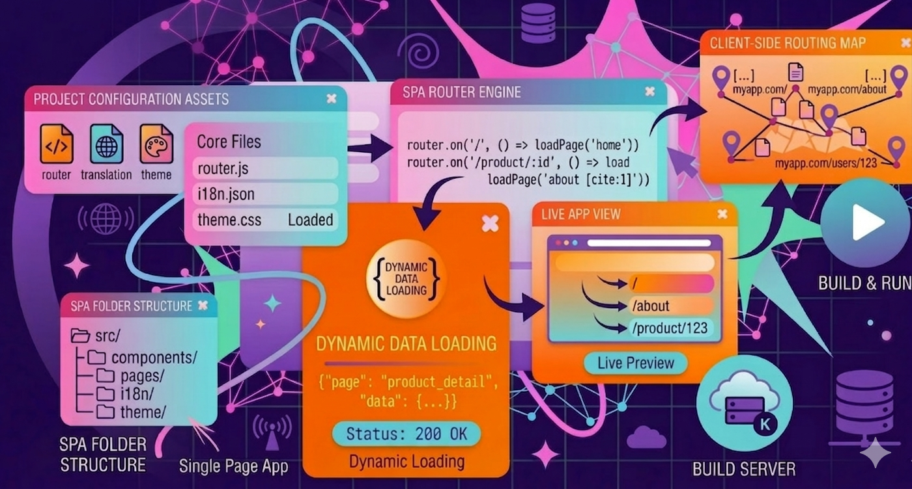
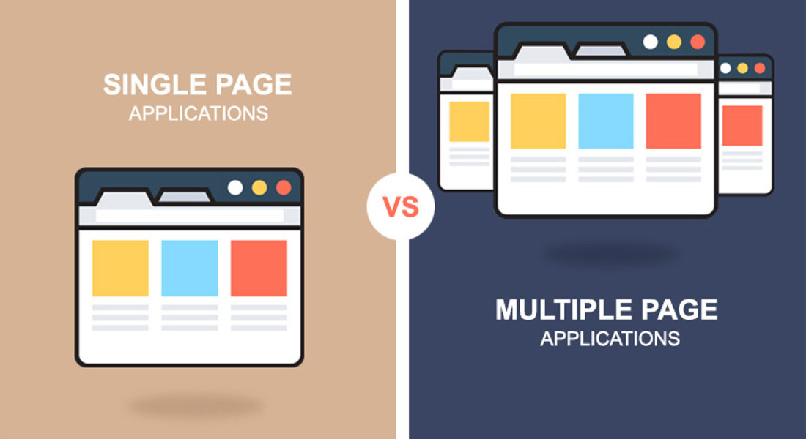

# Лекция 14. Практический SPA-проект: роутинг, переводы и тема оформления



## Введение

На прошлой лекции мы с вами сделали очень важный шаг вперёд.

До этого момента у нас, по сути, всё ещё была одна страница.
Да, мы уже настроили `dev`-сервер, разбили проект на части и сделали структуру аккуратнее. Но для пользователя это всё ещё был один экран.

На прошлой лекции мы:

- установили `Node.js`;
- познакомились с `npm`;
- разобрали, что такое `package.json`;
- создали проект через `Vite`;
- научились запускать `dev`-сервер;
- увидели, как работает `HMR`;
- привели проект к более аккуратной структуре;
- разбили страницу на отдельные части;
- подключили стили;
- собрали свою первую страницу уже не как набор случайных файлов, а как более организованный проект.

И вот здесь возникает совершенно логичный следующий вопрос:

> Хорошо, проект мы создали. Но как теперь превратить его в что-то более похожее на настоящее приложение?

А в реальной разработке почти всегда требуется больше.

Например:

- главная страница;
- страница «О нас»;
- страница контактов;
- отдельные разделы приложения;
- переключение языка;
- настройка темы оформления.

То есть в какой-то момент одного файла `Main.js` или одного экрана уже становится недостаточно.

Именно здесь мы подходим к следующему важному этапу frontend-разработки — к построению небольшого `SPA`-приложения.

В этой лекции мы не будем уходить в слишком тяжёлую теорию.
Наша задача другая: на практике показать, как из уже созданного проекта можно сделать более живое и современное приложение.

Мы не просто добавим ещё одну страницу.
Мы шаг за шагом соберём проект, в котором появятся:

- несколько страниц;
- клиентская навигация;
- роутинг;
- переводы;
- переключение темы.

То есть теперь мы начинаем двигаться от просто «страницы на `JavaScript`» к приложению, которое уже больше похоже на реальный современный `frontend`.

И начать этот разговор нужно с самой основы: понять, что такое `SPA`, и чем такой подход отличается от обычного сайта из нескольких отдельных `HTML`-страниц.

## Что такое `SPA`?



`SPA` — это аббревиатура от `Single Page Application`, что переводится как **одностраничное приложение**.

Название здесь может немного запутывать.
Когда студент впервые слышит «одностраничное приложение», может показаться, что речь идёт буквально об одной странице без переходов и разделов.

Но на практике смысл немного другой.

`SPA` — это такой тип веб-приложения, в котором браузер один раз загружает основную страницу, а дальше её содержимое меняется динамически с помощью `JavaScript`, без полной перезагрузки всего сайта.

То есть вместо того, чтобы при каждом переходе заново загружать новый `HTML`-документ с сервера, приложение уже работает внутри одной основной страницы и просто меняет нужную часть интерфейса.

Для пользователя это может выглядеть как обычные переходы между страницами:

- главная;
- о нас;
- контакты;
- услуги;
- профиль;
- настройки.

Но технически это уже не набор отдельных `HTML`-страниц, а одно клиентское приложение, которое само управляет навигацией и отображением контента.

### Как это работает

Схема работы `SPA` обычно выглядит так:

1. браузер загружает один основной `HTML`-файл;
2. вместе с ним подключается `JavaScript`, который управляет приложением;
3. когда пользователь нажимает на ссылку или кнопку, страница не перезагружается полностью;
4. `JavaScript` определяет, какой раздел нужно показать, и обновляет содержимое интерфейса;
5. для навигации внутри приложения обычно используется роутинг.

Именно поэтому `SPA` ощущается более «живым», чем обычный сайт из отдельных страниц.

### Что важно понять

На данном этапе нам не нужно уходить в слишком большую теорию.

Сейчас важно запомнить главное:

> `SPA` — это приложение, которое работает как одна основная страница, а переходы между разделами происходят без полной перезагрузки браузера.

Именно такой подход мы и будем использовать в этой лекции, когда начнём собирать наш проект с несколькими страницами, роутингом, переводами и переключением темы.

## Что мы будем делать в этой лекции

Теперь, когда мы понимаем, что такое `SPA`, можно сразу обозначить практическую цель этой лекции.

В этой лекции мы не будем ограничиваться одной страницей и одним блоком `Main`, как это было раньше.

Наша задача — на основе проекта из прошлой лекции собрать более живое и современное `frontend`-приложение, в котором уже появится логика переходов, разные страницы и пользовательские настройки интерфейса.

По сути, мы будем постепенно превращать наш проект в небольшой `SPA`-сайт.

В рамках этой лекции мы сделаем следующее:

- подготовим структуру проекта под несколько страниц;
- создадим отдельные страницы приложения;
- добавим роутинг;
- сделаем навигацию между страницами;
- подключим переводы через отдельные `json`-файлы;
- добавим переключение языка;
- сохраним выбранный язык в `localStorage`;
- добавим светлую и тёмную тему;
- сохраним выбранную тему в `localStorage`.

То есть к концу лекции у нас будет уже не просто одна страница на `JavaScript`, а небольшой проект, в котором:

- есть несколько разделов;
- переходы происходят без полной перезагрузки;
- интерфейс умеет менять язык;
- интерфейс умеет менять тему оформления.

Именно это и поможет вам увидеть, как из простой структуры на `Vite` начинает вырастать более полноценное приложение.

## Подготавливаем структуру проекта под `SPA`

Теперь, когда мы понимаем, что такое `SPA` и какую цель ставим перед собой в этой лекции, можно переходить к практике.

На прошлой лекции у нас уже был проект с базовой структурой:

- `Header`;
- `Main`;
- `Footer`;
- глобальные стили;
- точка входа `main.js`.

Для одной страницы этого было достаточно.

Но теперь проект становится сложнее.

У нас появятся:

- несколько страниц;
- навигация между ними;
- логика роутинга;
- переводы;
- переключение темы.

А это значит, что прежней структуры уже недостаточно.

Если оставить всё в одном месте, очень быстро начнётся путаница:

- страницы будут смешиваться с компонентами;
- логика перевода будет лежать рядом с логикой интерфейса;
- тема оформления будет вперемешку с роутингом;
- `main.js` начнёт разрастаться и станет неудобным.

Именно поэтому перед тем, как писать код дальше, нам нужно привести проект к новой структуре, которая уже подходит не для одной страницы, а для небольшого `SPA`-приложения.

### Какая структура нам понадобится

Внутри папки `src` мы постепенно приведём проект примерно к такому виду:

```bash
src/
├── components/
│   ├── Header/
│   ├── Main/
│   ├── Footer/
│   ├── ThemeToggle/
│   └── LanguageSwitcher/
├── pages/
│   ├── Home/
│   │   ├── components/
│   │   ├── Home.js
│   │   └── index.js
│   ├── About/
│   │   ├── About.js
│   │   └── index.js
│   ├── Contacts/
│   │   ├── Contacts.js
│   │   └── index.js
│   └── NotFound/
│       ├── NotFound.js
│       └── index.js
├── router/
│   └── index.js
├── i18n/
│   ├── en.json
│   ├── ru.json
│   ├── cz.json
│   └── index.js
├── theme/
│   └── index.js
├── styles/
│   └── global.scss
└── main.js
```

На этом этапе не нужно пугаться количества папок. Наоборот, такая структура делает проект понятнее.

Когда приложение растёт, папки начинают не усложнять работу, а упрощать её, потому что каждая часть проекта получает своё место.

### Что будет находиться в этих папках

**`components`**

В папке `components` будут лежать общие части интерфейса, которые могут использоваться в разных местах приложения.

Например:

- `Header` — верхняя часть сайта;
- `Main` — общая обёртка с тегом `<main>`;
- `Footer` — нижняя часть сайта;
- `ThemeToggle` — переключатель темы;
- `LanguageSwitcher` — переключатель языка.

**`pages`**

Папка `pages` нужна для отдельных страниц приложения.

Например:

- `Home`;
- `About`;
- `Contacts`;
- `NotFound`.

Каждая страница будет храниться в своей папке.

Это удобно, потому что у страницы со временем может появиться не только основной файл, но и собственные стили, вспомогательные части и внутренняя логика.

**`pages/Home/components`**

Обратите внимание, что внутри `Home` мы сразу закладываем папку `components`. Это полезно, потому что у конкретной страницы тоже могут быть свои внутренние блоки. Например, у главной страницы позже могут появиться:

- приветственный блок;
- секция преимуществ;
- карточки;
- кнопки призыва к действию.

И такие элементы лучше хранить внутри самой страницы, а не смешивать с общими компонентами всего приложения.

То есть здесь важно разделять два уровня:

- `src/components` — общие компоненты всего приложения;
- `pages/Home/components` — внутренние блоки только главной страницы.

**`router`**

В папке `router` будет находиться логика роутинга.

Именно здесь мы будем описывать, какая страница должна показываться при каком маршруте.

То есть `router` будет отвечать за переходы внутри нашего `SPA`.

**`i18n`**

Папка `i18n` нужна для переводов.

Здесь будут лежать отдельные `json`-файлы для каждого языка:

- `en.json`;
- `ru.json`;
- `cz.json`.

А также файл `index.js`, который будет помогать работать с переводами внутри приложения.

**`theme`**

Папка `theme` будет отвечать за смену темы оформления.

Именно здесь мы разместим логику, которая будет:

- переключать светлую и тёмную тему;
- сохранять выбор пользователя;
- применять тему при повторной загрузке приложения.

**`styles`**

Папка `styles` останется для глобальных стилей проекта.

Здесь будет храниться общий `global.scss`, который относится ко всему приложению в целом.

**`main.js`**

Файл `main.js` по-прежнему остаётся точкой входа в проект.

Но теперь его задача станет шире.

Если в прошлой лекции он просто собирал страницу из `Header`, `Main` и `Footer`, то теперь через него будет запускаться уже всё приложение:

- подключение глобальных стилей;
- запуск роутинга;
- подключение переводов;
- применение темы;
- рендер интерфейса.

### Почему так важно структурировать проект

Здесь важно понять одну простую вещь. Когда проект только начинается, кажется, что лишние папки только мешают.
Хочется держать всё в одном месте, чтобы было *«проще»*.

Но по мере роста приложения происходит обратное.

Если структура не продумана, код начинает смешиваться:

- страницы лежат рядом с утилитами;
- переводы — рядом с компонентами;
- тема — рядом с роутингом;
- всё становится трудно читать и поддерживать.

Поэтому хорошая структура — это не усложнение проекта, а способ заранее навести в нём порядок.

### Что мы будем делать дальше

Теперь, когда мы определили, как должен выглядеть проект, следующим шагом мы начнём создавать страницы приложения.

То есть дальше мы перейдём от общей структуры к конкретной реализации:

- создадим `Home`;
- создадим `About`;
- создадим `Contacts`;
- добавим `NotFound`.

И уже на этой основе будем подключать роутинг и остальные возможности нашего `SPA`.

## Создаём страницы приложения

Теперь, когда структура проекта стала более понятной, можно переходить к следующему шагу — создать страницы нашего `SPA`.

На этом этапе важно понять одну вещь: раньше мы работали с одной страницей, которая отображалась в браузере.

Теперь логика меняется.

У нас появится несколько отдельных страниц:

- `Home`;
- `About`;
- `Contacts`;
- `NotFound`.

То есть теперь приложение уже не будет состоять из одного экрана.
Оно начнёт делиться на разные разделы, которые будут показываться в зависимости от маршрута.

### Почему страницы лучше разделять

Можно было бы попробовать хранить весь контент в одном файле и просто как-то переключать его вручную.

Но очень быстро такой подход стал бы неудобным.

Например:

- код разных страниц смешивался бы между собой;
- становилось бы трудно редактировать отдельные разделы;
- логика приложения начала бы разрастаться в одном месте;
- проект было бы трудно поддерживать.

Именно поэтому страницы мы сразу выносим в отдельные папки.

Такой подход делает проект чище и помогает лучше понимать его структуру.

### Создаём страницу `Home`

Начнём с главной страницы.

В папке `src/pages/Home/` создадим файл `Home.js`:

```javascript
export function Home() {
  return `
    <section class="home">
      <div class="container">
        <h1 class="home__title">Добро пожаловать</h1>
        <p class="home__text">
          Это главная страница нашего SPA-приложения.
        </p>
      </div>
    </section>
  `;
}
```

Теперь рядом создадим файл `index.js`, который будет служить точкой входа для этой страницы:

```javascript
export { Home } from './Home';
```

### Создаём страницу `About`

Теперь создадим страницу «О нас».

В папке `src/pages/About/` создадим файл `About.js`:

```javascript
export function About() {
  return `
    <section class="about">
      <div class="container">
        <h1 class="about__title">О нас</h1>
        <p class="about__text">
          Здесь будет размещаться информация о компании, проекте или команде.
        </p>
      </div>
    </section>
  `;
}
```

И также создадим `index.js` для страницы «О нас»:

```javascript
export { About } from './About';
```

### Создаём страницу `Contacts`

Теперь создадим страницу контактов.
В папке `src/pages/Contacts/` создадим файл `Contacts.js`:

```javascript
export function Contacts() {
  return `
    <section class="contacts">
      <div class="container">
        <h1 class="contacts__title">Контакты</h1>
        <p class="contacts__text">
          Здесь будет размещаться контактная информация, форма обратной связи или карта.
        </p>
      </div>
    </section>
  `;
}
```

И создадим `index.js` для страницы контактов:

```javascript
export { Contacts } from './Contacts';
```

### Создаём страницу `NotFound`

И наконец, создадим страницу для обработки несуществующих маршрутов — `NotFound`.
В папке `src/pages/NotFound/` создадим файл `NotFound.js`:

```javascript
export function NotFound() {
  return `
    <section class="not-found">
      <div class="container">
        <h1 class="not-found__title">404 — Страница не найдена</h1>
        <p class="not-found__text">
          К сожалению, запрашиваемая страница не существует.
        </p>
      </div>
    </section>
  `;
}
```

И создадим `index.js` для страницы `NotFound`:

```javascript
export { NotFound } from './NotFound';
```

### Что мы сделали

На этом этапе мы создали четыре отдельные страницы для нашего `SPA`:

- `Home` — главная страница;
- `About` — страница «О нас»;
- `Contacts` — страница контактов;
- `NotFound` — страница для несуществующих маршрутов.

Такая структура уже позволяет нам работать с разными разделами приложения, не смешивая их код между собой.

> Поначалу кажется сложным создавать столько файлов и папок, но на практике это помогает лучше организовать проект и делает его более поддерживаемым.

Следующим шагом будет подключение этих страниц к роутингу, чтобы при переходе по разным маршрутам отображалась нужная страница.

## Роутинг и навигация между страницами

Теперь, когда у нас уже есть несколько отдельных страниц, нужно научить приложение понимать, какую из них показывать в зависимости от адреса в браузере.

Именно для этого в `SPA` используется роутинг.

Есть несколько способов реализовать роутинг в `SPA`.

Можно написать собственную логику на `JavaScript`, которая будет отслеживать изменения в адресной строке и в зависимости от этого отображать нужную страницу.

Но можно использовать и готовые библиотеки, которые упрощают эту задачу.

Например:

- `page.js`;
- `Navigo`;
- `React Router` — для `React`-приложений;
- `Vue Router` — для `Vue`-приложений;
- `Angular Router` — для `Angular`-приложений.

### Устанавливаем `page.js`

В этой лекции для реализации роутинга мы будем использовать библиотеку `page.js`.

Почему именно её?

Потому что она достаточно простая, хорошо подходит для учебного проекта и позволяет показать основную идею роутинга без лишней сложности.

Чтобы установить `page.js`, откроем терминал и выполним команду:

```bash
npm install page
```

После этого библиотека будет добавлена в проект и появится в `package.json` в разделе зависимостей. То есть теперь мы сможем импортировать её в наш проект и использовать для настройки маршрутов.

### Настраиваем роутинг

Теперь, когда библиотека `page.js` установлена, можно переходить к самой настройке роутинга.

На этом этапе наша задача — связать адрес в браузере с нужной страницей приложения.

То есть мы должны описать:

- какой компонент показывать для главной страницы;
- какой компонент показывать для страницы «О нас»;
- какой компонент показывать для страницы контактов;
- что делать, если пользователь открыл несуществующий маршрут.

Для этого будем работать в файле:

```bash
src/router/index.js
```

Именно здесь будет находиться логика маршрутов нашего `SPA`.

### Импортируем библиотеку и страницы

Сначала подключим `page.js` и наши страницы:

```javascript
import page from 'page';
import { Home } from '../pages/Home';
import { About } from '../pages/About';
import { Contacts } from '../pages/Contacts';
import { NotFound } from '../pages/NotFound';
```

Здесь мы:

- импортируем саму библиотеку `page`;
- подключаем все страницы, которые должны отображаться по разным маршрутам.

### Создаём функцию для запуска роутера

Теперь создадим функцию `initRouter`, внутри которой опишем маршруты:

```javascript
export function initRouter(renderPage) {
  page('/', () => renderPage(Home));
  page('/about', () => renderPage(About));
  page('/contacts', () => renderPage(Contacts));
  page('*', () => renderPage(NotFound));

  page();
}
```

Тут мы описали четыре маршрута:

- `/` — главная страница, которая отображает компонент `Home`;
- `/about` — страница «О нас», которая отображает компонент `About`;
- `/contacts` — страница контактов, которая отображает компонент `Contacts`;
- `*` — любой другой маршрут, который отображает компонент `NotFound`.

Такой подход позволяет нам легко управлять навигацией внутри нашего `SPA` и показывать нужный контент в зависимости от адреса в браузере.

### Подключаем роутинг в `main.js`

Теперь, когда роутер настроен, его нужно подключить в `main.js`, чтобы приложение действительно начало показывать нужную страницу в зависимости от маршрута.

Именно `main.js` остаётся точкой входа в проект, поэтому здесь мы будем:

- импортировать общие части интерфейса;
- собирать каркас страницы;
- передавать текущую страницу внутрь `Main`;
- запускать роутер.

Для этого в `main.js` мы сделаем примерно следующее:

```javascript
import { Header } from './components/Header';
import { Main } from './components/Main';
import { Footer } from './components/Footer';
import { initRouter } from './router';
import './styles/global.scss';

const app = document.querySelector('#app');

function renderPage(pageComponent) {
  app.innerHTML = `
    ${Header()}
    ${Main(pageComponent())}
    ${Footer()}
  `;
}

initRouter(renderPage);
```

Здесь мы:

- импортируем `Header`, `Main`, `Footer` и функцию `initRouter`;
- находим элемент с `id="app"`, который будет контейнером для нашего приложения;
- создаём функцию `renderPage`, которая принимает не готовую строку HTML, а сам компонент страницы;
- вызываем этот компонент как `pageComponent()` и вставляем результат внутрь `Main`;
- запускаем роутер, передавая ему функцию `renderPage`, чтобы он мог отображать нужную страницу при изменении маршрута.

Тут важно понять, что теперь при каждом переходе по маршруту будет вызываться функция `renderPage`, которая будет обновлять содержимое страницы в зависимости от того, какой компонент нужно показать.

### Делаем навигацию в `Header`

Теперь, когда роутинг уже подключён, нужно дать пользователю возможность переходить между страницами через интерфейс.

Для этого мы обновим компонент `Header` и добавим в него ссылки на основные разделы приложения.

В файле `Header.js` можно сделать примерно так:

```javascript
const navLinks = [
  { path: '/', label: 'Главная' },
  { path: '/about', label: 'О нас' },
  { path: '/contacts', label: 'Контакты' },
];

const createNavLinks = () => {
  return navLinks
    .map(
      (link) => `
        <a href="${link.path}" data-link class="nav__link">
          ${link.label}
        </a>
      `
    )
    .join('');
};

export function Header() {
  return `
    <header class="header">
      <div class="container">
        <div class="header__inner">
          <a href="/" data-link class="logo">MySite</a>

          <nav class="nav">
            ${createNavLinks()}
          </nav>
        </div>
      </div>
    </header>
  `;
}
```

Тут логика следующая:

- мы создаём массив `navLinks`, который содержит информацию о маршрутах и их названиях;
- функция `createNavLinks` генерирует HTML для этих ссылок;
- в компоненте `Header` мы вставляем эти ссылки в навигацию.

Теперь, когда пользователь будет нажимать на эти ссылки, браузер будет изменять адрес, и роутер будет показывать нужную страницу без полной перезагрузки.

> Тут `data-link` используется как удобный маркер для ссылок навигации. Основную работу по перехвату переходов делает библиотека `page.js`.

## Подготовка переводов и переключение языка

Теперь, когда у нас уже есть несколько страниц и настроенный роутинг, можно переходить к следующему важному этапу — добавлению переводов и возможности переключать язык интерфейса.

В современном мире поддержка нескольких языков — это не просто приятный бонус, а часто необходимость.

Если сайт или приложение ориентированы на разную аудиторию, пользователю должно быть удобно выбрать тот язык, на котором он хочет работать с интерфейсом.

В нашем случае мы не будем использовать слишком сложную систему локализации.

Наша задача — показать понятный и практический подход, который хорошо подходит для учебного проекта:

- тексты будут храниться в отдельных `json`-файлах;
- для каждого языка будет свой файл с переводами;
- приложение будет уметь переключать язык;
- выбранный язык будет сохраняться в `localStorage`.

То есть логика будет достаточно простой, но при этом уже похожей на реальный проект.

### Как мы организуем переводы

Для переводов создадим внутри `src` отдельную папку `i18n`.

Внутри неё будут находиться файлы:

- `en.json` — английский язык;
- `ru.json` — русский язык;
- `cz.json` — чешский язык;
- `index.js` — файл, который будет помогать работать со всеми переводами.

В итоге структура будет выглядеть так:

```bash
src/
├── i18n/
│   ├── en.json
│   ├── ru.json
│   ├── cz.json
│   └── index.js
```

Такой подход удобен потому, что каждый язык хранится отдельно.

Если позже в проекте появится ещё один язык, нам не придётся переписывать всю систему.
Достаточно будет просто добавить ещё один `json`-файл.

### Создаём файлы с переводами

Теперь создадим сами файлы переводов.

Для начала нам не нужно добавлять туда слишком много текста.
Важно сначала понять сам принцип:

- у каждого текста будет свой ключ;
- для каждого языка этот ключ будет иметь своё значение;
- по одному и тому же ключу приложение сможет получать текст на нужном языке.

Например, если в интерфейсе у нас есть ссылки в навигации:

- Главная;
- О нас;
- Контакты.

То для них можно задать такие ключи:

- `nav.home`;
- `nav.about`;
- `nav.contacts`.

А если на главной странице есть заголовок и описание, можно добавить ещё такие ключи:

- `home.title`;
- `home.text`.

Теперь создадим три файла:

- `en.json`;
- `ru.json`;
- `cz.json`.

#### `en.json`

```json
{
  "nav.home": "Home",
  "nav.about": "About",
  "nav.contacts": "Contacts",
  "home.title": "Welcome to our SPA application",
  "home.text": "This is the main page of our project.",
  "about.title": "About Us",
  "about.text": "Here you can find information about the company, project, or team.",
  "contacts.title": "Contacts",
  "contacts.text": "Here you can find contact information, a feedback form, or a map."
}
```

#### `ru.json`

```json
{
  "nav.home": "Главная",
  "nav.about": "О нас",
  "nav.contacts": "Контакты",
  "home.title": "Добро пожаловать в наше SPA-приложение",
  "home.text": "Это главная страница нашего проекта.",
  "about.title": "О нас",
  "about.text": "Здесь будет размещаться информация о компании, проекте или команде.",
  "contacts.title": "Контакты",
  "contacts.text": "Здесь будет размещаться контактная информация, форма обратной связи или карта."
}
```

#### `cz.json`

```json
{
  "nav.home": "Domů",
  "nav.about": "O nás",
  "nav.contacts": "Kontakty",
  "home.title": "Vítejte v naší SPA aplikaci",
  "home.text": "Toto je hlavní stránka našeho projektu.",
  "about.title": "O nás",
  "about.text": "Zde najdete informace o společnosti, projektu nebo týmu.",
  "contacts.title": "Kontakty",
  "contacts.text": "Zde najdete kontaktní informace, formulář pro zpětnou vazbu nebo mapu."
}
```

### Создаём `index.js` для работы с переводами

Теперь, когда у нас есть файлы с переводами, нужно создать `index.js`, который будет помогать работать с этими переводами внутри приложения.

В файле `src/i18n/index.js` можно сделать примерно так:

```javascript
import en from './en.json';
import ru from './ru.json';
import cz from './cz.json';

const translations = {
  en,
  ru,
  cz,
};

const defaultLanguage = 'en';
const languageStorageKey = 'app-language';

export function getCurrentLanguage() {
  return localStorage.getItem(languageStorageKey) || defaultLanguage;
}

export function setCurrentLanguage(lang) {
  localStorage.setItem(languageStorageKey, lang);
}

export function getTranslation(lang, key) {
  return translations[lang]?.[key] || translations[defaultLanguage]?.[key] || key;
}
```

Здесь мы:

- импортируем все файлы переводов;
- собираем их в один объект `translations`;
- задаём язык по умолчанию;
- задаём ключ `languageStorageKey`, под которым язык будет храниться в `localStorage`;
- создаём функцию `getCurrentLanguage`, которая получает текущий язык из `localStorage`;
- создаём функцию `setCurrentLanguage`, которая сохраняет выбранный язык;
- создаём функцию `getTranslation`, которая возвращает перевод по языку и ключу.

Если перевода для выбранного языка не окажется, функция попробует взять значение из языка по умолчанию.
Если и там такого ключа нет, будет возвращён сам ключ.

### Добавляем переключатель языка в `Header`

Теперь, когда у нас есть вся логика для работы с переводами, нужно дать пользователю возможность переключать язык прямо из интерфейса.

Для этого мы обновим компонент `Header` и добавим в него элемент для выбора языка.

В файле `Header.js` можно сделать примерно так:

```javascript
const navLinks = [
  { path: '/', key: 'nav.home' },
  { path: '/about', key: 'nav.about' },
  { path: '/contacts', key: 'nav.contacts' },
];

export function Header(t, currentLanguage) {
  return `
    <header class="header">
      <div class="container">
        <div class="header__inner">
          <a href="/" data-link class="logo">MySite</a>

          <nav class="nav">
            ${navLinks
              .map(
                (link) => `
                  <a href="${link.path}" data-link class="nav__link">
                    ${t(link.key)}
                  </a>
                `
              )
              .join('')}
          </nav>

          <div class="language-switcher">
            <button class="language-switcher__btn ${currentLanguage === 'en' ? 'active' : ''}" data-lang="en">
              EN
            </button>
            <button class="language-switcher__btn ${currentLanguage === 'ru' ? 'active' : ''}" data-lang="ru">
              RU
            </button>
            <button class="language-switcher__btn ${currentLanguage === 'cz' ? 'active' : ''}" data-lang="cz">
              CZ
            </button>
          </div>
        </div>
      </div>
    </header>
  `;
}
```

Здесь мы:

- заменяем обычные названия ссылок на ключи переводов;
- передаём в `Header` функцию `t`, которая будет возвращать текст на текущем языке;
- передаём `currentLanguage`, чтобы понимать, какой язык сейчас выбран;
- добавляем блок `language-switcher` с тремя кнопками;
- используем атрибут `data-lang`, чтобы у каждой кнопки был свой код языка;
- добавляем класс `active`, чтобы можно было визуально выделить выбранный язык.

Теперь `Header` уже умеет не только показывать навигацию, но и отображать переключатель языка.

### Добавляем переводы в страницы

Теперь, когда у нас есть вся логика для работы с переводами, нужно обновить наши страницы, чтобы они тоже использовали эту систему.

Например, в `Home.js` можно сделать так:

```javascript
export function Home(t) {
  return `
    <section class="home">
      <div class="container">
        <h1 class="home__title">${t('home.title')}</h1>
        <p class="home__text">
          ${t('home.text')}
        </p>
      </div>
    </section>
  `;
}
```

Точно так же можно обновить и другие страницы.

Например, в `About.js`:

```javascript
export function About(t) {
  return `
    <section class="about">
      <div class="container">
        <h1 class="about__title">${t('about.title')}</h1>
        <p class="about__text">
          ${t('about.text')}
        </p>
      </div>
    </section>
  `;
}
```

И в `Contacts.js`:

```javascript
export function Contacts(t) {
  return `
    <section class="contacts">
      <div class="container">
        <h1 class="contacts__title">${t('contacts.title')}</h1>
        <p class="contacts__text">
          ${t('contacts.text')}
        </p>
      </div>
    </section>
  `;
}
```

Теперь страницы принимают функцию `t`, которая возвращает перевод по ключу.

Это стало возможным благодаря тому, что в роутере мы передаём в `renderPage` не готовую строку страницы, а сам компонент страницы.
А уже в `main.js` этот компонент можно вызвать как `pageComponent(t)`.

### Обновляем `main.js` для работы с переводами

Теперь нужно сделать так, чтобы язык влиял не только на `Header`, но и на содержимое страниц.

Кроме того, при нажатии на кнопки выбора языка приложение должно:

- определить, какой язык выбрал пользователь;
- сохранить его в `localStorage`;
- заново отрисовать интерфейс с новыми переводами.

Для этого обновим `main.js`:

```javascript
import { Header } from './components/Header';
import { Main } from './components/Main';
import { Footer } from './components/Footer';
import { initRouter } from './router';
import {
  getCurrentLanguage,
  setCurrentLanguage,
  getTranslation,
} from './i18n';
import './styles/global.scss';

const app = document.querySelector('#app');

let currentPageComponent = null;

function renderPage(pageComponent) {
  currentPageComponent = pageComponent;

  const currentLanguage = getCurrentLanguage();
  const t = (key) => getTranslation(currentLanguage, key);

  app.innerHTML = `
    ${Header(t, currentLanguage)}
    ${Main(pageComponent(t))}
    ${Footer()}
  `;

  const languageButtons = document.querySelectorAll('[data-lang]');

  languageButtons.forEach((button) => {
    button.addEventListener('click', () => {
      const selectedLanguage = button.dataset.lang;
      setCurrentLanguage(selectedLanguage);
      renderPage(currentPageComponent);
    });
  });
}

initRouter(renderPage);
```

Здесь мы:

- получаем текущий язык через `getCurrentLanguage()`;
- создаём функцию `t(key)`, которая возвращает перевод для нужного ключа;
- передаём `t` и `currentLanguage` в `Header`;
- вызываем текущую страницу как `pageComponent(t)`;
- после отрисовки страницы находим все кнопки с атрибутом `data-lang`;
- добавляем на них обработчик события `click`;
- при нажатии сохраняем новый язык через `setCurrentLanguage()`;
- заново вызываем `renderPage(currentPageComponent)`, чтобы интерфейс обновился.

Теперь при клике на кнопки выбора языка интерфейс будет переключаться на нужный язык, и этот выбор будет сохраняться в `localStorage`, так что при следующем открытии приложения будет использоваться последний выбранный язык.

Анологично, что при добавлении новых текстов в интерфейс нужно будет:
- добавить соответствующие ключи в файлы переводов;
- использовать функцию `t` для получения перевода по этим ключам.
Таким образом, мы создали простую, но эффективную систему локализации для нашего `SPA`-приложения.

## Создаём переключатель темы и сохраняем выбор в `localStorage`

Теперь, когда у нас уже есть несколько страниц, настроенный роутинг и поддержка переводов, можно переходить к следующему этапу - добавлению возможности переключать тему оформления.

В современном `frontend`-приложении поддержка светлой и тёмной темы стала практически стандартом.

Пользователи ожидают, что смогут выбрать, как будет выглядеть интерфейс, и часто предпочитают тёмную тему, особенно при работе в условиях низкой освещённости.

### Создаём модуль для работы с темой

Для того чтобы логика темы не смешивалась с остальным кодом приложения, создадим для неё отдельный модуль.

Внутри папки `src/theme/` создадим файл `index.js`.

Именно в нём будет находиться вся основная логика, связанная с темой оформления.

На этом этапе нам нужно решить несколько задач:

- определить тему по умолчанию;
- уметь получать текущую тему;
- уметь сохранять выбранную тему;
- уметь применять тему к документу.

В файле `src/theme/index.js` можно сделать примерно так:

```javascript
const defaultTheme = 'light';
const themeStorageKey = 'app-theme';

export function getCurrentTheme() {
  return localStorage.getItem(themeStorageKey) || defaultTheme;
}

export function setCurrentTheme(theme) {
  localStorage.setItem(themeStorageKey, theme);
}

export function applyTheme(theme) {
  document.body.setAttribute('data-theme', theme);
}
```

Здесь мы:

- задаём тему по умолчанию через `defaultTheme`;
- создаём ключ `themeStorageKey`, под которым тема будет храниться в `localStorage`;
- делаем функцию `getCurrentTheme()`, которая возвращает текущую тему;
- делаем функцию `setCurrentTheme(theme)`, которая сохраняет тему;
- делаем функцию `applyTheme(theme)`, которая применяет тему к `body` через атрибут `data-theme`.

### Добавляем переключатель темы в `Header`

Теперь, когда у нас есть модуль для работы с темой, нужно дать пользователю возможность переключать её прямо из интерфейса.

Для этого обновим компонент `Header` и добавим в него кнопку переключения темы.

На этом этапе нам не нужен сложный переключатель с несколькими вариантами.  
Достаточно одной кнопки, которая будет менять текущую тему между `light` и `dark`.

В файле `Header.js` можно сделать примерно так:

```javascript
const navLinks = [
  { path: '/', key: 'nav.home' },
  { path: '/about', key: 'nav.about' },
  { path: '/contacts', key: 'nav.contacts' },
];

export function Header(t, currentLanguage, currentTheme) {
  const themeButtonLabel = currentTheme === 'dark' ? '☀️' : '🌙';

  return `
    <header class="header">
      <div class="container">
        <div class="header__inner">
          <a href="/" data-link class="logo">MySite</a>

          <nav class="nav">
            ${navLinks
              .map(
                (link) => `
                  <a href="${link.path}" data-link class="nav__link">
                    ${t(link.key)}
                  </a>
                `
              )
              .join('')}
          </nav>

          <div class="header__controls">
            <div class="language-switcher">
              <button class="language-switcher__btn ${currentLanguage === 'en' ? 'active' : ''}" data-lang="en">
                EN
              </button>
              <button class="language-switcher__btn ${currentLanguage === 'ru' ? 'active' : ''}" data-lang="ru">
                RU
              </button>
              <button class="language-switcher__btn ${currentLanguage === 'cz' ? 'active' : ''}" data-lang="cz">
                CZ
              </button>
            </div>

            <button class="theme-toggle" data-theme-toggle>
              ${themeButtonLabel}
            </button>
          </div>
        </div>
      </div>
    </header>
  `;
}
```

### Подключаем логику переключения темы в `main.js`

Теперь нужно сделать так, чтобы при нажатии на кнопку переключения темы происходило:

- определение новой темы;
- сохранение её в `localStorage`;
- применение новой темы к документу;
- обновление интерфейса, чтобы отразить новый выбор.

Для этого обновим `main.js`:

```javascript
import { Header } from './components/Header';
import { Main } from './components/Main';
import { Footer } from './components/Footer';
import { initRouter } from './router';
import {
  getCurrentLanguage,
  setCurrentLanguage,
  getTranslation,
} from './i18n';
import {
  getCurrentTheme,
  setCurrentTheme,
  applyTheme,
} from './theme';
import './styles/global.scss';

const app = document.querySelector('#app');

let currentPageComponent = null;

function renderPage(pageComponent) {
  currentPageComponent = pageComponent;

  const currentLanguage = getCurrentLanguage();
  const currentTheme = getCurrentTheme();

  const t = (key) => getTranslation(currentLanguage, key);

  applyTheme(currentTheme);

  app.innerHTML = `
    ${Header(t, currentLanguage, currentTheme)}
    ${Main(pageComponent(t))}
    ${Footer()}
  `;

  const languageButtons = document.querySelectorAll('[data-lang]');

  languageButtons.forEach((button) => {
    button.addEventListener('click', () => {
      const selectedLanguage = button.dataset.lang;
      setCurrentLanguage(selectedLanguage);
      renderPage(currentPageComponent);
    });
  });

  const themeToggleButton = document.querySelector('[data-theme-toggle]');

  if (themeToggleButton) {
    themeToggleButton.addEventListener('click', () => {
      const newTheme = currentTheme === 'dark' ? 'light' : 'dark';
      setCurrentTheme(newTheme);
      applyTheme(newTheme);
      renderPage(currentPageComponent);
    });
  }
}

initRouter(renderPage);
```

Здесь мы:
- получаем текущую тему через `getCurrentTheme()`;
- передаём `currentTheme` в `Header`, чтобы кнопка могла отобразить правильный символ;
- вызываем `applyTheme(currentTheme)`, чтобы при загрузке страницы применить сохранённую тему;
- находим кнопку с атрибутом `data-theme-toggle` и добавляем на неё обработчик события `click`;
- при клике определяем новую тему, сохраняем её через `setCurrentTheme(newTheme)`, применяем её через `applyTheme(newTheme)` и заново вызываем `renderPage(currentPageComponent)`, чтобы интерфейс обновился.

Теперь при нажатии на кнопку переключения темы интерфейс будет менять своё оформление, и этот выбор будет сохраняться в `localStorage`, так что при следующем открытии приложения будет использоваться последний выбранный режим.

### Добавляем стили для тем

Теперь, когда у нас есть вся логика для работы с темой, нужно добавить стили, которые будут менять внешний вид интерфейса в зависимости от выбранной темы.

Так как в `theme/index.js` мы применяем тему через атрибут:

```javascript
document.body.setAttribute('data-theme', theme);
```

значит, в стилях мы можем ориентироваться на значение `data-theme` у `body`.

Например, в `global.scss` можно добавить примерно такую структуру:

```scss
body {
  font-family: Arial, sans-serif;
  transition: background-color 0.3s ease, color 0.3s ease;
}

body[data-theme='light'] {
  background-color: #ffffff;
  color: #222222;
}

body[data-theme='dark'] {
  background-color: #121212;
  color: #f5f5f5;
}
```

```scss
body {
  font-family: Arial, sans-serif;
  transition: background-color 0.3s ease, color 0.3s ease;
}

body[data-theme='light'] {
  background-color: #ffffff;
  color: #222222;
}

body[data-theme='dark'] {
  background-color: #121212;
  color: #f5f5f5;
}
```

Этого уже достаточно для того, чтобы при переключении темы менялся фон и цвет текста на всей странице.

По аналогии можно добавить более детальные стили для конкретных элементов, чтобы они тоже адаптировались под выбранную тему.

Например, можно сразу добавить стили для `Header`, `Footer` и основного контента:

```scss
body[data-theme='light'] {
  background-color: #ffffff;
  color: #222222;

  .header,
  .footer {
    background-color: #f3f3f3;
    color: #222222;
  }

  .nav__link,
  .logo {
    color: #222222;
  }

  .theme-toggle,
  .language-switcher__btn {
    background-color: #ffffff;
    color: #222222;
    border: 1px solid #cccccc;
  }
}

body[data-theme='dark'] {
  background-color: #121212;
  color: #f5f5f5;

  .header,
  .footer {
    background-color: #1e1e1e;
    color: #f5f5f5;
  }

  .nav__link,
  .logo {
    color: #f5f5f5;
  }

  .theme-toggle,
  .language-switcher__btn {
    background-color: #2a2a2a;
    color: #f5f5f5;
    border: 1px solid #444444;
  }
}
```

Таким образом, при переключении темы не только фон и цвет текста будут меняться, но и другие элементы интерфейса будут адаптироваться под выбранный режим.

### Проверяем работу проекта

Теперь, когда мы добавили поддержку переключения темы, нужно проверить, что всё работает корректно:
- при загрузке страницы должна применяться тема, сохранённая в `localStorage`;
- при нажатии на кнопку переключения темы интерфейс должен менять своё оформление;
- при обновлении страницы выбранная тема должна сохраняться.

Если всё работает как задумано, значит мы успешно реализовали поддержку тем в нашем `SPA`-приложении.

## Заключение

На этом этапе мы создали полноценное `SPA`-приложение с несколькими страницами, поддержкой роутинга, переводов и переключения темы.
Мы научились:
- организовывать структуру проекта так, чтобы код был чистым и поддерживаемым;
- создавать отдельные страницы и подключать их к роутингу;
- работать с переводами и позволять пользователю выбирать язык интерфейса;
- реализовывать переключение темы и сохранять выбор пользователя.

Этот проект уже достаточно сложный, чтобы показать основные принципы разработки `SPA`, но при этом он остаётся достаточно простым для понимания и дальнейшего расширения.